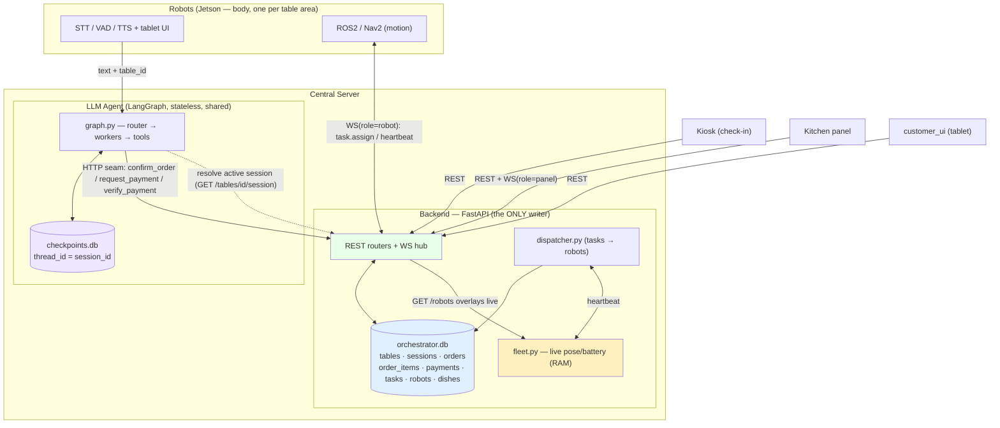
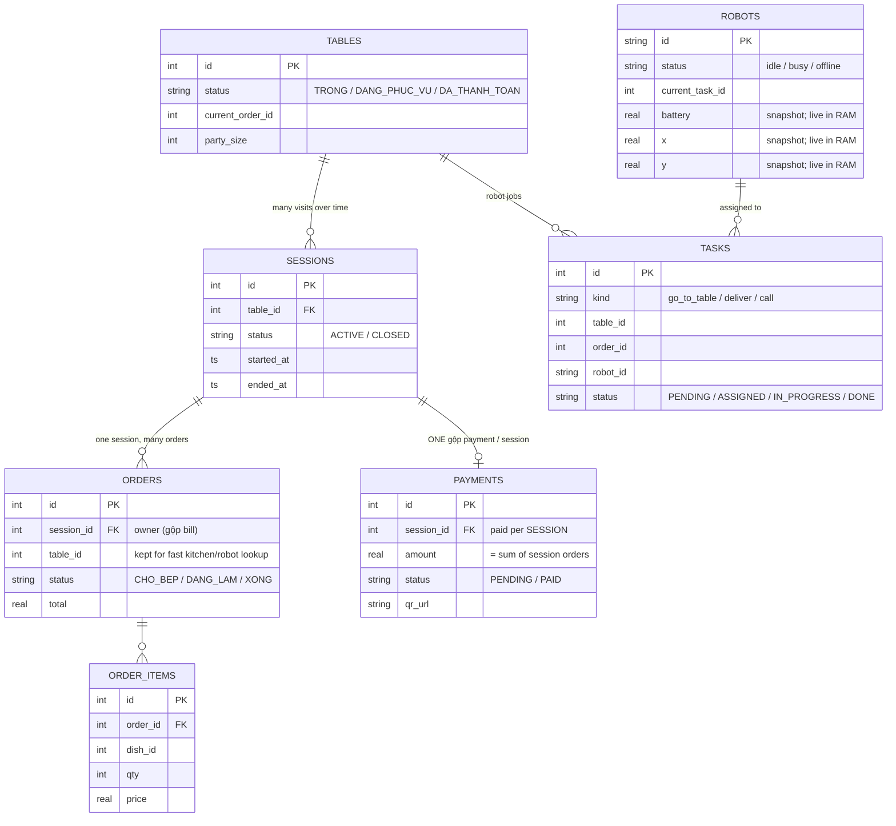
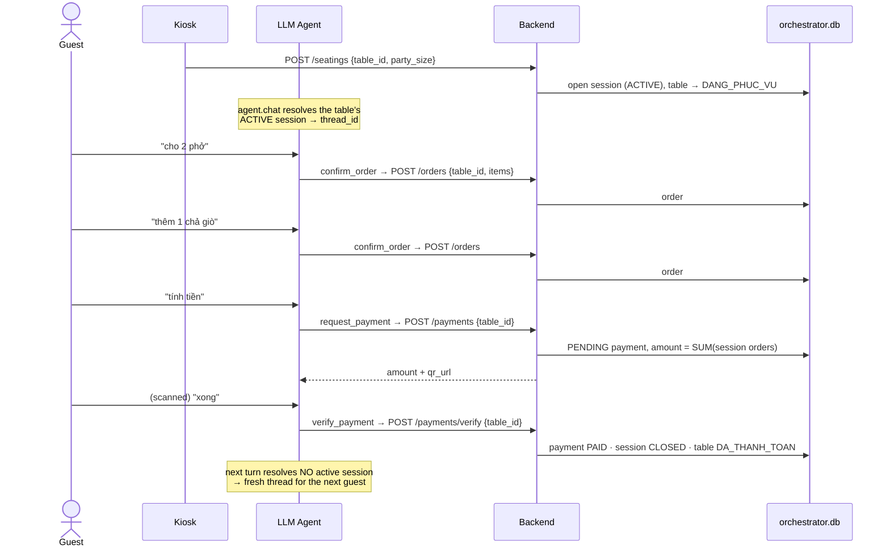
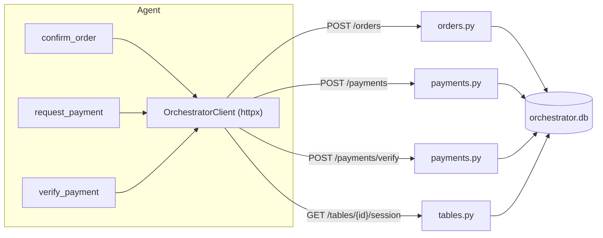
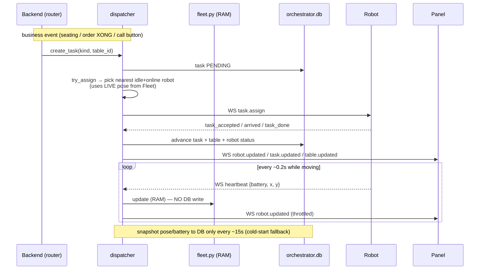

# AI Waiter — Architecture & Data Flow (code-level overview)

> Reviewer's guide to **how the system is wired and how data flows**, matching the code as of
> 2026-06-26 (after the ledger unification). For the broader product/design doc see
> [system-design.md](system-design.md); **this file is the current, code-accurate
> overview** of the backend + agent + data stores.

## TL;DR

- **One backend is the single writer.** `orchestrator.db` is the business ledger. The LLM agent,
  the kiosk, the kitchen panel and the customer tablet **all go through the FastAPI REST API** — no
  component writes the DB directly except the backend itself.
- **Session-centric ledger.** A *session* = one party's whole visit (seating → orders → one gộp
  bill → leave). Orders and the single payment hang off the session.
- **Three data stores, by data nature** (the key design decision):
  - `orchestrator.db` (SQLite) — durable business records (the ledger).
  - `checkpoints.db` (SQLite, LangGraph) — conversation memory, **keyed by session id**.
  - **RAM** (`fleet.py`) — live robot telemetry (pose/battery), high-frequency & ephemeral, kept
    out of the DB so heartbeats never contend with order/payment writes.
- **Agent ↔ backend = HTTP seam.** Tools (`confirm_order` / `request_payment` / `verify_payment`)
  call REST endpoints via `OrchestratorClient`.
- **Robots ↔ backend = WebSocket.** Task assignment + heartbeats over `/ws`.

---

## 1. Component map



**Who writes what:** only the backend writes `orchestrator.db`. The agent reaches it *through* the
backend (REST). Robot telemetry lands in RAM (`fleet.py`); the DB gets only an occasional snapshot.

---

## 2. Data model — `orchestrator.db`

Defined in [src/server_orchestrator/data/db.py](../src/server_orchestrator/data/db.py) (plain SQLite, no ORM).



> Note on `robots`: `battery/x/y` columns are a **periodic snapshot** (cold-start fallback). The
> *live* values come from RAM (`fleet.py`) and are layered on top by `GET /robots`, the panel
> broadcast and the dispatcher's robot picker.

The other two stores are **not** in this DB: `checkpoints.db` (LangGraph) and the in-RAM fleet
state.

---

## 3. Session lifecycle (the core business flow)



Endpoints: [tables.py](../src/server_orchestrator/routers/tables.py),
[orders.py](../src/server_orchestrator/routers/orders.py),
[payments.py](../src/server_orchestrator/routers/payments.py); session helpers in
[sessions.py](../src/server_orchestrator/services/sessions.py).

---

## 4. The agent seam (how the LLM writes data)

The agent never touches a DB. Tools call the backend via
[orchestrator_client.py](../src/agent_brain/services/orchestrator_client.py)
(`ORCHESTRATOR_URL`, table id normalised `"T1" → 1` via
[normalise_table_id](../src/_shared/types.py)).



### Conversation memory = session (the checkpoint fix)

`thread_id = active session id` ([checkpointer.py](../src/agent_brain/agent/memory/checkpointer.py)).
`graph.chat` resolves the table's current session each turn
([graph.py](../src/agent_brain/agent/graph.py)):

- **Within a visit** → same session id → memory persists.
- **After payment** (session CLOSED) → no active session → next guest opens a **new** session →
  **new thread → clean context** (no bleed between guests). Fallback `table-{id}-nosession` only
  before any seating.

---

## 5. Robot dispatch + telemetry

Robots connect over `/ws?role=robot&robot_id=...` ([ws.py](../src/server_orchestrator/realtime/ws.py)); the
dispatcher ([dispatcher.py](../src/server_orchestrator/services/dispatcher.py)) turns business events into tasks.



**Why telemetry is in RAM:** a moving robot streams pose several times a second. Writing each beat
to SQLite would take a file-level write lock and contend with order/payment transactions on the
same DB. Keeping it in RAM (latest-value-wins, losing a tick is harmless) removes that contention;
`robots` rows stay for identity + assignment + a periodic snapshot.

---

## 6. Frontends

Three Vite/Vue apps under [src/frontends/](../src/frontends/): `customer_ui` (tablet menu/bill),
`kiosk` (check-in seating), `panel` (kitchen + fleet board). Each calls the backend via a
same-origin `/api` proxy to FastAPI:8000 (no CORS); the panel also opens `/ws?role=panel` for
realtime `order.created` / `table.updated` / `robot.updated` / `task.*` events.

### Voice mirror on the tablet (`customer_ui`)

The mic + STT + TTS live on the **Jetson** (USB conference mic in, Bluetooth speaker out); the
tablet has no mic. So `customer_ui` is a **mirror**, not a voice client: it opens
`/ws?role=customer` and renders the live conversation + follows the agent's UI actions. The flow:

```
Jetson: mic → VAD → Whisper → text ──POST /chat──► agent service (LLM, server.py)
                                                      │  ├─ POST /voice/event {voice.heard}
agent runs AIWaiterGraph, returns reply+action ──────┤  └─ POST /voice/event {voice.reply, action}
Jetson speaks the reply (TTS)                         ▼
                                       backend broadcast(role=customer) ──► customer_ui
                                       (user/AI bubbles; open_menu→/menu, open_payment→/payment)
```

The agent never reaches the tablet directly: it POSTs to the backend bridge
([routers/voice.py](../src/server_orchestrator/routers/voice.py)), keeping the backend's
"does-not-import-agent_brain" boundary intact. This is the *delivery* half of the agent's
action seam ([actions.py](../src/agent_brain/agent/actions.py) decides; the agent
service delivers). Tablets filter events by their own `table_id`.

---

## 7. File map (where to look)

| Concern | File |
|---|---|
| App entry, lifespan, routers | [src/server_orchestrator/main.py](../src/server_orchestrator/main.py) |
| DB schema + migrations | [src/server_orchestrator/data/db.py](../src/server_orchestrator/data/db.py) |
| Session helpers | [src/server_orchestrator/services/sessions.py](../src/server_orchestrator/services/sessions.py) |
| Live robot telemetry (RAM) | [src/server_orchestrator/services/fleet.py](../src/server_orchestrator/services/fleet.py) |
| Task dispatch + heartbeat + watchdog | [src/server_orchestrator/services/dispatcher.py](../src/server_orchestrator/services/dispatcher.py) |
| WebSocket hub (router + registry) | [src/server_orchestrator/realtime/ws.py](../src/server_orchestrator/realtime/ws.py) + [connection_manager.py](../src/server_orchestrator/realtime/connection_manager.py) |
| REST contracts (pydantic) | [src/server_orchestrator/schemas/__init__.py](../src/server_orchestrator/schemas/__init__.py) |
| Endpoints | [src/server_orchestrator/routers/](../src/server_orchestrator/routers/) (admin, layout, menu, orders, payments, robots, tables, tasks, voice) |
| Cross-role paths + types | [src/_shared/paths.py](../src/_shared/paths.py) + [types.py](../src/_shared/types.py) |
| Agent graph + chat() | [src/agent_brain/agent/graph.py](../src/agent_brain/agent/graph.py) |
| Thread = session | [src/agent_brain/agent/memory/checkpointer.py](../src/agent_brain/agent/memory/checkpointer.py) |
| Agent tools | [src/agent_brain/agent/tools/](../src/agent_brain/agent/tools/) |
| Agent → backend HTTP seam | [src/agent_brain/services/orchestrator_client.py](../src/agent_brain/services/orchestrator_client.py) |
| Agent resources (centroids, few-shots, prompts, skills) | [src/agent_brain/agent/resources/](../src/agent_brain/agent/resources/) |
| Voice loop on Jetson (mic → VAD → Whisper → POST /chat → TTS) | [src/edge_voice/main.py](../src/edge_voice/main.py) |
| VAD + STT + cross-thread queues | [src/edge_voice/perception/](../src/edge_voice/perception/) |
| TTS | [src/edge_voice/output/tts_engine.py](../src/edge_voice/output/tts_engine.py) |
| Agent HTTP service (LLM on the server; POST /chat) | [src/agent_brain/server.py](../src/agent_brain/server.py) |
| Voice bridge → customer tablet (role=customer WS) | [src/server_orchestrator/routers/voice.py](../src/server_orchestrator/routers/voice.py) |

## 8. Key endpoints

| Method | Path | Purpose |
|---|---|---|
| POST | `/seatings` | Seat a party → opens an ACTIVE session |
| GET | `/tables/{id}/session` | Active session + gộp total (agent resolves thread, panel shows bill) |
| POST | `/orders` | Create order under the table's session |
| PATCH | `/orders/{id}` | Kitchen status; `XONG` → enqueues a deliver task |
| POST | `/payments` | Open/refresh the gộp payment (PENDING + QR) |
| POST | `/payments/verify` | Settle by table (agent): PAID + close session + free table |
| POST | `/payments/{id}/verify` | Settle by id (tablet) |
| GET | `/robots` | Fleet status (DB snapshot + live RAM overlay) |
| POST | `/voice/event` | Voice bridge: agent service → tablet (`voice.heard` / `voice.reply` + UI action) |
| WS | `/ws?role=panel\|robot\|customer` | Realtime events / robot link / voice mirror to tablet |
