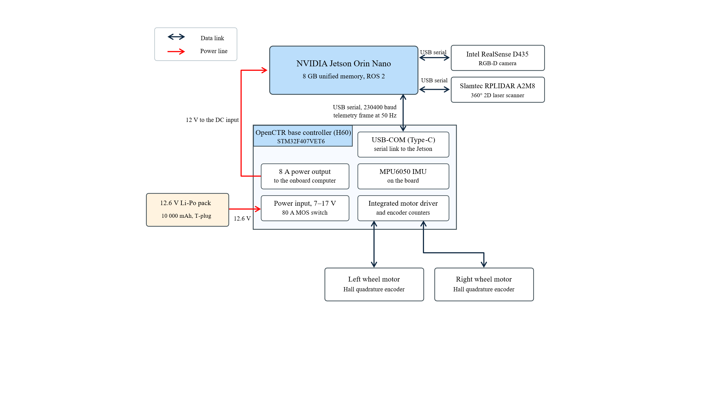
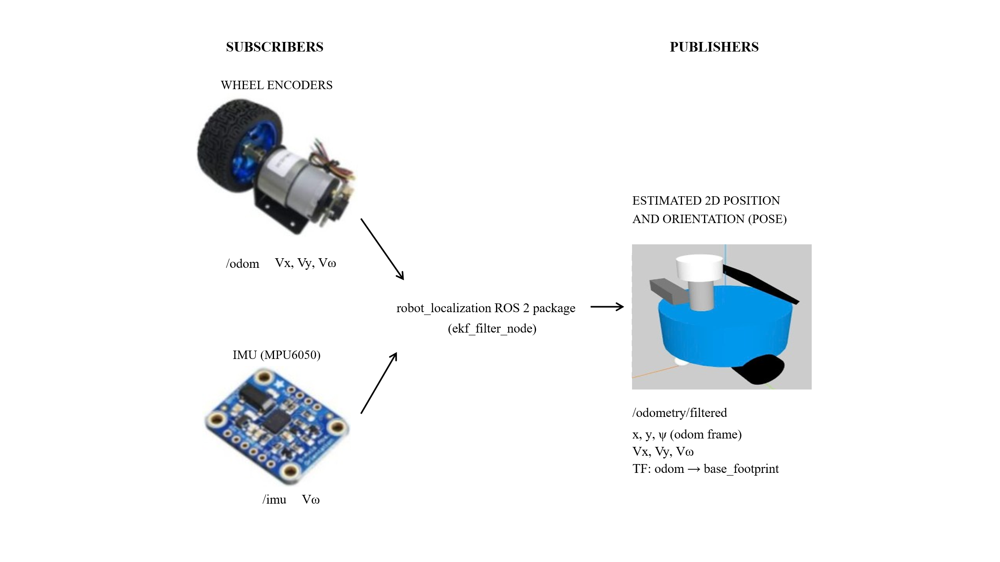
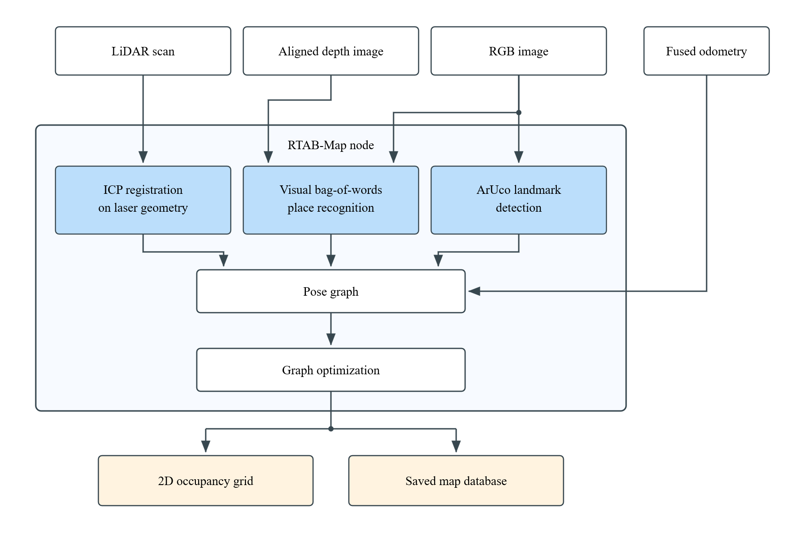
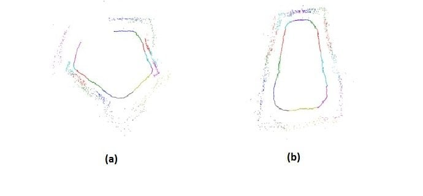
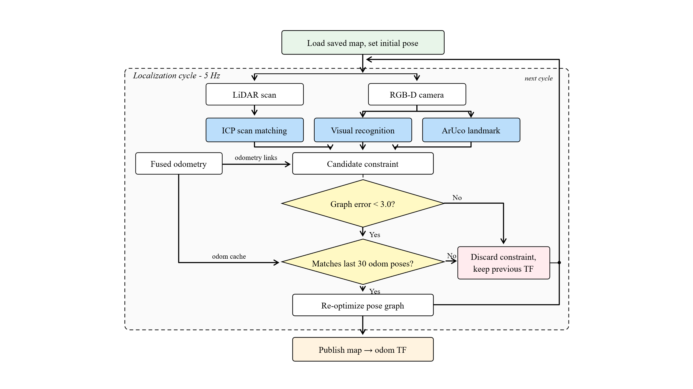
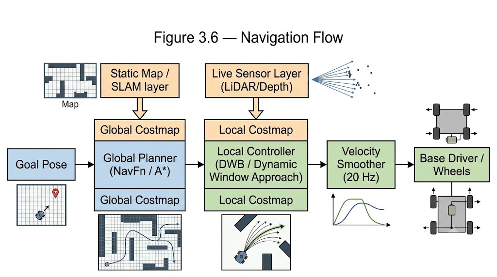
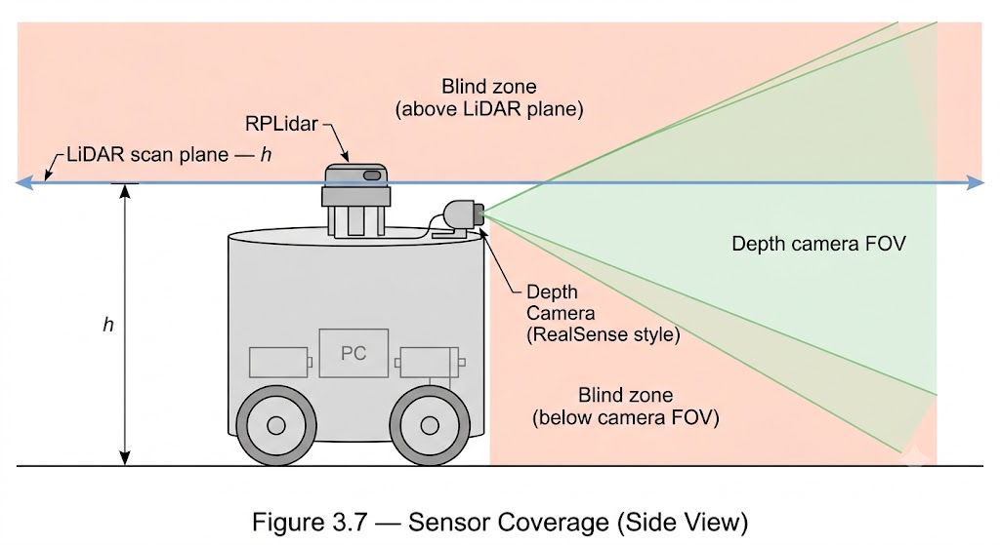

# CHAPTER 3: PROPOSED METHOD (I): ROBOT CONTROL AND NAVIGATION ON ROS2
## 3.1 System Requirements
**Map building:** The SLAM method must build a 2D map of the service area by fusing several onboard sensors, namely the LiDAR, the IMU, the wheel encoders and the RGB-D camera, so that the resulting map is accurate and consistent enough to be reused for localization and navigation.

**Bounded odometry drift: **The fused encoder-IMU odometry must bound accumulated position and heading drift over a full-service loop and must be corrected at the table against an absolute reference, since raw wheel odometry alone accumulates error beyond the arrival tolerance stated below.

**Consistent**** localization:**** **The system must localize accurately and consistently in a visually and geometrically repetitive environment, keeping localization error over a mapped route well below the arrival tolerance stated below.

**Accurate arrival:** The robot must re-detect fixed ArUco markers built into the map to correct accumulated drift, so that its pose near a marked table stays accurate and arrival there is repeatable rather than left to odometry drift.

**Safety and operating constraints:** The robot must operate on flat indoor floor inside the dedicated lane, keep a safe clearance from obstacles, and stop safely whenever the lane is blocked, or a target marker cannot be found.

## 3.2 Robot Platform Specification
The platform is a purchased two-wheel differential-drive (TWD) base. The contribution of this work begins at the ROS2 layer and above; the mechanical building, the motor drive and the low-level firmware are used as supplied. The physical and electronic properties that the methods of this chapter depend on are collected in Table 3.1.

*Table 3.1: Robot platform specification.*
| Group | Item | Value |
| --- | --- | --- |
| Chassis | Drive configuration | Two-wheel differential drive, one passive caster |
| Chassis | Body radius / height | 0.114 m / 0.106 m |
| Chassis | Wheel radius / diameter | 0.0362 m / 0.0724 m |
| Chassis | Wheel width | 0.053 m |
| Chassis | Wheel track | 0.206 m |
| Chassis | Caster | Sphere, radius 0.015 m, 0.09 m forward of the body center |
| Chassis | Footprint radius used by the navigation stack | 0.12 m |
| Sensor mounting | LiDAR scan plane | 0.22 m above base_link |
| Sensor mounting | RGB-D camera | 0.10 m forward, 0.17655 m above base_link |
| LiDAR | Model | Slamtec RPLIDAR A2M8, 360° 2D scanner |
| LiDAR | Interface | USB serial, 115200 baud, standard scan mode |
| LiDAR | Range used for mapping | 0.15 m to 10.0 m |
| RGB-D camera | Model | Intel RealSense D435 |
| RGB-D camera | Color stream | 640 × 480 at 15 fps |
| RGB-D camera | Depth stream | 640 × 480 at 15 fps, aligned to the color frame |
| IMU | Model | MPU6050, six-axis, no magnetometer |
| IMU | Accelerometer full-scale range | ±2 g, 16-bit signed |
| IMU | Gyroscope full-scale range | ±500 °/s, 16-bit signed |
| Encoders | Type | Hall-effect quadrature, one per driven wheel |
| Encoders | Resolution | 1024 pulses per revolution |
| Encoders | Gear ratio | 1:30 |
| Encoders | Counts per wheel revolution | 122880 |
| Base controller | Board / MCU | OpenCTR (Robot Controller H40), STM32F407VET6, 168 MHz Cortex-M4 |
| Base controller | Supply input | 7-17 V wide-voltage input, 80 A electronic (MOS) switch |
| Base controller | Motor / servo drives | Four quadrature-encoder motor ports, six PWM servo channels |
| Base controller | Auxiliary interfaces | On-board IMU, buzzer, OLED, 3× TTL serial, SBUS, SPI/I²C, SWD download |
| Base controller | Link to the onboard computer | USB serial, 230400 baud |
| Base controller | Telemetry frame / rate | 25-byte binary frame, 50 Hz |
| Onboard computer | Model | NVIDIA Jetson Orin Nano, 8 GB |
| Onboard computer | Middleware | ROS2 |
| Power | Battery | 12.6 V (nominal 12 V) 10 000 mAh polymer lithium pack, T-plug |
| Power | Protection | Over-discharge, over-current and over-voltage protection board |
| Power | Discharge current | 10 A continuous, 20 A peak |
| Power | Distribution | 12 V direct to the motor driver and to the onboard computer (12 V @ 5 A port); DC-DC 5 V @ 5 A rail for the servos |
| Power | Telemetry | Pack voltage reported by the base at 50 Hz |

Two consequences of this table shape the rest of the chapter. First, the IMU has no magnetometer, so nothing on the robot measures absolute heading; heading must therefore be anchored by the map (Section 3.5) rather than by the inertial sensor. Second, the LiDAR observes a single horizontal plane at 0.22 m, so obstacles above and below that plane are invisible to it; this gap is closed by the camera in Section 3.6.

### 3.2.1 Sensing and Compute Components
Three devices carry the perception and computation that the rest of this chapter depends on. Their numeric properties are collected in Table 3.1; this subsection describes what each one contributes and how it is used, without repeating the figures given there.

**Slamtec RPLIDAR A2M8.** The primary geometric sensor is a 360° rotating 2D laser scanner. It measures range by laser triangulation over a full revolution, producing a planar scan of the room several times a second in a single horizontal plane 0.22 m above the floor. Because it measures distance directly and does not rely on ambient light, its geometry stays stable across the lighting changes common in a dining room, and within its plane it is accurate enough to serve as the sole source of the occupancy grid built in Section 3.4 and of the global costmap in Section 3.6.1. It’s one structural limit is that it sees only that horizontal plane: obstacles above or below the beam are invisible to it, which is the gap the depth camera fills in Section 3.6.1. It connects to the onboard computer over a USB serial link and runs through its stock ROS2 driver without modification.

**Intel RealSense D435.** The RGB-D camera provides two things the LiDAR cannot. Its color stream carries visual appearance, which drives place recognition and ArUco marker detection during mapping and localization (Sections 3.4 and 3.5) and lets the robot separate locations that look identical to a 2D scan. Its depth stream collapses into a synthetic laser scan over the near field, covering the low and overhanging obstacles that fall outside the LiDAR plane (Section 3.6.1). The camera projects an infrared pattern and recovers depth from a stereo pair, so it works in ordinary indoor light but is trusted only over the near-to-mid range where that depth stays accurate. Its combined color and depth bandwidth is the one reason the platform needs a USB 3.0 port rather than only USB 2.0.

**NVIDIA Jetson Orin Nano (8 GB).** The onboard computer runs the whole system on one board: the ROS2 navigation stack of this chapter on the CPU, and the GPU-accelerated workloads (RTAB-Map's visual feature matching here, and the speech and language models of Chapter 4) on its integrated GPU. Its 8 GB of memory is unified, meaning the CPU and GPU share one pool rather than each holding its own, so perception, navigation, and speech inference all draw from the same 8 GB. What can run at once is therefore limited by memory, not by compute, and that limit shapes the workload split of Chapter 4. Every other device connects back to it, so it is also the hub through which the system communicates, which Section 3.2.2 takes up.

### 3.2.2 System Interconnection
The onboard computer is that hub. The RPLIDAR and RealSense D435 reach it over a USB serial link, and the OpenCTR base controller over a USB serial link at 230400 baud. The base controller in turn carries the four drive motors with their wheel encoders and the on-board MPU6050 IMU, so those measurements arrive at the computer inside the base telemetry frame described in Section 3.3.1 rather than over separate buses. Power is distributed from the 12.6 V battery in parallel: directly to the motor driver, to the onboard computer through its 12 V @ 5 A port, and through a DC-DC converter to the 5 V servo rail, with the pack voltage reported back to the computer in the same telemetry frame. Figure 3.1 shows these data and power paths.

Figure 3.1: Block diagram of the robot's electronics with the Jetson Orin Nano at the center and three data links.

## 3.3 Encoder-IMU Sensor Fusion with an Extended Kalman Filter
### 3.3.1 Wheel Odometry from the Encoders
Each driven wheel carries a Hall-effect quadrature encoder. As the wheel turns, the encoder emits pulses on two offset channels; counting the pulses gives the amount of rotation and the ordering of the channels gives its direction. The number of counts produced per full wheel revolution is

where  is the number of counts per wheel revolution,  is the encoder resolution in pulses per revolution, the factor  comes from quadrature decoding (both edges of both channels are counted), and  is the gear ratio between the encoder shaft and the wheel. One count therefore corresponds to a fixed arc length at the wheel rim,

with  the wheel diameter, so that a wheel  producing  counts in an interval  turns at a linear speed of

where  and  denote the left and the right driven wheel.

With the platform values of Table 3.1, namely  pulses per revolution,  and a wheel diameter of  m, this gives  counts per wheel revolution and a rim resolution of  per count. The resolution of the encoders is therefore far finer than any error the odometry suffers from; the limiting factors are slip and wheel-geometry error, not quantization.

The forward kinematics of the differential drive established in Section 2.2 convert the two-wheel speeds into the body-frame velocities of the robot,

where:

is the forward velocity of the body, in m/s;

is the lateral velocity, held at zero by the non-holonomic constraint of the two-wheel drive;

is the yaw rate, in rad/s, obtained as the wheel-speed difference divided by the wheel track .

These three quantities form the wheel-odometry measurement supplied to the filter,

where  is the odometry measurement noise, whose covariance  is given in Section 3.3.3.

Integrated on its own over an Euler step, this velocity yields a pose,

with the heading wrapped to . This integrated pose is published for reference, but only the velocity  is fused, because an integrated wheel pose accumulates drift that the filter cannot later undo. Pulse counting, scaling into wheel speeds and the motor control loop all run at a fixed 50 Hz on the STM32 of the base and are transmitted over the serial link; the ROS2 driver on the onboard computer converts the values to SI units and publishes the odometry message.

Wheel odometry alone drifts, chiefly from wheel slip and from small errors in the assumed wheel geometry, and because it only ever adds new motion onto the previous estimate it can never correct a past mistake. The heading is the worst affected, since every turn contributes error that is never removed. For this reason, the wheel odometry is fused with the IMU rather than used on its own.

### 3.3.2 IMU Measurement Model
The IMU is a six-axis MPU6050 combining a three-axis gyroscope and a three-axis accelerometer. Both sensors report in the robot body frame as raw 16-bit signed integers, and the chip carries no magnetometer, so it provides no absolute heading.

**Gyroscope.** The gyroscope measures the body's angular velocity about the three body axes,

where ,  and  are the angular velocities about the body x, y and z axes, that is the roll, pitch and yaw rates. Each component arrives as a raw integer and is converted to physical units by the gyroscope scale factor,

where:

is the converted angular velocity about body axis , in rad/s, so that  is the yaw rate about the vertical axis;

is the raw integer reading of that axis;

is the gyroscope scale factor, in rad/s per count;

is the magnitude of the configured full-scale range of the gyroscope,  for a configured range of  on this robot;

is the magnitude of the signed 16-bit range over which the raw integer is spread.

**Accelerometer.** The accelerometer measures the body's linear acceleration along the three body axes,

where ,  and  are the accelerations along the body x, y and z axes. Each component is converted in the same way by the accelerometer scale factor,

where:

is the converted acceleration along body axis , in m/s²;

is the raw integer reading of that axis;

is the accelerometer scale factor, in m/s² per count;

is the magnitude of the configured full-scale range of the accelerometer,  for a configured range of  on this robot.

**Numeric values.** Substituting the two configured ranges gives the scale factors the driver applies to every incoming sample,

with  taken as  to match the constant used in the base firmware. The raw sensor axes are remapped to the ROS body convention (forward x, left y, up z) by a fixed permutation in the base firmware, so no further axis transform is applied on the ROS2 side.

**Bias on the yaw axis.** Of the six converted readings above, only the yaw rate  is used by the estimator, for the reason given at the end of this subsection. Even at rest the gyroscope reports a small constant offset, or bias, on that axis, which would otherwise integrate into a growing heading error. The bias is estimated by averaging  samples of  collected while the robot is stationary,

where  is the estimated bias,  the number of stationary samples and  the -th converted reading of . The bias is subtracted from every subsequent reading, giving the single-element IMU measurement supplied to the filter,

where  is the gyroscope measurement noise, whose variance  is given in Section 3.3.3.

The quantity this measurement carries is the yaw rate , the same physical quantity that appears in the wheel-odometry measurement  above and in the kinematic model of Section 2.2. The two sources obtain it differently: the gyroscope measures the turning rate directly, whereas the wheel odometry infers it indirectly from the difference of the two-wheel speeds. Having two independent measurements of one quantity is precisely what makes the sources complementary, and Section 3.3.3 fuses them.

The yaw rate is the only quantity taken from the IMU. The accelerometer is converted and published but is not fused, and the orientation produced on the base by a complementary attitude filter is not fused either, because without a magnetometer nothing bounds its drift during long rotations. The robot's absolute heading is instead anchored by the map-based localization of Section 3.5.

### 3.3.3 Fusion with the Extended Kalman Filter
The wheel odometry gives accurate translation but drifts with slip; the IMU gives a clean, slip-independent yaw rate but no absolute reference. The two are combined by the Extended Kalman Filter presented in Section 2.2, implemented by the robot_localization package and configured entirely through a parameter file.

**State vector.** Because the robot moves on a flat floor, the filter runs in planar mode: height, roll, pitch and the out-of-plane rates are held fixed and dropped from the estimate. The state reduces to the planar pose and the body-frame velocities,

where:

,  are the position of the robot in the odom frame, in metres;

is the heading, or yaw angle, in that same frame;

, ,  are the body-frame velocities already defined in Section 3.3.1.

The first three entries are the pose that the rest of the stack consumes; the last three are kept so that the two velocity measurements can be fused and then integrated into that pose. Note that the last three state components carry the same symbols as the measurements of Sections 3.3.1 and 3.3.2, and deliberately so: both sources observe quantities that are already part of the state, which is what makes the measurement models below pure selections.

**Process model.** Over one step of duration  the body velocities are rotated into the world frame by the current heading and integrated to advance the position, while the velocities themselves are carried forward unchanged under a constant-velocity assumption, with any real change absorbed by the process noise:

The model is non-linear through  and  in the position update, which is why the extended form of the filter is required; its Jacobian  differs from the identity only in the couplings introduced by integrating motion over one step.

**Measurement models.** Both sources observe quantities that are already state components, so each model reduces to a selection,

where  predicts what the wheel odometry  of Section 3.3.1 should read and  predicts what the gyroscope measurement  of Section 3.3.2 should read, each difference  forming the innovation that the update step applies. Both models are linear, so their Jacobians  and  are constant matrices of ones and zeros, each row holding a single  in the column of the state it observes,

so that the three rows of  pick out ,  and  and the single row of  picks out . The position and the heading are therefore never corrected directly by either sensor; they are corrected indirectly, through the coupling between the velocities and the pose held in the covariance . The yaw rate  is the one quantity both sources observe, so it is fused twice per cycle, each contribution weighted by its own measurement-noise covariance,  and .

**Configuration.** Because the robot moves on a flat floor, the filter runs with two_d_mode set to true, which is what reduces the estimate to the planar state written above: height, roll, pitch and the out-of-plane rates are held at zero rather than estimated. The rest of the settings in this category follow from the platform and leave no real choice. The filter predicts and updates at 30 Hz, treats a silent source for more than 0.1 s as unavailable, buffers each input against jitter in arrival time, and reinitializes when timestamps jump backwards. It runs as a local odometry instance, estimating the pose of base_footprint in the odom frame, and it publishes the odom → base_footprint transform itself instead of leaving it to the base driver. The accelerometer is unused, so gravity removal and acceleration publishing are both switched off. Table 3.2 lists the settings that were genuinely chosen, with the reason for each.

*Table 3.2: Extended Kalman Filter design settings.*
| Parameter | Value | Reason |
| --- | --- | --- |
| odom | , , | Only the twist of the wheel odometry is fused; its integrated pose is ignored, so that pose and twist are not both taken from one source. |
| imu | only | Only the gyroscope yaw rate is fused; orientation is excluded for want of a magnetometer. |
| odom0_twist_rejection_threshold | 2.5 | Discards odometry-twist spikes caused by wheel slip. |
| imu0_angular_velocity_rejection_threshold | 1.2 | Discards gyroscope spikes caused by vibration or electrical noise. The tighter value reflects the gyroscope being the cleaner of the two sources. |
| process_noise_covariance | matrix | Sets how far the constant-velocity assumption may drift between predictions. |
| initial_estimate_covariance | matrix | Small for the known initial pose, large for the unobserved states. |

Both thresholds are counted in standard deviations, not in raw sensor units. Before each update, the filter already has a prediction for what the sensor should read, together with how uncertain that prediction is. When the actual reading comes in, the filter checks how many standard deviations away it falls from the prediction and throws the reading away if it falls too far. A wheel-odometry reading is discarded once it is more than 2.5 standard deviations from what the filter expected, and a gyroscope reading once it is more than 1.2 away. Measuring the gap this way, instead of with a fixed number like "0.1 m/s," lets the same threshold work whether the filter is currently confident or unsure. A low threshold rejects more noise but also risks throwing away genuine sudden acceleration.

The measurement-noise covariances are not set in this file. They are attached to every message by the base driver, which sets them adaptively rather than fixing them: the odometry covariance is tightened when the wheels report no motion, so that a stationary robot leans on the encoders and does not wander, and relaxed while driving, where slip makes them less reliable. The lateral velocity is a separate case. Since a differential-drive robot cannot move sideways, the driver reports  as a measured zero with a very small variance, which turns the non-holonomic constraint into an enforced property of the estimate rather than a hint.

In the parameter file,  and  are not written as the six-by-six matrices used above. robot_localization always works with its full state of fifteen quantities, which is position, orientation, their rates, and linear acceleration, each on all three axes, so both matrices are declared as 15-by-15 in the file even though two_d_mode only lets six of those states move. The other nine, everything tied to , roll, and pitch, are forced back to zero after every predict and update step regardless of what covariance is assigned to them. Table 3.3 lists only the six diagonal entries that affect the published estimate; the remaining off-diagonal entries are zero throughout, so each state and each measurement is treated as independent.

*Table 3.3: Covariance values, planar diagonal entries.*
| Matrix |  |  |  |  |  |  |
| --- | --- | --- | --- | --- | --- | --- |
| , process noise | 0.02 | 0.02 | 0.05 | 0.03 | 0.03 | 0.04 |
| , initial estimate |  |  |  |  |  |  |

The nine out-of-plane entries, not shown above since two_d_mode** **holds them at zero regardless, follow one pattern in the file: a process noise between 0.02 and 0.06 in , paired with an initial covariance of  in , which is the value robot_localization uses to mark a state as unconstrained. One entry breaks the pattern: vertical acceleration is given an initial covariance of  instead of . Since that state is zeroed out by two_d_mode anyway, it has no effect on the estimate, but it is worth checking against the intended configuration.

The yaw rate is the one state both sources observe, and the two variances that meet there are  for the odometry while driving against  for the IMU. The gyroscope is therefore trusted about five times more than the wheels for rotation, which is the intended division of labour: the encoders carry translation, the IMU carries rotation.

One consequence follows directly. The heading  is never measured by any source; it comes only from integrating the fused yaw rate, and so it still drifts slowly in the odom frame. This is accepted by design, because the absolute pose is anchored separately by the localization layer of Section 3.5.

Figure 3.2: Block diagram of Encoder-IMU odometry fusion using EKF.

## 3.4 Map Building with RTAB-Map
The robot operates indoors, on a fixed floor plan that does not change from one service to the next, so a map built once in advance remains valid for every trip; this is the assumption that justifies building the map offline rather than mapping continuously as an outdoor robot would have to. The map is built once, before deployment, by driving the robot slowly along the whole service lane under manual control, including a return pass so that the start of the lane is revisited and at least one loop closure is triggered. The resulting graph is optimized into a globally consistent two-dimensional occupancy grid, which is saved and reused for every subsequent trip.

RTAB-Map builds this map as a pose graph, taking geometry from the LiDAR, appearance from the RGB-D camera, and fixed ArUco markers as landmarks. Chapter 2 covers why this method was chosen over LiDAR-only and vision-only alternatives; the rest of this section takes the method as settled and describes how it is configured and how its loop closure was tuned for this floor.

### 3.4.1 Mapping Configuration
RTAB-Map is configured through a single parameter file. Table 3.4 lists the parameters that shape the mapping run, with the value used and the reason for it; settings left at their RTAB-Map defaults are omitted unless the default itself is a decision worth recording.

*Table 3.4: RTAB-Map configuration for mapping.*
| Group | Parameter | Value | Purpose |
| --- | --- | --- | --- |
| Inputs | subscribe_depth / subscribe_scan | true / true | Both the RGB-D camera and the LiDAR feed the graph. |
| Inputs | frame_id | base_footprint | The frame the filter of Section 3.3 and the costmaps also use. |
| Inputs | Odometry source | fused odometry (Section 3.3) | The backbone of the pose graph; pose is not re-derived from raw sensors. |
| Memory | Mem/IncrementalMemory | true | New observations are added to the graph as the robot drives the lane. |
| Occupancy grid | Grid/Sensor | 0 (LiDAR) | The grid is built from laser returns only; depth noise at range would write ghost cells. |
| Occupancy grid | Grid/CellSize | 0.05 m | Grid resolution; matches the navigation costmaps of Section 3.6. |
| Occupancy grid | Grid/RangeMax / Grid/RangeMin | 10.0 m / 0.15 m | Covers the 9.5 m room; the lower bound rejects return from the robot's own body. |
| Graph | Rtabmap/DetectionRate | 2.0 Hz | Keeps the graph dense; mapping runs offline, so there is no real-time cost to trade against. |
| Graph | RGBD/LinearUpdate / RGBD/AngularUpdate | 0.05 m / 0.05 rad | New-node thresholds in translation and rotation. |
| Graph | RGBD/OptimizeFromGraphEnd | false | Keeps the map origin fixed rather than re-anchoring at the newest node. |
| Registration | Reg/Strategy / Reg/Force3DoF | 1 (ICP) / true | Geometric registration on laser data, constrained to . |
| Registration | RGBD/ProximityBySpace | true | Detects revisits by spatial proximity as well as by appearance. |
| Registration | Icp/VoxelSize | 0.05 m | Downsamples each scan before matching; matches the grid resolution. |
| Registration | Icp/MaxCorrespondenceDistance | 0.3 m | Widened beyond the 0.1 m default; see Section 3.4.2. |
| Registration | Icp/Iterations / Icp/CorrespondenceRatio | 30 / 0.1 | Converge inside the wider window; accept a match at 10% overlap. |
| Registration | Icp/PointToPlane / PointToPlaneK | true / 20 | Point-to-plane converges faster on planar indoor geometry. |
| Visual features | Whole group | defaults | GFTT/BRIEF detector, 500 features per image, PnP with 20 minimum inliers, no depth cut-off; see the note below. |
| Markers | RGBD/MarkerDetection | true | Inserts each detected marker into the graph as a landmark node. |
| Markers | Marker/Dictionary / Marker/Length | 0 (4×4) / 0.15 m | The dictionary must match Section 3.5; the known size makes one detection yield a metric pose. |
| Robustness | RGBD/OptimizeMaxError | 3.0 | Rejects any candidate link whose optimization error would distort the graph. |

The visual-feature group stays at its defaults. This is intentional, not accidental. These parameters balance recognition quality against processing load. Since mapping is offline, cost doesn't matter here. But once the settings run real-time, two of them deserve tuning first if processing gets tight. Lowering Kp/MaxFeatures directly cuts per-image cost. Capping Vis/MaxDepth removes the noisy far points from the RealSense, cutting cost while improving accuracy.

### 3.4.2 Loop Closure and Landmark Constraints
Two mechanisms correct the pose graph during mapping, both stored in the same map database. Geometric loop closure matches the current laser scan against stored geometry when the robot revisits an area, adding a constraint that cancels the drift accumulated since. ArUco markers add a second, independent constraint: each detected marker is inserted into the graph as a **landmark node**.

The ICP registration was tuned for this floor rather than left at its defaults. The correspondence search was widened from 0.1 m to 0.3 m to cover the drift accumulated between revisits, the iteration limit raised to 30 to converge inside that wider window, and the required overlap ratio lowered from 0.3 to 0.1 to accept a partially overlapping revisit. Matching also uses a 0.05 m voxel size, matching the grid resolution, and a point-to-plane metric with 20 neighbors per normal, which converges faster on planar indoor geometry. Each setting trades strictness for closure capability, admitting more false closures along with the true ones.

Geometric closure alone is not reliable here: identical tables at regular spacing and long flat walls make distinct locations look alike in the laser scan, and visual appearance is no steadier, since it shifts with lighting, occlusion, and the room being rearranged. Printed ArUco markers of known size, fixed at selected locations and detected inside the SLAM node, cover this gap. A marker's identity is decoded directly from its pattern, so recognizing it needs no threshold and cannot be confused with another place, and its known size yields a full relative pose from a single detection by solving PnP on the four corners. Its only limit is coverage: it helps only where a marker is installed and visible, so it supplements the geometric closure rather than replacing it.

Looser registration admits more false closures, so RGBD/OptimizeMaxError, set to 3.0, guards every candidate link, loop, proximity, or landmark, rejecting any whose optimization error would distort the graph.

Figure 3.3:** **RTAB-Map SLAM data-flow architecture.

Figure 3.4: Effect of loop closure. The map before and after a loop closure is accepted

## 3.5 Localization and ArUco-Based Pose Correction
Localization determines where the robot is on the stored map while it drives. No single sensor gives both a smooth, high-rate pose and a drift-free absolute position, so the problem is split into two layers.

The first layer is local odometry from sensor fusion. The Extended Kalman Filter of Section 3.3, from the robot_localization package, fuses wheel-encoder odometry with the IMU and publishes the odom → base_footprint transform. This estimate updates quickly and is locally accurate, which is what the controller needs to track a path. Over longer distances it drifts, because wheel slips and IMU bias accumulate with no external reference to correct them.

The second layer is global localization from RTAB-Map. It matches the current LiDAR scan and RGB-D image against the map database built in Section 3.4 and publishes the map → odom transform that corrects the drift in the first layer. The same RTAB-Map node that built the map in Section 3.4 is switched into localization mode, so the stored map is never modified, and the whole map is loaded into memory at start-up, which lets the robot relocalize from anywhere rather than only near its last known pose.

RTAB-Map matches against the same features that built the map, because it reuses the mapping sensors. The LiDAR carries the geometry through ICP scan matching. The RGB-D camera adds visual place recognition, which matters where a restaurant repeats itself: long flat walls and evenly spaced tables look alike to a 2D scan, and scan matching alone can lock onto the wrong spot.

ArUco markers add a third cue, and it is the one that cannot be ambiguous, because a marker carries a printed pattern that decodes to a known identity. The camera image is searched for markers of the mapping dictionary, and each detection returns the marker identity and its four corners in the image. Since the marker's side length is known, solving the perspective-n-point (PnP) problem on those four corners recovers the marker's pose relative to the camera,

This is a measurement, not yet a correction. The marker's pose on the map was stored as a landmark when the map was built, and the camera-to-base transform is fixed by the robot model, so chaining the three recovers the robot's pose on the map from a single image,

RTAB-Map does not apply this estimate as a pose reset. It adds the detection to the pose graph as a landmark constraint and re-optimizes, so the marker is weighed against the LiDAR and odometry already in the graph rather than overriding them. A single detection is then enough to pull accumulated drift back onto the map without the pose jumping, and because the identity is unambiguous the correction holds wherever a marker is in view.

The pose-correction rate is raised to 5.0 Hz, above the 2.0 Hz used during mapping, so corrections arrive fast enough for the navigation controller to track, close to what Adaptive Monte Carlo Localization would provide. Two guards keep the robot from jumping to the wrong place in symmetric areas: RTAB-Map rejects any match whose graph error is too large, and it checks each candidate’s localization against the last 30 odometry poses before accepting it.

The two layers feed Nav2 through the standard transform chain

The EKF owns the fast local segment, RTAB-Map owns the slow global correction, and Nav2 reads the combined result as a single pose.

Figure 3.5:** **Localization and pose-correction flow.

## 3.6 Autonomous Navigation with Nav2
Navigation consumes everything the previous layers produce: the occupancy grid of Section 3.4, the map-to-odometry transform of Section 3.5, and the fused odometry of Section 3.3. A goal is a pose on the map, namely the approach point recorded for a requested table, and the navigation stack turns it into safe motion through a global planner that computes a path across the whole map and a local controller that follows that path while reacting to what the sensors see.

### 3.6.1 Obstacle Perception
The LiDAR scans a single horizontal plane at 0.22 m above the floor. Two classes of obstacle are invisible to it: anything below the plane, such as flared chair legs, boxes and thresholds, and anything above it, such as table edges, overhanging trays and a person's arm. Both are common in restaurants, and both are collision hazards.

The gap is closed by converting the depth image into a second, synthetic laser scan covering the near field that the LiDAR plane misses. Eight image rows are collapsed into one scan line every 0.066 s, over a usable range of 0.35 m to 2.5 m, which is the interval in which the depth sensor is both in focus and accurate enough to trust.

The two sources are then fused asymmetrically into the two costmaps, which is a deliberate choice rather than an oversight. The local costmap, which governs immediate collision avoidance, consumes both the LiDAR and the depth-derived scan, because near-field avoidance needs the most complete picture available. The global costmap, which governs long-horizon planning, consumes the LiDAR only, because the depth source reaches just 2.5 m and is noisy at that distance, so it would inject transient obstacles into plans spanning the whole room. The depth source is additionally capped at an obstacle height of 0.8 m against 2.0 m for the LiDAR, restricting it to what the robot can physically strike. Table 3.5 gives both costmaps in full.

*Table 3.5: Costmap configuration.*
| Property | Local costmap | Global costmap |
| --- | --- | --- |
| Reference frame | odom | map |
| Extent | 4 × 4 m rolling window | Whole map, static |
| Resolution | 0.05 m | 0.05 m |
| Update / publish rate | 10.0 Hz / 2.0 Hz | 1.0 Hz / 1.0 Hz |
| Layers | obstacle, inflation | static, obstacle, inflation |
| Robot radius | 0.12 m | 0.12 m |
| Observation sources | LiDAR scan and depth scan | LiDAR scan only |
| LiDAR obstacle / raytrace range | 0.15 to 2.5 m / 0.15 to 3.0 m | 0.15 to 2.5 m / 0.15 to 3.0 m |
| Depth obstacle / raytrace range | 0.35 to 2.5 m / 0.35 to 3.0 m | not used |
| Maximum obstacle height | 2.0 m LiDAR, 0.8 m depth | 2.0 m |

The split reflects the two consumers. The local costmap serves the controller, so it lives in the odom frame, rolls a 4 by 4 m window with the robot, and updates fast at 10 Hz to catch a near obstacle at once. The global costmap serves the planner, so it lives in the map frame, covers the whole floor for a full-length path, and updates slowly at 1 Hz. Both share the 0.05 m map resolution and plan around a 0.12 m robot radius. Within each grid the obstacle layer marks return out to 2.5 m and clears stale cells out to 3.0 m, the height cap decides what counts as strikable (0.8 m for depth, 2.0 m for the LiDAR), and the inflation layer pads a cost buffer around every obstacle.

### 3.6.2 Planning and Control
Reaching a table is two problems running at different rates. The global planner draws one path across the whole map, from the robot's current pose to the approach point, and refreshes it slowly. The local controller then follows that path, deciding many times a second what velocity to send to the wheels so the robot stays on the path and stops short of anything in the way. Two algorithms do this work: A* for the global path, and the Dynamic Window Approach for the local control. Table 3.6 lists the settings of both.

**Global planning with A*.**

The global costmap of Section 3.6.1 is a grid. Each cell carries a cost, low in open floor and rising through the inflated band around obstacles. The planner treats every free cell as a node linked to its eight neighbors.

Moving from one cell to the next costs the distance travelled plus the cost of the cell entered, so a route that hugs an obstacle is charged more than one that stays in the open. A* searches this graph by expanding cells in order of the estimated total cost of a route passing through them,

where  is the cost already accumulated on the best route found from the start to cell , and  is a heuristic that estimates the cost still to go.

The heuristic used here is the straight-line distance from  to the goal. At each step the planner takes the unexpanded cell with the lowest , updates its neighbours, and repeats until it reaches the goal cell. The straight-line heuristic never overestimates the true remaining cost, so the path returned is a least-cost one. Because the heuristic also pulls the search toward the goal, A* finds that path after expanding far fewer cells than an uninformed search that ignores  and spreads outward in every direction.

That saving is the reason for choosing A* here. The floor plan is fixed and known, and goals sit at the far end of the lane, so steering the search with  shortens planning without changing the path it finds. The planner may route through cells the map still marks as unknown and accepts a path that ends within 0.25 m of the goal when the goal cell itself cannot be reached. It replans once a second, so the path stays valid as the pose is corrected. Each planning call is expected to finish within 50 ms, and Nav2 warns if it does not.

**Local control with the Dynamic Window Approach.**

The wheel command comes from DWB, the Nav2 controller built on the Dynamic Window Approach. DWB works in velocity space rather than position space. It does not ask where to go next; it asks which constant velocity, held for the next moment, would carry the robot along the path without hitting anything. A differential-drive base takes two numbers, the forward speed  and the yaw rate , so every candidate is a pair . The controller repeats four steps on every control cycle, at 20 Hz.

The first step bounds the search to a window of velocities. Two limits define that window. The first is the robot's fixed envelope, the speeds the base can hold at all,

Forward speed starts at zero rather than a negative value, so the base never samples a reverse trajectory. Lateral velocity is held at zero throughout, which writes the non-holonomic constraint of the two-wheel drive straight into the search: the controller can only drive forward and rotate, and it turns on the spot when the heading has to change sharply.

The second limit is the set of velocities reachable from the current velocity  within one control period , given the acceleration limits  on the forward speed and  on the yaw rate,

This second set is the dynamic window the method is named after. It slides with the robot's present motion and keeps every candidate within one step's worth of acceleration, so the controller never commands a jump the base cannot physically make. The window search is the intersection of the two,

sampled on a grid of 20 forward speeds by 20 yaw rates, giving up to 400 candidate pairs each cycle.

The second step simulates each sampled pair forward over a fixed horizon of 1.7 s. Holding  constant, the controller rolls the differential-drive kinematics ahead in small increments, 0.05 m of travel or 0.025 rad of turn at a time and records the short trajectory the robot would trace if it committed to that command.

The third step scores each simulated trajectory. A critic is one term that rewards or penalizes one property of a trajectory, and a candidate is graded by a weighted sum of them,

Table 3.6 lists the critics and their weights . Collision safety is not one of them. A trajectory that enters a lethal costmap cell is discarded before it is scored at all, so the weighted sum only ever chooses between trajectories that are already collision-free.

The fourth step is committed. The controller takes the highest-scoring surviving pair, publishes it as the velocity command, and begins the cycle again from the new velocity on the next tick. Running all four steps at 20 Hz keeps the command matched to the robot's real motion and to what the costmaps currently show.

*Table 3.6: Global planner and local controller configuration.*
| Group | Setting | Value |
| --- | --- | --- |
| Global planner | Algorithm | NavFn grid search with the A* heuristic |
| Global planner | Path endpoint tolerance | 0.25 m |
| Global planner | Planning through unknown space | allowed |
| Global planner | Replanning rate | 1.0 Hz |
| Controller | Control rate | 20.0 Hz |
| Controller | Velocity limits | forward 0 to 0.26 m/s, lateral 0, yaw ±1.0 rad/s |
| Controller | Acceleration limits | ±2.5 m/s², ±3.2 rad/s² |
| Controller | Trajectory sampling | 20 × 20 pairs, 1.7 s horizon, 0.05 m / 0.025 rad steps |
| Critic weights | Path distance, path alignment, rotate to goal heading | 32.0 |
| Critic weights | Goal distance, goal alignment | 24.0 |
| Critic weights | Obstacle proximity | 0.02 |
| Critic weights | Oscillation suppression | enabled |
| Arrival | Goal tolerance | 0.18 m, 0.15 rad |
| Arrival | Progress requirement | 0.10 m within 30.0 s |

**Output conditioning.** The velocity command does not go straight to the wheels. A velocity smoother runs at 20 Hz between the controller and the base driver. It holds the command to the same envelope the controller uses, ±0.26 m/s and ±1.0 rad/s under acceleration limits of ±2.5 m/s² and ±3.2 rad/s², and applies a small deadband, 0.01 m/s and 0.05 rad/s, so that near-zero commands settle to a clean stop instead of chattering. A path smoother refines the global plan before the controller follows it. Both act on the platform rather than the algorithm. A differential-drive base that is handed abrupt velocity steps answers with wheel slip, and wheel slip is the same disturbance the filter of Section 3.3 spends its rejection thresholds and adaptive covariance holding back. Smoothing takes that disturbance out at the source instead of leaving the filter to clean it up afterwards.

**Arrival at a table.** The controller drives the robot to the approach point stored for the requested table. The goal checker then decides when the goal is reached, declaring arrival once the robot is within the position and heading tolerances of Table 3.6. The rotate-to-goal critic turns the robot onto the recorded approach heading as it closes in, so the robot finishes facing the ArUco marker rather than facing the direction it drove in from. At a table that carries an ArUco marker, the landmark constraint of Section 3.5 refines the map-frame pose while the robot arrives, so the stopping pose is registered against the surveyed table position instead of resting on odometry that has been running since the last correction.

Figure 3.6: Autonomous navigation architecture and motion planning framework.

Figure 3.7: Sensor field-of-view and blind zone analysis (side view).

