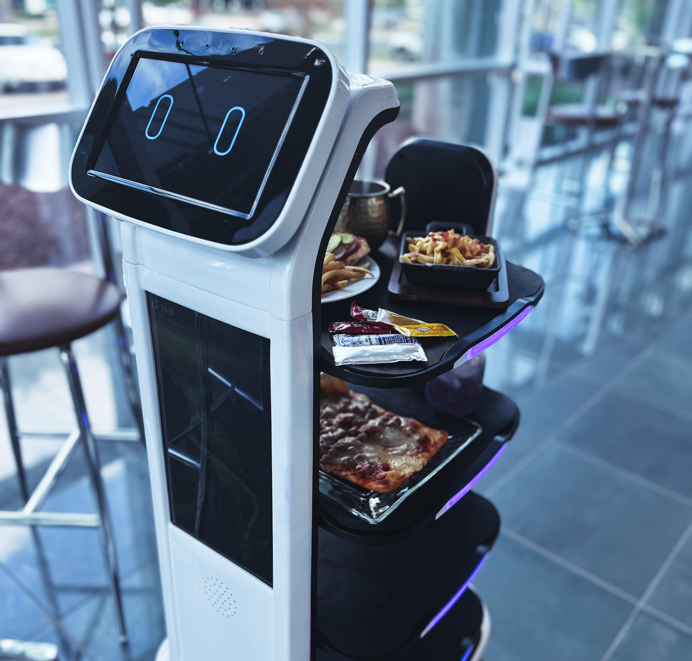
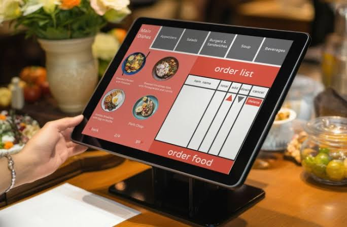
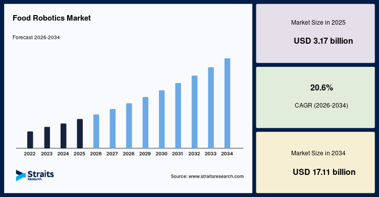

## CHAPTER 1: INTRODUCTION

### 1.1 Motivation

Service robots in restaurants have changed shape. The first deployments ran on rails or on magnetic
tape laid into the floor, so the building had to be rebuilt around the robot. Current platforms
localise themselves against a map they built and follow a route an operator can redraw in software.
The direction is steady: less fixed infrastructure in the restaurant, more autonomy on the robot.

*Figure 1.1. A Commercial Restaurant Service Robot: a multi-tray delivery platform in a dining
room, carrying plated food to a table. The display at the top shows a face and reports the robot's
status; it is not an ordering interface, and the order it is delivering was taken elsewhere. (image
source to be cited)*

Ordering has moved along a similar line. Paper menus gave way to QR codes and tablet applications,
a shift the pandemic accelerated and which is now ordinary in Vietnamese casual dining. Every step
took away part of the conversation a customer used to have with a waiter and handed it to a screen.
Speaking to the restaurant instead of tapping at it continues that line rather than departing from
it.

*Figure 1.2. Screen-Mediated Ordering: a self-service ordering terminal on a restaurant table. The
customer browses the menu by category and builds the order without speaking to anyone, which is the
step this trend has already taken. (image source to be cited)*

The third development is more recent. Large language models stopped being text generators and
became controllers: given a set of tools, a model can choose which one to call and with what
arguments, so its output is an action on a software system rather than a paragraph for a person to
read. An ordering conversation is exactly that kind of task, and this capability is what makes an
AI waiter buildable now rather than three years ago.

Inference has also moved closer to where it is used. Open-weight models small enough to serve on
one commodity GPU, together with edge boards of the Jetson class, let a restaurant run speech
recognition and language understanding on its own premises. The consequences are commercial as much
as technical: no per-request cloud bill, no dependence on an internet link during service, and
customer conversations that never leave the building.

These four lines point at the same system, and nobody has joined them. The robot that carries the
food does not talk to the customer, and the software that understands the customer cannot send a
robot. A restaurant that wants both runs two independent systems and bridges them by hand, with a
member of staff or a tablet in the middle. Delivery therefore stays a narrow capability, moving
objects between fixed points, while conversational artificial intelligence stays disembodied,
producing text it has no way to act on.

This thesis proposes the joined system: an autonomous waiter robot that accepts spoken Vietnamese
orders, processes them through a conversational AI agent, dispatches the order to the kitchen, and
delivers the food to the correct table. The work spans four domains: autonomous navigation on a
purchased two-wheel differential-drive platform, a Vietnamese voice processing pipeline deployed on
edge hardware, an AI agent that converts informal Vietnamese speech into validated backend actions,
and a real-time restaurant management system that keeps order state, kitchen display and robot
movement in step across several client roles.

Chapter 2 surveys prior work in each of these areas and identifies the gap it leaves. Chapters 3
and 4 present the proposed solutions. Chapter 5 reports what was measured.

---

### 1.2 Necessity of the Study

The case for the study rests on three conditions that hold at the same time: a structural labour
shortage in food service, a market that is already buying service automation, and a set of
component technologies that are individually mature but have not been composed.

The restaurant industry has faced a persistent and worsening labour shortage. In the United
States, the restaurant workforce remained approximately 3.6 % below pre-pandemic levels as of
2024, with quit rates in hospitality consistently outpacing all other sectors [1.2.1]. In Vietnam,
the food and beverage sector, valued at over 590 trillion VND in 2024 and forecast to grow at 9 to
10 % annually [1.2.2], faces its own recruitment pressures. A 2024 survey of Vietnamese food and
beverage enterprises found that 48 % reported difficulty recruiting and retaining service staff,
citing high turnover, wage pressure and a growing preference among younger workers for
office-based employment over physical service roles [1.2.3]. These conditions create a structural
need for automation able to absorb the high-frequency repetitive parts of table service, taking
orders, delivering food and processing payment, not in order to replace human workers but to cover
the portion of the workload for which staff are increasingly unavailable.

Investment in food service automation has accelerated in step with that need. The global food
robotics market was valued at 3.17 billion USD in 2025 and is projected to reach 17.11 billion USD
by 2034, a compound annual growth rate of 20.6 % across the forecast period [1.2.4]. That figure is
a market research forecast rather than a measurement, and the growth it assumes is steep, but the
direction is corroborated by deployment counts: a major Chinese manufacturer reported more than
40,000 units deployed across over 600 cities as of 2023 [1.2.5]. Robot delivery in restaurants has
moved from novelty to expectation in the Asia-Pacific region in particular, and Vietnamese
restaurants, especially in the fast-growing casual dining and hot-pot segments in Ho Chi Minh City,
Hanoi and Da Nang, have begun operating delivery platforms imported from China and South Korea.
Those deployments are uniformly non-interactive. The robot delivers food that was ordered through a
human waiter or a QR-code menu application, which is the disconnect described above appearing in
the Vietnamese market in particular.

*Figure 1.3. Food Robotics Market Forecast: global market value from 2022 to 2034, with 2026 to
2034 shown as projection. Reproduced from Straits Research [1.2.4].*

The third condition is technical. Every component an AI waiter needs already works on its own.
Large language models achieve competitive performance on Vietnamese conversational benchmarks
[1.2.6]. Speech recognition models fine-tuned on Vietnamese reach word error rates below 15 %
under clean conditions [1.2.7]. ROS 2 navigation stacks reliably drive differential-drive
platforms in mapped indoor environments [1.2.8]. Restaurant management software, covering
point-of-sale, kitchen display and QR-code ordering, is a mature commercial category. What does
not exist is a system in which these components operate as one pipeline: a customer speaks
Vietnamese to a robot, the speech is transcribed, the intent is classified correctly despite
informal wording, the agent takes validated actions on a backend, the kitchen display updates in
real time, and a robot drives to the correct table with the food. Each component was built for a
different context, cloud chatbots for customer support, warehouse fleet managers for logistics,
academic navigation stacks for controlled laboratory environments. Composing them raises problems
that none of them was designed to solve, and those problems, rather than the components
themselves, are the intellectual content of this thesis.

The work is feasible at student scale because the mechanical layer is bought rather than built.
The project uses a purchased two-wheel differential-drive platform whose chassis, motors,
encoders, microcontroller and IMU are supplied as a unit, and the group's contribution begins at
ROS 2 integration: adding the sensors, fusing them, building the navigation stack, and developing
the entire AI, backend and web software layer. That boundary keeps the effort on system
integration and AI capability rather than on mechanical engineering. The whole system runs on
commodity hardware, a laptop-grade GPU for language model inference, an NVIDIA Jetson edge
computer for on-robot voice processing, and ordinary web browsers for the client interfaces, which
puts the architecture within reach of small and medium-sized restaurant operators.

---

### 1.3 Objectives

The overall objective is to design, implement and evaluate an autonomous AI waiter system that
accepts Vietnamese spoken orders, processes them through a conversational agent, dispatches orders
to the kitchen, and delivers food to the correct table using a two-wheel differential-drive robot.
Nine specific objectives were set. Chapter 5 reports the measured result for each one, including
those that could not be measured within the reporting period.

1. **Intent classification accuracy.** Classify Vietnamese restaurant utterances into the correct
   intent, ordering, menu search, payment or general conversation, with accuracy of at least 90 %
   on cases held out from training.

2. **Routing without a language model in the loop.** Reach that accuracy with a trained
   classifier rather than with a language model, at a median latency at least an order of
   magnitude below language-model routing, so that deciding what a customer wants costs no
   perceptible time.

3. **Deterministic action validation.** Allow no item absent from the menu to reach the
   customer's cart, measured by comparing the system with the validator enabled against the same
   system with the validator bypassed.

4. **Knowledge retrieval quality.** Retrieve relevant dishes from the 219-entry menu in response
   to Vietnamese sensory descriptions rather than dish names, measured by recall and mean
   reciprocal rank at rank five.

5. **Agent turn latency.** Produce a reply within five seconds at the median, measured from the
   arrival of a transcript to the completion of the reply text.

6. **End-to-end ordering.** Complete full ordering scenarios, from a customer request through a
   confirmed order to the kitchen display, across conversations that include ambiguous dish names,
   items that are not on the menu, and changes of mind.

7. **EKF-fused odometry.** Integrate wheel encoder and IMU data through an Extended Kalman Filter
   on the two-wheel differential-drive platform, with a return-to-start error of at most `[?]` cm
   after a closed kitchen to table to kitchen path.

8. **Map-based navigation.** Build a map of the restaurant from LiDAR and RGB-D data using
   RTAB-Map, and drive from the kitchen to the correct table with a success rate of at least
   `[?]` % across the six tables.

9. **ArUco precision docking.** Re-localise against an ArUco marker on final approach and dock
   with a final pose error within `[?]` cm and `[?]` degrees.

Two clarifications belong with this list. Objectives 1 to 6 were evaluated on typed Vietnamese
text rather than on speech. The voice pipeline was specified and built, but speech recognition
accuracy in the deployed pipeline was not measured, so the figures reported for the agent describe
the agent and not the complete spoken path. Separately, one property was measured although it was
never set as a target, the completeness with which the agent puts every part of a multi-request
turn into words, because the experiments identified it as the system's weakest point and it would
be misleading to leave it out.

---

### 1.4 Research Scope

**In scope.** The system operates in an indoor, flat-floor restaurant environment with a
pre-mapped layout consisting of a kitchen area and six dining tables connected by a dedicated
service lane. The lane is physically separated from the customers, so the robot does not navigate
through dining areas and does not perform pedestrian avoidance. The map is two-dimensional.
Navigation is autonomous within the service lane, and arrival at a table triggers a precision
docking step using ArUco fiducial markers. The customer interacts with the system through spoken
Vietnamese, processed by a voice pipeline running on the robot's edge computer. The AI agent, the
knowledge retrieval system and the backend orchestrator run on a local server with a self-hosted
large language model. Three web interfaces, a customer ordering tablet, a guest check-in kiosk and
a combined kitchen and fleet management panel, provide the operational frontend. All components
communicate over local WiFi with no cloud dependency in normal operation.

**Out of scope.** The robot platform is purchased, so the mechanical design, the chassis, the
motors and the low-level motor control firmware are not part of this work; the contribution begins
at ROS 2 integration. The system supports Vietnamese speech only, and multi-language support is
not implemented. The language model is prompted, not fine-tuned. Only one restaurant environment
is mapped and evaluated. Multi-floor operation, elevator integration and dynamic obstacle handling
for pedestrians in the lane are not addressed.

**Known limitations.** The platform is non-holonomic: it cannot move laterally and corrects
heading by rotating in place. The consumer-grade MPU6050 IMU has bounded yaw accuracy, and the
drift it accumulates over distance is corrected by the ArUco markers at the tables but not during
transit. The Intel RealSense D435 depth camera and ArUco detection are both sensitive to lighting
conditions. All components communicate over WiFi, and network latency and occasional packet loss
are managed by reconnection logic rather than eliminated.

---

### 1.5 Contents

The work proceeded in four stages. Prior work in restaurant service robotics, Vietnamese speech
processing, conversational agents, knowledge retrieval and restaurant operations software was
surveyed first, and the gaps it left became the requirements for the two design chapters. The
navigation, voice, agent, backend and web layers were then implemented. The software layers were
deployed on the server and the browser clients and exercised end to end, and the robot was
assembled with its sensors, compute board and peripherals. Each objective was finally evaluated
with a dedicated experiment: the classifier, the retrieval indices, the validator, the agent and
the backend against curated Vietnamese datasets with paired statistical tests. The navigation
experiments were designed in full but require robot hardware time that was not available within
the reporting period, and are recorded as not evaluated rather than as unmet.

*Figure 1.4. The Assembled Robot Platform: the two-wheel differential-drive base with the sensors,
compute board and peripherals added by the group, labelled. Further views are given in Appendix F.
(photographed by the group)*

The remainder of this report is organised as follows.

- **Chapter 2** surveys prior work across the areas the system draws on: navigation to goals
  assigned dynamically by an external system rather than to pre-set waypoints, Vietnamese voice
  processing on edge hardware shared with robot control, informal spoken Vietnamese converted into
  validated actions without hallucination, sensory food descriptions matched against a menu indexed
  by name and category, AI-driven business events coordinated across several client roles in real
  time, and the division of computation between a robot and a server. For each area it identifies
  the specific gap that the proposed system addresses.

- **Chapter 3** presents the robot control and navigation system. It defines the navigation
  requirements, identifies the design challenges the platform imposes, and describes the proposed
  method: EKF sensor fusion, RTAB-Map mapping and localisation, ArUco precision docking, and
  Nav2-based autonomous navigation with goals assigned dynamically by the backend.

- **Chapter 4** presents the AI agent, the backend orchestrator and the web interfaces. It
  defines the system requirements, identifies the design challenges, and describes the overall
  software architecture, the edge voice pipeline, the conversational agent (intent classification,
  tool-calling workers, the deterministic validator, tool and state management, and response
  generation), the knowledge retrieval pipeline, backend orchestration and fleet management, and
  the three single-page web applications.

- **Chapter 5** presents the experiments and results: intent classification and routing against
  five alternative routers on identical cases, action validation and out-of-menu robustness,
  multi-intent execution and verbalisation, knowledge retrieval and the fusion ablation, six
  end-to-end conversations examined turn by turn, agent latency, and a set of infrastructure
  checks on the backend and the web interfaces. It also states what was not measured: the
  navigation, docking and odometry experiments, which need robot hardware time, and speech
  recognition accuracy in the deployed pipeline.

- **Chapter 6** concludes the report with a summary of the contributions, the limitations, and
  directions for future work.

The core contributions of this work are the following.

1. An autonomous two-wheel differential-drive robot platform with EKF-fused encoder and IMU
   odometry, RTAB-Map mapping and localisation, ArUco precision docking, and Nav2 navigation whose
   goals are set by an external AI-driven backend dispatcher rather than by an operator or a fixed
   schedule.

2. A Vietnamese voice processing pipeline deployed on Jetson edge hardware, integrating voice
   activity detection, speech recognition and speech synthesis into a threaded system with
   barge-in, running alongside the robot control processes inside a quantified unified-memory
   budget.

3. A conversational AI agent built on a LangGraph state graph that converts informal Vietnamese
   restaurant utterances into deterministic, validated tool calls, combining a trained MLP intent
   classifier that reads conversation state as well as sentence meaning and routes in single-digit
   milliseconds, tool-calling workers with a delegate escape hatch, a deterministic
   post-generation validator that blocks hallucinated tool calls before they act, and a cart state
   machine that enforces the correct ordering sequence.

4. The system on which the first three run: a self-hosted restaurant backend with a REST API, a
   role-based WebSocket hub for multi-client state synchronisation, a session lifecycle state
   machine, a fleet dispatcher with dynamic robot-to-table voice binding and heartbeat-based
   fault recovery, and three single-role web applications, deployed on one server with no cloud
   dependency. Chapter 5 reports this layer as infrastructure that must stay out of the agent's
   way rather than as a result in its own right. Its load-bearing part is the dispatcher, which
   turns a business event into a navigation goal and so carries the coupling claimed in the first
   contribution.
