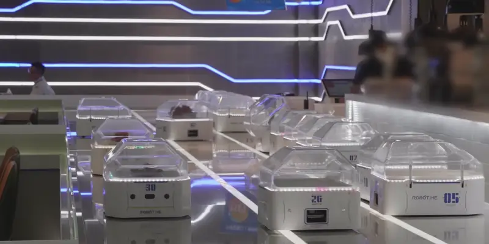

## 2.1 Overview: Automation of the Restaurant Service Loop

> **Cross-refs:** §2.2–§2.8 (each need in depth), §2.9 (summary and requirement traceability), §3.1, §4.1 (requirements)
> **Citations:** [2.1.1]–[2.1.25]; final numbering assigned when all Ch.2 references are merged.

---

A restaurant service interaction — from greeting to payment — is a closed-loop business process with three distinct components: the customer conversation (taking orders, answering menu questions, confirming selections), the backend transaction (creating order records, updating kitchen displays, computing bills), and the physical delivery (transporting food from kitchen to table). Automation has addressed each component independently.

### 2.1.1 Service Robots in the Restaurant Industry

Service robots for food delivery have been deployed commercially at scale, falling into two major architectural categories: free-navigation platforms and track-based systems.

Free-navigation platforms — Bear Robotics Servi (USA, 2017), Pudu Bellabot (China, 2016), Keenon T-series (China, 2010) — use LiDAR and RGB-D cameras for SLAM-based mapping and autonomous navigation in restaurant environments [2.1.1]–[2.1.4]. These robots build an occupancy grid of the restaurant floor, localize within it, and plan collision-free paths between kitchen and tables. Pudu alone reported over 40,000 units deployed across more than 600 cities as of 2023, with Bellabot featuring a cat-like animated face display and voice module for pre-recorded greetings [2.1.5]. Servi emphasizes a minimalist form factor with tray shelves and obstacle avoidance. Both categories share the same operational model: a human waiter loads food onto the robot, selects a destination table on a touchscreen, and the robot navigates autonomously to deliver the items. Upon arrival, the robot plays a greeting, waits for the customer to retrieve the food, and returns to the kitchen. The complete delivery cycle — load, navigate, deliver, return — is autonomous; the ordering and conversational components remain entirely human-operated.

Track-based systems represent an alternative approach. Alibaba Robot.He (Shanghai, 2018) mounts pod-shaped automated guided vehicles (AGVs) on fixed physical rails installed alongside dining tables, adapted from Cainiao's warehouse logistics technology [2.1.6]. The rail-based design eliminates SLAM, path planning, and localization entirely — the robot follows a deterministic track to a predetermined position with sub-centimeter precision. This trades spatial flexibility for mechanical simplicity and delivery accuracy. Robot.He handles food delivery, table clearing, and dishwashing assistance in the Hema robotic restaurant chain, as shown in Figure 2.1. Other rail-based systems include rotating conveyor belts in sushi restaurants and ceiling-mounted monorail delivery units in themed dining venues.

**Figure 2.1** — Track-based food delivery: Alibaba Robot.He pod AGVs on fixed rails in a Hema robotic restaurant. Each numbered pod carries one covered dish to a predetermined table position. Source: [2.1.6].

Both categories reliably transport food from kitchen to table. Their core competency is autonomous physical delivery. However, both categories share a fundamental architectural limitation: they are closed appliances. Their interaction model is a touchscreen for destination selection or a pre-recorded voice greeting that plays upon arrival. They provide no documented speech recognition, natural-language understanding, dialogue management, or Vietnamese-language support. They deliver food ordered through a separate channel — a human waiter, a tablet application, or a QR-code menu — and do not participate in the ordering conversation [2.1.7]. The software stack is proprietary: third-party developers cannot add an LLM agent, a Vietnamese speech pipeline, or a custom fleet dispatcher.

Beyond dedicated service robots, a parallel line of research has explored general-purpose mobile platforms — typically two-wheel differential-drive (TWD) or four-wheel mecanum chassis — equipped with 2D LiDAR, RGB-D cameras, and inertial sensors, running the Robot Operating System (ROS2) for autonomous navigation [2.1.8]. Unlike commercial service robots with proprietary embedded firmware, these platforms expose the full software stack — sensor drivers, SLAM algorithms, path planners, and motor controllers — to modification. Published work in this category has demonstrated that a TWD platform combined with EKF-fused odometry, an RTAB-Map SLAM system, and a Nav2 navigation stack achieves autonomous indoor delivery with fiducial-marker precision docking [2.1.9]. What separates these platforms from commercial service robots is not hardware capability — both navigate and deliver — but architectural openness: a closed appliance cannot be coupled to external software, whereas an open ROS2 platform can in principle be driven by an external system that manages interaction and business logic alongside navigation. That coupling, however, is what the literature does not provide: in these systems the navigation goal is set by a human operator rather than by an external software agent (§2.2).

### 2.1.2 Conversational Ordering Systems

Conversational ordering has progressed through three generations of technology. Traditional task-oriented dialogue systems — pipelines of natural language understanding (intent classification + slot filling), dialogue state tracking, and natural language generation — have been deployed for English, Chinese, Korean, and Japanese restaurant ordering via platforms such as Rasa and Dialogflow [2.1.10]–[2.1.12]. They produce structured API calls (create order, add item) and enforce valid state transitions, but their classifiers are language-specific and trained on formal corpora — Vietnamese informal variants ("ck" for chuyển khoản, "z" for vậy) are out of vocabulary, and their slot schemas cannot represent open-ended Vietnamese customer queries.

Large language models introduced a more flexible approach. Vietnamese-language chatbots — Zalo AI (VNG) and VinAI — demonstrate conversational Vietnamese capability across open domains [2.1.13]. Combined with retrieval-augmented generation, they can ground responses in a restaurant's actual menu. However, a chatbot generates text; it does not affect system state. When a customer says "Cho 1 phần Ốc Hương Xốt Trứng Muối," the chatbot can respond with "Dạ, món đó giá 170.000đ ạ" — linguistically correct but operationally empty. No item was added to a cart, no order was created, no kitchen display was updated. The gap is architectural: a chatbot cannot call an `add_cart` function, validate a dish name against a menu database, or dispatch a robot [2.1.14].

Voice ordering systems represent the third generation. Wendy's FreshAI (USA, 2023) uses an LLM pipeline to process spoken drive-through orders in English and push them to the point-of-sale system [2.1.15]. Domino's AI (USA, 2019) processes telephone pizza orders through speech recognition and NLU [2.1.16]. Both demonstrate that LLM-based voice ordering is commercially viable — real orders are processed, wait times are reduced, kitchen integration works. But they are English-only, cloud-dependent (inference runs on Google Cloud for Wendy's, a proprietary platform for Domino's), and stateless per transaction. They have no multi-turn memory, no persistent cart, and no physical robot delivery — the food is handed to the customer by a human server.

### 2.1.3 Restaurant Management Software

Running alongside all three generations of conversational technology, and largely independent of them, is the operational software that records what was ordered and tells the kitchen to cook it. Point-of-sale systems track orders and payments. Kitchen display systems (KDS) show order tickets to cooking staff. QR-code ordering applications let customers browse menus and place orders from their phones — a model that proliferated during COVID-19 [2.1.17]. These systems share a common architecture: each serves one role (POS, kitchen, customer) and operates independently. A kitchen display learns about a new order on its next poll cycle — typically every 5 to 10 seconds. The customer ordering app does not know the kitchen's queue depth. The robot does not know the customer just paid. There is no shared real-time state across roles, and no external AI agent can drive the multi-role workflow through API calls.

### 2.1.4 The Integration Gap

No existing system combines conversational AI, backend transaction capability, and physical delivery into one operational system. Each category addresses a subset of the required capabilities, as summarized in Table 2.1.

**Table 2.1** — Coverage of the three service-loop components by existing categories of restaurant automation. Coverage: ✓ full, ◐ partial, ✗ absent. Language reach and deployment model are reported as observed characteristics rather than as pass/fail criteria.

| Category | Conversation | Transaction | Delivery | Language reach | Deployment model |
|----------|:---:|:---:|:---:|---|---|
| Free-navigation robots (Bear, Pudu, Keenon) | ✗ | ✗ | ✓ | n/a — touchscreen | Vendor cloud, closed stack |
| Track-based AGV (Alibaba Robot.He) | ✗ | ✗ | ✓ | n/a — QR code and app | Closed stack |
| Task-oriented dialogue frameworks (Rasa, Dialogflow) | ◐ | ✓ | ✗ | Retrainable; Vietnamese needs a labelled corpus | Rasa self-hosted; Dialogflow cloud |
| Vietnamese LLM chatbots (Zalo AI, VinAI) | ✓ | ✗ | ✗ | Native Vietnamese | Cloud |
| LLM voice ordering (Wendy's, Domino's) | ◐ | ✓ | ✗ | English only, as deployed | Vendor cloud |
| Restaurant software (POS, KDS, QR ordering) | ✗ | ✓ | ✗ | Localizable | Varies by vendor |

No category covers more than two of the three components, and no category covers conversation and delivery together. The delivery robots move food but take no part in the conversation that produced the order. The Vietnamese chatbots hold the conversation but cannot act on it. The restaurant software records the transaction but neither speaks to the customer nor moves the food.

The two partial ratings mark different constraints. Task-oriented dialogue frameworks conduct a conversation only within a predefined schema of intents and slots: they handle the utterances an author anticipated and fail on the ones they did not, which is a poor match for open-ended customer speech. LLM voice ordering handles genuinely open speech, but each transaction is stateless — there is no persistent cart or multi-turn memory spanning a visit, and both deployments are English-only in practice.

A further property is absent from the table because no surveyed category exhibits it: none performs an automated check of a proposed action against an authoritative source before executing it. The categories that act on the world at all either constrain the action space so narrowly that such a check is unnecessary, as in slot-filling dialogue, or delegate correctness to the human operator entering the order. This is not an oversight in the systems surveyed. Validation only becomes a distinct architectural concern once a component that can generate incorrect actions is permitted to propose them freely — a situation none of these systems creates, and one that the categories in the upper half of the table avoid by not conversing at all. The property is therefore treated where it arises, in §2.4.5, rather than as a dimension of comparison here.

Joining the three components is not an incremental step from any row of Table 2.1. It requires the conversation to produce actions that are correct enough to execute against live business records, and those records to drive physical delivery — with every component present, integrated, and operating on the same real-time state.

The remainder of this chapter decomposes this integration gap into six concrete needs, each corresponding to a real problem the literature has not fully solved:

1. **Dynamic goal navigation (§2.2).** The robot must navigate to the right table at the right time, with navigation goals assigned by an external AI agent based on live restaurant events — a table is seated, an order is ready, a session ends — rather than pre-set waypoints chosen by a human operator. Prior navigation systems drive to fixed targets; the open problem is coupling navigation targets to an AI-driven backend that changes goals dynamically.

2. **Vietnamese voice on the edge (§2.3).** Vietnamese speech recognition, voice activity detection, and speech synthesis must operate reliably on edge hardware co-located with robot control, under real restaurant acoustic conditions — ambient noise at 60–70 dB, concurrent conversations, kitchen sounds. Individual voice components have been evaluated in quiet labs; the open problem is their integrated performance under combined noise and edge hardware constraints.

3. **Informal speech to validated actions (§2.4).** A conversational agent must convert informal, teencode-heavy Vietnamese utterances into correct, validated tool calls — without hallucinating dish names, wrong quantities, or invalid state transitions. Existing approaches trade generality for determinism or vice versa; the open problem is an architecture that achieves both simultaneously and validates every LLM output before it reaches external systems.

4. **Vague descriptions to relevant items (§2.5).** Customers describe food by sensory experience ("món gì ấm bụng cho ngày lạnh?"), which shares zero lexical overlap with menu entries indexed by name and category. Standard retrieval-augmented generation fails when queries and documents have no common vocabulary. The open problem is a pipeline that actively bridges this semantic gap — rewriting the query into concrete search terms before retrieval and rephrasing the results in natural Vietnamese after.

5. **AI decisions to synchronized operations (§2.6).** Multiple client roles — customer tablet, kitchen display, manager dashboard, robot fleet — must share a single real-time view of restaurant state, all driven by an AI agent's business events. Existing restaurant software serves one role at a time with polling-based refresh. Existing fleet management frameworks target warehouse scale, not restaurant scale. The open problem is a lightweight, self-contained system where the AI agent is the primary driver of business events across all roles simultaneously.

6. **Multi-role web interfaces driven by AI events (§2.7).** Restaurant operations require distinct user interfaces for each role — customer ordering tablet, kitchen Kanban board, guest check-in kiosk, fleet monitoring dashboard — all sharing a common real-time data layer. Existing single-page application frameworks, component libraries, and real-time communication patterns have been evaluated in general contexts but not for the specific demands of a multi-role, AI-driven restaurant system where the event source is an AI agent rather than a human operator.

The edge computing platform that hosts the robot's software — the NVIDIA Jetson Orin Nano — imposes hardware constraints that govern where each workload runs. Section 2.8 surveys these constraints and their architectural implications. Finally, Section 2.9 consolidates all six needs into a traceability matrix mapping each gap to the system requirements it motivates (Chapters 3 and 4) and the experiments that validate it (Chapter 5).
