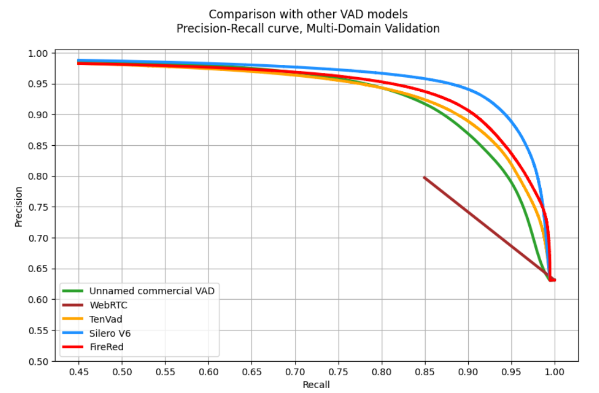

## 2.3 Vietnamese Voice Understanding

A restaurant voice interaction follows a physical path: the customer speaks into a microphone mounted on the robot, the captured audio is processed on the robot's edge computer, and a spoken reply comes out of the robot's speaker. That path has to complete quickly enough to sustain conversational rhythm, and it has to do so under restaurant acoustic conditions, where concurrent conversations, kitchen sounds, plate clatter, and chair movement are present throughout service. The language it processes is Vietnamese, in which a single diacritic changes a word's meaning entirely. The hardware it runs on is simultaneously running the robot's navigation stack.

Three properties of that setting bear on every component surveyed below, and none of them belongs to the components themselves. The first is connectivity. A component that requires a network round-trip per utterance behaves differently in a building with intermittent WiFi than one that does not, since a temporary outage becomes a total loss of the voice interface rather than a degradation of it. The second is memory. The edge device provides a single pool shared between the voice pipeline, the navigation stack, and the operating system, so every model's footprint is subtracted from a fixed total rather than drawn from a dedicated allocation. The third is latency, the least obvious of the three, because it does not belong to any single component either.

The latency budget is a sum, and the components compete for it. An utterance is not complete until the detector has observed enough trailing silence to declare it finished, and that silence window is dead time in every turn, paid before transcription begins. Transcription then scales with model size, synthesis scales with sentence length, and the language model sits between them. Because the customer experiences the total, the useful question for each component is not only how accurate it is, but how much of the budget it consumes and what the accuracy gained costs the components downstream. The rest of this section sets out the available options for each component and the properties that determine that trade-off.

---

### 2.3.1 Voice Activity Detection

Voice activity detection determines the boundaries of a spoken utterance in a continuous audio stream: when the customer started speaking, and when they stopped. It is the first processing stage, and its output, a trimmed segment containing exactly one utterance, feeds directly into the transcription model. If detection ends an utterance prematurely, the transcriber receives a truncated sentence and the agent never sees the complete order. If detection triggers on background noise, everything downstream (transcription, intent classification, reasoning, validation) processes restaurant clatter as though it were an order. The accuracy of this one stage therefore bounds everything that follows.

The simplest approach classifies any audio frame whose root-mean-square amplitude exceeds a fixed threshold as speech. This works in a quiet recording environment, where silence sits near zero amplitude and speech rises clearly above it. In a restaurant it does not, because the ambient noise floor regularly exceeds the amplitude of quiet speech and no threshold separates the two. Raising the threshold loses trailing syllables; lowering it produces continuous false triggers. Energy thresholding has no mechanism for distinguishing speech from non-speech at comparable loudness, which makes it unsuitable here regardless of tuning [2.3.1].

Lightweight neural models address this by classifying frames on learned spectral structure rather than amplitude. Silero VAD is a compact model of roughly 2 MB that processes frames on CPU in real time, emits a speech probability per frame, and exposes a configurable decision threshold [2.3.2]. WebRTC VAD, roughly 100 KB, applies a Gaussian mixture model trained on telephony speech; it is the lighter of the two and correspondingly less accurate under noise [2.3.3], by the margin Figure 2.3a shows. Both run without GPU involvement, which matters because GPU memory on the edge device is committed to transcription and to the navigation stack.

At the accurate end of the range, systems such as pyannote.audio [2.3.4] and NVIDIA NeMo's VAD [2.3.5] use substantially larger architectures for state-of-the-art frame-level discrimination, and both expect GPU inference for real-time operation. On a device where the transcription model and the navigation stack already contend for a shared memory pool, committing further GPU capacity to an always-on detector is hard to justify while CPU-only alternatives remain adequate.

**Table 2.3a.** Voice activity detection approaches.

| Approach | Footprint | Inference | Discrimination under noise | GPU required | Documented evaluation context |
|---|---:|---|:---:|:---:|---|
| Energy threshold | n/a | Trivial | Poor; cannot separate speech from noise at similar amplitude | No | Quiet recording conditions [2.3.1] |
| WebRTC VAD | ~100 KB | CPU, real-time | Moderate | No | Telephony-quality speech [2.3.3] |
| Silero VAD | ~2 MB | CPU, real-time | Good; threshold configurable | No | Multilingual telephone and meeting audio [2.3.2] |
| pyannote.audio | ~100 MB | GPU | High | Yes | Meeting and diarization corpora [2.3.4] |
| NeMo VAD | ~200 MB | GPU | High | Yes | NVIDIA internal benchmarks [2.3.5] |

**Figure 2.3a.** Precision against recall for five voice activity detectors on a multi-domain validation set. What the figure establishes is the separation between WebRTC and the neural detectors: WebRTC holds precision only between 0.80 and 0.63 across the recall range plotted, while the four neural systems stay above 0.90 until recall approaches 1.0. Two limits apply to reading anything finer from it. It is published by the maintainers of Silero VAD, whose own model ranks first in it, so it is not an independent comparison. And its constituent domains are not named, so the audio behind it is of unknown composition and includes no stated Vietnamese material. Source: [2.3.2].

Two parameters govern the behaviour of any detector in this class, and they are where the accuracy and latency constraints meet. The first is the decision threshold on the per-frame speech probability, which trades two failure modes against one another: set high, it suppresses false triggers from impulse noise at the cost of clipping quiet onsets; set low, it captures hesitant speech at the cost of admitting noise to the transcriber. The second follows from the fact that any system segmenting continuous audio into discrete utterances has to decide when an utterance has ended, and the conventional criterion is a fixed interval of observed silence. That interval sets a floor on turn latency independent of every other component in the pipeline. It elapses on every turn, before transcription begins, and no downstream optimisation recovers it. Shortening it returns control to the speaker sooner and truncates anyone who pauses mid-sentence. Neither parameter has a value that is correct in the abstract; both are properties of the room and of the people speaking in it.

The published record supplies neither value. Silero VAD has been evaluated on multilingual telephone and meeting audio and WebRTC VAD on telephony speech, and the hardest restaurant condition appears in neither: intelligible conversation at an adjacent table, which is exactly what a speech detector is built to respond to. What the literature does establish concerns the approaches rather than their settings, namely which of them run without a GPU, what each costs in memory, and whether the decision threshold is exposed for tuning at all.

---

### 2.3.2 Speech-to-Text for Vietnamese

Speech-to-text converts the segment isolated by the detector into Vietnamese text. It is the most consequential stage in the pipeline. Every component downstream (the intent classifier, the agent's language model, the validator, the response generator) operates on the text this stage produces, and none can recover information that transcription destroyed. A tone error that turns *cá* (fish) into *cà* (eggplant) does not present as an error downstream at all; it presents as a correctly processed order for the wrong dish.

The dominant architecture for on-device multilingual transcription is Whisper, a Transformer encoder-decoder trained on approximately 680,000 hours of multilingual web audio [2.3.6]. Audio passes through a convolutional front end, is encoded into a latent representation, and is decoded autoregressively into text conditioned on both the audio encoding and the tokens generated so far. Vietnamese is present in the training distribution but was not a primary target, so the model handles it competently without being optimised for it. The family is released in five sizes, tiny (39M parameters), base (74M), small (244M), medium (769M), and large (1.55B, currently at revision v3), which trade accuracy against memory and inference time. Two further variants exist. The English-only checkpoints, released from tiny.en through medium.en, are more accurate than their multilingual counterparts on English and useless for Vietnamese. The large-v3-turbo checkpoint (809M) keeps the full large-v3 encoder and reduces the decoder from thirty-two layers to four, which cuts decoding time substantially at a small accuracy cost that varies by language and is not reported for Vietnamese.

The deployment characteristics of this family changed substantially with faster-whisper, a reimplementation built on the CTranslate2 inference engine [2.3.7]. CTranslate2 applies operator fusion, memory-layout optimisation, and integer quantisation to reduce both latency and memory footprint relative to the reference implementation. Two consequences matter for edge deployment. The first is that a model size which would otherwise exceed the available budget becomes viable. The second is that the models are distributed *already converted* to the CTranslate2 format, so deploying one requires no weight-conversion step.

PhoWhisper [2.3.8] fine-tunes Whisper on Vietnamese speech data and reports improved word error rate over the multilingual base on Vietnamese benchmarks, with the gains concentrated in tonal diacritics. That is the error this subsection opened on, the one that does not surface as a transcription failure but as a correct-looking order for a different dish, and it is also the dimension on which a broadly multilingual model is weakest for this language. PhoWhisper is released across the same size range as its base, from tiny to large, so the choice of size remains open independently of the choice of language targeting; the medium checkpoint is tabulated below as the representative case.

What that Vietnamese targeting costs is the property worth recording. A fine-tune preserves the architecture and parameter count of its base, so PhoWhisper at a given size holds exactly the weights the multilingual model holds at the same size, and decodes in the same time. The gain is therefore free at runtime. It is paid for once, at build time: PhoWhisper is distributed as Transformers-format checkpoints, so running it under CTranslate2 means converting the weights and maintaining the converted artefact locally, where a multilingual checkpoint is retrieved in its final form and loaded unattended.

Cloud services occupy a different position entirely. Google Cloud Speech-to-Text, Viettel AI, and FPT.AI all provide dedicated Vietnamese recognition trained on large Vietnamese corpora and running on server-grade infrastructure [2.3.10]–[2.3.12], and their accuracy on clean Vietnamese speech exceeds what any edge-deployable model achieves. Their limitation is structural rather than acoustic: every utterance requires a network round-trip, which places conversational latency partly outside the system's control and turns a WiFi outage into a total failure of the voice interface.

**Table 2.3b.** Speech-to-text options for Vietnamese. The disk figures are the weights alone, that is the parameter count at the stored precision, two bytes per parameter at float16. Runtime memory is larger, because the inference context and the working buffers sit on top of the weights, and the two are frequently conflated; a measured figure for the deployed configuration is given in §4.4. The English-only Whisper checkpoints are omitted as inapplicable to Vietnamese.

| Model / service | Parameters | Vietnamese | Distribution format | Disk | Offline |
|---|---:|---|---|---:|:---:|
| Whisper tiny | 39M | Multilingual, not targeted | CTranslate2, ready to load | ~75 MB | ✓ |
| Whisper base | 74M | Multilingual, not targeted | CTranslate2, ready to load | ~145 MB | ✓ |
| Whisper small | 244M | Multilingual, not targeted | CTranslate2, ready to load | ~485 MB | ✓ |
| Whisper medium | 769M | Multilingual, not targeted | CTranslate2, ready to load | ~1.5 GB | ✓ |
| Whisper large-v3 | 1.55B | Multilingual, not targeted | CTranslate2, ready to load | ~3 GB | ✓ |
| Whisper large-v3-turbo | 809M (large-v3 encoder, four-layer decoder) | Multilingual, not targeted | CTranslate2, ready to load | ~1.6 GB | ✓ |
| PhoWhisper medium | 769M (Whisper medium architecture) | Fine-tuned on Vietnamese | Transformers; conversion required for CTranslate2 | ~1.5 GB once converted (~3 GB as released, fp32) | ✓ |
| Google Cloud STT | n/a | Dedicated Vietnamese model | Hosted API | n/a | ✗ |
| Viettel AI STT | n/a | Dedicated Vietnamese model | Hosted API | n/a | ✗ |
| FPT.AI STT | n/a | Dedicated Vietnamese model | Hosted API | n/a | ✗ |

Word error rates are deliberately omitted from the table. Published figures for these systems come from different corpora recorded under different conditions and are not comparable cell to cell. The Whisper family's rates are reported against multilingual benchmarks [2.3.6] and PhoWhisper's against Vietnamese academic corpora including VLSP [2.3.8]–[2.3.9], which consist of read speech recorded in quiet conditions with standard pronunciation. A single ranked accuracy column would imply a comparability that the underlying evaluations do not support.

Of the properties the table reports, the one separating the Vietnamese-specialised model from its multilingual base is narrower than it first appears. The two are identical in architecture, parameter count, footprint, and inference cost, and differ only in what they were trained on and in a one-time build step. Whether the fine-tune keeps its advantage once the audio leaves the recording studio is not something any entry in the table establishes.

---

### 2.3.3 Text-to-Speech for Vietnamese

The final stage converts the agent's Vietnamese text into audible speech. Quality here is judged on two axes that do not always move together: intelligibility, meaning the customer recovers the words, and naturalness, meaning the voice is appropriate to a service setting. Vietnamese adds a third consideration, since tone is lexical. A synthesiser that renders diacritics inaccurately does not merely sound unnatural; it says something else.

The available engines span a wide range of model complexity. At the lightest extreme, eSpeak-NG is a formant synthesiser: rather than learning from recorded speech, it models the vocal tract as a set of resonant frequencies and applies rules to shape them into phonemes [2.3.13]. The result is unmistakably mechanical, flat and without natural prosody, but it is approximately 5 MB, runs on any CPU, and its Vietnamese phoneme tables cover the full tonal system. Formant synthesis has served screen readers and accessibility tooling for decades and remains the floor of the range.

Piper occupies the middle of that range [2.3.14]. It implements the VITS architecture, in which a single network converts text directly to a waveform in one pass, with no intermediate spectrogram and no separate vocoder [2.3.15]. The community-trained Vietnamese voice is roughly 200 MB and synthesises a sentence on CPU in the region of half a second. Its output is audibly synthetic but fully intelligible, with tones rendered correctly, and it is the only neural Vietnamese voice that fits an edge memory budget without requiring GPU capacity.

At the upper end of on-device synthesis, Coqui's XTTS v2 uses a large autoregressive model with a separate vocoder, supports Vietnamese within its multilingual training, and offers voice cloning from a short reference clip [2.3.16]. Its naturalness approaches that of cloud neural voices. Its cost is roughly 4 GB of GPU memory, the largest claim any voice component could make on a device already allocating memory to transcription and to navigation, and it competes directly with the transcription model selected in §2.3.2.

The remaining options are hosted services. Microsoft Azure Neural TTS, reachable through the open-source edge-tts client, provides multiple Vietnamese voices covering Northern and Southern accents and both speaker genders [2.3.17]. Google Cloud TTS offers WaveNet voices with the highest reported naturalness [2.3.18]. Two Vietnamese providers, vbee and FPT.AI, supply voices trained specifically for the local market [2.3.19]–[2.3.20]. All four are more natural than any on-device option, and all four require connectivity for every sentence spoken.

**Table 2.3c.** Text-to-speech engines for Vietnamese.

| Engine | Synthesis approach | Footprint | Compute | Offline | Vietnamese voices |
|---|---|---:|---|:---:|---|
| eSpeak-NG | Formant, rule-based | ~5 MB | CPU | ✓ | Phoneme tables, full tonal coverage |
| Piper | VITS, single-stage neural | ~200 MB | CPU | ✓ | One community-trained voice |
| XTTS v2 | Autoregressive + vocoder | ~4 GB | GPU | ✓ | Multilingual, voice cloning |
| edge-tts (Azure) | Neural, hosted | n/a | Cloud | ✗ | Multiple, regional accents |
| Google Cloud TTS | WaveNet, hosted | n/a | Cloud | ✗ | WaveNet voices |
| vbee | Neural, hosted | n/a | Cloud | ✗ | Vietnamese-specific |
| FPT.AI TTS | Neural, hosted | n/a | Cloud | ✗ | Vietnamese-specific |

Synthesis quality is conventionally assessed by Mean Opinion Score, in which listeners rate samples on a five-point naturalness scale [2.3.21], and reported scores place cloud neural voices above on-device neural synthesis and both well above formant methods. Specific values are not reproduced here: the published scores come from separate studies using different listener pools, different text material, and in most cases languages other than Vietnamese, so listing them in one ranked column would invite precisely the comparison those studies cannot support. All of them were also conducted in quiet listening conditions, and under restaurant noise the gap between a moderately natural voice and a highly natural one may compress considerably, since intelligibility rather than naturalness becomes the limiting factor.

What the record does document unambiguously is two divisions, and both fall in the same place: whether synthesis requires a network, and whether it requires GPU capacity. The two on-device neural options sit on opposite sides of the GPU line, and every hosted service sits on the far side of the network line. The three orders of magnitude of footprint in Table 2.3c are therefore not a continuum of small trade-offs but a set of discrete commitments about where synthesis runs and what it displaces.

---

Three numbers decide how this pipeline behaves in a dining room, and the literature supplies none of them: the frame-level decision threshold, the silence interval that terminates an utterance, and the transcription accuracy attainable on restaurant-domain vocabulary. Every evaluation cited above was conducted on read speech, telephony, or recorded meetings, in quiet or acoustically controlled conditions. The one acoustic condition that defines the deployment, intelligible conversation carrying from the next table, appears in none of them. The three are therefore empirical quantities rather than settings to be looked up, and they remain open in this work.

A second gap is not acoustic at all. Voice assistants in the surveyed literature are single-device systems: one microphone, one speaker, one user, activated by a wake word and listening continuously thereafter. The arrangement required here differs in kind. Capture is armed deliberately, by a customer pressing a control on a tablet that is not the device holding the microphone. The command is routed through a server to whichever robot is currently serving that table, a binding that changes as robots move between tables. And the resulting turn has to remain interruptible throughout, by a customer who cancels it, mutes the reply, or simply begins speaking over it. None of this is a property of the detection, transcription, or synthesis models, which are indifferent to how they are invoked. It is a property of the orchestration around them, and it has no counterpart in single-device voice assistants, whose activation model assumes that the microphone, the speaker, the control surface, and the user occupy the same place.
