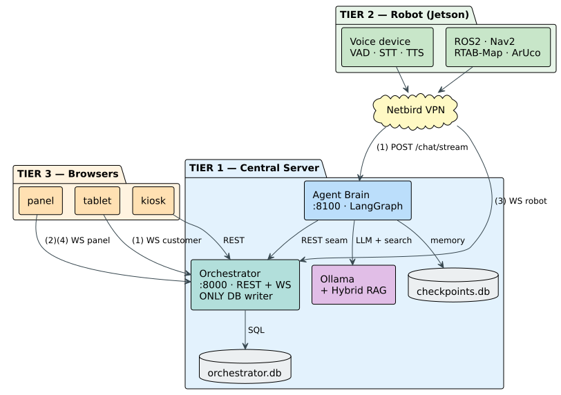
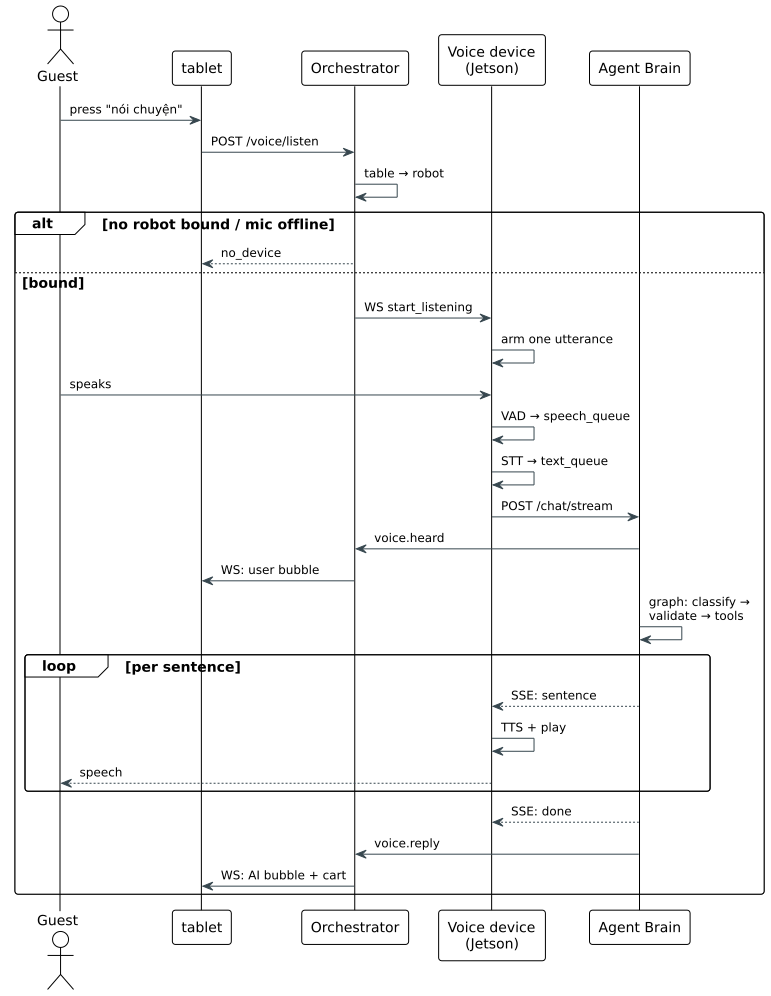
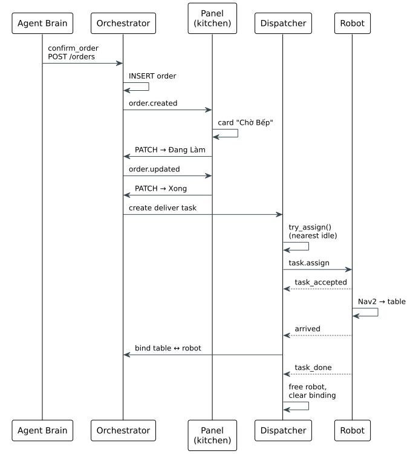

## 4.3 Software System Architecture

A restaurant runs as a loop: a guest is seated, orders, waits, is served, and pays. The
software in this chapter turns that loop into something a robot and the staff can run
together, with the customer speaking to the robot instead of to a waiter. Many pieces are
needed to make that work, and they do not all live in the same place. Before opening any one
of them, it helps to see the whole shape first: what pieces exist, where each one runs, and
how a spoken order travels through them. That whole-system view is what this section gives,
and it is the map that the rest of the chapter fills in one piece at a time.

The system runs on two computers and three browser apps. The robot carries an NVIDIA Jetson.
A central desktop server carries an x86 processor and one graphics card. The staff and
customers use three web apps: a tablet at each table, a kiosk at the entrance, and a
management panel in the kitchen. Everything talks over the restaurant's own WiFi, so the
system keeps working when the internet is down. Figure 4.1 shows the whole layout.

*Figure 4.1. System Architecture Overview: the three-tier layout (server, robot, staff
browsers) and the type of connection on each link. The inside of the agent and the search
index is left to later sections. (drawn by the group)*

### 4.3.1 Topology and Responsibilities

The work of the system divides into two kinds, and that divide decides what runs where. Some
work is bound to the robot's body and its senses, and it has to run on the robot. Other work
is bound to thought and to shared records, and it belongs on the server.

On the robot runs everything tied to the robot's own hardware. It reads the sensors, the
LiDAR, the depth camera, and the inertial unit, and fuses them into an estimate of where the
robot is. It holds the map and keeps the robot located on it. It plans a path to the next
table and follows that path while steering around obstacles. It records sound at the
microphone, decides when the customer is speaking, turns that speech into text, and plays the
reply through the speaker. Two things force all of this onto the robot, and neither is about
memory. First, each part is wired to hardware that sits on the robot: the motors, the sensors,
the microphone, and the speaker. Second, driving the wheels and holding a position is a
real-time loop that reads a sensor and corrects the motors many times a second, and sending
that loop out over WiFi and back would add a delay that breaks it. The raw data is heavy as
well, a steady stream of camera frames, laser scans, and audio, so it is cheaper to reduce it
to a small result on the robot than to ship it across the network.

On the server runs everything that is not tied to one robot's body. The language model and the
agent that reasons over the customer's request run here. So do the business records, meaning
the tables, sessions, orders, and payments, and the menu together with its search. None of
these belong to a particular robot; they are common to every table and every robot in the
restaurant, so they live once, in one place, where they stay consistent. Table 4.1 sets out
the whole division and the reason for each side.

*Table 4.1. Where each job runs, and the constraint that fixes its place.*

| Job | Runs on | Why it must be there |
|-----|---------|----------------------|
| Motor control and wheel odometry | Robot | Wired to the motors; needs real-time timing next to them |
| Sensing and localization (LiDAR, camera, IMU, map) | Robot | The sensors are on the robot; the raw data is heavy and reduced locally |
| Navigation, path planning, and obstacle avoidance | Robot | Closes a real-time loop with the sensors and motors |
| Voice capture and playback | Robot | The microphone and speaker are on the robot; keeps audio off the network |
| Language model and agent | Server | Too large for the robot's memory, and tied to no robot's body |
| Business records (tables, sessions, orders, payments) | Server | Shared state; one source of truth for every table and robot |
| Menu and its search | Server | Shared, updated in one place, used by every robot |

One job in the table could, in principle, run on either side: the language model. It is wired
to no sensor and closes no control loop, so nothing about the robot's hardware pins it in
place, and it would even be simpler to keep it on the robot, since then the request would
never leave the machine. What rules this out is memory, and the robot does not start empty. Before this chapter adds
anything, it already runs the navigation and localization built in Chapter 3, and that
software holds part of the 8 GB. Table 4.2 breaks down what it uses.

*Table 4.2. Memory the robot's navigation and localization already use (the Chapter 3 stack).*

| ROS component | Approx. memory |
|---------------|---------------:|
| ROS 2 core and DDS middleware | ~0.2 GB |
| Sensor drivers (LiDAR, depth camera, IMU) | ~0.5 GB |
| Localization on the prebuilt map (RTAB-Map) | ~2.0 GB |
| Navigation (Nav2 planners, costmaps, behaviour trees) | ~0.7 GB |
| Odometry fusion (EKF) and ArUco docking | ~0.3 GB |
| **Used by the Chapter 3 stack** | **~3.7 GB** |
| **Free of the 8 GB** | **~4.3 GB** |

That leaves about 4 GB free, and it is into this 4 GB, not the whole board, that the work of
this chapter must fit. The voice pipeline comes first, since the robot has to hear and speak on
its own, so speech recognition, voice-activity detection, and speech synthesis all run here and
take a further share of that space. Even setting them aside, a language model able to
understand informal Vietnamese and follow the ordering steps reliably needs more than the four
gigabytes that remain, and a model squeezed under that limit is small and heavily compressed,
which costs the accuracy the agent depends on. The 4 GB is not truly spare either: it is the
headroom the navigation stack needs at its peak, when costmaps rebuild or the localizer closes
a loop, and a model that claimed it would starve the work that must never stall. So the
language model runs on the server, where it has room to be as capable as the task needs.

Three more reasons support the same choice, and none of them depends on memory:

- **Speed.** Only small messages cross the WiFi, a line of text or a set of coordinates, never
  audio or video. A transcript is about a hundred bytes where the raw audio it replaces is
  about a hundred kilobytes, so the network step is tiny and adds almost no delay.
- **Safety of the data.** The robot stands out on the floor, where it can be knocked, damaged,
  or taken, so nothing lasting is kept on it. Every order, payment, session, and conversation
  lives on the server, and a robot that is lost or switched off carries no customer data with
  it and can be replaced at once.
- **Consistency across the fleet.** One model on one server serves every robot the same way,
  so their behaviour does not drift apart, and an improvement is installed once on the server
  rather than on each robot in turn.

The memory limit and these three reasons point the same way; a larger board would ease only the
first of them.

The server itself runs two programs. The agent takes a Vietnamese sentence and turns it into a
checked action: it works out what the customer wants, picks the operation to run, checks that
operation against the menu and the current order, runs it, and writes the spoken reply. The
language model it calls is served on the same machine by Ollama, which keeps the model
loaded in the graphics card so that no request waits for it to start. The orchestrator
keeps the business consistent: it answers the web apps, pushes live updates to every screen,
hands delivery jobs to robots, and stores the tables, sessions, orders, and payments. Behind
it sit two small databases, one for the business records and one for the conversation history,
each a single file that needs no separate database server.

The two programs run as separate processes on purpose. The agent is slow: one reasoning step
takes seconds, and it stops while it runs. The orchestrator's own work, reading records and
updating screens, takes milliseconds. Keeping them apart means a slow reasoning step never
freezes the kitchen screen, and either program can be restarted without bringing down the
other. They pass messages to each other inside the one machine, which costs almost nothing.

### 4.3.2 Messages Between Components

The three web apps share one small library of communication and data code, so they always
agree with the server on formats. Two kinds of message travel between the apps and the server.
Commands and first page loads, such as placing an order or seating a party, use an ordinary
request-and-reply call: the app asks, the server answers. Live changes, such as a new order
appearing or a robot moving, are pushed the other way: the server sends them to the screens
that care, the moment they happen, instead of the screen asking again and again. Pushing is
what makes the system feel live. The kitchen sees an order the moment it is confirmed, and the
manager watches the robots move without refreshing. The robot keeps two open connections to
the server: one carries the command to start and stop listening, the other carries navigation
jobs out and position and battery reports back.

Two example flows show the whole system working together. The first is a spoken order. The
second is a delivery.

Figure 4.2 follows a spoken order. The customer taps "Talk to AI" on the tablet. The server
finds which robot is at that table and tells it to listen. The robot records the sentence and
turns it into text (about 800 ms), then sends the text to the agent. The agent at once shows
the customer what it heard, with a "đang suy nghĩ" note, while it works. It reads the request,
checks the action, runs it, and writes the reply. The reply is sent back one sentence at a
time; the robot speaks each sentence as it arrives, and the tablet shows the finished reply
and the updated cart. Three things are worth noticing. The recording, the transcription, and
the speaking all happen on the robot, so no audio ever crosses the WiFi. The check on the
action sits between the model and the cart, so nothing reaches the cart unchecked. The tablet
only shows the conversation; it never controls the microphone.

*Figure 4.2. Voice Ordering Sequence: a spoken order travelling from the tablet, through the
server and the robot's voice pipeline, to the agent and back to the speaker. Recording,
transcription, and speech all happen on the robot; only text crosses the WiFi. (drawn by the
group)*

Figure 4.3 follows a delivery. When the agent confirms an order, the server saves it and
pushes it to the kitchen board, where a card appears in the "Chờ Bếp" (waiting) column. The
kitchen moves the card along, from Chờ Bếp to Đang Làm (cooking) to Xong (done), and each move
updates the board. When the order is done, the server creates a delivery job, hands it to the
nearest free robot with enough battery, sends that robot to the table, and links the table's
voice to that robot when it arrives. When the delivery finishes, the robot is freed and the
link is released. The path from the agent's decision to the robot's wheels runs entirely on
pushed events; nothing polls, and no person carries the order from screen to screen.

*Figure 4.3. Order-to-Delivery Sequence: one AI decision (confirm order) travelling through
the kitchen board, the delivery dispatcher, and the robot's navigation to a real delivery.
(drawn by the group)*

Each connection uses the kind of message that fits it, listed in Table 4.3. Commands and page
loads go over HTTP, where a reply is expected. Live updates are pushed over WebSocket. The one
two-way WebSocket to each robot carries jobs out and reports back on a single open connection.

*Table 4.3. Type of connection on each link, and why.*

| Link | Connection | Why |
|------|-----------|-----|
| Agent to language model | HTTP, same machine | Native protocol, no network, almost no delay |
| Agent and orchestrator | HTTP, same machine | Ask-and-answer for actions, fire-and-forget for voice events |
| Voice device to agent | HTTP request | Send the text, get the reply back; holds no state |
| Orchestrator to web apps | WebSocket | Live push; asking again and again would add 5–10 s of lag |
| Orchestrator and robot | WebSocket | Two-way: jobs out, position and status in, one open connection |
| Web apps to orchestrator | HTTP request | Create, read, update, and delete map cleanly onto HTTP |

The result is that the system never polls. Commands travel over HTTP and get an answer. Live
changes are pushed the moment they occur. A time-critical event reaches its screen in well
under a tenth of a second.
