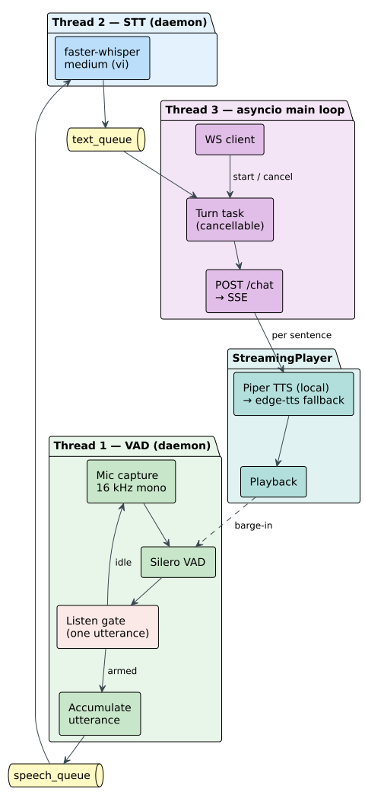

## 4.4 Edge Voice Pipeline

The robot has to hear and speak on its own, in Vietnamese, and without leaning on the network.
This section chooses the three pieces that make that possible, voice-activity detection, speech
recognition, and speech synthesis, and then shows how they are wired together so that one
utterance flows through them without any stage waiting on another.

### 4.4.1 Component Selection

The language model runs on the server, so it is fair to ask why the voice pipeline does not
join it there, since it too is only a set of models. It stays on the robot for three reasons.
The microphone and speaker are on the robot, so the sound is captured and played there in any
case. The pipeline also has to survive a network drop: a robot that cannot hear because the
WiFi faltered is worse than one that answers a little slowly, so each utterance is transcribed
on the spot and only the finished text waits for the network. And the audio is the wrong thing
to move: shipping the raw sound of every utterance, from every robot in the room, is far more
traffic than shipping the short text those utterances become, so keeping recognition local is
the lighter choice across a whole fleet as well. The voice pipeline is therefore fixed on the
robot, and the task in this section is to choose the pieces that fit it.

Before choosing anything, it helps to fix the yardstick. Every piece of the voice pipeline is
judged against the same three requirements, which follow directly from the challenge and which
are also the properties the voice survey in Chapter 2 recorded for each option:

- **Offline.** It must run on the robot without the internet, because the restaurant's network
  can drop and the robot still has to take the order in front of it.
- **Small.** It must fit inside the roughly four gigabytes the navigation stack leaves free, and
  it must not need graphics memory the robot does not have.
- **Good at Vietnamese.** It must cope with the six Vietnamese tones and the diacritics that
  carry meaning.

Choosing each piece is then a matter of reading the survey against these three needs.

**Voice-activity detection: Silero VAD.** Silero VAD is the natural choice. It is a small neural network,
about two megabytes, that labels each short frame of audio as speech or silence. It runs in
real time on the processor, needs no graphics memory, and does not depend on the language being
spoken, so it satisfies all three requirements at once and handles Vietnamese with no change.
The older WebRTC detector is lighter still but weaker once there is restaurant noise, and the
larger detectors in the survey, pyannote and NeMo, are more accurate but need the graphics
memory the robot cannot spare. A single sensitivity threshold is the one setting to tune: low
enough to catch a quiet voice, high enough to ignore a plate being set down.

**Speech recognition: PhoWhisper medium.** PhoWhisper at the medium size is the largest piece of the pipeline
at about 3.5 GB. PhoWhisper is the Whisper speech model fine-tuned on Vietnamese, which sharpens
its handling of the six tones and the diacritics a general multilingual model often gets wrong,
so it meets the Vietnamese requirement more fully than plain Whisper of the same size. It runs
offline through faster-whisper, an optimized runtime that uses the robot's graphics cores and
transcribes a normal utterance in about eight hundred milliseconds. Running PhoWhisper is the
same as running Whisper with one extra step: the Vietnamese weights are converted once into the
runtime's own format and then loaded like any other model. The survey's other options fall away
against the yardstick: the cloud services are accurate but break the offline requirement, the
plain multilingual Whisper of the same size is weaker on Vietnamese tones, and the largest
Whisper model is more accurate still but too big for the memory that remains. Recognition is
fixed to Vietnamese and uses a beam width of five, which trades a little speed for steadier
accuracy.

**Speech synthesis: Piper.** Piper is a small neural voice, about two hundred megabytes, that runs on the processor
and speaks a sentence in roughly half a second. It is the only Vietnamese voice in the survey
that runs fully offline, which is what decides it against the three requirements: the cloud
voices are more natural, but each spoken reply would then wait on the network, the one thing the
pipeline is built to avoid. With Piper the reply is spoken entirely on the robot.

Together the three pieces use about 3.7 GB. That fills nearly all of the roughly four gigabytes
the navigation stack leaves free, which is the reason, promised earlier, that no language model
can join them on the robot.

### 4.4.2 Threaded Pipeline Architecture

Figure 4.4 shows how the three pieces are wired. They do not run one after another in a single
line of control, because that would make every utterance wait for the slowest step. Instead
each piece runs in its own thread, and the pieces hand work to one another through small
queues. While speech recognition transcribes one utterance, voice-activity detection is already
free to capture the next, and the main thread can be sending an earlier transcript to the
agent. The three kinds of work, listening at the microphone, transcribing on the graphics card,
and talking to the server over the network, never block one another.

*Figure 4.4. Edge Voice Pipeline: the three threads (voice-activity detection, speech
recognition, and the main loop) passing one utterance through two queues, with the barge-in
path that lets the customer interrupt. (drawn by the group)*

The first of the three threads owns the microphone and the voice detector. It stays idle until
the server tells it to listen, which happens only when the customer presses "Talk to AI" on the
tablet, so the robot never records the table on its own. Once it is armed, it gathers the audio
while the customer speaks and stops when it hears about a second and a half of silence, then
hands the whole utterance to the second thread and returns to idle.

The second thread does nothing but transcribe. It waits for an utterance, runs it through
PhoWhisper, and passes the resulting Vietnamese text to the last thread. A short warm-up
transcription runs once at start-up, so the first real order does not pay the one-time cost of
loading the model.

The last thread carries the exchange with the server. It sends the text to the agent and plays
the reply back, and because the agent streams its answer one sentence at a time, the thread
speaks each sentence the moment it arrives instead of waiting for the whole reply. The first
spoken sentence reaches the customer in about half a second, so the robot begins answering
while it is still receiving the rest.

Two smaller behaviours sit on top of this loop. The customer can interrupt at any time: to
change an order or ask something else while the robot is still talking, they only have to speak,
because the listening thread keeps watching the microphone even during playback and stops the
current sentence as soon as it hears sustained speech. A brief noise, a clink or a scrape, is
not enough to trigger it, only continued speech, and the result is natural turn-taking, where
the robot stops, listens, and answers the new request.

Together these choices keep the pipeline within its limits. Every piece fits in the memory the
navigation stack leaves free, nothing needs the internet to take an order, and the streamed,
interruptible reply keeps a spoken turn short.
