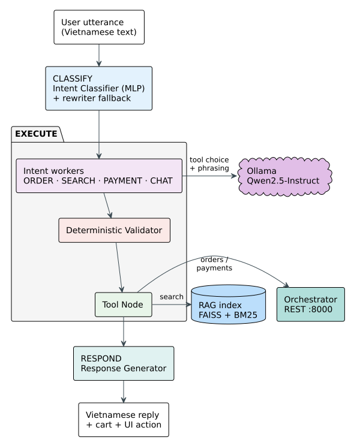

## 4.5 Conversational Agent

The voice pipeline of §4.4 delivers transcribed Vietnamese text to the server. From this
point forward, the system must determine what the customer wants, decide what action to
take, ensure that action is safe, and produce a spoken reply. All of this must happen within
a few seconds, without a cloud dependency, and without human review. This section describes
the component that performs that work: the conversational agent.

The agent must operate under two constraints that make a monolithic design inadequate. The
first is the nature of the input. Vietnamese as spoken in a restaurant is informal: customers
use teencode abbreviations, context-dependent short affirmations, and multi-clause sentences
that combine ordering with payment or search. A single model call, however capable, cannot
reliably handle this variety because the same word maps to different actions in different
conversation states. The second is the consequence of error. The agent calls tools that
modify the cart, confirm orders, and request payment. A hallucinated dish name or an invalid
state transition is not a conversational error: it is a wrong order, an incorrect bill, or
a charge for items the customer never received. The agent must therefore be structured so
that the language model can propose actions, but deterministic code inspects every proposal
before it becomes an effect.

These two constraints, input variety requiring context-dependent routing and output risk
requiring pre-execution inspection, drive the architecture presented in this section. The
following subsections describe the agent's structure, the flow of an utterance through it,
and the design decisions that each component embodies. Figure 4.5 gives the overall shape
before the detail begins.

*Figure 4.5. Agent Brain Component Overview: the three stages of one turn (decide the intent,
choose and check the action, say the result) and the external systems each stage depends on.
The four intent workers are drawn as a single block because at this level they are
interchangeable; their differing paths are shown in Figure 4.6. (drawn by the group)*

### 4.5.1 Agent Architecture

An utterance arrives as a string of Vietnamese text. Somewhere in the system, that string
must become a decision: add items to the cart, search the menu, request the bill, or simply
reply. A naive design would place a single language model call at the center: the utterance
and the conversation history enter, a structured tool call exits. This is the pattern of
chain-based agents surveyed in §2.4.2, and it fails here for two reasons. The first is domain
confusion: when all seven tools are available to a single call, the model can drift, and a
customer asking about menu recommendations can receive a cart operation because both tools
are present in the same namespace and the model's internal reasoning does not enforce domain
boundaries. The second reason is that the model's output is probabilistic. A hallucinated
dish name inserted into the cart or a confirmation call made before the cart has been shown
to the customer are errors the model can produce and cannot detect, because the model does
not know the restaurant's menu and does not enforce the ordering workflow.

The architecture proposed here separates concerns into distinct components, each responsible
for one stage of the processing pipeline. The separation is not arbitrary; it follows the
natural sequence of an interaction: classify the intent, decide the action, validate the
action, execute it, and respond.

Figure 4.6 shows the complete architecture.

*Figure 4.6. Agent StateGraph Topology: an utterance enters at the router, which classifies
the intent and dispatches to one of four specialized agents. Each agent's output passes
through the validator before execution. The chat worker and delegated utterances bypass
validation. The state updater merges results, the state outcome finalizes the turn, and
the response generator produces the spoken reply. The order, search, and payment workers are
drawn as one composite because their edges are identical. (drawn by the group)*

Table 4.5 names the nodes of that graph in the order an utterance meets them, and marks which
of them call the language model. Six of the ten are ordinary Python, which is the point: the
model is one component inside a mostly deterministic machine, not the machine itself.

*Table 4.5. The nodes of the agent graph, in the order an utterance meets them.*

| Node | Kind | Responsibility |
|------|------|----------------|
| Classifier router | Deterministic | Turns the utterance into a queue of intents |
| Order agent | Language model | Picks a cart operation and extracts its arguments |
| Search agent | Language model | Rewrites the request into search terms and calls retrieval |
| Payment dispatch | Deterministic | Always emits a request for the bill |
| Chat agent | Deterministic | Assembles the conversational context; calls no tool |
| Validator | Deterministic | Checks the proposed arguments before anything runs |
| Tool node | Deterministic | Executes the approved calls |
| State updater | Deterministic | Merges results, advances the stage, drops the finished intent |
| State outcome | Deterministic | Builds the typed reply context and clears the per-turn fields |
| Response generator | Both | Produces the Vietnamese reply, by template or by model |

An eleventh node, the earlier semantic router that the classifier replaced, is still registered
in the graph as a rollback path. It is unreachable while the graph enters at the classifier, so
it takes no part in a turn and is left out of the count above.

The five stages that follow are each the subject of one of the remaining subsections, and none of
them is explained here. What matters at this level is the shape: a deterministic router decides
the domain, a specialized agent bound only to that domain's tools proposes an action, a
deterministic validator inspects the proposal before anything runs, the tools execute and the
state is merged, and a final stage turns the outcome into spoken Vietnamese. The language model
appears at two points in that sequence, proposing the action and phrasing the reply, and it is
fenced on both sides by code that does not depend on it.

All specialized agents that call a language model share the same model instance: Qwen2.5 14B
Instruct, served locally by Ollama on the central server. Its size is not constrained by the
robot's memory ceiling because it does not run there. The choice of model class, and the way the
surrounding design absorbs the model's Vietnamese limitations, are set out in §4.5.3.
