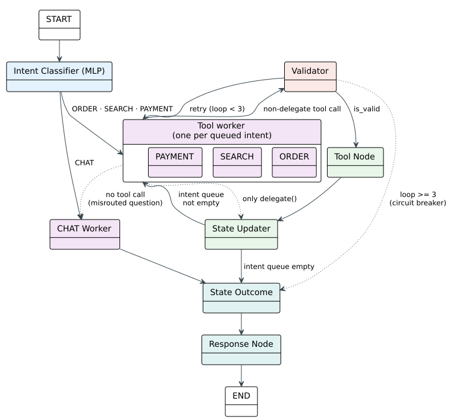

## 4.5 Conversational Agent

The voice pipeline of §4.4 delivers transcribed Vietnamese text to the server. From this
point forward, the system must determine what the customer wants, decide what action to
take, ensure that action is safe, and produce a spoken reply — all within a few seconds,
without a cloud dependency, and without human review. This section describes the component
that performs that work: the conversational agent.

The agent must operate under two constraints that make a monolithic design inadequate. The
first is the nature of the input. Vietnamese as spoken in a restaurant is informal: customers
use teencode abbreviations, context-dependent short affirmations, and multi-clause sentences
that combine ordering with payment or search. A single model call — however capable — cannot
reliably handle this variety because the same word maps to different actions in different
conversation states. The second is the consequence of error. The agent calls tools that
modify the cart, confirm orders, and request payment. A hallucinated dish name or an invalid
state transition is not a conversational error — it is a wrong order, an incorrect bill, or
a charge for items the customer never received. The agent must therefore be structured so
that the language model can propose actions, but deterministic code inspects every proposal
before it becomes an effect.

These two constraints — input variety requiring context-dependent routing, and output risk
requiring pre-execution inspection — drive the architecture presented in this section. The
following subsections describe the agent's structure, the flow of an utterance through it,
and the design decisions that each component embodies.

### 4.5.1 Agent Architecture

An utterance arrives as a string of Vietnamese text. Somewhere in the system, that string
must become a decision — add items to the cart, search the menu, request the bill, or simply
reply. A naive design would place a single language model call at the center: the utterance
and the conversation history enter, a structured tool call exits. This is the pattern of
chain-based agents surveyed in §2.4.2, and it fails here for two reasons. The first is domain
confusion: when all seven tools are available to a single call, the model can drift — a
customer asking about menu recommendations can receive a cart operation because both tools
are present in the same namespace and the model's internal reasoning does not enforce domain
boundaries. The second reason is that the model's output is probabilistic. A hallucinated
dish name inserted into the cart or a confirmation call made before the cart has been shown
to the customer are errors the model can produce and cannot detect — because the model does
not know the restaurant's menu and does not enforce the ordering workflow.

The architecture proposed here separates concerns into distinct components, each responsible
for one stage of the processing pipeline. The separation is not arbitrary — it follows the
natural sequence of an interaction: classify the intent, decide the action, validate the
action, execute it, and respond.

The first component is a **router** that determines what the customer wants. It receives the
utterance and the current conversation state and produces a classification: is this an order,
a menu search, a payment request, or casual conversation? The router must be fast — the
customer is waiting — and deterministic — the same utterance in the same context must always
produce the same classification, because inconsistent routing erodes trust. It must also be
aware of the conversation state, because the same word means different things at different
stages of an order: "ok" confirms an order when the cart is awaiting confirmation, but is
casual acknowledgment when no order is in progress. A pure embedding-based approach cannot
make this distinction because the embedding vector for "ok" is unchanged regardless of
context. The architecture addresses this by giving the router access to state features — the
order stage, the cart contents, the search context — in addition to the semantic embedding of
the utterance itself. The router's design is detailed in §4.5.2.

Routing tells the system *which* domain the utterance belongs to. The next question is *who*
handles it. A single model capable of all actions — ordering, searching, paying, chatting —
would face the domain-confusion problem described above. The architecture instead deploys
**specialized agents**, each responsible for one domain. The order agent handles cart
operations and order confirmation. The search agent rewrites conversational queries into
search keywords and invokes menu retrieval. The payment agent requests the bill. The chat
agent handles small talk, greetings, and utterances outside the other domains.

This design is not merely a convenience — it is the structural answer to the survey finding
in §2.4.2 that multi-agent architectures achieve specialization at the cost of LLM-mediated
coordination, where one agent calls another through a language model invocation, reintroducing
non-determinism and latency. In the proposed architecture, agents do not call each other
through language model invocations. The router dispatches deterministically — a conditional
edge in the graph — and when an agent encounters an utterance it cannot handle, it calls a
delegate tool that the graph routes deterministically to the appropriate agent. The benefit
of specialization is retained — each agent has only its domain tools, its domain system prompt,
and its domain few-shot examples — while the cost of LLM-mediated coordination is avoided.
The specialized agents are detailed in §4.5.3.

Specialization prevents domain confusion, but a specialized agent still calls a language
model, and that model can still hallucinate. The order agent, bound to cart tools, can
produce a dish name that does not exist on the menu, an impossible quantity, or a
confirmation call when the cart is empty. These errors are not classification errors — the
router worked correctly — they are argument-level errors within a valid domain. The
architecture addresses this with a **validator** positioned between every agent's output and
the execution of that output.

The validator is a pure-rules layer with no machine learning. Every check is a hand-written
predicate: does this dish name resolve against the restaurant's 217-item menu? Is this
quantity within a reasonable range? Is the cart in the correct state for this operation? The
validator does not prevent the language model from hallucinating, but it detects hallucinated
output before it reaches the cart, the kitchen, or the payment system. When it detects an
error, it does not simply reject — it produces specific corrective feedback naming the exact
problem and the nearest valid menu item, and returns the utterance to the agent for a second
attempt. A counter caps retries at three; after three consecutive rejections, a circuit
breaker routes the utterance to an apology with no side effects. The validator is detailed in
§4.5.4.

Routing, specialization, and validation handle a single turn. But a restaurant order spans
multiple turns — the customer browses, adds items, asks questions, modifies, and confirms.
The agent must **remember** what happened across turns. A simple approach would place the
entire conversation in the language model's context window. This works for short exchanges
but fails for two reasons. The first is Vietnamese token consumption: the same content in
Vietnamese consumes roughly double the tokens of English, so the context window fills faster.
The second is that the cart, the order stage, and the search context are not part of the
conversation — they are application state that the model should read but not summarize or
reconstruct from memory.

The architecture addresses this with a **typed state object** separate from the message
history. The conversation history accumulates using append semantics, but the cart, order
stage, and search context are stored as structured records — not text in the message list —
and are therefore not subject to window truncation. The state persists between turns through
a checkpointer that saves after every node execution. The critical design decision ties the
conversation thread identifier to the restaurant's session identifier (§4.7.2): within a
guest visit, all turns share the same thread and the checkpointer restores the full state
before each turn; when payment closes the session, the next seating creates a new thread with
a blank state. No manual cleanup is needed. The state model and the cart state machine that
governs the ordering workflow are specified in §4.5.5.

The final stage is the **response generator**, which converts the executed action's result
into spoken Vietnamese. Some responses are formula-driven: a cart echo lists items and totals,
a confirmation announces the order, a clarification request lists ambiguous variants. For
these, pre-written Vietnamese templates produce correct, consistent output in microseconds,
with no language model inference. Other responses require variable content: paraphrasing
search results conversationally, suggesting alternatives for off-menu items, handling
free-form chat. For these, a language model receives only pre-verified structured data —
resolved dish names, computed prices, validated quantities — and paraphrases it into natural
Vietnamese. The model never invents content because the content it receives has already been
verified. The response generator is detailed in §4.5.6, and the prompt architecture that
adapts the language model to Vietnamese restaurant dialogue without fine-tuning is presented
in §4.5.7.

All specialized agents that call a language model share the same model instance: Qwen2.5 7B,
served locally by Ollama on the central server. The model was selected from the survey of
§2.4.3 as the smallest model with reliable function-calling performance and adequate
Vietnamese quality within a 16-thousand-token context window. Its Vietnamese limitations —
moderate diacritic accuracy, variable compound-word handling — are compensated by two
architectural decisions described above: the MLP router classifies intent without calling the
model, so classification accuracy does not depend on the model's Vietnamese understanding;
and the validator's diacritic-insensitive match at level two of its resolution cascade
corrects the model's diacritic errors before they reach the cart. The architecture is
designed so that the language model's primary role is extraction and paraphrasing — deciding
*which* structured action to take and *how* to say what has been verified — while
classification, validation, and price computation are performed by deterministic code that
does not depend on the model's language quality.

Figure 3 shows the complete architecture.

*Figure 3. Agent StateGraph Topology: an utterance enters at the router, which classifies
the intent and dispatches to one of four specialized agents. Each agent's output passes
through the validator before execution. The chat agent and delegated utterances bypass
validation. The state updater merges results, the state outcome finalizes the turn, and
the response generator produces the spoken reply. Four annotated execution paths (A–D)
trace the standard, retry, circuit breaker, and chat leaf flows. (drawn by the group)*

### 4.5.2 Intent Classification

The router is the first stage of every utterance — the component that determines whether the
customer is ordering, searching, paying, or chatting. This section details the router's
design: why a trained multi-layer perceptron was chosen over the semantic and language-model-
based alternatives surveyed in §2.4.4, how the 768-dimensional Vietnamese bi-encoder
embedding is augmented with ten context features extracted from the conversation state to
produce a 778-dimensional input vector, how the three-layer network was trained on 3,712
synthetic utterances, and how the classifier achieves 97.4 percent accuracy on a held-out
evaluation set while operating in under one millisecond — three orders of magnitude faster
than a language-model-based alternative.

### 4.5.3 Specialized Agents

The four specialized agents — order, search, payment, and chat — each handle one domain of
the restaurant interaction. This section details their design: the shared patterns across the
language-model-based agents (forced tool choice, temperature 0.1, KV-cache-optimized prompt
ordering), the tool bindings and argument schemas that define each agent's capabilities, the
dynamic context injection that provides the order agent with cart state and the search agent
with known-item lists, the delegate mechanism that allows agents to hand off utterances they
cannot handle, and the robustness mechanisms — retry with corrective feedback and the circuit
breaker — that guarantee bounded execution regardless of language model behavior.

### 4.5.4 Deterministic Validator

The validator is the safety firewall introduced in §4.5.1. This section presents its design
in full: the five-level menu name resolution cascade that matches dish names against the
restaurant's 217-item menu (exact match, diacritic-insensitive match, prefix match, substring
match, and token Jaccard fallback); the ambiguity detection that flags generic names matching
multiple menu variants; the off-menu handling policy that captures invalid names with nearest-
match suggestions without auto-correcting; the modifier stripping logic that separates special
requests from dish names; the state consistency checks that prevent simultaneous add-and-
confirm, preserve existing cart items during additive turns, and deduplicate against the
cart; and the per-tool validation rules and circuit breaker that together ensure no invalid
tool call reaches execution. The validator's effectiveness is quantified in §5.3.2.

### 4.5.5 State Management

This section specifies the typed state object and the persistence model introduced in
§4.5.1. It covers the state fields organized by lifecycle — conversation history, task state
(the cart, order stage, search context), routing state (the intent queue), inter-agent
communication fields (validation flags, feedback, off-menu items), and output fields (the
typed response context and UI action commands). It presents the cart state machine that
governs the ordering workflow through four guarded states: idle, drafting, awaiting
confirmation, and confirmed. It details the tool execution and state merging process, the
multi-intent sequential execution via the intent queue, and the SQLite-backed checkpointer
whose thread identifier tracks the restaurant session to provide session-scoped persistence
without manual cleanup.

### 4.5.6 Response Generation

The final stage converts the typed response context into spoken Vietnamese. This section
details the hybrid template-and-language-model design: template responses for formula-driven
outputs — cart echoes, order confirmations, ambiguity clarifications, off-menu rejections,
greetings, and thanks — that are pre-written by a Vietnamese speaker and assembled in
microseconds with guaranteed correctness; language-model-based responses for variable
content — search result paraphrasing, off-menu suggestions, free-form chat — where the model
receives only pre-verified structured data, eliminating hallucination risk. It also presents
the sentence-level streaming architecture that delivers the reply to the robot's voice
pipeline one sentence at a time, enabling speech synthesis to begin while the response is
still being generated.

### 4.5.7 Prompt Architecture

No fine-tuning is used for any language model call in the agent. All domain adaptation —
Vietnamese restaurant vocabulary, the ordering workflow, the hospitality tone — is achieved
through prompting. This section presents the prompt architecture: the seven system prompts
written in Vietnamese to activate the model's Vietnamese representations rather than
translating from English; the five few-shot example sets selected to cover observed failure
modes rather than random utterances; the three skill documents defining hospitality etiquette,
menu grounding rules, and service boundaries, composed into prompts across nodes for
consistent persona; the dynamic context injection mechanisms that provide conversation
history, order stage, and validator feedback at runtime; and the key-value cache optimization
that groups all static prompt content before dynamic content to preserve Ollama's prefix
caching across turns, reducing per-turn latency.
