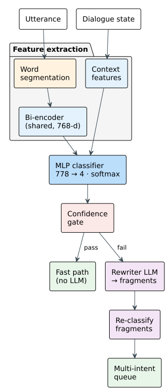

## 4.5.2 Intent Classification

The router is the first stage of every utterance. Its job is to answer a single question.
Given this Vietnamese sentence and the current conversation state, what does the customer
want to do: order, search, pay, or chat? The answer determines which specialized agent
handles the utterance downstream, so a routing error cascades: a misclassified ordering
intent sent to the chat worker produces a conversational reply instead of a cart operation,
and a misclassified chat intent sent to the order agent produces a spurious tool call that
the validator must reject.

Section 2.4.4 surveyed five approaches to this problem and found that none combines the three
properties this system requires. Rule-based classifiers are fast and deterministic but
language-specific and stateless; they match keywords against a fixed pattern table and cannot
resolve context-dependent utterances. Semantic centroid routers add domain vocabulary
handling through embedding similarity but fail on teencode abbreviations and context-
dependent affirmations; the embedding vector for "ok" carries no information about whether
the cart is awaiting confirmation or empty. Language-model-based routers handle all accuracy
criteria but introduce non-determinism and latency on the order of seconds per invocation.
The survey identified the gap: no approach combines speed and determinism with Vietnamese-
language handling. The proposed router closes this gap by combining a frozen Vietnamese
bi-encoder for semantic representation with ten hand-crafted context features extracted from
the conversation state, processed through a small trained classifier, and reserving the
language model only for utterance decomposition when the classifier cannot resolve a compound
sentence.

The classifier recognizes four output classes. ORDER\_CONFIRM utterances ("ok em," "chốt
đơn," "đúng rồi đặt luôn") are merged with ORDER. The distinction between drafting an order
and confirming one is handled downstream by the cart state machine (§4.5.5): the classifier
outputs ORDER, and the graph routes to the order agent, whose language model selects the
appropriate tool based on the current order stage. Multi-intent utterances such as "Cho 2 Ốc
Hương rồi tính tiền luôn" follow one of two paths. If the utterance contains no boundary
markers and the classifier produces a high-confidence single classification, the dominant intent
determines the dispatched agent. If boundary markers are detected or confidence is low, a
language-model-based rewriter decomposes the sentence into single-intent fragments, each
classified independently and queued for sequential execution (§4.5.5). Table 4.6 gives the four
classes with the kind of Vietnamese that triggers each.

*Table 4.6. The four intent classes, with Vietnamese utterances that trigger each.*

| Intent | Vietnamese Triggers | Dispatched Agent |
|--------|---------------------|-----------------|
| **ORDER** | "Cho 2 Ốc Hương", "Gọi thêm 1 Lẩu Thái", "Bỏ món X", "Ok chốt đơn" | Order agent |
| **SEARCH** | "Món nào cay cay?", "Ốc Hương giá bao nhiêu?", "Có món chay không?" | Search agent |
| **PAYMENT** | "Tính tiền", "Cho xin bill", "Thanh toán QR" | Payment dispatch |
| **CHAT** | "Chào em", "Cảm ơn", "Ngon quá", "Quán đông ghê" | Chat agent |

The classifier itself is a three-layer multi-layer perceptron that accepts a 778-dimensional
input vector and produces a four-class probability distribution via softmax. The input vector
concatenates a 768-dimensional Vietnamese sentence embedding with a 10-dimensional context
feature vector. Figure 4.7 illustrates the full pipeline.

*Figure 4.7. Intent Classification Pipeline: the utterance is segmented, embedded by the same
bi-encoder the retriever already uses, and concatenated with the context features before the
network produces a four-class distribution. The fast path is taken when confidence is at
least 0.70 and no clause-boundary marker is present; otherwise a rewriter splits the utterance
into fragments that are classified one by one into a multi-intent queue. (drawn by the group)*

The sentence embedding is produced by the Vietnamese bi-encoder selected in §4.6 for the
retrieval pipeline. This model, pre-trained on Vietnamese sentence pairs, produces L2-
normalized 768-dimensional vectors and is shared between the classifier and the retriever:
loaded once at agent startup, it serves both routing and menu search with no additional
memory cost. The bi-encoder was chosen over multilingual alternatives because it handles
Vietnamese-specific properties that general multilingual models address only partially:
tone-carrying diacritics where "cá" (fish) and "cà" (eggplant) are distinct embeddings
rather than near-neighbors; compound-word boundaries where "bún bò Huế" is one lexical item;
and informal register where teencode abbreviations carry semantic content.

Before embedding, the utterance is tokenized via Vietnamese word segmentation. Vietnamese
script places spaces between syllables, not between words: "ốc_hương_xốt_trứng_muối" is five
syllables but one dish. Without segmentation, the bi-encoder represents syllable-level
fragments rather than the compound unit, diluting semantic precision. The segmentation step
collapses syllable sequences into compound tokens so the bi-encoder receives word-level input.

The ten context features are the architectural element that distinguishes this classifier from
the centroid and rule-based alternatives surveyed in §2.4.4. A pure embedding-based approach
cannot resolve context-dependent utterances because the embedding vector for a given word is
constant regardless of when it is spoken. The ten features inject the conversation state that
the embedding alone cannot see.

Table 4.7 gives the encoding of all ten. What they buy is visible in three Vietnamese cases the
embedding alone cannot separate: "ok" at awaiting confirmation is a confirmation while the same
"ok" at idle is casual acknowledgment; "gọi thêm" on an existing cart is an addition while "gọi
món" on an empty one is a first order; and a short question following a search is usually another
SEARCH or a CHAT reference to a dish already discussed rather than a new order.

*Table 4.7. The ten context features and how each is encoded.*

| Dimension | Feature | Encoding |
|-----------|---------|----------|
| 0 to 4 | Order stage | One-hot over idle, building, awaiting confirmation, confirmed, modifying |
| 5 | Cart present | 1 when the cart holds items, otherwise 0 |
| 6 | Cart size | Item count capped at ten, divided by ten |
| 7 | Search results present | 1 when a previous search is still in context, otherwise 0 |
| 8 | Search result count | Result count capped at twenty, divided by twenty |
| 9 | Utterance length | Character count capped at two hundred, divided by two hundred |

Two of the five stage slots are reserved rather than active. The running system only ever
reports idle, awaiting confirmation, or confirmed, so the building and modifying slots stay
zero in deployment and the vector is effectively eight-dimensional. They are kept because the
cost of an unused input is one weight per hidden unit, and because a later revision of the
ordering workflow could populate them without retraining the feature extractor.

The network itself is intentionally small, three layers totaling approximately 220 thousand
parameters, because the 768-dimensional embedding already carries a strong semantic
representation of the utterance. The network's role is not to understand Vietnamese from
scratch but to learn how the context features interact with the embedding to resolve
ambiguities. The first layer projects from 778 to 256 dimensions with ReLU activation and
20% dropout. The second layer reduces to 64 dimensions, again with ReLU and dropout. The
output layer produces four logits normalized by softmax. Dropout is there because the corpus is
small: it discourages the network from memorising individual training utterances and pushes it
towards phrasings it has not seen.

No labeled dataset of Vietnamese restaurant utterances with intent annotations exists, so one was
written. The corpus is 434 utterances composed by hand against the restaurant's actual menu,
distributed as 129 ORDER, 128 SEARCH, 107 CHAT, and 70 PAYMENT. Writing them rather than
generating them with a language model was a deliberate choice: a generator echoes the vocabulary
of the examples it is shown, so a generated corpus is narrow in exactly the way that matters here,
and its labels are only as reliable as the generator's own judgement of its own output. Composing
by hand gives control over both. It also allows the corpus to be aimed at known weaknesses rather
than at coverage in general: the utterances over-sample casual and ambiguous phrasings, because
CHAT is the class most often pulled toward ORDER; they separate asking a price, which is SEARCH,
from asking for the bill, which is PAYMENT; and they include verbless fragment-shaped clauses,
because that is the shape the rewriter emits when it splits a compound sentence, and the
classifier has to route those too.

Each utterance is then paired with several conversation-state configurations. "Cho 1 Lẩu Thái"
appears at idle as a first order, at awaiting confirmation as a change to a cart about to be
confirmed, and at confirmed as the start of a new order. The text and its embedding are identical
in every copy; only the context features differ, so each copy is a different 778-dimensional input
carrying a possibly different label. This is what teaches the classifier that the same words mean
different things in different states, which is precisely the skill a pure embedding approach
cannot have. The 434 utterances expand to 2,134 context-augmented examples.

A 39-case holdout set was separated before augmentation and never seen during training, so no
augmented copy of a holdout utterance can leak into the training split. Training uses an 80/20
stratified split with cross-entropy loss weighted inversely by class frequency, the Adam optimizer
at a learning rate of 1e-3 with weight decay of 1e-4, and early stopping after ten epochs without
validation improvement. Because the bi-encoder is frozen, all embeddings are precomputed once and
training runs on cached vectors, converging in about two minutes on CPU. Three artifacts are saved
and loaded at agent startup: the network weights, a label encoder, and a scaler fitted on the
training split's context features.

At inference the utterance is segmented, embedded by the frozen bi-encoder, and concatenated with
the ten features before the network produces its distribution. Two outcomes determine the
subsequent path. If the confidence score exceeds 0.7 and the
utterance contains no boundary markers (words such as "rồi," "và," "thì," "xong," or "với
lại" that signal clause boundaries in Vietnamese), the classifier's output is accepted
directly. The predicted intent becomes the sole entry in the intent queue, and the graph
dispatches to the corresponding specialized agent. This fast path handles the majority of
utterances.

If the confidence falls below 0.7 or boundary markers are detected, the utterance is routed
to a language-model-based rewriter. The rewriter is a focused language model call with a
single responsibility: decompose the utterance into single-intent Vietnamese fragments. For
"Cho 2 Ốc Hương rồi tính tiền luôn," the rewriter produces two fragments: "Cho 2 Ốc Hương"
for ORDER and "Tính tiền" for PAYMENT. Each fragment is then classified independently by the
MLP, and the resulting intents are queued in order. The graph processes them sequentially,
so the payment total reflects the just-added items (§4.5.5). The rewriter is invoked only
when the fast path cannot resolve the utterance, so the language model cost is paid only when
necessary, not on every turn.

This classifier is the third design iteration, and the two it replaced are kept as ablation
baselines. The first was a pure semantic centroid router, which handled domain vocabulary but
could not see conversation state at all. The second added a language model fallback on top of it,
which showed that a language model does not substitute for context features: it cannot resolve
state-dependent ambiguity from few-shot examples alone, and every fallback cost latency. Both are
measured against the proposed router in §5.4.1, together with an arm that ablates the context
features and an arm that replaces the whole router with a language model.
