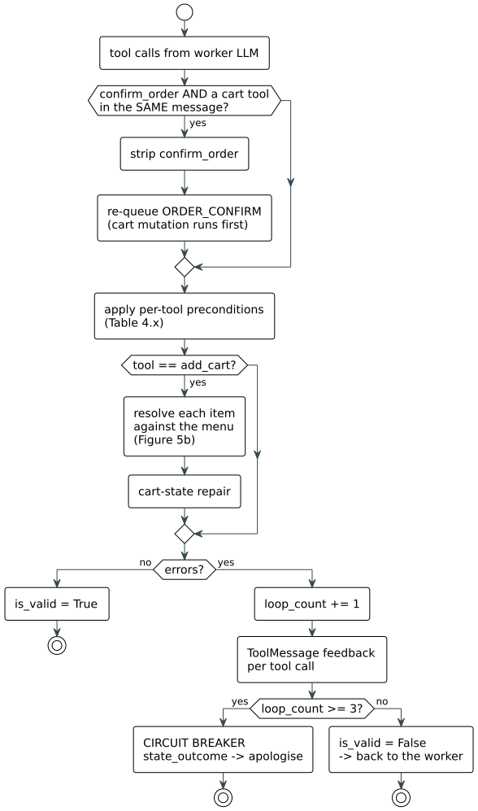
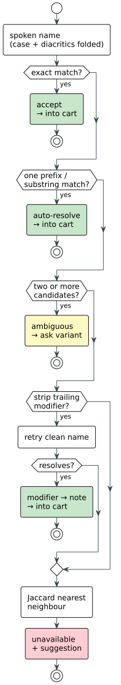

## 4.5.4 Deterministic Validator

The validator addresses the gap identified in §2.4.5: no autonomous, deterministic,
post-generation validator that inspects every tool call argument and blocks invalid calls has
been demonstrated. The survey found that existing approaches all operate at generation time.
Constrained decoding enforces schema syntax but performs no semantic check: "Cơm Tấm" is
valid JSON but not a valid dish. RAG grounding reduces the probability of error by injecting
authoritative data into the prompt, but provides no detection mechanism for the errors that
still occur. Human-in-the-loop eliminates all errors at the cost of full autonomy. The
validator presented here is a pure-rules layer positioned after the language model proposes
an action but before that action executes, inspecting every argument against the authoritative
menu and current conversation state.

A language model's output is probabilistic regardless of temperature. It can hallucinate a
dish name that does not exist on the menu, produce a nonsensical quantity, or attempt to
confirm an order with invalid items. The validator cannot prevent the language model from
hallucinating, but it can detect hallucinated output before it reaches the cart, the kitchen,
or the payment system. This architecture, in which the language model proposes, the validator
inspects, and tools execute only if approved, is the central safety invariant of the system.
Figure 4.8 shows the validator's control flow.

*Figure 4.8. Validator Control Flow: a proposed tool call enters, its arguments are checked
against the menu and the current state, and it either reaches the tool node or returns to the
worker as corrective feedback. The name resolution invoked by the cart tools is expanded in
Figure 4.9. Three consecutive failures trip the circuit breaker. (drawn by the group)*

The core validation logic is menu name resolution: determining whether each item name the
language model produced actually exists on the restaurant's menu, whose 219 entries carry 212
distinct dish names. Figure 4.9 illustrates the resolution cascade, ordered from the most
reliable form of evidence to the least.

*Figure 4.9. Menu Name Resolution Cascade: resolution of a customer-spoken dish name, applied
to each item requested by a cart tool. A name that matches one menu entry is accepted, a name
that matches several produces a clarifying question rather than a guess, and a name that
matches none is reported as unavailable with the nearest suggestion. (drawn by the group)*

Resolution begins with a normalisation step applied to both sides of every comparison. The
input and each menu name are lowercased, stripped of Vietnamese diacritics through Unicode
decomposition, with the letter đ folded to d, and their whitespace collapsed. Normalising up
front rather than comparing twice means the common Vietnamese typing pattern, where customers
and language models omit diacritics, costs nothing extra: "Oc Huong Xot Trung Muoi" and "Ốc
Hương Xốt Trứng Muối" become the same string before any matching is attempted, as do "Lau Thai
Hai San" and "Lẩu Thái Hải Sản."

Two matching stages then run on the normalised forms. The first is exact comparison: if the
input equals a menu name, resolution stops and the item is accepted. The second widens to
partial matching for the shortened names customers actually use. Menu names beginning with the
input are collected first, since a prefix is the most intuitive abbreviation, and only if no
name begins with the input does the validator fall back to names containing it anywhere. The
number of surviving candidates decides the outcome: exactly one is accepted as an unambiguous
match, several are reported as ambiguous, and none means the item is not on the menu.

Every resolution therefore ends in one of four verdicts: exact, single unambiguous match,
ambiguous, or no match. Nothing further is attempted to force a name into the cart. Token
similarity plays no part in this decision, and is used only afterwards, to suggest an
alternative for a name that has already been ruled off-menu.

Generic names that match multiple menu items are flagged as ambiguous, never auto-resolved.
This is a critical Vietnamese restaurant-specific challenge: a dish family like "Ốc Hương"
appears in eleven sauce variants on the menu (trứng muối, me, tỏi, bơ, rang muối, and others).
When a customer says "Cho 1 Ốc Hương," the prefix match resolves to all variants, none
uniquely. The validator flags this ambiguity, and the response node asks for clarification:
"Dạ, Ốc Hương có nhiều loại sốt: trứng muối, me, tỏi, bơ... anh/chị muốn loại nào ạ?"
Choosing a specific variant for the customer would be incorrect; the system forces the
customer to disambiguate.

Items that resolve to nothing are captured as off-menu, each carrying the raw
language-model-produced name and, where possible, a suggested alternative. The suggestion is
computed separately from resolution: both names are split into tokens and scored by Jaccard
similarity, the overlap divided by the union, and the best-scoring menu name is offered only if
it reaches 0.3. Below that floor no suggestion is made at all, on the reasoning that an
apology is more useful to the customer than a barely related dish. Because this runs after the
item has already been ruled off-menu, a token score can never put a dish in the cart; it can
only propose one the customer must accept. The validator never auto-corrects or substitutes. It only
flags and suggests. The decision to accept the suggestion or choose something else remains
with the customer. This design principle of flagging but not substituting prevents the system
from ordering the wrong dish on the customer's behalf.

Vietnamese customers frequently append special requests directly to dish names: "Lẩu Thái,
ít cay," "Ốc Hương Xốt Trứng Muối, thêm hành," "Cơm Chiên (không hành)." The validator
extracts these modifiers by matching common delimiters (parentheses, commas, and dashes) in
priority order. If a pattern matches, the modifier text is extracted, the cleaned name is
re-resolved against the menu, and, if the cleaned name resolves to a valid item, the modifier
is stored in the item's special requests field rather than the name. "Lẩu Thái, ít cay" is
stored as the dish "Lẩu Thái" with the modifier "ít cay"; the kitchen sees the correct dish
with the customer's preference separated from the name.

Beyond menu validation, the validator enforces three state consistency rules. Simultaneous
add-and-confirm is rejected: if the language model emits both an add-to-cart and a
confirm-order call in the same turn, the confirm-order call is stripped and an error is added
to the feedback. The cart state machine requires the customer to explicitly confirm after
seeing the updated cart; a simultaneous add-and-confirm would send items to the kitchen that
the customer never saw.

Additive-turn detection prevents a problem caused by language model statelessness. The model
receives a prompt, produces a response, and has no memory of prior turns. If the customer
says "thêm 1 Bia Sài Gòn" and the prompt accidentally omits the existing cart contents, the
model might produce an add-to-cart call that overwrites a cart previously containing three
items. The validator detects additive markers in the utterance ("thêm," "nữa," "lấy thêm,"
"gọi thêm," "cho thêm") and, if the proposed cart does not include the existing items,
automatically restores them. The existing items are prepended to the new items, ensuring the
cart accumulates rather than replaces.

Cart deduplication prevents the model from re-adding the entire cart from context. If the cart
contains Ốc Hương and Lẩu Thái and the customer says "thêm 1 Bia," the model might re-add all
existing items plus the new one. The validator checks each item in the proposed tool call
against the current cart and strips items already present that the customer did not mention in
the current utterance. For removal operations, the validator resolves the raw item name
against the current cart contents: if the model says "bỏ Ốc Hương" but the cart contains "Ốc
Hương Xốt Trứng Muối," a prefix match resolves the vague name to the full cart entry.

Each tool type receives specific additional validations, listed in Table 4.11. For confirming
an order, the validator requires that the cart is non-empty and that the order stage is
awaiting confirmation; an order cannot be confirmed before the cart has been drafted and echoed
to the customer. For clearing the cart, the validator rejects the operation if the cart is
already empty. For payment and confirmation tools, the validator automatically injects the
table identifier into the tool call arguments; these tools call the backend orchestrator, which
requires the table identifier, but the language model operates on session-scoped state and
does not know the identifier.

*Table 4.11. What the validator checks before each tool, and what happens when a check fails.*

| Tool | Checks applied | On failure |
|------|----------------|------------|
| Add to cart | Every item name resolves against the menu; quantity is greater than zero | The item is dropped and recorded as off-menu or ambiguous |
| Remove from cart | The name resolves against the cart rather than the menu; quantity is clamped to what the cart holds, and a quantity covering the whole line removes it | Rejected with feedback, worker retries |
| Clear cart | The cart is not already empty | Rejected with feedback, worker retries |
| Confirm order | Stage is awaiting confirmation; cart is non-empty; the item list is replaced with the server-side cart | Rejected with feedback, worker retries |
| Request payment, verify payment | The table identifier is injected from session state | Rejected with feedback, worker retries |

When the validator finds errors, it constructs per-tool error messages with formatted
feedback in Vietnamese, naming the exact problem, the affected item, and the nearest valid
suggestion where applicable. These error messages are appended to the conversation history.
When the worker is invoked for retry, it sees its own prior failed tool call followed by the
validator's error feedback as the full failure context. A loop counter tracks retry attempts.
At three failed validations, the circuit breaker engages: the validator returns a rejection
flag, but the routing function sends the utterance to the state outcome instead of returning
to the worker. The state outcome builds a retry response context with an apology, and the
response node verbalizes it: "Dạ, em xin lỗi anh/chị, em xử lý thông tin bị lỗi. Anh/chị
kiểm tra lại giúp em nhé ạ." The system always produces a response; even after repeated
language model failures, the customer hears an apology rather than silence.

The validator's effectiveness is evaluated in §5.4.2.
