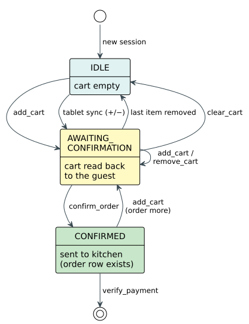

## 4.5.5 State Management

Section 2.4.6 surveyed memory strategies for conversational agents and identified a gap
specific to Vietnamese task-oriented dialogue: no prior work characterizes a memory
architecture that combines conversation history with persistent application state, session
isolation, and context window awareness under Vietnamese token pressure. General-purpose
agent frameworks provide sliding-window history and periodic summarization, but they do not
natively separate the message list from structured state such as the cart, order stage, and
search context. For Vietnamese, the problem is compounded: the same content consumes roughly
double the tokens of English, so a window that fits English conversations truncates
Vietnamese conversations earlier, and periodic summarization risks omitting tone-carrying
diacritics that change the meaning of a summarized sentence. This section presents the state
architecture that addresses this gap: a typed state object separate from the message history,
session-scoped persistence keyed to the restaurant's session lifecycle (§4.7.2), and a cart
state machine that enforces the ordering workflow.

The agent's shared state is a typed object carrying all information that must persist across
turns and flow between nodes. Its fields divide into five categories by lifecycle, so each node
knows which it may read, which it must write, and which are cleared before the next turn.
Conversation history is the only field that grows monotonically within a session; everything else
is overwritten or reset per turn. Table 4.12 sets out the categories.

*Table 4.12. The five categories of state field, by lifecycle.*

| Category | Fields | Lifetime |
|----------|--------|----------|
| Conversation history | User messages, assistant replies, tool results | Appends for the whole session |
| Task state | Table identifier, active cart (names, quantities, unit prices, special requests), order stage, search context | Persists across turns within the session |
| Routing state | Intent queue in first-in-first-out order, classification path taken, confidence score, per-intent sub-queries | Written by the router each turn, consumed as workers drain the queue |
| Inter-node contract | Validity flag, validator feedback, retry counter, off-menu items, ambiguous items | One turn only, cleared at the end of it |
| Output | Typed response context, UI action command, order-confirmed flag, cart-touched flag | One turn only, read by the response stage and the tablet |

The two one-shot flags in the output category earn their place: they let the tablet transition its
display exactly once, which is what stops the agent from overwriting a hand-edited cart on a turn
that had nothing to do with ordering.

The state persists between turns through a SQLite-backed checkpointer that saves after every
node execution. The critical design decision ties the conversation thread identifier to the
restaurant's session identifier (§4.7.2): a session begins when a party is seated and ends
when payment is verified. Within a visit, all turns share the same thread and the
checkpointer restores the full state before each turn. Between visits, payment closes the
session, the next seating creates a new session with a new identifier, the checkpointer sees
a fresh thread, and all state is blank. No manual cleanup is needed; the session lifecycle
naturally partitions conversation memory.

Execution proceeds in two phases once the validator approves a tool call. In the first phase,
the ToolNode executes the approved tool. In the second phase, the state updater merges the
result into the agent's state. This two-phase design of execute then update ensures that tool
execution failures, such as network errors or database constraint violations, leave no
residue. Only successful tool calls modify the state.

Seven tools cover the agent's action space across three architectural categories. Three
in-memory cart tools operate with no network calls, no database writes, and no external
dependencies: the add-to-cart tool merges items by incrementing quantity for same-name items
rather than creating duplicates; the remove-from-cart tool removes one item by exact name;
the clear-cart tool empties all items. All three recompute prices from the authoritative menu
data, never from the language model. Three orchestrator API tools bridge the agent to the
persistent restaurant ledger. The confirm-order tool serializes the cart and sends it to the
backend, which inserts the order, links it to the active session, verifies prices against the
menu, and emits a real-time event to the kitchen display. The request-payment tool triggers
the backend to compute the session total from all confirmed orders and generate a payment QR
code. The verify-payment tool marks the session as closed and the table as paid. The agent
does not write to the database directly; it proposes actions, and the backend enforces
business rules. The search tool wraps the hybrid retrieval pipeline (§4.6): it tokenizes the
query for Vietnamese, executes parallel BM25 and FAISS retrievals, fuses results via
Reciprocal Rank Fusion, and returns a list of structured results with dish names, prices,
categories, and taste tags. Table 4.13 sets the seven out together.

*Table 4.13. The agent's seven tools, what each touches, and whether its effect outlives the
session.*

| Tool | Category | Effect | Permanent |
|------|----------|--------|-----------|
| Search | Retrieval | Reads the menu index and returns ranked dishes | No, read-only |
| Add to cart | In-memory | Adds items, merging quantities for a dish already present | No |
| Remove from cart | In-memory | Removes a line, or reduces its quantity | No |
| Clear cart | In-memory | Empties the cart | No |
| Confirm order | Backend | Writes the order to the ledger and returns its identifier | Yes |
| Request payment | Backend | Totals the session and returns the amount and QR code | Yes |
| Verify payment | Backend | Settles the bill, closes the session, frees the table | Yes |

An eighth callable, the delegate escape hatch, is bound to the two language-model agents but
never executes. It carries no effect of its own; the graph reads it as a routing instruction
and hands the turn to the chat agent.

The ToolNode iterates over all approved tool calls and executes each independently. When the
language model emits multiple tool calls in a single message, such as adding two different
items in one utterance, each call produces its own result appended to the conversation
history. The state updater then processes all results from the current turn through dedicated
per-tool handlers: cart additions merge items additively and recalculate the total; removals
filter the named item and recalculate; clearing replaces the cart with an empty one;
confirmation advances the order stage to confirmed; search stores results in the search
context; payment sets a UI action command. After processing, the state updater recomputes the
cart total from the authoritative menu data and pops the processed intent from the queue. If
more intents remain, the routing function dispatches the next worker; if the queue is empty,
execution proceeds to finalize the turn.

The ordering workflow is governed by a finite state machine, illustrated in Figure 4.10. Four
stages are declared, but only three are ever written by the running system.

*Figure 4.10. Cart and Order Stage Machine: the stages a cart passes through and the tool that
causes each transition. The validator refuses a confirmation from any stage other than
awaiting confirmation, and that edge is the only way into the confirmed stage, so the property
that the customer saw the cart before being billed belongs to the graph rather than to a
prompt. (drawn by the group)*

In the idle state, no cart exists. The first successful addition moves the cart directly to
awaiting confirmation, because the same turn that adds an item also echoes the cart back to the
customer: there is no moment at which items sit in the cart unseen, so no separate drafting
stage is needed to represent one. Further additions, removals, and clearances keep the cart at
awaiting confirmation and re-echo it, and emptying the cart returns it to idle. Only an
explicit confirmation moves it to confirmed and sends the order to the kitchen. The critical
rule is that no modification can proceed silently to confirmation; the customer always sees the
updated cart first, and the validator enforces this by refusing a confirmation from any stage
other than awaiting confirmation. In the confirmed state, payment proceeds and a new addition
starts a fresh cycle.

A fourth stage, drafting, is declared in the order stage type but is never assigned by any
node. It is retained as a reserved value for a workflow that separates composing a cart from
presenting it, which the current design does not require because composition and presentation
happen in the same turn.

Multi-intent turns are processed sequentially through the intent queue. When the router
classifies multiple intents, as when "Cho 2 Ốc Hương rồi tính tiền luôn" produces [ORDER,
PAYMENT], each intent is dispatched to its worker in order, and the state updater merges
results before the next intent is processed. Sequential execution is essential: the order worker adds items
first, the state updater pops ORDER and advances the cart, and only then does the payment
dispatch request the bill, so the total reflects the just-added items.

The state outcome node finalizes each turn after all intents are processed. It builds a typed
response context from the executed tool's results: an order context carrying the cart and
total, off-menu items with nearest-match suggestions, and ambiguous items needing
clarification; a search context carrying the rewritten query and ranked results; a payment
context carrying the amount, QR code, and status; or a retry context carrying the failed tool
and feedback when the circuit breaker triggered. If the chat worker has already set a
response context for the CHAT path, the state outcome skips building and only performs
cleanup. The cleanup resets all ephemeral fields that must not persist to the next turn:
off-menu items, ambiguous items, validator feedback, the delegate reason, per-intent
sub-queries, and the UI action command.
