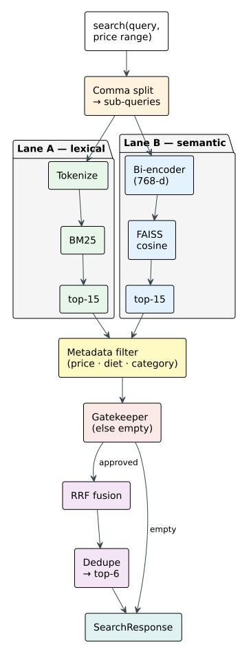

## 4.6 Knowledge Retrieval Pipeline

Section 2.5 surveyed the RAG literature and identified a gap. Prior work does give the language
model a role in retrieval, but always at one edge or the other: rewriting the query before it
runs, or scoring the documents after it returns. What none of the surveyed pipelines builds is
a path from the output of retrieval back to its input, so a rewrite that produced unusable
terms cannot be recognised as such and answered differently. The architecture proposed here
closes that path: the model rewrites the query before retrieval, a hybrid BM25-and-FAISS
retriever searches the 219-entry menu behind a relevance gate that rejects a query cleanly when
both retrieval strategies produce noise, and the model rephrases what survives, evaluating
relevance against the original customer intent. A multi-turn search context persists across
turns so the model can answer follow-up questions about previously retrieved dishes without
re-querying.

This closed-loop design is the answer to the fourth design challenge of §4.2, that a query and
the dish which answers it may share no words at all. Standard embedding-based retrieval fails
structurally in that case, because the query and the document occupy disconnected regions of the
embedding space. Figure 4.11 illustrates the full pipeline.

*Figure 4.11. Hybrid Retrieval Pipeline: the rewritten query enters two lanes that run in
parallel, keyword matching over the menu text and semantic similarity over the shared
embedding index. The gatekeeper admits a result only when one of the two lanes is confident,
so an out-of-domain question returns nothing rather than the least bad dishes. Survivors are
fused by rank, deduplicated by dish name, and cut to the final list. (drawn by the group)*

### 4.6.1 Query Rewriting

The first stage runs before any retrieval occurs. Rather than embedding the customer's raw
utterance, the search agent (§4.5.3) uses the language model to translate conversational
Vietnamese into concrete search terms.

The utterance "món gì ấm bụng cho ngày lạnh?" contains no word that appears in the menu. BM25
returns nothing, and FAISS returns the nearest vectors to a general-domain sentence about comfort
and warmth rather than to any food item. What is needed is cultural knowledge, not extraction:
"ấm bụng" names the sensation of warmth and fullness after eating, which in Vietnamese cuisine
means noodle soups, hot pots, porridges, and stews. The model rewrites the request into those
categories, "lẩu, súp, cháo, bún, phở, món nước nóng", which are lexically present in the menu's
category and tag metadata. Extracting tokens instead would have produced "món", "ấm", "bụng",
"lạnh", none of which match any entry.

This is Step-Back Prompting (§2.5.4) applied to a domain the technique has not been evaluated
on, and it differs from the canonical form in three ways. Step-Back abstracts a query to a
single higher-level question; here the abstraction produces several categories at once, because
one sensory description spans unrelated parts of a menu. Step-Back's published evaluations
abstract over factual taxonomy in English; what is abstracted here is a culinary association
rather than a fact, since nothing in the menu text records that warmth and fullness after eating
correspond to hot pots and porridges, and whether a model holds such associations reliably
enough to drive retrieval is what §5.4.4 measures. And the rewrite is not trusted on its own: it
is checked by the gate of §4.6.2, which can reject what it produced, where Step-Back hands off
to retrieval with no return path.

The rewritten query goes into the search tool's arguments, where it is split on commas and each
term run as an independent sub-query returning up to six results, the sub-queries then merged and
deduplicated by dish name. One request becomes five parallel searches, so the result set covers
every category the model identified. Decomposition is therefore the model's responsibility, and
the retriever stays a plain search engine that matches terms without knowing why they were chosen.
Mappings of this kind, "ấm bụng" to "cháo, lẩu, súp nóng" or "giải nhiệt" to "nước ép, sinh tố,
trà đá", are taught by example in the search agent's prompt, which is what removes the need for a
separate rewriting model or a hand-built synonym dictionary.

### 4.6.2 Hybrid Retrieval

The rewritten query enters two parallel retrieval paths that exploit the complementary strengths
of sparse and dense retrieval. BM25 matches keywords exactly against dish names, categories, tags,
and taste profiles; FAISS matches meaning, by cosine similarity over embedding vectors. Neither is
sufficient alone, and their failure modes are opposite, which is why running both guarantees that
one of them finds a relevant match for any query type. Table 4.16 sets the two lanes against each
other.

*Table 4.16. Where each retrieval lane succeeds, where it fails, and on what kind of query.*

| Lane | Strong when | Weak when | Worked example |
|------|-------------|-----------|----------------|
| Keyword | The query names a dish or a category that appears in the menu text | The query and the dish that answers it share no words | "Ốc Hương" finds every sauce variant; "hải sản" misses "tôm mực cá" |
| Semantic | The query describes a taste, an attribute, or a sensation | The dish name is rare and the encoder has little evidence for it | "món cay" finds spicy dishes with no word match; "Ốc Hương Xốt Trứng Muối" may sit closer to generic restaurant text than to itself |

Both indices are built over the same 219 entries, each dish represented as one document
concatenating its name, category, tags, taste profile, and description. The BM25 side tokenizes
those documents with the same Vietnamese word segmentation the classifier uses, so compounds stay
whole, and it disables document-length normalization because menu entries are short and of near
uniform length. The FAISS side encodes each document as a 768-dimensional vector using the frozen
bi-encoder shared with the classifier (§4.5.2), loaded once at startup so the embedding model
occupies memory only once, and searches it exactly rather than approximately, which costs nothing
at this corpus size.

Both retrievers are queried in parallel on a two-worker pool. Because keyword matching and vector
search are independent and use different resources, the combined wall-clock time is the maximum of
the two rather than their sum. Each returns up to fifteen candidates. Before fusion, a metadata
post-filter applies if the customer named a constraint on price, dietary type, or category, and it
applies only to menu documents so that supporting material such as restaurant information passes
through untouched.

Before anything is fused, a dual-lane relevance gatekeeper determines whether the query is
worth answering at all. The semantic lane checks the top FAISS result: if its cosine similarity
is at least 0.35, the lane passes. The lexical lane extracts keywords from the raw query and
checks whether any keyword appears in the top BM25 or FAISS document text. Either lane can
approve the query. Only if both lanes fail does retrieval return an empty list, and in that
case no fusion is performed at all.

CRAG (§2.5.4) places a comparable check at the same point in the pipeline, but scores relevance
with a language model call and falls back to a web search when nothing passes. The gate here is
deterministic and costs no inference: two threshold tests over values the two retrievers have
already computed. A rejection also returns nothing rather than reaching outside the menu for a
substitute, which is the correct answer when the restaurant genuinely does not serve what was
asked for. This prevents the system from returning irrelevant menu
items for utterances that triggered a search call but are not actually about food: a greeting,
a complaint, or an out-of-domain question. The agent responds with "Dạ, quán không có món đó
ạ" rather than feeding noisy results to the language model, which might hallucinate a dish
based on irrelevant retrieved text.

A query that clears the gate has its two ranked lists fused by Reciprocal Rank Fusion, which
operates on document ranks rather than raw scores. This matters because the two scores are not
comparable: BM25 produces unbounded term-weight sums while FAISS produces cosine similarities in a
bounded range, and fusing by rank sidesteps the calibration that fusing by score would demand.
Each list contributes to a document the quantity

    1 / (k + r)

where r is the document's rank in that list and k is set to 60, and the two contributions are
added; a document appearing in only one list receives one contribution. The constant damps the gap
between neighbouring ranks, which is what makes a document both lanes rank well outrank one that a
single lane puts first. The fused list is then sorted by descending score, deduplicated by dish
name so an item returned by both retrievers appears once, and truncated to six final results.

Table 4.17 collects the settings of the whole pipeline in one place.

*Table 4.17. Settings of the retrieval pipeline.*

| Stage | Setting | Value |
|-------|---------|-------|
| Keyword lane | Term frequency saturation | 1.2 |
| | Document length normalisation | Disabled, since menu entries are short and near-uniform |
| | Tokenisation | Vietnamese word segmentation, compounds kept whole |
| Semantic lane | Embedding dimensions | 768 |
| | Index | Exact flat inner product over normalised vectors |
| Both lanes | Candidates returned per lane | 15 |
| Gatekeeper | Semantic lane, top-1 cosine similarity | At least 0.35 |
| | Lexical lane | Any query keyword present in the top document |
| Fusion | Rank constant | 60 |
| | Results returned | 6, deduplicated by dish name |
| Sub-queries | Results requested per comma-separated term | 6 |
| Follow-up memory | Dishes retained for later turns | 5 |

### 4.6.3 Result Rephrasing

The third stage of the loop hands the fused dishes to the response node, which is described in
§4.5.6. What matters for retrieval is the shape of what is handed over: a typed search context in
which every dish carries its name, price, category, tags, and taste profile, all read from the
authoritative menu data rather than produced by the model. The model then judges each dish against
what the customer originally asked and phrases the reply, so it decides the ordering and the
wording but never which dishes exist or what they cost.

The failure case is what makes the loop closed. When the gatekeeper rejects a query the search
context is empty, and an empty context is not something a model can embellish: with no dishes to
name, the reply becomes an apology and an offer to show the menu. Responding differently to a hit
and to a miss, on evidence rather than on instruction, is the behaviour §2.5 found absent from
standard RAG pipelines.

### 4.6.4 Multi-Turn Search Context

Restaurant conversations span multiple turns. A customer may search for a dish, order it,
then ask a follow-up question about it several turns later. Without search context, the agent
repeats the same search and presents the same results; the customer perceives the agent as
forgetful.

The search agent injects a dynamic section listing already-known items, drawn from two
sources. The current search context holds the results of the most recent search call, retained
across turns so the model can reference previously retrieved dishes without re-querying. The
active cart holds items the customer has already ordered. When the language model reads this
list before deciding whether to call the search tool, it can determine that the customer is
asking about a previously discussed item and delegate to the chat worker, which answers from
the curated memory rather than re-searching. The curated memory converts the search context
into structured objects, up to five dishes, each carrying a name, price, tags, and taste
profile, and passes them to the chat worker for conversational follow-up responses.

A cumulative list of all dish names ever returned by search turns is maintained separately.
This list is injected into the response prompt as an anti-repetition constraint: the language
model is explicitly instructed to prioritize different dishes when the customer makes
subsequent search requests, preventing the same recommendations from appearing turn after
turn. The list is cleared when the cart is emptied or the session resets, so a new customer
receives fresh recommendations.

Both indices are built offline and serialized to disk, then loaded during the agent's warmup, so a
rebuild is needed only when the menu changes. The retrieval pipeline's effectiveness is evaluated
in §5.4.4.
