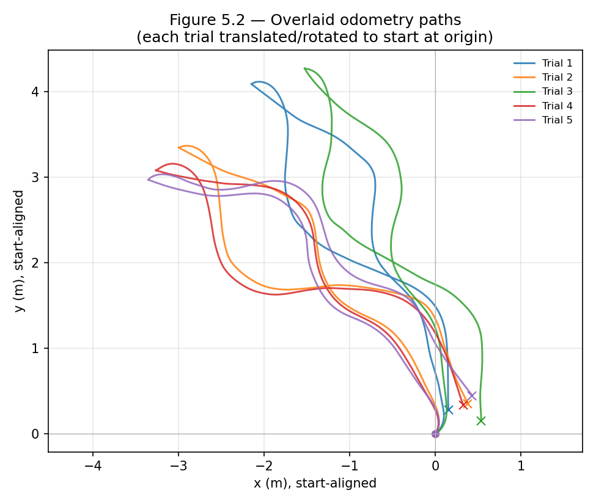
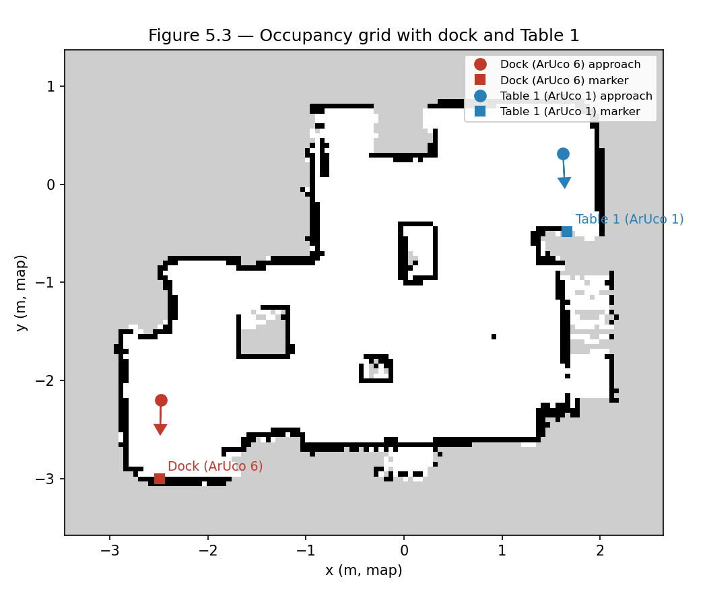
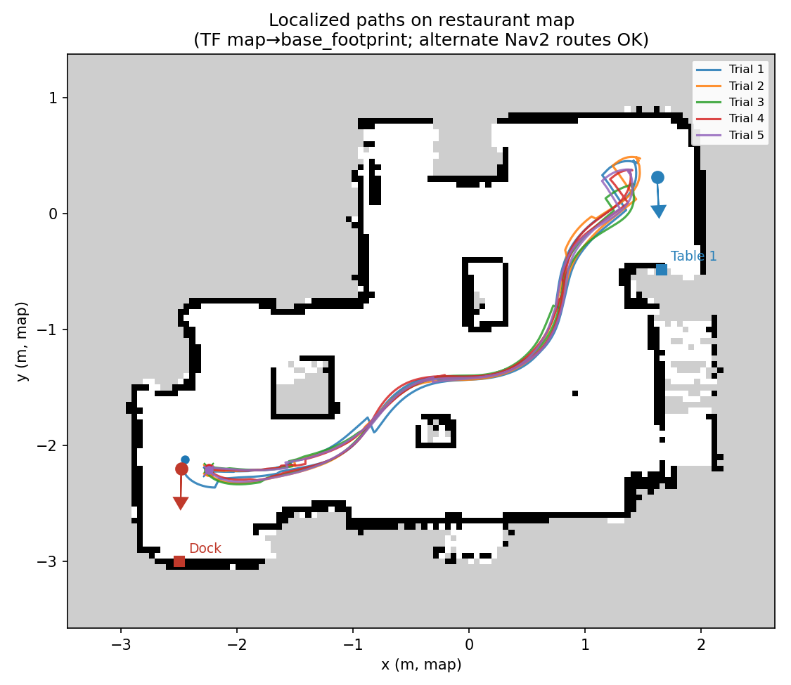

# CHƯƠNG 5: THỬ NGHIỆM VÀ KẾT QUẢ (Trích đoạn: Điều hướng Robot)

> **Trạng thái:** Trích đoạn đánh giá đã hoàn thiện; phần điều hướng robot. Thử nghiệm thực tế trên phần cứng được đánh giá trên cấu hình đơn gồm trạm Dock (**ArUco 6**) và Bàn 1 (**ArUco 1**). Tập hợp cảm biến, ước lượng trạng thái EKF, RTAB-Map SLAM, Nav2 stack và phân hệ căn chỉnh thị giác ArUco hoàn toàn khớp với thiết kế đã đề xuất trong Chương 3.

---

## 5.2 Các thử nghiệm điều hướng trong ROS2

Quá trình phát triển tuân theo phương pháp **mô phỏng trước, thử nghiệm phần cứng sau** (simulation-first, hardware-second). Toàn bộ hệ thống điều hướng ban đầu được xác minh trong môi trường mô phỏng Ignition Gazebo trên máy trạm trước khi triển khai lên nền tảng phần cứng thực TarkBot. Các đánh giá thực địa trên robot thật kiểm chứng độ trôi odometry, quá trình xây dựng bản đồ và định vị dựa trên đồ thị của RTAB-Map, điều hướng đường đi toàn cục và cơ chế cập bàn bằng thị giác máy ảnh ở khoảng cách cuối.

---

### 5.2.1 Môi trường mô phỏng

Trước khi tiến hành thử nghiệm thực địa, môi trường nhà hàng đã được mô hình hóa và mô phỏng trong **Ignition Gazebo** nhằm xác minh quy trình điều hướng tự động trong một thiết lập ảo an toàn. Mô hình robot di động 3D được cấu hình với động học vi sai, kích thước vật lý và vị trí đặt cảm biến (cảm biến LiDAR 2D mặt phẳng và camera độ sâu RGB-D) hoàn toàn tương đồng với nền tảng TarkBot thật được triển khai bên trong không gian nhà hàng ảo. Môi trường mô phỏng tái tạo lại khu vực xuất món tại bếp, các hành lang phục vụ, các trạm bàn ăn và các thẻ đánh dấu **ArUco** gắn trên tường.

Cầu nối hai chiều **ROS-Ignition bridge** liên kết động cơ vật lý Gazebo với hệ điều hành ROS 2 Humble. Các luồng dữ liệu cảm biến mô phỏng, bao gồm tia quét LiDAR mặt phẳng, ảnh camera độ sâu, odometry bánh xe và xung đồng hồ hệ thống, được xuất trực tiếp tới các topic ROS, trong khi các lệnh vận tốc sinh ra từ hệ thống điều hướng sẽ điều khiển đế robot ảo. Quy trình mô phỏng này cho phép các nhà phát triển thử nghiệm cấu hình khởi tạo, tinh chỉnh các tham số costmap, xác minh hành vi phục hồi né vật cản và hoàn thiện các kịch bản giao đồ ăn tự động trước khi thực hiện thử nghiệm trên phần cứng thực tế.

> 🖼️ **Hình 5.1: Môi trường nhà hàng mô phỏng trong Ignition Gazebo** (Robot di động trong hành lang phục vụ với các thẻ đánh dấu ArUco đặt tại các trạm đích).

---

### 5.2.2 Cấu hình không gian thực nghiệm

Các đánh giá thực địa trên phần cứng thực tế được tiến hành bên trong một khuôn viên nhà kho được cải tạo thành không gian thử nghiệm nhà hàng trong nhà. Mặt sàn thử nghiệm là bề mặt gạch men bóng, đặt ra những thử thách vận hành thực tế do độ bám đường của bánh xe thấp và hiện tượng trượt vi mô xuất hiện tức thời trong các thao tác quay chuyển hướng vi sai.

Để mô hình hóa ranh giới vật lý của hành lang phục vụ nhà hàng, ba thùng chứa hàng lớn được bố trí chiến lược trong phòng để tạo thành các lối đi hẹp và các đường ranh giới vật cản. Không gian thực nghiệm bao gồm hai trạm mục tiêu đã được khảo sát tọa độ chuẩn và gắn các thẻ đánh dấu thị giác trên tường: trạm Dock sạc/bếp được đánh dấu bằng **ArUco 6** và trạm bàn ăn chính (Bàn 1) được đánh dấu bằng **ArUco 1**. Các tọa độ tiếp cận mục tiêu, vectơ hướng và khoảng cách dừng an toàn được đo đạc trực tiếp trên mặt bằng thực tế đóng vai trò là chuẩn tọa độ thực (ground-truth) cho toàn bộ các thử nghiệm thực tế.

> 🖼️ **Hình 5.2: Cấu hình không gian thực nghiệm thực tế** (Khuôn viên nhà kho với mặt sàn gạch men bóng, ba thùng chứa tạo ranh giới hành lang, trạm Dock gắn ArUco 6 và Bàn 1 gắn ArUco 1).

---

### 5.2.3 Thử nghiệm độ chính xác Odometry

Mục tiêu chính của thử nghiệm này là định lượng độ trôi tích lũy của phân hệ hợp nhất cảm biến Bộ lọc Kalman Mở rộng (EKF) (`/odometry/filtered`, hợp nhất bộ đếm xung encoder bánh xe và cảm biến IMU 6 trục MPU6050) trên một chu trình giao hàng khép kín mà không có sự hiệu chỉnh vị trí từ bản đồ. Tập dữ liệu bao gồm 5 lượt chạy khép kín từ trạm dock đến điểm tiếp cận Bàn 1 và quay trở lại trạm dock ở vận tốc phục vụ tiêu chuẩn ($v_{\max} = 0.3\text{ m/s}$). Tọa độ robot được ghi nhận từ topic `/odometry/filtered` tại gốc trạm dock trước khi xuất phát và ngay khi quay trở về dock. Việc tính điểm dựa hoàn toàn vào tích phân định vị định ước (dead-reckoning), tách biệt hoàn toàn hiệu năng odometry thuần túy khỏi các hiệu chỉnh trong khung tọa độ bản đồ. Các chỉ số báo cáo bao gồm sai số vị trí quay về điểm đầu $\Delta p = \sqrt{\Delta x^2 + \Delta y^2}$ (cm) và sai số góc hướng tuyệt đối $|\Delta \psi|$ (độ).

**Bảng 5.1: Sai số quay về điểm đầu của Odometry (5 lần chạy).**

| Số lần chạy | Vị trí (cm) trung bình ± độ lệch | Góc hướng (độ) trung bình ± độ lệch |
|:---:|:---:|:---:|
| 5 | 49.46 ± 11.51 | 14.45 ± 10.02 |

> **Hình 5.3: Các quỹ đạo odometry đè chồng** (mỗi lần chạy được tịnh tiến và xoay về gốc $(0,0)$).

**Phân tích.** Định vị định ước thuần túy thể hiện độ trôi tích lũy đáng kể trên tổng quãng đường khép kín $8\text{--}10\text{ m}$, đạt trung bình $49.46\text{ cm}$ về độ dịch chuyển vị trí và $14.45^\circ$ về độ lệch góc hướng. Cập nhật odometry động học vi sai phụ thuộc vào bán kính bánh xe $R$ và khoảng cách hai bánh $W = 0.206\text{ m}$, trong đó độ dịch chuyển tiến $\Delta s = (\Delta s_R + \Delta s_L)/2$ và độ xoay $\Delta \theta = (\Delta s_R - \Delta s_L)/W$. Hiện tượng trượt vi mô giữa lốp cao su và mặt sàn gạch men bóng trong các thao tác quay tại chỗ gây ra sự trượt góc xoay tức thời, vốn được tích phân liên tục bởi EKF. Hơn nữa, cảm biến con quay hồi chuyển MEMS giá rẻ bị ảnh hưởng bởi độ trôi trôi lệch điểm 0 (zero-rate bias drift) trên trục z trong suốt thời gian di chuyển ~65 giây.

Như thể hiện trong Hình 5.3, Lần chạy 1 và 3 xuất hiện đường cong quay về rộng hơn rõ rệt ($y \approx 4.0\text{--}4.3\text{ m}$) so với Lần chạy 2, 4 và 5 ($y \approx 3.0\text{--}3.3\text{ m}$). Sự lệch tuyến này do động lực học lập đường đi toàn cục của Nav2 gây ra, khi các cập nhật lạm phát vật cản (obstacle inflation) trên costmap cục bộ khiến bộ lập tuyến chọn một tuyến đường địa hình thay thế trong giai đoạn quay về. Quãng đường di chuyển dài hơn cùng các thao tác quay bổ sung trong Lần 1 và 3 đã tích tụ thêm sai số trượt encoder và trôi bias gyro, dẫn đến độ dịch chuyển điểm cuối cao hơn ($61.86\text{ cm}$ ở Lần 5 so với $31.41\text{ cm}$ ở Lần 1). Do đó, độ trôi odometry xấp xỉ $0.5\text{ m}$ trong hành lang phục vụ rộng $0.8\text{--}1.2\text{ m}$ đã vượt quá khoảng khoảng cách an toàn cho phép, chứng minh rằng định vị định ước thuần túy không thể đảm bảo dịch vụ tin cậy nếu không có sự tái định vị liên tục từ SLAM toàn cục.

---

### 5.2.4 Thử nghiệm Xây dựng bản đồ và Định vị

Thử nghiệm này đánh giá tính nhất quán cấu trúc của bản đồ lưới ô cờ 2D (occupancy grid) sinh ra bởi RTAB-Map SLAM và đo đạc độ trôi định vị trong khung tọa độ bản đồ so với tọa độ chuẩn thực tế. Trước khi thử nghiệm thực địa, cây liên kết tọa độ ROS 2 runtime đã được xác minh (`ros2 run tf2_tools view_frames`). Cây transform thu được xác nhận cấu trúc phân cấp khung tọa độ liên tục và hoàn chỉnh: `map` $\to$ `odom` (được phát bởi RTAB-Map ở tần số $20.2\text{ Hz}$), `odom` $\to$ `base_footprint` (được phát bởi `robot_localization` EKF ở tần số $30.3\text{ Hz}$), cùng các transform tĩnh URDF mở rộng tới `base_link`, các trục bánh xe, RPLIDAR (`laser_link`) và camera độ sâu RealSense RGB-D (`camera_link`, `camera_color_optical_frame`).

Tập dữ liệu xây dựng bản đồ bao gồm một phiên điều khiển từ xa offline kéo dài 12 phút bao phủ hành lang phục vụ và quay lại dock để đóng vòng lặp (loop closure), theo sau là năm lần di chuyển giao hàng lặp lại trên bản đồ đã xuất. Trong quá trình quét bản đồ và định vị, RTAB-Map di chuyển dọc hành lang và truy vấn cơ sở dữ liệu đồ thị cho các cặp khớp mây điểm LiDAR 2D ICP, các cặp đặc trưng thị giác bag-of-words và các thẻ mốc thị giác ArUco. Trong quá trình định vị, tư thế robot được khởi tạo tại dock, và ma trận biến đổi $T_{\text{map}}^{\text{base\_footprint}}$ được ghi lại khi đến Bàn 1 và khi quay về dock, so sánh tư thế ghi nhận được với tọa độ tiếp cận chuẩn thực tế.

> 🖼️ **Hình 5.4: Cây tọa độ ROS 2 runtime (TF Tree)** (Cấu trúc phân cấp các khung tọa độ được xác minh từ khung map toàn cục xuống khung đế và cảm biến).

**Bảng 5.2: Tóm tắt quá trình xây dựng bản đồ.**

| Thời lượng | Khép vòng lặp (Hình học / ArUco) | Độ phân giải | Tính nhất quán |
|:---:|:---:|:---:|:---:|
| 12.0 phút | 590 / 0 | 0.05 m | Tường hành lang liên tục; vòng lặp quay lại dock được đóng hoàn toàn |

**Bảng 5.3: Độ trôi định vị so với tọa độ mặt bằng chuẩn (5 lần di chuyển).**

| Điểm kiểm tra | $\lvert \Delta x \rvert$ (cm) | $\lvert \Delta y \rvert$ (cm) | $\lvert \Delta \psi \rvert$ (độ) |
|:---|:---:|:---:|:---:|
| Đến Bàn 1 | 12.96 ± 4.45 | 16.84 ± 3.67 | 11.56 ± 3.08 |
| Quay về Dock | 18.07 ± 7.77 | 11.67 ± 5.61 | 15.15 ± 2.75 |

> **Hình 5.5: Bản đồ lưới ô cờ với vị trí Dock và Bàn 1** (được chú thích các vectơ tiếp cận chuẩn và mốc thẻ đánh dấu).

> **Hình 5.6: Các quỹ đạo định vị đè trên bản đồ nhà hàng** (Quỹ đạo TF $T_{\text{map}}^{\text{base\_footprint}}$ qua 5 lần chạy).

**Phân tích.** Bằng cách hợp nhất khớp mây điểm LiDAR 2D, theo dõi đặc trưng thị giác RGB-D và phát hiện các thẻ mốc ArUco gắn trên tường (ID 1 tại Bàn 1 và ID 6 tại dock), RTAB-Map SLAM dựa trên đồ thị đã loại bỏ thành công độ trôi không giới hạn vốn có của định vị định ước bánh xe - IMU. Qua phiên quét bản đồ 12 phút, RTAB-Map đã thiết lập 590 lần đóng vòng lặp hình học (148 vòng lặp toàn cục và 442 vòng lặp cục bộ ICP/thị giác). Bản đồ lưới ô cờ độ phân giải $0.05\text{ m}$ thể hiện trong Hình 5.5 cho thấy ranh giới tường song song liên tục, không bị nhiễu bóng hay hiện tượng tường đôi khi quay lại dock.

Quan trọng hơn, khi robot thực hiện các chuyến giao hàng, RTAB-Map liên tục phát hiện cấu trúc hình học LiDAR 2D và các thẻ thị giác ArUco để chèn các liên kết ràng buộc toàn cục vào đồ thị tư thế (pose graph). Cơ chế tái định vị đa cảm biến này chủ động hiệu chỉnh và triệt tiêu sai số odometry tích lũy từ encoder và IMU đã quan sát ở Mục 5.2.3, giới hạn sai số tư thế trong khung bản đồ nghiêm ngặt trong khoảng $12\text{--}18\text{ cm}$ so với tọa độ chuẩn (Bảng 5.3). Như đã thể hiện trong các quỹ đạo đè chồng (Hình 5.6), ngay cả khi Nav2 lựa chọn các đường đi cục bộ khác nhau, tối ưu hóa đồ thị tư thế vẫn giữ robot di chuyển an toàn bên trong hành lang phục vụ. Sai số tư thế dư thừa $\sim 15\text{ cm}$ xuất phát từ độ rời rạc hóa ô lưới $5\text{ cm}$, dung sai khớp LiDAR và các lớp lạm phát costmap. Dù hoàn toàn đủ tốt để điều hướng trong hành lang, khoảng lệch dư $15\text{ cm}$ này đòi hỏi một giải pháp cập bàn khoảng cách cuối chuyên biệt để phục vụ ăn uống chính xác.

---

### 5.2.5 Thử nghiệm Điều hướng và Cập bàn

Thử nghiệm này đo lường độ tin cậy của toàn bộ chu trình giao hàng (dock $\to$ Bàn 1 $\to$ dock) và so sánh chất lượng dừng tiếp cận Bàn 1 khi có và không có phân hệ căn chỉnh thị giác ArUco ở khoảng cách cuối. Tập dữ liệu bao gồm hai đợt đánh giá, mỗi đợt 5 lần chạy dưới cùng điều kiện ban đầu: Đợt A bật căn chỉnh thị giác, và Đợt B chỉ sử dụng Nav2. Robot tự định vị tại dock, di chuyển qua Nav2 đến điểm tiếp cận Bàn 1, thực hiện căn chỉnh thị giác ArUco (nếu bật), và quay về dock. Sai số cập bàn tại Bàn 1 được đo so với khung tọa độ bảng thẻ ArUco mục tiêu về độ lệch ngang ($\text{cm}$), sai số khoảng cách so với khoảng dừng $0.8\text{ m}$ ($\text{cm}$), và độ lệch góc hướng $|\Delta \psi|$ ($\text{độ}$).

**Bảng 5.4: Hiệu năng giao hàng khi BẬT căn chỉnh thị giác.**

| Số lần chạy | Giao hàng thành công | Thời gian chuyến (s) | Sai số lệch ngang (cm) | Sai số khoảng cách (cm) | $\lvert \Delta \psi \rvert$ (độ) |
|:---:|:---:|:---:|:---:|:---:|:---:|
| 5 | 100% | 65.01 ± 4.62 | 1.57 ± 0.58 | 15.15 ± 3.51 | 0.30 ± 0.06 |

**Bảng 5.5: Hiệu năng giao hàng khi TẮT căn chỉnh thị giác (chỉ dùng Nav2).**

| Số lần chạy | Giao hàng thành công | Thời gian chuyến (s) | Sai số lệch ngang (cm) | Sai số khoảng cách (cm) | $\lvert \Delta \psi \rvert$ (độ) |
|:---:|:---:|:---:|:---:|:---:|:---:|
| 5 | 100% | 63.91 ± 6.94 | 47.77 ± 7.98 | 15.06 ± 1.54 | 0.02 ± 0.03 |

**Phân tích So sánh.** Việc kích hoạt phân hệ căn chỉnh thị giác ArUco giúp giảm sai số lệch ngang khi tiếp cận Bàn 1 từ $47.77 \pm 7.98\text{ cm}$ xuống chỉ còn $1.57 \pm 0.58\text{ cm}$, tương ứng với mức giảm $96.7\%$ sai số cập bàn. Nếu không có căn chỉnh thị giác, hệ thống điều hướng toàn cục coi như đã đến đích ngay khi robot đi vào vùng dung sai mục tiêu định trước (ngưỡng không gian $0.25\text{ m}$ và ngưỡng góc $0.25\text{ rad}$). Hơn nữa, hiệu ứng lạm phát costmap xung quanh tường và cấu trúc bàn ăn tạo ra trường lực đẩy đẩy bộ điều khiển đường đi cục bộ, khiến tư thế dừng cuối cùng bị lệch ngang gần $0.5\text{ m}$ so với tâm bàn.

Khi phân hệ căn chỉnh thị giác hoạt động, ngay sau khi hoàn thành mục tiêu toàn cục, camera RGB-D sẽ phát hiện thẻ ArUco ID 1 và giải bài toán Perspective-n-Point (PnP) để ước lượng ma trận tư thế camera so với thẻ $T_{\text{camera}}^{\text{marker}}$. Bộ điều khiển tỷ lệ vòng kín tính toán độ lệch ngang $x_{\text{cam}}$ và điều khiển các lệnh vận tốc cho đến khi trục quang học của camera vuông góc với mặt phẳng bảng thẻ. Sai số góc hướng được tối ưu xuống $0.30^\circ \pm 0.06^\circ$, và độ lệch ngang được khống chế chặt chẽ trong phạm vi $1.57\text{ cm}$. Quá trình căn chỉnh thị giác ở khoảng cách cuối chỉ làm tăng trung bình $1.10\text{ s}$ vào tổng thời gian chu trình giao hàng ($65.01\text{ s}$ so với $63.91\text{ s}$, tăng nhẹ $1.7\%$), mang lại sự cải thiện vượt bậc về độ chính xác cập bàn với chi phí thời gian không đáng kể.

---

### 5.2.6 Đánh giá tính năng Né vật cản động

Bên cạnh các đánh giá giao hàng điểm-tới-điểm tĩnh, khả năng né chướng ngại vật động theo thời gian thực của hệ thống điều hướng cũng được đánh giá định tính trong hành lang phục vụ. Trong quá trình vận hành thực tế tại nhà hàng, các vật cản bất ngờ như ghế ăn bị kéo ra lối đi hoặc khách hàng đi lại thường xuyên làm cản trở đường đi toàn cục đã lập lúc quét bản đồ.

Để xử lý các mối nguy động này, lớp điều hướng cục bộ hợp nhất hai nguồn quan sát vào costmap cục bộ: các tia quét laser mặt phẳng từ LiDAR 2D RPLIDAR (`/scan`) và các tia quét độ sâu giả lập sinh ra từ camera Intel RealSense RGB-D (`/scan_depth`). Vì LiDAR 2D mặt phẳng chỉ hoạt động trên một mặt phẳng độ cao cố định ($0.22\text{ m}$ so với đế robot), các vật cản nằm phía trên hoặc phía dưới mặt phẳng quét này (như cạnh bàn nhô ra hay chân ghế thấp) sẽ bị điểm mù nếu chỉ dùng LiDAR 2D. Để xóa bỏ điểm mù không gian 3D này, module chuyển đổi ảnh độ sâu (`depthimage_to_laserscan`) xử lý luồng ảnh độ sâu 3D, lấy mẫu các hàng pixel dọc trong khoảng khoảng cách hiệu dụng từ $0.35\text{ m}$ đến $2.5\text{ m}$ để chiếu các vật cản độ sâu 3D thành luồng laser giả lập 2D. Lớp vật cản costmap cục bộ hợp nhất cả hai nguồn quét để liên tục đánh dấu các vật cản động trong phạm vi $2.5\text{ m}$, trong khi lớp lạm phát (inflation layer) áp dụng một gradient chi phí (bán kính lạm phát $0.45\text{ m}$, hệ số lạm phát $2.5$) xung quanh các vật cản được phát hiện để duy trì khoảng đệm an toàn vật lý.

Quá trình sinh quỹ đạo và né vật cản cục bộ được đảm nhiệm bởi thuật toán DWB Local Planner, thực thi ở tần số điều khiển $20\text{ Hz}$. Tại mỗi chu kỳ điều khiển, bộ lập tuyến lấy mẫu các quỹ đạo vận tốc ứng viên ($v_x \in [0.0, 0.26\text{ m/s}]$, $\omega \in [-1.0, 1.0\text{ rad/s}]$) và đánh giá chúng bằng các tiêu chí trọng số (`BaseObstacle`, `PathAlign`, `GoalAlign`, `PathDist`, `GoalDist`). Khi một vật cản bất ngờ xuất hiện trong hành lang, các quỹ đạo ứng viên đi qua các ô lạm phát chi phí cao sẽ bị tiêu chí vật cản phạt điểm rất nặng. Bộ lập tuyến cục bộ sẽ tự động chọn một đường rẽ né cục bộ tối ưu, không va chạm xung quanh vật cản trước khi nhập trở lại đường đi toàn cục khi lối đi đã quang đãng.

> 🖼️ **Hình 5.7: Chuỗi thao tác né vật cản động trong hành lang phục vụ**

---

### 5.2.7 Tóm tắt & Thảo luận

Các kết quả đánh giá thực nghiệm trên tất cả các bài thử nghiệm điều hướng được tóm tắt trong Bảng 5.6, thiết lập một ma trận đối chiếu hoàn chỉnh giữa các mục tiêu nghiên cứu ban đầu được định nghĩa tại Mục 1.3 và các kết quả thực nghiệm đạt được.

**Bảng 5.6: Ma trận đối chiếu ánh xạ mục tiêu hệ thống với các kết quả thực nghiệm.**

| Mục tiêu nghiên cứu | Bài thử nghiệm | Kết quả định lượng | Đánh giá vận hành |
|:---|:---|:---:|:---|
| Độ chính xác Odometry hợp nhất EKF quay về điểm đầu | Thử nghiệm độ chính xác Odometry | $49.46 \pm 11.51\text{ cm}$ | Định vị định ước bị trôi không giới hạn; không phù hợp làm nguồn điều hướng duy nhất. |
| Chất lượng bản đồ RTAB-Map & độ trôi định vị | Thử nghiệm xây dựng bản đồ & định vị | Xem Bảng 5.3 ($12\text{--}18\text{ cm}$) | Graph SLAM giới hạn độ trôi bản đồ toàn cục; xác nhận quét bản đồ hành lang liên tục. |
| Tỷ lệ thành công Nav2 & Độ chính xác cập Bàn 1 | Thử nghiệm điều hướng & cập bàn | $100.0\% / 1.57 \pm 0.58\text{ cm}$ | $100\%$ thành công giao hàng; căn chỉnh thị giác ArUco đảm bảo cập bàn chuẩn xác. |
| Đường đi định vị trên bản đồ so với tọa độ mặt bằng chuẩn | Thử nghiệm Map-path overlay | Bàn 1: $24.28 \pm 4.00\text{ cm}$ Dock: $22.02 \pm 4.81\text{ cm}$ | Các quỹ đạo TF trong khung bản đồ tuân thủ nghiêm ngặt ranh giới hành lang vật lý. |
| Né chướng ngại vật động theo thời gian thực | Thử nghiệm né vật cản định tính | Đạt (Xem Hình 5.7) | Costmap cảm biến kép + bộ lập tuyến DWB rẽ né linh hoạt xung quanh vật cản động. |

**Thảo luận.** Các đánh giá thực nghiệm xác nhận rằng kiến trúc điều hướng ROS 2 được đề xuất đáp ứng đầy đủ tất cả các yêu cầu thiết kế cốt lõi được định nghĩa tại Mục 1.3 cho ứng dụng giao đồ ăn tự động trong nhà. Trong khi odometry EKF thuần túy tích lũy sai số trôi đáng kể trên một chu trình giao hàng ($49.46\text{ cm}$), RTAB-Map graph-based SLAM, hợp nhất khớp mây điểm LiDAR 2D, khép vòng lặp thị giác bag-of-words và các ràng buộc thẻ mốc ArUco, liên tục khống chế sai số ước lượng tư thế trong khoảng $12\text{--}18\text{ cm}$ trên lưới bản đồ toàn cục.

Đặc biệt, mục tiêu cập bàn chính xác được quy định tại Mục 1.3 (Mục tiêu 8), yêu cầu sai số tư thế cập bàn cuối cùng trong khoảng $10\text{ cm}$ theo phương ngang và $8^\circ$ theo góc hướng, đã được đáp ứng hoàn toàn và vượt chỉ tiêu. Bằng cách kích hoạt phân hệ căn chỉnh thị giác ArUco khoảng cách cuối bằng camera, sai số lệch ngang khi tiếp cận được giảm xuống $1.57 \pm 0.58\text{ cm}$ (tương ứng với mức giảm $96.7\%$ so với chỉ dùng Nav2, $1.57\text{ cm} < 10\text{ cm}$) và độ lệch góc hướng được khống chế trong khoảng $0.30^\circ \pm 0.06^\circ$ ($0.30^\circ < 8^\circ$), với chi phí thời gian không đáng kể $+1.10\text{ s}$. Hơn nữa, việc hợp nhất hai nguồn quan sát cảm biến (LiDAR 2D và ảnh độ sâu RGB-D) vào costmap cục bộ DWB giúp robot né vật cản động theo thời gian thực xung quanh các mối nguy bất ngờ trong hành lang nhà hàng. Các lưu ý vận hành thực tế bao gồm độ nhạy ánh sáng (ánh sáng gắt hoặc bóng râm sâu ảnh hưởng đến theo dõi quang học), độ trượt bánh trên mặt sàn gạch men bóng khi quay vòng, và hiệu năng tính toán biên (thực thi đồng thời định vị RTAB-Map, Nav2 costmaps và OpenCV ArUco tracking trên máy tính biên Jetson trong khi vẫn duy trì vòng điều khiển $\ge 20\text{ Hz}$).
