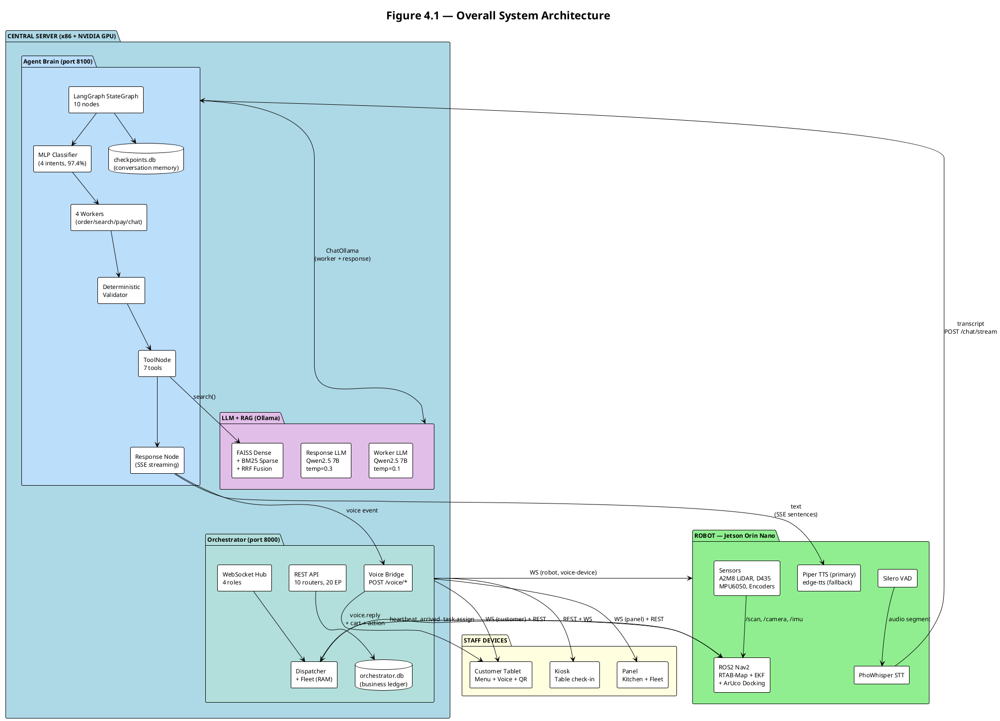
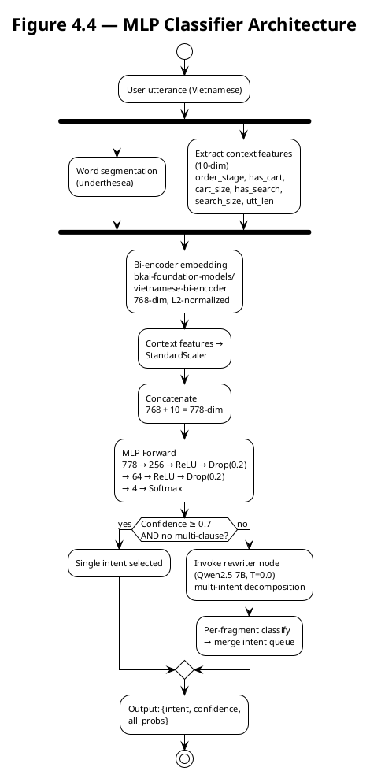
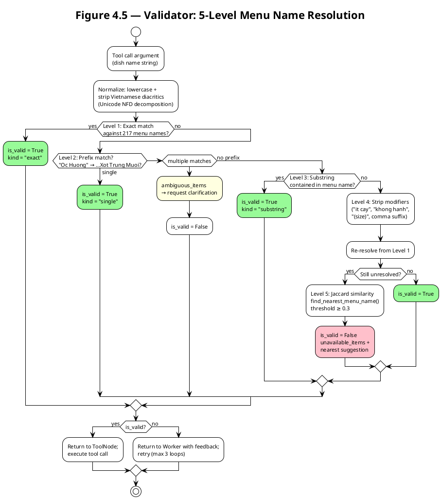
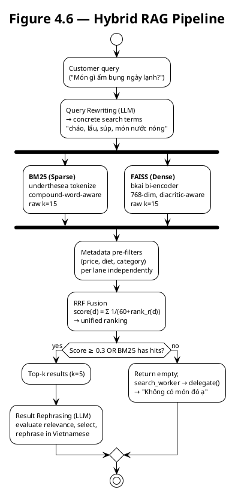
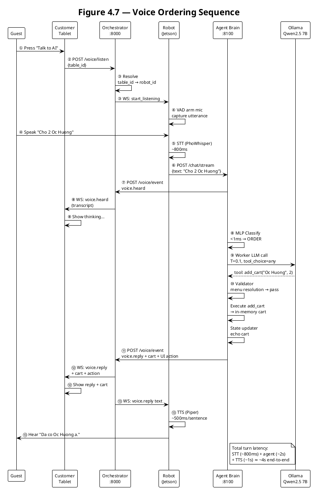
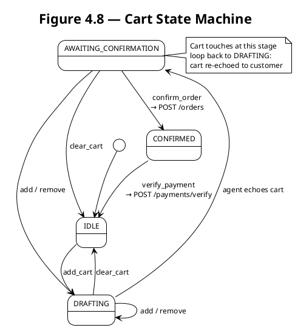
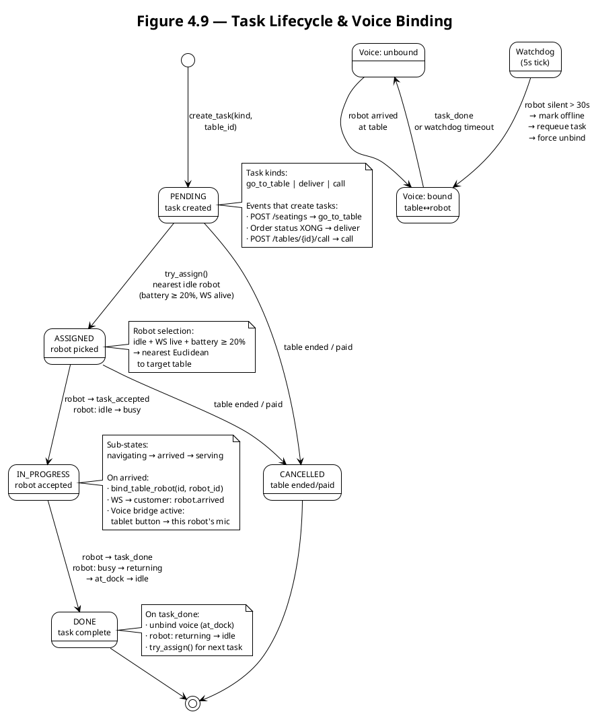
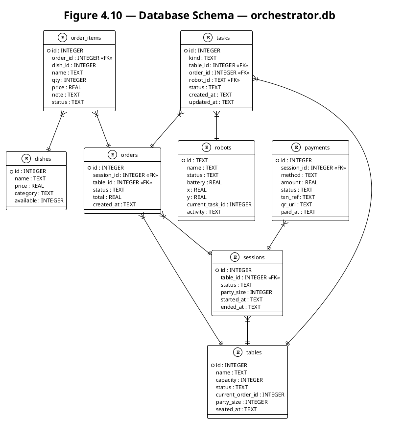

# Thesis Diagrams — AI Waiter Robot (Ch.4)

> All diagrams in PlantUML. Render via `plantuml` or plantuml.com.
> Caption format: `Figure X.Y — [Description] *(drawn by the group)*`

---

## Figure 4.1 — Overall System Architecture

> **Build this by hand** (draw.io / Figma / Illustrator). This is the first thing examiners see in Ch.4.
> The PlantUML below is a reference blueprint — not the final visual. Produce a cleaner hand-drawn version.

### Layout Spec

**3 horizontal tiers.** Tier 1 is the largest (~55% height). Tier 2 spans full width in two columns. Tier 3 is the VPN overlay.

```
┌──────────────────────────────────────────────────────────────────┐
│  TIER 1 — CENTRAL SERVER (x86 PC + NVIDIA GPU)                   │
│  [Ollama runs here. FastAPI on :8000. Agent on :8100.]           │
│                                                                  │
│  ┌───────────────────┐  ┌──────────────────┐  ┌───────────────┐ │
│  │  Agent Brain      │  │  Orchestrator    │  │  LLM + RAG    │ │
│  │  (Port 8100)      │  │  (Port 8000)     │  │  (Ollama)     │ │
│  │                   │  │                  │  │               │ │
│  │  LangGraph        │  │  FastAPI REST    │  │  Qwen2.5 7B   │ │
│  │  · MLP Classifier │◄─┤  · /menu         │─►│  × 2 models   │ │
│  │  · 4 Workers      │  │  · /orders       │  │  (worker,     │ │
│  │  · Validator      │  │  · /payments     │  │   response)   │ │
│  │  · 7 Tools        │──┤  · /tables       │  │               │ │
│  │  · Response Node  │  │  · /robots       │  │  FAISS Index  │ │
│  │                   │  │  · /tasks        │  │  217 dishes   │ │
│  │  SSE Streaming    │  │  · /voice/event  │  │  · BM25       │ │
│  │                   │  │  · /voice/listen │  │  · Dense      │ │
│  │                   │  │  · /voice/cancel │  │  · RRF Fusion │ │
│  │                   │  │                  │  │               │ │
│  │  (LangGraph       │  │  WebSocket Hub   │  │               │ │
│  │   StateGraph      │  │  · panel         │  │               │ │
│  │   + checkpointer) │  │  · customer      │  │               │ │
│  │                   │  │  · robot         │  │               │ │
│  │                   │  │  · voice-device  │  │               │ │
│  │                   │  │                  │  │               │ │
│  │                   │  │  Fleet +         │  │               │ │
│  │                   │  │  Dispatcher      │  │               │ │
│  └───────┬───────────┘  └────────┬─────────┘  └───────┬───────┘ │
│          │                       │                     │        │
│          │    POST /chat ───────►│                     │        │
│          │◄─── REST (CRUD) ──────│                     │        │
│          │───────────────────────┼────────────────────►│        │
│          │         search() tool │   ChatOllama        │        │
│          │                       │                     │        │
│  ┌───────┴───────────────────────┴─────────────────────┴──────┐ │
│  │                    SQLite (2 databases)                     │ │
│  │  orchestrator.db        │        checkpoints.db             │ │
│  │  · tables, sessions,    │        · LangGraph state          │ │
│  │    orders, payments,    │        · thread_id = session_id   │ │
│  │    robots, tasks, dishes│        · conversation memory      │ │
│  └────────────────────────────────────────────────────────────┘ │
└───────────────────────────┬──────────────────────────────────────┘
                            │
                    ┌───────┴────────┐
                    │  Netbird VPN   │
                    │  (overlay mesh)│
                    └───┬────────┬───┘
        ┌───────────────┘        └───────────────┐
        │                                        │
┌───────▼──────────────┐              ┌──────────▼──────────────┐
│ TIER 2 — ROBOT       │              │ TIER 2 — RESTAURANT     │
│ Jetson Orin Nano 8GB │              │ STAFF DEVICES           │
│                       │              │                         │
│  ┌─────────────────┐  │              │  ┌───────────────────┐  │
│  │ Voice Pipeline  │  │              │  │ Kiosk (Check-in)  │  │
│  │ Mic → SileroVAD │  │              │  │ Vue 3 SPA         │  │
│  │  → PhoWhisper   │  │              │  │ · Table grid      │  │
│  │  → Piper TTS    │  │              │  │ · Party size      │  │
│  └────────┬────────┘  │              │  │ · POST /seatings  │  │
│           │           │              │  └───────────────────┘  │
│  ┌────────▼────────┐  │              │                         │
│  │ ROS2 Nav2 Stack │  │              │  ┌───────────────────┐  │
│  │ · RTAB-Map      │  │              │  │ Customer Tablet   │  │
│  │ · Nav2 planner  │  │              │  │ Vue 3 + PrimeVue  │  │
│  │ · EKF odometry  │  │              │  │ · Menu browsing   │  │
│  │ · ArUco docking │  │              │  │ · Voice mirror    │  │
│  └────────┬────────┘  │              │  │ · Cart + Payment  │  │
│           │           │              │  └───────────────────┘  │
│  ┌────────▼────────┐  │              │                         │
│  │ Sensors         │  │              │  ┌───────────────────┐  │
│  │ · RPLiDAR A2M8  │  │              │  │ Panel (Kitchen +  │  │
│  │ · Realsense D435│  │              │  │ Fleet Dashboard)  │  │
│  │ · MPU6050 (IMU) │  │              │  │ · Kanban orders   │  │
│  │ · Hall encoders │  │              │  │ · Robot minimap   │  │
│  └─────────────────┘  │              │  │ · Table status    │  │
│                       │              │  └───────────────────┘  │
│  WS: voice-device     │              │                         │
│  WS: robot            │              │  WS: customer           │
│                       │              │  WS: panel              │
└───────────────────────┘              └─────────────────────────┘
```

### Arrows & Protocols

| From | To | Protocol | What Flows |
|------|----|----------|------------|
| Agent | Orchestrator | REST (internal) | Agent POSTs voice events, reads session info |
| Agent | Ollama | ChatOllama API | 2 model calls: worker (T=0.1), response (T=0.3); classifier is MLP (deterministic, no LLM) |
| Agent | FAISS/BM25 | In-process | `search()` tool queries hybrid retriever (~15 ms) |
| Orchestrator | Robot WS | WebSocket | `task.assign`, `task.release` → robot; `heartbeat`, `arrived`, `task_done` ← robot |
| Orchestrator | Voice WS | WebSocket | `start_listening`, `cancel_listening` → Jetson mic |
| Orchestrator | Tablet WS | WebSocket | `voice.heard`, `voice.reply` (with cart, stage, UI action) |
| Orchestrator | Panel WS | WebSocket | `order.created/updated`, `table.updated`, `robot.updated`, `task.created` |
| Tablet | Orchestrator | REST | `GET /menu`, `POST /orders`, `POST /payments` |
| Tablet | Orchestrator | REST | `POST /voice/listen`, `POST /voice/cancel` |
| Kiosk | Orchestrator | REST | `POST /seatings`, `GET /tables` |
| Panel | Orchestrator | REST | `GET /orders`, `GET /robots`, `PATCH /orders`, `GET /layout` |
| Jetson → Agent | REST | `POST /chat/stream` (via voice_device.py main loop) |
| Agent → Tablet | Via Orchestrator | Voice mirror: `POST /voice/event` → fan-out to `role=customer` WS |

### Color Palette Suggestion

| Element | Color | Hex |
|---------|-------|-----|
| Central Server box | Light blue | `#E3F2FD` border `#1976D2` |
| Agent Brain | Blue | `#BBDEFB` |
| Orchestrator | Teal | `#B2DFDB` |
| Ollama + RAG | Purple | `#E1BEE7` |
| SQLite cylinders | Gray | `#ECEFF1` |
| Robot box | Light green | `#E8F5E9` border `#388E3C` |
| Staff device boxes | Light orange | `#FFF3E0` border `#F57C00` |
| VPN cloud | Yellow | `#FFF9C4` |
| Arrows | Dark gray | `#37474F` with protocol labels in `#D32F2F` |

### Numbered Data Flow Overlay

Add 7 small numbered circles tracing the voice ordering flow:

```
① Guest taps "Talk to AI" on tablet
② POST /voice/listen → resolves table_id → robot_id → Jetson mic
③ VAD captures speech → PhoWhisper STT → transcript
④ POST /chat/stream → Agent: MLP classify → worker → validator → tools
⑤ Order stored via POST /orders (confirm_order tool)
⑥ Panel WS receives order.created → kitchen Kanban updates
⑦ Voice reply + cart + UI action → tablet WS → TTS plays
```

### Suggested Tools

- **draw.io** (diagrams.net) — free, good for block diagrams with database cylinders, icons
- **Figma** — better typography and gradient fills, more "impressive" final look
- **Excalidraw** — hand-drawn feel can look clean if done well (but less precise)
- Export as **SVG** then embed in LaTeX/Word for sharp rendering at any scale

---

### Reference PlantUML (for structure, not to render)



---

## Figure 4.2 — Conversational Agent: 5-Stage Pipeline

> **Build this by hand.** This is the conceptual overview — the examiner sees this first in §4.5, before diving into the graph topology (§4.3), classifier architecture (§4.4), or validator (§4.5). It establishes the 5-stage mental model: Understanding → Decision → Validation → Execution → Response.

### Layout Spec (vertical pipeline, 5 boxes, left-to-right flow)

```
 ┌──────────────────────────────────────────────────────────────────┐
 │                           AgentState (shared typed state)         │
 └──────────────────────────────────────────────────────────────────┘
 
 User utterance (Vietnamese text)
        │
        ▼
 ┏━━━━━━━━━━━━━━━━━━━━━━━━━━━━━━━━━━━━━━━━━━━━━━━━━━━━━━━━━━━━━━━━━┓
 ┃  STAGE I — UNDERSTANDING                                         ┃
 ┃  Intent Classification                                           ┃
 ┃                                                                  ┃
 ┃  Utterance → word segmentation → bi-encoder (768-dim)            ┃
 ┃  + context features (10-dim) → MLP (778→256→64→4)                ┃
 ┃  → {ORDER, SEARCH, PAYMENT, CHAT}                                ┃
 ┃  Latency: <1 ms · Deterministic · 97.4% accuracy                 ┃
 ┗━━━━━━━━━━━━━━━━━━━━━━━━━━━━┯━━━━━━━━━━━━━━━━━━━━━━━━━━━━━━━━━━━━┛
                              │ intent(s)
                              ▼
 ┏━━━━━━━━━━━━━━━━━━━━━━━━━━━━━━━━━━━━━━━━━━━━━━━━━━━━━━━━━━━━━━━━━┓
 ┃  STAGE II — DECISION                                             ┃
 ┃  Tool-Calling LLM (Qwen2.5 7B, T=0.1, num_ctx=16384)             ┃
 ┃                                                                  ┃
 ┃  ORDER  → {add_cart, remove_cart, clear_cart, confirm_order}     ┃
 ┃  SEARCH → {search, delegate}                                     ┃
 ┃  PAYMENT → request_payment  (deterministic, no LLM)              ┃
 ┃  CHAT   → builds ChatResponseContext  (pure function, no LLM)    ┃
 ┃  Latency: ~1-3 s (LLM calls) · Delegation escape hatch           ┃
 ┗━━━━━━━━━━━━━━━━━━━━━━━━━━━━┯━━━━━━━━━━━━━━━━━━━━━━━━━━━━━━━━━━━━┛
                              │ tool call(s)
                              ▼
 ┏━━━━━━━━━━━━━━━━━━━━━━━━━━━━━━━━━━━━━━━━━━━━━━━━━━━━━━━━━━━━━━━━━┓
 ┃  STAGE III — VALIDATION                                          ┃
 ┃  Deterministic Validator (pure Python, no LLM)                   ┃
 ┃                                                                  ┃
 ┃  5-level menu name resolution:                                   ┃
 ┃    exact match → prefix match → ambiguous? → modifier strip      ┃
 ┃    → off-menu with nearest suggestion                             ┃
 ┃  State checks: cart consistency, order stage gating              ┃
 ┃  Circuit breaker: max 3 retries with corrective feedback         ┃
 ┗━━━━━━━━━━━━━━━━━━━━━━━━━━━━┯━━━━━━━━━━━━━━━━━━━━━━━━━━━━━━━━━━━━┛
                              │ validated tool calls
                              ▼
 ┏━━━━━━━━━━━━━━━━━━━━━━━━━━━━━━━━━━━━━━━━━━━━━━━━━━━━━━━━━━━━━━━━━┓
 ┃  STAGE IV — EXECUTION                                            ┃
 ┃  Tools + State Management                                        ┃
 ┃                                                                  ┃
 ┃  In-memory: add_cart, remove_cart, clear_cart                    ┃
 ┃  Backend API: confirm_order → POST /orders                       ┃
 ┃             request_payment → POST /payments                     ┃
 ┃             verify_payment → POST /payments/verify               ┃
 ┃  RAG: search → FAISS + BM25 + RRF                                ┃
 ┃  Cart state machine: IDLE → DRAFTING → AWAIT_CONF → CONFIRMED    ┃
 ┗━━━━━━━━━━━━━━━━━━━━━━━━━━━━┯━━━━━━━━━━━━━━━━━━━━━━━━━━━━━━━━━━━━┛
                              │ ResponseContext (typed struct)
                              ▼
 ┏━━━━━━━━━━━━━━━━━━━━━━━━━━━━━━━━━━━━━━━━━━━━━━━━━━━━━━━━━━━━━━━━━┓
 ┃  STAGE V — RESPONSE                                              ┃
 ┃  Output Generation                                                ┃
 ┃                                                                  ┃
 ┃  Typed dispatch: templates (orders, payments, errors)            ┃
 ┃                + LLM (search results, free-form chat, T=0.3)     ┃
 ┃  Grounding guard: post-gen check against retrieved dishes        ┃
 ┃  CJK sanitizer: strips non-Vietnamese characters                 ┃
 ┃  SSE streaming: sentence-level → TTS playback                    ┃
 ┗━━━━━━━━━━━━━━━━━━━━━━━━━━━━━━━━━━━━━━━━━━━━━━━━━━━━━━━━━━━━━━━━━┛
        │
        ▼
  Vietnamese spoken reply → Piper TTS → speaker
  + JSON: {ui_action, cart, order_confirmed}
```

### Color Zones

| Stage | Color | Hex |
|-------|-------|-----|
| Understanding | Blue | `#E3F2FD` |
| Decision | Purple | `#F3E5F5` |
| Validation | Red/Orange | `#FBE9E7` |
| Execution | Green | `#E8F5E9` |
| Response | Teal | `#E0F2F1` |

---

## Figure 4.3 — LangGraph Agent StateGraph

> **Build this by hand.** Full-page diagram showing the 10-node StateGraph topology. Replaces the old "3-stage" diagram — the correct flow is: MLP classifier → worker → validator → tools → state_updater → (loop or) state_outcome → response_node.

### Layout Spec (top-down with 3 lanes)

```
┌─────────────────────────────────────────────────────────────────┐
│                     AgentState (TypedDict)                       │
│  messages │ active_cart │ order_stage │ current_intents │        │
│  shown_dishes │ search_context │ is_valid │ loop_count │ ...    │
│  (shared typed state flows through every node)                   │
└────────────────────────────┬────────────────────────────────────┘
                             │
┌────────────────────────────┼────────────────────────────────────┐
│  LANE 1: CLASSIFY          │                                    │
│                            ▼                                    │
│  ┌──────────────────────────────────────────────────────────┐  │
│  │              MLP Classifier Node                          │  │
│  │                                                           │  │
│  │  Utterance → [bi-encoder 768-dim] + [10 context features] │  │
│  │           → 778-dim → MLP(256→64→4) → {intent, conf}     │  │
│  │                                                           │  │
│  │  Fast path (≥0.7 conf): single intent                     │  │
│  │  Rewriter path (<0.7 conf or multi-clause): decompose     │  │
│  │  → per-fragment classify → merged intent queue            │  │
│  │                                                           │  │
│  │  Latency: <1 ms (MLP) or ~2 s (with rewriter LLM)        │  │
│  │  Accuracy: 97.4% (holdout), 95.6% (45-case eval)         │  │
│  └───────────────────────┬──────────────────────────────────┘  │
│                          │ current_intents = [ORDER, PAYMENT]  │
│                          ▼                                      │
├─────────────────────────────────────────────────────────────────┤
│  LANE 2: EXECUTE (per intent, sequential)                       │
│                                                                 │
│   ┌──────────┐  ┌──────────┐  ┌────────────┐  ┌──────────┐    │
│   │  ORDER   │  │  SEARCH  │  │  PAYMENT   │  │   CHAT   │    │
│   │  Worker  │  │  Worker  │  │  Dispatch  │  │  Worker  │    │
│   │          │  │          │  │(determin.) │  │(pure fn) │    │
│   │ LLM call │  │ LLM call │  │            │  │          │    │
│   │ T=0.1    │  │ T=0.1    │  │ emits      │  │ builds   │    │
│   │ tool_cho-│  │ tool_cho-│  │ request_   │  │ ChatResp-│    │
│   │ ice=any  │  │ ice=any  │  │ payment    │  │ onseCont-│    │
│   │ 5 tools  │  │ 2 tools  │  │            │  │ ext      │    │
│   └────┬─────┘  └────┬─────┘  └─────┬──────┘  └────┬─────┘    │
│        │             │              │               │         │
│        └─────────────┼──────────────┘               │         │
│                      ▼                              │         │
│        ┌─────────────────────────┐                  │         │
│        │   Deterministic         │◄── retry (≤3×) ──┘         │
│        │   Validator (no LLM)    │                             │
│        │                         │                             │
│        │  · Menu name resolution │                             │
│        │  · Off-menu detection   │                             │
│        │  · Ambiguity detection  │                             │
│        │  · Cart consistency     │                             │
│        │  · Modifier stripping   │                             │
│        └───────────┬─────────────┘                             │
│                    │ is_valid=True              circuit breaker │
│                    ▼                              (loop ≥3)    │
│        ┌─────────────────────────┐               ──→ state_    │
│        │   ToolNode (7 tools)    │                  outcome    │
│        │                         │                             │
│        │  search() → RAG         │                             │
│        │  add/remove/clear_cart  │                             │
│        │  confirm_order → REST   │                             │
│        │  request_payment → REST │                             │
│        │  verify_payment → REST  │                             │
│        │  delegate()             │                             │
│        └───────────┬─────────────┘                             │
│                    │ ToolMessage                                │
│                    ▼                                            │
│        ┌─────────────────────────┐                             │
│        │   State Updater         │                             │
│        │  · Update active_cart   │                             │
│        │  · Set UI action        │                             │
│        │  · Advance order_stage  │                             │
│        │  · Update shown_dishes  │                             │
│        │  · Pop intent queue     │◄─────────────────────┐      │
│        └───────────┬─────────────┘                      │      │
│                    │                                    │      │
│         queue empty? ──── yes ─────▶ (proceed)         │      │
│                    │                                    │      │
│                    no ───→ route to next worker ────────┘      │
│                                                                 │
├─────────────────────────────────────────────────────────────────┤
│  LANE 3: RESPOND                                                │
│                                                                 │
│   ┌─────────────────────────┐                                   │
│   │   State Outcome         │                                   │
│   │  · Build typed          │                                   │
│   │    ResponseContext      │                                   │
│   │  · Reset per-turn       │                                   │
│   │    ephemeral fields     │                                   │
│   └───────────┬─────────────┘                                   │
│               │                                                 │
│               ▼                                                 │
│   ┌─────────────────────────┐                                   │
│   │   Response Node         │                                   │
│   │                         │                                   │
│   │  Templates (deterministic│                                  │
│   │    confirm, error, etc) │                                   │
│   │                         │                                   │
│   │  OR                     │                                   │
│   │                         │                                   │
│   │  LLM stream (search     │                                   │
│   │    results, free chat)  │                                   │
│   │  T=0.3                  │                                   │
│   │  → _ground_reply()      │                                   │
│   │  → _sanitize_sentence() │                                   │
│   │  → SSE sentence stream  │                                   │
│   └─────────────────────────┘                                   │
│               │                                                 │
│               ▼                                                 │
│        Vietnamese AIMessage                                     │
│        + JSON: ui_action, stage, cart                           │
└─────────────────────────────────────────────────────────────────┘
```

### Edge Routing Table

| From → To | Condition |
|-----------|-----------|
| Classifier → ORDER Worker | `intent == ORDER \|\| ORDER_CONFIRM` |
| Classifier → SEARCH Worker | `intent == SEARCH` |
| Classifier → PAYMENT Dispatch | `intent == PAYMENT` |
| Classifier → CHAT Worker | `intent == CHAT` or empty queue |
| Worker → Validator | LLM produced non-delegate tool call |
| Worker → CHAT Worker | LLM produced only `delegate()` (escape hatch) |
| Validator → ToolNode | `is_valid == True` |
| Validator → Same Worker | `is_valid == False` AND `loop_count < 3` (retry with `feedback`) |
| Validator → State Outcome | `loop_count >= 3` (circuit breaker) |
| ToolNode → State Updater | Tool execution complete |
| State Updater → Next Worker | Intent queue not empty after pop |
| State Updater → State Outcome | Intent queue empty (all intents processed) |
| CHAT Worker → State Outcome | Direct (bypasses validator + tools) |
| State Outcome → Response Node | Unconditional |
| Response Node → END | Unconditional |

### Special Paths

- **Multi-intent loop:** curved dashed arrow from State Updater back to the appropriate worker, labeled "intent queue not empty"
- **Retry loop:** dashed arrow from Validator back to Worker, labeled "feedback, max 3×"
- **Circuit breaker:** dashed arrow from Validator to State Outcome, labeled "loop ≥ 3 → apology response"
- **Delegate path:** ORDER/SEARCH Worker → CHAT Worker when the LLM calls `delegate(reason)`

### Color Zones

| Lane | Color | Contains |
|------|-------|----------|
| **Classify** | Blue (`#E3F2FD`) | MLP Classifier node with context features breakdown |
| **Execute** | Green (`#E8F5E9`) | 4 Workers → Validator → ToolNode → State Updater, multi-intent loop |
| **Respond** | Orange (`#FFF3E0`) | State Outcome → Response → output |

### Footnotes

- "SQLite Checkpointer: `thread_id = session_id`" at bottom-left
- "Circuit breaker: max 3 retry loops per turn" at bottom-right
- Latency annotations: "<1 ms" (classifier), "~1-3 s" (LLM calls), "~2-4 s" (total turn)

---

### Reference PlantUML

```plantuml
@startuml
!theme plain
skinparam backgroundColor #FFFFFF
skinparam defaultFontSize 11

title Figure 4.3 — LangGraph StateGraph (10 nodes)

package "CLASSIFY" as S1 #E3F2FD {
  state "MLP Classifier\n778-dim → 4-class\n<1 ms, 97.4% acc" as classifier
  state "Rewriter\n(multi-intent\ndecompose)" as rewriter
  classifier --> rewriter : low conf or\nmulti-clause
}

package "EXECUTE" as S2 #E8F5E9 {
  state "ORDER Worker\nLLM: T=0.1\ntool_choice=any\n5 CRUD tools" as ow
  state "SEARCH Worker\nLLM: T=0.1\ntool_choice=any\nsearch + delegate" as sw
  state "PAYMENT Dispatch\nDeterministic\nno LLM call" as pd
  state "CHAT Worker\nPure function\nno LLM, no tool" as cw
  
  state "Validator\n5-level menu res.\nno LLM" as val
  state "ToolNode\n7 tools\nsearch, cart CRUD,\nconfirm, pay, verify" as tools
  state "State Updater\nupdate cart/stage\npop intent queue\nshown_dishes" as upd
}

package "RESPOND" as S3 #FFF3E0 {
  state "State Outcome\nbuild ResponseContext\nreset per-turn fields" as so
  state "Response Node\ntemplate or LLM stream\n+ grounding guard\n+ CJK sanitizer\n→ SSE sentences" as resp
}

state "START" as s
state "END" as e

' Stage 1
s --> classifier

' Worker routing (from classifier and rewriter)
classifier --> ow : ORDER / CONFIRM
classifier --> sw : SEARCH
classifier --> pd : PAYMENT
classifier --> cw : CHAT
rewriter --> ow : per-fragment
rewriter --> sw : per-fragment
rewriter --> pd : per-fragment
rewriter --> cw : per-fragment

' Tool workers → validator
ow --> val : has tool call
sw --> val : has tool call
pd --> val : has tool call

' Escape hatches
ow --> cw : only delegate
sw --> cw : only delegate
cw --> so : (bypass)

' Validator routing
val --> tools : is_valid
val --> ow : retry (≤3) with feedback
val --> so : circuit breaker (≥3)

' Tools → updater
tools --> upd

' Updater → next worker (multi-intent loop) or outcome
upd --> ow : more intents
upd --> sw : more intents
upd --> pd : more intents
upd --> so : intent queue empty

' Finalize
so --> resp
resp --> e

note right of upd
  **Multi-intent loop:**
  pops front of current_intents[]
  → remaining intents → back to worker
  → empty → proceed to response
end note

note bottom of val
  **Validator guards:**
  · 5-level menu name resolution
  · Off-menu detection + suggestion
  · Ambiguity detection (e.g. 11 "Oc Huong")
  · Cart state consistency checks
  · Modifier stripping ("it cay", "khong hanh")
  · Max 3 retry → circuit breaker
end note

@enduml
```

---

## Figure 4.4 — MLP Classifier Architecture

> **Build this by hand.** Replaces the old "Two-Tier Hybrid Router" — the active router is now a trained MLP classifier, not semantic centroids + SLM fallback.

### Layout Spec (horizontal pipeline)

```
  User utterance
       │
       ▼
  ┌──────────────┐    ┌──────────────────┐
  │ Word         │    │ Context Features │
  │ Segmentation │    │ (10-dim)         │
  │ (underthesea)│    │                  │
  └──────┬───────┘    │ order_stage (5)  │
         │            │ has_cart         │
         ▼            │ cart_size        │
  ┌──────────────┐    │ has_search_ctx   │
  │ Bi-Encoder   │    │ search_size      │
  │ bkai-...     │    │ utterance_length │
  │ 768-dim      │    └────────┬─────────┘
  │ L2-norm'd    │             │
  └──────┬───────┘             │
         │                     │
         └──────────┬──────────┘
                    │ concat
                    ▼
            ┌───────────────┐
            │  778-dim      │
            └───────┬───────┘
                    │
                    ▼
            ┌───────────────┐
            │ Linear: 256   │
            │ ReLU          │
            │ Dropout(0.2)  │
            └───────┬───────┘
                    │
                    ▼
            ┌───────────────┐
            │ Linear: 64    │
            │ ReLU          │
            │ Dropout(0.2)  │
            └───────┬───────┘
                    │
                    ▼
            ┌───────────────┐
            │ Linear: 4     │
            │ Softmax       │
            └───────┬───────┘
                    │
       ┌────────────┼────────────┐
       ▼            ▼            ▼
    ORDER        SEARCH       PAYMENT       CHAT
   (0.92)       (0.05)       (0.02)       (0.01)
```

### Training Details (as annotation boxes)

```
┌─────────────────────────────────┐
│ Training Config                 │
│ · 3,712 synthetic utterances    │
│ · 80/20 stratified split        │
│ · CrossEntropyLoss (weighted)   │
│ · Adam (lr=1e-3, wd=1e-4)      │
│ · Early stopping (patience=10)  │
│ · Batch size: 64, Epochs: 50    │
│ · GPU-free training (~2 min)    │
└─────────────────────────────────┘

┌─────────────────────────────────┐
│ Inference Pipeline              │
│ 1. word_segment(utterance)      │
│ 2. encode → 768-dim embedding   │
│ 3. extract 10 context features  │
│ 4. StandardScaler → normalize   │
│ 5. concat → 778-dim vector      │
│ 6. model.forward → softmax      │
│ 7. argmax + confidence          │
│                                 │
│ Latency: <1 ms (deterministic)  │
│ Checkpoint: saved/model.pt      │
└─────────────────────────────────┘
```

### Accuracy (annotation)

```
┌──────────────────────────────────────┐
│ Results                              │
│ · 97.4% on holdout test (39 cases)   │
│ · 95.6% on 45-case eval set          │
│ · Fast path (≥0.7 conf): ~85% of    │
│   utterances skip the rewriter       │
│ · Rewriter path (<0.7 or multi-      │
│   clause): ~15% of utterances        │
└──────────────────────────────────────┘
```



---

## Figure 4.5 — Deterministic Validator: 5-Level Menu Resolution

> **Build this by hand.** Flowchart. This is a major contribution claim in §4.5.4 — the validator catches hallucinated tool call arguments before they reach external systems.

### Layout Spec (vertical flowchart)

```
  Tool call argument (dish name string)
              │
              ▼
    ╔═════════════════════╗
    ║ LEVEL 1: Exact      ║──── yes ──→ name → is_valid=True
    ║ Normalize + match   ║
    ║ against 217 names   ║
    ╚════════╤════════════╝
             │ no
             ▼
    ╔═════════════════════╗
    ║ LEVEL 2: Prefix      ║── single ──→ resolved name → is_valid=True
    ║ Partial utterances   ║
    ║ "Oc Huong" → "Oc     ║── multiple ──→ ambiguous_items → request clarification
    ║ Huong Xot Trung Muoi"║
    ╚════════╤════════════╝
             │ no match
             ▼
    ╔═════════════════════╗
    ║ LEVEL 3: Substring   ║──── yes ──→ auto-resolved → is_valid=True
    ║ Contained in any     ║
    ║ menu name?           ║
    ╚════════╤════════════╝
             │ no match
             ▼
    ╔═════════════════════╗
    ║ LEVEL 4: Modifier    ║──────────→ strip + retry from Level 1
    ║ Strip "it cay",      ║
    ║ "khong hanh",        ║
    ║ "(size)", etc.       ║
    ╚════════╤════════════╝
             │ still no match after stripping
             ▼
    ╔═════════════════════╗
    ║ LEVEL 5: Off-menu    ║
    ║ Jaccard similarity   ║
    ║ to find nearest name ║──→ unavailable_items + nearest suggestion
    ║ threshold ≥ 0.3      ║──→ is_valid=False → feedback → retry worker
    ╚═════════════════════╝

  Additional checks (applied per tool call):
    · remove_cart: verify name exists in active_cart (subset match)
    · clear_cart: reject if cart already empty
    · confirm_order: enforce stage == AWAITING_CONFIRMATION + non-empty cart
    · request_payment: ensure table_id present
    · Additive-turn detection: keywords "thêm", "nữa" → restore cart before add
    · Mixed-turn handling: cart tools + confirm → strip confirm, re-route
```



---

## Figure 4.6 — Hybrid RAG Pipeline

> **Build this by hand.** Shows the rewrite→retrieve→fuse→filter→rephrase closed loop.

### Layout Spec (pipeline, left-to-right)

```
  Customer query ("Món gì ấm bụng cho ngày lạnh?")
       │
       ▼
  ┌───────────────────────────────────────────┐
  │  Query Rewriting (LLM)                    │
  │  "ấm bụng ngày lạnh" → "cháo, lẩu, súp, │
  │  món nước nóng"                           │
  └────────────────────┬──────────────────────┘
                       │ rewritten terms
          ┌────────────┴────────────┐
          ▼                         ▼
  ┌───────────────┐        ┌───────────────┐
  │  BM25 Sparse  │        │  FAISS Dense  │
  │               │        │               │
  │ underthesea   │        │ bkai bi-enc.  │
  │ segmentation  │        │ 768-dim       │
  │ "bún bò Huế"  │        │ semantic      │
  │ = 1 token     │        │ similarity    │
  │               │        │               │
  │ raw k=15      │        │ raw k=15      │
  └───────┬───────┘        └───────┬───────┘
          │                        │
          ▼                        ▼
  ┌───────────────────────────────────────────┐
  │  Metadata Pre-Filters                      │
  │  Applied independently to each lane:       │
  │  max_price, min_price, diet_type, category │
  └────────────────────┬──────────────────────┘
                       │
                       ▼
  ┌───────────────────────────────────────────┐
  │  RRF Fusion                                │
  │  score(d) = Σ 1/(60 + rank_r(d))           │
  │  → unified ranking                         │
  └────────────────────┬──────────────────────┘
                       │
                       ▼
  ┌───────────────────────────────────────────┐
  │  Score Threshold (0.3)                     │
  │  Below threshold AND no BM25 hits?         │
  │  → retriever returns empty                 │
  │  → search_worker calls delegate()          │
  │  → CHAT worker: "Dạ, quán không có ạ"     │
  └────────────────────┬──────────────────────┘
                       │ (results exist)
                       ▼
  ┌───────────────────────────────────────────┐
  │  Result Rephrasing (LLM)                   │
  │  "Dạ, cho ngày lạnh quán có Lẩu Cá Tầm,  │
  │   Cháo Hải Sản, và Súp Cua ạ."            │
  └───────────────────────────────────────────┘
```

### Multi-Search: comma-split (annotation)

```
  Query with commas: "ốc, tôm, cua"
  → split: ["ốc", "tôm", "cua"]
  → 3 parallel searches → deduplicated by dish name
  → merged top-6
```



---

## Figure 4.7 — Voice Ordering End-to-End Sequence

> **Build this by hand.** UML sequence diagram for the core user-facing flow (§4.3.4 Flow a). 5 lifelines, 13 numbered steps.

### Layout Spec

```
  Customer    Customer     Orchestrator    Robot        Agent
  (guest)     Tablet       (server)        (Jetson)     Brain        Ollama
    │            │             │              │            │            │
    │ ① Press    │             │              │            │            │
    │ "Talk to   │             │              │            │            │
    │  AI"       │             │              │            │            │
    │───────────►│             │              │            │            │
    │            │ ② POST      │              │            │            │
    │            │ /voice/listen│             │            │            │
    │            │ {table_id}   │              │            │            │
    │            │─────────────►│              │            │            │
    │            │              │ ③ resolve    │            │            │
    │            │              │ table→robot  │            │            │
    │            │              │──────────────┤            │            │
    │            │              │ ③ WS:        │            │            │
    │            │              │ start_listening           │            │
    │            │              │─────────────►│            │            │
    │ ④ Speak    │              │              │            │            │
    │ "Cho 2 Oc  │              │              │            │            │
    │  Huong"    │              │              │ VAD arm    │            │
    │            │              │              │ (1.5s sil. │            │
    │            │              │              │  timeout)  │            │
    │            │              │              │            │            │
    │            │              │              │ ⑤ STT      │            │
    │            │              │              │ PhoWhisper │            │
    │            │              │              │ ~800ms     │            │
    │            │              │              │            │            │
    │            │              │              │ ⑥ POST     │            │
    │            │              │              │ /chat/stream│           │
    │            │              │              │ {text}─────►│            │
    │            │              │◄── ⑦ POST ───│            │            │
    │            │              │ /voice/event│             │            │
    │            │◄──⑧ WS: ────│ voice.heard │             │            │
    │            │ voice.heard │ (transcript)│             │            │
    │            │              │              │            │ ⑧ MLP      │
    │            │              │              │            │ classify   │
    │            │              │              │            │ <1ms       │
    │            │              │              │            │            │
    │            │              │              │            │ ⑨ Worker   │
    │            │              │              │            │ LLM call──►│
    │            │              │              │            │ ⑨ Qwen2.5 │
    │            │              │              │            │ T=0.1      │
    │            │              │              │            │ ~2s        │
    │            │              │              │            │◄───────────│
    │            │              │              │            │            │
    │            │              │              │            │ ⑩ Validator│
    │            │              │              │            │ add_cart   │
    │            │              │              │            │ → pass     │
    │            │              │              │            │            │
    │            │              │◄── ⑪ POST ───│            │            │
    │            │              │ /voice/event│             │            │
    │            │◄──⑫ WS: ────│ voice.reply │             │            │
    │            │ voice.reply │ + cart sync │             │            │
    │ ⑫ Tablet  │ + UI action │              │            │            │
    │ shows AI   │              │              │            │            │
    │ reply +    │              │           ⑬ WS: voice.reply text       │
    │ cart update│              │─────────────►│ ⑬ TTS     │            │
    │            │              │              │ Piper play │            │
    │ ⑫ Hear     │              │              │ ~500ms/sent│            │
    │ "Dạ có     │              │              │            │            │
    │  Ốc Hương" │              │              │            │            │
```

### Timing Annotations (along bottom)
```
  │←────── ~500ms button→WS ──────│← ~800ms STT ──│← ~50ms POST ──│← ~2-3s agent ──│← ~1s TTS ──│
  │◄──────────────────────── Total: ~4-6 seconds ────────────────────────────────►│
```



---

## Figure 4.8 — Cart State Machine



---

## Figure 4.9 — Task Lifecycle & Voice Binding

> Combines fleet dispatcher task states with robot state side-effects and dynamic voice binding.



---

## Figure 4.10 — Database Schema (ERD)



---

## Figure 4.11 — WebSocket Hub: Four Role Types

```plantuml
@startuml
!theme plain
skinparam backgroundColor #FFFFFF
skinparam defaultFontSize 12

title Figure 4.11 — WebSocket Hub — Four Role Types

component "Orchestrator\n/ws endpoint" as Hub

package "role=customer" #E8F5E9 {
  [Tablet T1..T6\nfiltered by table_id] as Cust
}

package "role=panel" #FFF3E0 {
  [Kitchen Dashboard\norder queue]\nas Panel1
  [Fleet Dashboard\nrobot minimap]\nas Panel2
}

package "role=robot" #BBDEFB {
  [Robot R1..R3\nbidirectional\ntask.assign ←\nheartbeat →] as Robot
}

package "role=voice-device" #F3E5F5 {
  [Robot Mic R1..R3\nserver→client only\nstart_listening →\ncancel_listening →] as Voice
}

Cust -- Hub
Panel1 -- Hub
Panel2 -- Hub
Robot -- Hub
Voice -- Hub

Robot <..> Voice : same robot_id\n→ dynamic table binding\nvia connection_manager

note right of Hub
  **Event catalog:**
  order.created | order.updated
  table.updated | robot.updated
  task.created  | task.updated
  voice.heard   | voice.reply
  
  **Voice bridge flow:**
  1. Tablet → POST /voice/listen {table_id}
  2. resolve table_id → robot_id
  3. WS → voice-device: start_listening
  4. Jetson captures, transcribes, posts to agent
  5. Agent → POST /voice/event
  6. WS → customer: voice.reply + cart + action
end note

@enduml
```

---

## Table 4.1 — Response Generation Decision Table

| ResponseContext | Condition | Method | Notes |
|-----------------|-----------|--------|-------|
| **Order** | Ambiguous items | Template | List all variants, ask customer to clarify |
| | Off-menu with suggestion | LLM stream | polite Vietnamese rewrite with alternatives |
| | Off-menu without suggestion | Template | Apology, item not available |
| | Status = error | Template | Generic error message |
| | tool = confirm_order | Template | Order confirmation with ID |
| | tool = remove_cart | Template | Removed reply + cart echo |
| | tool = clear_cart | Template | Cleared confirmation |
| | Default (add_cart success) | Template | Cart echo, ask for confirmation |
| **Search** | Error | Template | Apology |
| | No results | Template | "Không có món đó ạ" |
| | Results exist | LLM stream | List results naturally + _ground_reply() check |
| **Payment** | Any | Template | Amount + VietQR prompt or error |
| **Chat** | delegate: "xem lai" | Template | Cart echo (review order) |
| | Greeting detected | Template | Greeting |
| | Thanks detected | Template | Thanks |
| | Default | LLM stream | Free-form chat with curated memory + _ground_reply() |
| **Retry** | Loop ≥ 3 | Template | Apology, ask to repeat |

---

## Table 4.2 — Agent Turn Trace Example

Multi-intent utterance: *"Cho 2 Oc Huong roi tinh tien luon"* (ORDER + PAYMENT)

| Step | Node | Action | Output |
|------|------|--------|--------|
| 1 | MLP Classifier | embedding (768-d) + context (10-d) → MLP forward | `current_intents = ["ORDER", "PAYMENT"]` (rewriter path: multi-clause) |
| 2 | ORDER Worker | LLM → tool call | `add_cart(name="Ốc Hương Xốt Trứng Muối", qty=2)` |
| 3 | Validator | Resolve name against menu (Level 2: prefix match) | exact match → `is_valid = True` |
| 4 | ToolNode | Execute `add_cart` | `CartAddResult(status=success)` |
| 5 | State Updater | Update cart, update shown_dishes, pop intent | `active_cart = [{name, qty=2, price=85000}]`, queue → `["PAYMENT"]` |
| 6 | PAYMENT Dispatch | Deterministic emit | `request_payment(table_id="T1")` |
| 7 | Validator | table_id present | `is_valid = True` |
| 8 | ToolNode | Execute `request_payment` → POST /payments | `PaymentResult(amount=170000, qr_url=...)` |
| 9 | State Updater | Pop intent queue | queue → `[]` (empty) |
| 10 | State Outcome | Build `PaymentResponseContext` | Reset per-turn fields |
| 11 | Response | Template (payment) | "Dạ, tổng hóa đơn 170.000đ. Quét mã QR ạ." |

---

## Suggested Placement in Thesis

| Figure/Table | Section | Size | New/Updated |
|-------------|---------|------|:---:|
| Fig 4.1 — System Architecture | §4.3.1 | Full page | Updated (labels) |
| Fig 4.2 — Agent 5-Stage Pipeline | §4.5 (opening) | Full page | **NEW** |
| Fig 4.3 — LangGraph StateGraph | §4.5.1 | Full page | Updated (correct flow) |
| Fig 4.4 — MLP Classifier | §4.5.2 | Half page | **NEW** (replaces old router) |
| Fig 4.5 — Validator 5-Level Resolution | §4.5.4 | Half page | **NEW** |
| Fig 4.6 — Hybrid RAG Pipeline | §4.6.2 | Half page | Updated (removed gatekeeper) |
| Fig 4.7 — Voice Ordering Sequence | §4.3.4 | Full page | **NEW** |
| Fig 4.8 — Cart State Machine | §4.5.5 | Quarter page | Unchanged |
| Fig 4.9 — Task Lifecycle & Voice Binding | §4.7.4–5 | Half page | Updated (robot states + binding) |
| Fig 4.10 — Database Schema ERD | §4.7.6 | Half page | Updated (missing columns) |
| Fig 4.11 — WebSocket Hub | §4.7.2 | Half page | Unchanged |
| Table 4.1 — Response Decision Table | §4.5.6 | Half page | Updated |
| Table 4.2 — Agent Turn Trace | §4.5.1 | Half page | Updated (MLP router) |
