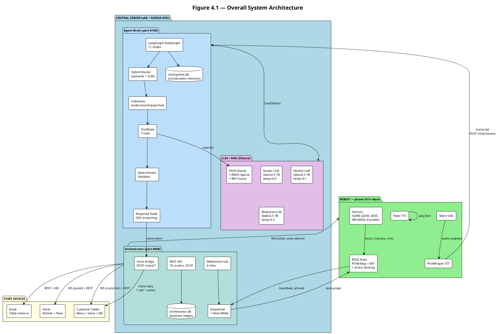
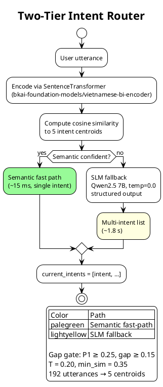
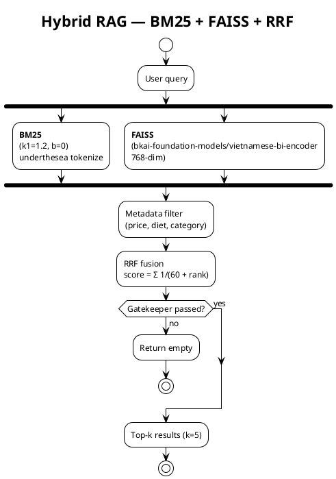
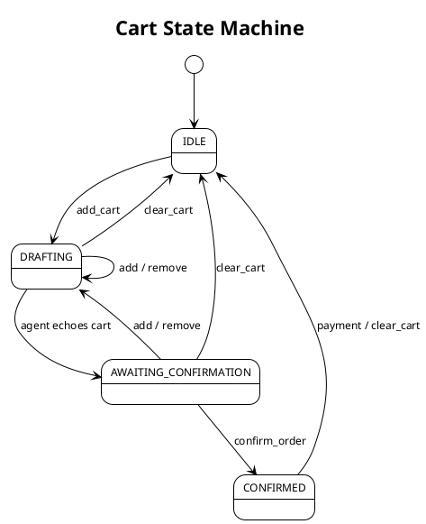
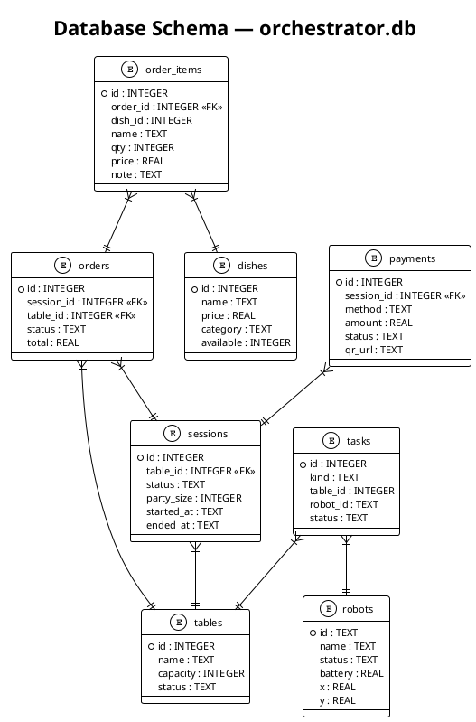
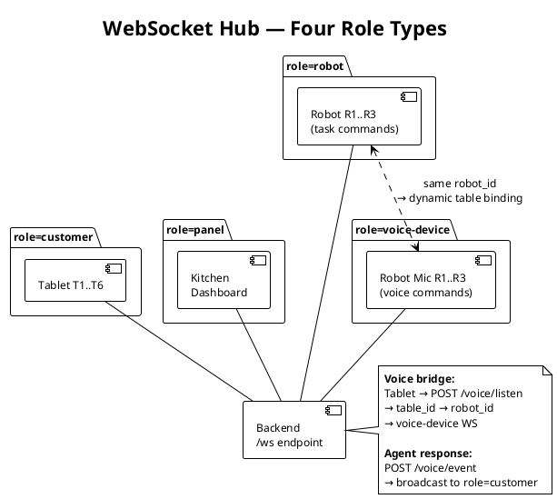
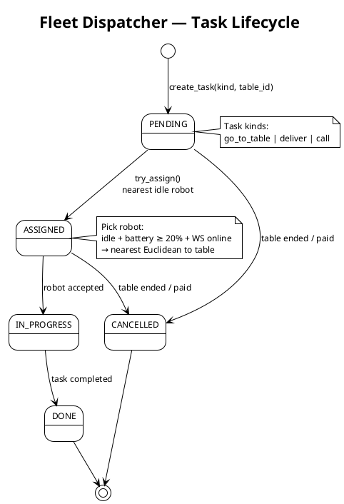

# Thesis Diagrams — AI Waiter Robot (Ch.4)

> All diagrams in PlantUML. Render via `plantuml` or plantuml.com.
> Caption format: `Figure X.Y — [Description] *(drawn by the group)*`

---

## Figure 4.1 — Overall System Architecture

> **Build this by hand** (draw.io / Figma / Illustrator). This is the first thing examiners see in Ch.4. Make it impressive with colors, icons, and clean layout.
> The PlantUML below is a detailed reference blueprint — not the final visual. Use it to understand what every box and arrow means, then produce a cleaner hand-drawn version.

### Layout Spec

**3 horizontal tiers** (top to bottom). Tier 1 is the largest (~55% height). Tier 2 spans full width. Tier 3 is the VPN overlay across all connections.

```
┌──────────────────────────────────────────────────────────────────┐
│  TIER 1 — CENTRAL SERVER (x86 PC + NVIDIA GPU)                   │
│  [Ollama runs here. FastAPI on :8000. Agent on :8100.]           │
│                                                                  │
│  ┌───────────────────┐  ┌──────────────────┐  ┌───────────────┐ │
│  │  Agent Brain      │  │  Orchestrator    │  │  LLM + RAG    │ │
│  │  (Port 8100)      │  │  (Port 8000)     │  │  (Ollama)     │ │
│  │                   │  │                  │  │               │ │
│  │  LangGraph        │  │  FastAPI REST    │  │  Qwen2.5 7B   │ │
│  │  · Hybrid Router  │◄─┤  · /menu         │─►│  × 3 models   │ │
│  │  · 4 Workers      │  │  · /orders       │  │  (router,     │ │
│  │  · Validator      │  │  · /payments     │  │   worker,     │ │
│  │  · 7 Tools        │──┤  · /tables       │  │   response)   │ │
│  │  · Response Node  │  │  · /robots       │  │               │ │
│  │                   │  │  · /tasks        │  │  FAISS Index  │ │
│  │  Response Node    │  │  · /voice/event  │  │  217 dishes   │ │
│  │  SSE Streaming    │  │  · /voice/listen │  │  · BM25       │ │
│  │                   │  │  · /voice/cancel │  │  · Dense      │ │
│  │                   │  │                  │  │  · RRF Fusion │ │
│  │  (LangGraph       │  │  WebSocket Hub   │  │               │ │
│  │   StateGraph      │  │  · panel         │  │               │ │
│  │   + checkpointer) │  │  · customer      │  │               │ │
│  │                   │  │  · robot         │  │               │ │
│  │                   │  │  · voice-device  │  │               │ │
│  │                   │  │                  │  │               │ │
│  │                   │  │  Fleet +         │  │               │ │
│  │                   │  │  Dispatcher      │  │               │ │
│  └───────┬───────────┘  └────────┬─────────┘  └───────┬───────┘ │
│          │                       │                     │        │
│          │    POST /chat ───────►│                     │        │
│          │◄─── REST (CRUD) ──────│                     │        │
│          │───────────────────────┼────────────────────►│        │
│          │         search() tool │   ChatOllama        │        │
│          │                       │                     │        │
│  ┌───────┴───────────────────────┴─────────────────────┴──────┐ │
│  │                    SQLite (2 databases)                     │ │
│  │  orchestrator.db        │        checkpoints.db             │ │
│  │  · tables, sessions,    │        · LangGraph state          │ │
│  │    orders, payments,    │        · thread_id = session_id   │ │
│  │    robots, tasks, dishes│        · conversation memory      │ │
│  └────────────────────────────────────────────────────────────┘ │
└───────────────────────────┬──────────────────────────────────────┘
                            │
                    ┌───────┴────────┐
                    │  Netbird VPN   │
                    │  (overlay mesh)│
                    └───┬────────┬───┘
        ┌───────────────┘        └───────────────┐
        │                                        │
┌───────▼──────────────┐              ┌──────────▼──────────────┐
│ TIER 2 — ROBOT       │              │ TIER 2 — RESTAURANT     │
│ Jetson Orin Nano 8GB │              │ STAFF DEVICES           │
│                       │              │                         │
│  ┌─────────────────┐  │              │  ┌───────────────────┐  │
│  │ Voice Pipeline  │  │              │  │ Kiosk (Check-in)  │  │
│  │ Mic → SileroVAD │  │              │  │ Vue 3 SPA         │  │
│  │  → PhoWhisper   │  │              │  │ · Table grid      │  │
│  │  → Piper TTS    │  │              │  │ · Party size      │  │
│  └────────┬────────┘  │              │  │ · POST /seatings  │  │
│           │           │              │  └───────────────────┘  │
│  ┌────────▼────────┐  │              │                         │
│  │ ROS2 Nav2 Stack │  │              │  ┌───────────────────┐  │
│  │ · RTAB-Map      │  │              │  │ Customer Tablet   │  │
│  │ · Nav2 planner  │  │              │  │ Vue 3 + PrimeVue  │  │
│  │ · EKF odometry  │  │              │  │ · Menu browsing   │  │
│  │ · ArUco docking │  │              │  │ · Voice mirror    │  │
│  └────────┬────────┘  │              │  │ · Cart + Payment  │  │
│           │           │              │  └───────────────────┘  │
│  ┌────────▼────────┐  │              │                         │
│  │ Sensors         │  │              │  ┌───────────────────┐  │
│  │ · RPLiDAR A2M8  │  │              │  │ Panel (Kitchen +  │  │
│  │ · Realsense D435│  │              │  │ Fleet Dashboard)  │  │
│  │ · MPU6050 (IMU) │  │              │  │ · Kanban orders   │  │
│  │ · Hall encoders │  │              │  │ · Robot minimap   │  │
│  └─────────────────┘  │              │  │ · Table status    │  │
│                       │              │  └───────────────────┘  │
│  WS: voice-device     │              │                         │
│  WS: robot            │              │  WS: customer           │
│                       │              │  WS: panel              │
└───────────────────────┘              └─────────────────────────┘
```

### Arrows & Protocols (reference for hand-drawing)

| From | To | Protocol | What Flows |
|------|----|----------|------------|
| Agent | Orchestrator | REST (internal) | `POST /chat`, `POST /chat/stream`; Agent reads session/table info |
| Orchestrator | Agent | REST (internal) | Agent creates orders, payments, voice events via OrchestratorClient |
| Agent | Ollama | ChatOllama API | 3 model calls: router, worker, response (temp=0.0/0.1/0.3) |
| Agent | FAISS/BM25 | In-process | `search()` tool queries hybrid retriever (~15 ms) |
| Orchestrator | Robot WS | WebSocket | `task.assign`, `task.release` → robot; `heartbeat`, `arrived`, `task_done` ← robot |
| Orchestrator | Voice WS | WebSocket | `start_listening`, `cancel_listening` → Jetson mic |
| Orchestrator | Tablet WS | WebSocket | `voice.heard`, `voice.reply` (with cart, stage, UI action) |
| Orchestrator | Panel WS | WebSocket | `order.created/updated`, `table.updated`, `robot.updated`, `task.created` |
| Tablet | Orchestrator | REST | `GET /menu`, `POST /orders`, `POST /payments` |
| Tablet | Orchestrator | REST | `POST /voice/listen`, `POST /voice/cancel` |
| Kiosk | Orchestrator | REST | `POST /seatings`, `GET /tables` |
| Panel | Orchestrator | REST | `GET /orders`, `GET /robots`, `PATCH /orders`, `GET /layout` |
| Jetson → Agent | REST | `POST /chat/stream` (via voice_device.py main loop) |
| Agent → Tablet | Via Orchestrator | Voice mirror: `POST /voice/event` → fan-out to `role=customer` WS |

### Color Palette Suggestion

| Element | Color | Hex |
|---------|-------|-----|
| Central Server box | Light blue | `#E3F2FD` border `#1976D2` |
| Agent Brain | Blue | `#BBDEFB` |
| Orchestrator | Teal | `#B2DFDB` |
| Ollama + RAG | Purple | `#E1BEE7` |
| SQLite cylinders | Gray | `#ECEFF1` |
| Robot box | Light green | `#E8F5E9` border `#388E3C` |
| Staff device boxes | Light orange | `#FFF3E0` border `#F57C00` |
| VPN cloud | Yellow | `#FFF9C4` |
| Arrows | Dark gray | `#37474F` with protocol labels in `#D32F2F` |

### Numbered Data Flow Overlay

Add 7 small numbered circles tracing the voice ordering flow:

```
① Guest taps "Talk to AI" on tablet
② POST /voice/listen → resolves table_id → robot_id → Jetson mic
③ VAD captures speech → PhoWhisper STT → transcript
④ POST /chat/stream → Agent: router → worker → validator → tools
⑤ Order stored via POST /orders (confirm_order tool)
⑥ Panel WS receives order.created → kitchen Kanban updates
⑦ Voice reply + cart + UI action → tablet WS → TTS plays
```

### Suggested Tools

- **draw.io** (diagrams.net) — free, good for block diagrams with database cylinders, icons
- **Figma** — better typography and gradient fills, more "impressive" final look
- **Excalidraw** — hand-drawn feel can look clean if done well (but less precise)
- Export as **SVG** then embed in LaTeX/Word for sharp rendering at any scale

---

### Reference PlantUML (for structure, not to render)



---

## Figure 4.2 — LangGraph Agent StateGraph

> **Build this by hand.** This is the core contribution diagram — the full agent architecture in one page. It must be crystal clear. The PlantUML below is a blueprint; the hand-drawn version should emphasize the 3-stage pipeline (classify → execute → respond) and the multi-intent loop.

### Layout Spec (3 lanes: top-down)

```
┌─────────────────────────────────────────────────────────────────┐
│                     AgentState (TypedDict)                       │
│  messages  │ active_cart │ order_stage │ current_intents │ ...  │
│  (shared typed state flows through every node)                   │
└────────────────────────────┬────────────────────────────────────┘
                             │
┌────────────────────────────┼────────────────────────────────────┐
│  STAGE 1: CLASSIFY         │                                    │
│                            ▼                                    │
│  ┌──────────────────────────────────────────────────────────┐  │
│  │              Hybrid Router Node                          │  │
│  │  ┌──────────────────┐    ┌──────────────────────────┐    │  │
│  │  │ Tier 1: Semantic │───▶│ Tier 2: SLM (fallback)   │    │  │
│  │  │ 192 utter. →     │ no │ Qwen2.5 7B              │    │  │
│  │  │ 5 centroids      │    │ 14 few-shot examples     │    │  │
│  │  │ cosine + softmax │    │ structured output        │    │  │
│  │  │ gap-gate (~15ms) │    │ multi-intent (~1.8s)     │    │  │
│  │  └──────────────────┘    └──────────────────────────┘    │  │
│  └───────────────────────┬──────────────────────────────────┘  │
│                          │ current_intents = [ORDER, PAYMENT]  │
│                          ▼                                      │
├─────────────────────────────────────────────────────────────────┤
│  STAGE 2: EXECUTE (per intent, sequential)                      │
│                                                                 │
│   ┌──────────┐  ┌──────────┐  ┌────────────┐  ┌──────────┐    │
│   │  ORDER   │  │  SEARCH  │  │  PAYMENT   │  │   CHAT   │    │
│   │  Worker  │  │  Worker  │  │  Dispatch  │  │  Worker  │    │
│   │          │  │          │  │(no LLM)    │  │(no LLM)  │    │
│   │ LLM call │  │ LLM call │  │            │  │          │    │
│   │ tool_cho-│  │ tool_cho-│  │ deterministic│ │ builds   │    │
│   │ ice=any  │  │ ice=any  │  │ emit req-  │  │ ChatResp-│    │
│   │ 5 CRUD   │  │ search + │  │ uest_paym- │  │ onseCont-│    │
│   │ tools    │  │ delegate │  │ ent        │  │ ext      │    │
│   └────┬─────┘  └────┬─────┘  └─────┬──────┘  └────┬─────┘    │
│        │             │              │               │         │
│        └─────────────┼──────────────┘               │         │
│                      ▼                              │         │
│        ┌─────────────────────────┐                  │         │
│        │   Deterministic         │                  │         │
│        │   Validator (no LLM)    │◄── retry (≤3×) ──┘         │
│        │                         │                             │
│        │  · Menu name resolution │                             │
│        │  · Off-menu detection   │                             │
│        │  · Ambiguity detection  │                             │
│        │  · Cart deduplication   │                             │
│        │  · Modifier stripping   │                             │
│        └───────────┬─────────────┘                             │
│                    │ is_valid=True                              │
│                    ▼                                            │
│        ┌─────────────────────────┐                             │
│        │   ToolNode (7 tools)    │                             │
│        │                         │                             │
│        │  search() → RAG         │                             │
│        │  add/remove/clear_cart  │                             │
│        │  confirm_order → REST   │                             │
│        │  request_payment → REST │                             │
│        │  verify_payment → REST  │                             │
│        │  delegate()             │                             │
│        └───────────┬─────────────┘                             │
│                    │ ToolMessage                                │
│                    ▼                                            │
│        ┌─────────────────────────┐                             │
│        │   State Updater         │                             │
│        │  · Update active_cart   │                             │
│        │  · Set UI action        │                             │
│        │  · Advance order_stage  │                             │
│        │  · Pop intent queue     │◄─────────────────────┐      │
│        └───────────┬─────────────┘                      │      │
│                    │                                    │      │
│         queue empty? ──── yes ─────▶ (proceed)         │      │
│                    │                                    │      │
│                    no ───→ route to next worker ────────┘      │
│                                                                 │
├─────────────────────────────────────────────────────────────────┤
│  STAGE 3: RESPOND                                               │
│                                                                 │
│        ┌─────────────────────────┐                             │
│        │   State Outcome         │                             │
│        │  · Build typed          │                             │
│        │    ResponseContext      │                             │
│        │  · Reset per-turn       │                             │
│        │    ephemeral fields     │                             │
│        └───────────┬─────────────┘                             │
│                    │                                            │
│                    ▼                                            │
│        ┌─────────────────────────┐                             │
│        │   Response Node         │                             │
│        │                         │                             │
│        │  Template (deterministic │                             │
│        │    confirm, error, etc) │                             │
│        │                         │                             │
│        │  OR                     │                             │
│        │                         │                             │
│        │  LLM stream (search     │                             │
│        │    results, free chat)  │                             │
│        │  → SSE sentence-by-     │                             │
│        │    sentence             │                             │
│        └─────────────────────────┘                             │
│                    │                                            │
│                    ▼                                            │
│             Vietnamese AIMessage                                │
│             + JSON: ui_action, stage, cart                      │
└─────────────────────────────────────────────────────────────────┘
```

### Key Labels for Hand-Drawn Arrows

| Edge | Condition |
|------|-----------|
| Router → ORDER Worker | `current_intents[0]` in `{ORDER, ORDER_CONFIRM}` |
| Router → SEARCH Worker | `current_intents[0] == "SEARCH"` |
| Router → PAYMENT Dispatch | `current_intents[0] == "PAYMENT"` |
| Router → CHAT Worker | `current_intents[0] == "CHAT"` or `current_intents` empty |
| Worker → Validator | LLM produced non-delegate tool call |
| Worker → Chat Worker | LLM produced only `delegate()` (escape hatch) |
| Validator → ToolNode | `is_valid == True` |
| Validator → Same Worker | `is_valid == False` AND `loop_count < 3` (retry with feedback) |
| Validator → State Outcome | `loop_count >= 3` (circuit breaker) |
| State Updater → Next Worker | Intent queue not empty after pop |
| State Updater → State Outcome | Intent queue empty (all intents processed) |

### Color Zones

| Stage | Color | Contains |
|-------|-------|----------|
| **Classify** | Blue zone (`#E3F2FD`) | MLP Classifier node (embedding + context features → MLP → intent) |
| **Execute** | Green zone (`#E8F5E9`) | 4 Workers → Validator → ToolNode → State Updater, with multi-intent loop arrow |
| **Respond** | Orange zone (`#FFF3E0`) | State Outcome → Response → output |

### Notes for the Diagram

- Show `AgentState` as a horizontal bar at the top, listing the 5 most important fields with arrows flowing in/out
- Show the **multi-intent loop** as a curved dashed arrow from State Updater back to Workers, labeled "intent queue not empty"
- Show the **retry loop** as a small dashed arrow from Validator back to Worker, labeled "feedback, max 3×"
- Show the **circuit breaker** as a dashed arrow from Validator to State Outcome, labeled "loop ≥ 3"
- Mention "SQLite Checkpointer: thread_id = session_id" as a footnote
- Add latency annotations: "~15 ms" on semantic path, "~1.8 s" on SLM path, "~2-4 s" total turn

---

### Reference PlantUML

```plantuml
@startuml
!theme plain
skinparam backgroundColor #FFFFFF
skinparam defaultFontSize 11

title Figure 4.2 — LangGraph Agent StateGraph (11 nodes, 3 stages)

package "STAGE 1: CLASSIFY" as S1 #E3F2FD {
  state "Hybrid Router\n(semantic + SLM)" as router
}

package "STAGE 2: EXECUTE" as S2 #E8F5E9 {
  state "ORDER Worker\nLLM: temp=0.1\ntool_choice=any\n5 CRUD tools" as ow
  state "SEARCH Worker\nLLM: temp=0.1\ntool_choice=any\nsearch + delegate" as sw
  state "PAYMENT Dispatch\nDeterministic\nno LLM call" as pd
  state "CHAT Worker\nPure function\nno LLM, no tool" as cw
  
  state "Deterministic\nValidator\n(no LLM)" as val
  state "ToolNode\n7 tools\n(search, cart CRUD,\nconfirm, pay, verify)" as tools
  state "State Updater\nprocess ToolMessages\nupdate cart/stage\npop intent queue" as upd
}

package "STAGE 3: RESPOND" as S3 #FFF3E0 {
  state "State Outcome\nbuild ResponseContext\nreset per-turn fields" as so
  state "Response Node\ntemplate or LLM stream\n→ SSE sentences" as resp
}

state "START" as s
state "END" as e

' Stage 1
s --> router

' Worker routing
router --> ow : ORDER / CONFIRM
router --> sw : SEARCH
router --> pd : PAYMENT
router --> cw : CHAT

' Tool workers → validator
ow --> val : has tool call
sw --> val : has tool call
pd --> val : has tool call

' Escape hatches
ow --> cw : only delegate
sw --> cw : only delegate
cw --> so : (leaf)

' Validator routing
val --> tools : is_valid
val --> ow : retry (≤3)
val --> so : circuit breaker

' Tools → updater
tools --> upd

' Updater → next worker (multi-intent loop) or outcome
upd --> ow : more intents
upd --> sw : more intents
upd --> pd : more intents
upd --> so : intent queue empty

' Finalize
so --> resp
resp --> e

note right of upd
  **Multi-intent loop:**
  pops front of current_intents[]
  → remaining intents → back to worker
  → empty → proceed to response
end note

note bottom of val
  **Validator guards:**
  · Name → menu resolution
  · Off-menu detection
  · Ambiguity (11 Oc Huong variants)
  · Cart deduplication
  · Max 3 retry → circuit breaker
end note

@enduml
```

---

## Figure 4.4 — Two-Tier Hybrid Router



---

## Figure 4.5 — Hybrid RAG Pipeline



---

## Figure 4.3.3 — Cart State Machine



---

## Figure 4.8.2 — Database Schema



---

## Figure 4.8.4 — WebSocket Hub



---

## Figure 4.10 — Task Lifecycle & Fleet



---

## Table 4.1 — Response Generation Decision Table

| ResponseContext | Condition | Method | Notes |
|-----------------|-----------|--------|-------|
| **Order** | Ambiguous items | Template | List all variants, ask customer to clarify |
| | Off-menu with suggestion | LLM stream | polite Vietnamese rewrite with alternatives |
| | Off-menu without suggestion | Template | Apology, item not available |
| | Status = error | Template | Generic error message |
| | tool = confirm_order | Template | Order confirmation with ID |
| | tool = remove_cart | Template | Removed reply + cart echo |
| | tool = clear_cart | Template | Cleared confirmation |
| | Default (add_cart success) | Template | Cart echo, ask for confirmation |
| **Search** | Error | Template | Apology |
| | No results | Template | Not found message |
| | Results exist | LLM stream | List results naturally |
| **Payment** | Any | Template | Amount + VietQR prompt or error |
| **Chat** | delegate: "xem lai" | Template | Cart echo (review order) |
| | Greeting detected | Template | Greeting |
| | Thanks detected | Template | Thanks |
| | Default | LLM stream | Free-form chat with curated memory |
| **Retry** | Loop ≥ 3 | Template | Apology, ask to repeat |

---

## Table 4.2 — Agent Turn Trace Example

Multi-intent utterance: *"Cho 2 Oc Huong roi tinh tien luon"* (ORDER + PAYMENT)

| Step | Node | Action | Output |
|------|------|--------|--------|
| 1 | Hybrid Router | SLM classify | `current_intents = ["ORDER", "PAYMENT"]` |
| 2 | ORDER Worker | LLM → tool call | `add_cart(name="Ốc Hương Xốt Trứng Muối", qty=2)` |
| 3 | Validator | Resolve name against menu | exact match → `is_valid = True` |
| 4 | ToolNode | Execute `add_cart` | `CartAddResult(status=success)` |
| 5 | State Updater | Update cart, pop intent | `active_cart = [{name, qty=2, price=85000}]`, queue → `["PAYMENT"]` |
| 6 | PAYMENT Dispatch | Deterministic emit | `request_payment(table_id="T1")` |
| 7 | Validator | table_id present | `is_valid = True` |
| 8 | ToolNode | Execute `request_payment` | `PaymentResult(amount=170000, qr_url=...)` |
| 9 | State Updater | Pop intent queue | queue → `[]` (empty) |
| 10 | State Outcome | Build `PaymentResponseContext` | Reset per-turn fields |
| 11 | Response | Template | "Dạ, tổng hóa đơn 170.000đ. Quét mã QR ạ." |

---

## Suggested Placement in Thesis

| Figure/Table | Section | Size |
|-------------|---------|------|
| Fig 4.1 — System Architecture | §4.1 | Half page |
| Fig 4.2 — LangGraph StateGraph | §4.3.1 | Full page |
| Fig 4.3 — Two-Tier Hybrid Router | §4.4 | Half page |
| Fig 4.4 — Hybrid RAG Pipeline | §4.5 | Half page |
| Fig 4.5 — Cart State Machine | §4.3.3 | Quarter page |
| Fig 4.6 — Database ERD | §4.8.2 | Half page |
| Fig 4.7 — WebSocket Hub | §4.8.4 | Half page |
| Fig 4.8 — Task Lifecycle | §4.10 | Quarter page |
| Table 4.1 — Response Decision Table | §4.7 | Half page |
| Table 4.2 — Agent Turn Trace | §4.3.5 | Half page |
