# Thesis Diagrams — AI Waiter Robot

> Caption format: `Figure X.Y — [Description] *(drawn by the group)*`

## Rendering

All diagrams are PlantUML. Render every figure in this file to `docs/thesis/images/` with:

```bash
export PLANTUML_JAR=/path/to/plantuml.jar     # https://plantuml.com/download
python scripts/render_diagrams.py             # all figures -> SVG
python scripts/render_diagrams.py --only 4 12 # just those
python scripts/render_diagrams.py --check     # validate syntax + legibility, write nothing
```

Filenames are stable (`Figure4.svg`, `Figure12a.svg`, …) so re-rendering updates in place and the
thesis document's figure references never break.

### The legibility floor

A diagram is laid out at its natural size and then *shrunk* to fit the page, so what the examiner
reads is the figure's font size **times the fit scale** — not the font size you set. The script
computes that number against a 15 × 22 cm A4 text block and **fails below 8 pt**:

```
FAIL Figure12a: too dense: 9.6 pt at A4 width (need >= 10.0)
```

Raising `defaultFontSize` does **not** fix a dense figure: the whole canvas grows with the text and
the ratio is unchanged. The three things that do work, in order of effect:

1. **Split the figure** — the only fix for a genuinely overloaded one (Figure 5 went 2.8 → 11.1/8.9 pt this way).
2. **Move notes into the caption** — in-figure `note` blocks are prose; they belong under the figure. Worth ~1–1.5 pt.
3. **Shorten the widest labels** — in sequence diagrams the width is set by the longest message label, so one verbose self-message can cost a point on its own.

Use `--min-pt 10` when a figure needs to survive being printed at half-column width.

**Two more traps** (both cost real time before this file was verified):

1. **Graphviz.** PlantUML shells out to `dot` for every non-sequence diagram; without it you get
   `Cannot run program "/opt/local/bin/dot"` and an error image. Either `sudo apt install graphviz`
   or use PlantUML's built-in layout engine — `-Playout=smetana`, which is what the script passes,
   so no Graphviz install is needed.
2. **PlantUML reports syntax errors with exit code 0**, by rendering an image that says
   "Syntax Error?". A build that "succeeds" can still be broken, which is how Figures 2 and 3 sat
   marked ✅ while neither actually rendered. `--check` greps the output for that marker and exits
   non-zero, so use it before submitting.

Every figure below was validated with `--check` on 2026-07-25: **17/17 render clean, all ≥ 9.2 pt.**
Figures carry **no in-diagram `title`** — the rendered SVG is titleless and the figure is named only
by the document caption; `render_diagrams.py` derives each filename from the `## Figure N` heading.

---

## Diagram Inventory

| # | Figure | Where | Type | Eff. pt |
|---|--------|-------|------|--------:|
| 1 | System Architecture Overview | Ch.4 §4.3 | Deployment block | 9.8 |
| 2 | Agent Brain Component Overview | Ch.4 §4.5 | Block diagram | 13.7 |
| 3 | Agent StateGraph topology | Ch.4 §4.5.1 | Directed graph | 10.4 |
| 4 | Intent Classification (MLP + rewriter) | Ch.4 §4.5.2 | Pipeline + NN | 15.3 |
| 5a | Validator control flow | Ch.4 §4.5.4 | Flowchart | 11.7 |
| 5b | Menu resolution cascade | Ch.4 §4.5.4 | Flowchart | 9.2 |
| 6 | Hybrid Retrieval Pipeline | Ch.4 §4.6 | Pipeline | 12.4 |
| 7 | Voice Ordering Sequence | Ch.4 §4.3 | Sequence | 10.3 |
| 8 | Edge Voice Pipeline (threads/queues) | Ch.4 §4.4 | Pipeline + threading | 11.2 |
| 9 | Cart / Order Stage Machine | Ch.4 §4.5.5 | State machine | 19.1 |
| 10a | Database Schema — business ledger | Ch.4 §4.7.6 | ERD | 9.3 |
| 10b | Database Schema — fleet tables | Ch.4 §4.7.6 | ERD | 19.7 |
| 11a | Order-to-Delivery Sequence | Ch.4 §4.3 | Sequence | 11.7 |
| 11b | Session Lifecycle | Ch.4 §4.7.3 | Sequence | 9.4 |
| 12a | Task Lifecycle + Robot States | Ch.4 §4.7.4 | State machine | 14.2 |
| 12b | Dynamic Voice Binding | Ch.4 §4.7.4 | State machine | 10.6 |
| 13 | WebSocket Hub (four roles) | Ch.4 §4.7.2 | Component | 13.4 |

**17 figures, all Chapter 4.** "Eff. pt" is the label size once the figure is scaled into a 15 cm
A4 text block — the size the examiner actually reads. `render_diagrams.py --check` enforces a
floor of 8 pt and fails the build below it.

> **Chapters 2, 3 and 5 have no figures yet.** The outline names Figures 2.7–2.12 explicitly
> (function calling, agent architecture patterns, routing approaches, validation timing, memory
> strategies, tool composition) and Ch.3 needs the TF tree, hardware wiring, EKF predict-update
> cycle, ArUco docking and Nav2 goal lifecycle. Ch.5 needs result plots, which are blocked on
> running the experiments. Track that gap separately — this file covers Ch.4 only.

> **All figures below were re-derived from the code on 2026-07-23.** Every constant, threshold,
> node name and edge condition is traceable to a source file (cited under each figure). See the
> **[Fact Sheet](#fact-sheet--verified-constants)** at the bottom for the numbers to quote in prose.

---

## Figure 2 — Agent Brain: Component Overview

> Ch.4 §4.5. Source: [graph.py](../../src/agent_brain/agent/graph.py), [agent/nodes/](../../src/agent_brain/agent/nodes/).
>
> **Caption:** *The three stages of one turn and the external systems each depends on. The four
> intent workers are drawn as one block here because at this altitude they are interchangeable —
> their differing topology (retries, delegation, the multi-intent loop) is Figure 3.*

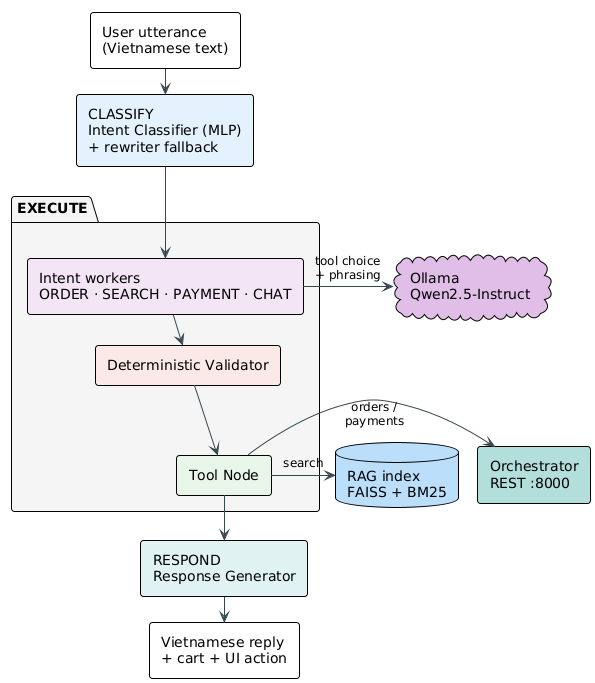
```plantuml
@startuml
!theme plain
skinparam backgroundColor #FFFFFF
skinparam defaultFontName "DejaVu Sans"
skinparam defaultFontSize 14
skinparam shadowing false
skinparam nodesep 18
skinparam ranksep 24
skinparam padding 2
skinparam roundCorner 6
skinparam ArrowColor #37474F
skinparam ArrowFontSize 12
skinparam componentStyle rectangle

rectangle "User utterance\n(Vietnamese text)" as USER #FFFFFF

rectangle "CLASSIFY\nIntent Classifier (MLP)\n+ rewriter fallback" as ROUTER #E3F2FD

package "EXECUTE" as EX #F5F5F5 {
  rectangle "Intent workers\nORDER · SEARCH · PAYMENT · CHAT" as WORKERS #F3E5F5
  rectangle "Deterministic Validator" as VALIDATOR #FBE9E7
  rectangle "Tool Node" as TOOLS #E8F5E9
}

rectangle "RESPOND\nResponse Generator" as RESPONSE #E0F2F1
rectangle "Vietnamese reply\n+ cart + UI action" as REPLY #FFFFFF

cloud "Ollama\nQwen2.5-Instruct" as LLM #E1BEE7
database "RAG index\nFAISS + BM25" as RAG #BBDEFB
rectangle "Orchestrator\nREST :8000" as API #B2DFDB

USER --> ROUTER
ROUTER --> WORKERS
WORKERS --> VALIDATOR
VALIDATOR --> TOOLS
TOOLS --> RESPONSE
RESPONSE --> REPLY

WORKERS -right-> LLM : tool choice\n+ phrasing
TOOLS -right-> RAG   : search
TOOLS -right-> API   : orders /\npayments

@enduml
```

| Block | Role | Calls LLM? |
|-------|------|:---:|
| **Intent Classifier** | MLP over a shared 768-d embedding + 10-d dialogue-state features -> ORDER / SEARCH / PAYMENT / CHAT. Rewriter LLM only on low confidence or a multi-clause utterance. | No* |
| **ORDER Worker** | LLM picks a cart action or `confirm_order`. | Yes |
| **SEARCH Worker** | LLM picks `search()` or `delegate()`. | Yes |
| **PAYMENT Dispatch** | Deterministic — always emits `request_payment`. | No |
| **CHAT Worker** | Pure function — builds context from search history + cart. | No |
| **Validator** | 5-level menu resolution + per-tool preconditions. Max 3 retries, then a circuit breaker. | No |
| **Tool Node** | Executes validated calls: in-memory cart, RAG search, REST for orders/payments. | No |
| **Response Generator** | Templates for deterministic outcomes, LLM stream for search results and chat. | Partial |

\* The rewriter LLM runs only for low-confidence or multi-clause utterances (see Figure 4).

---

## Figure 3 — Agent StateGraph: Control-Flow Topology

> Ch.4 §4.5.1. Source: [graph.py](../../src/agent_brain/agent/graph.py) (`_build_workflow`).
>
> **Caption:** *The LangGraph `StateGraph`. ORDER, SEARCH and PAYMENT are drawn as one composite
> because their edges are identical — each is entered from the classifier or from the multi-intent
> loop, validated, and retried on the same conditions. Ten nodes are reachable at runtime; an
> eleventh (`router`, the semantic + keyword hybrid) remains registered as a rollback but is
> bypassed by `START -> classifier_router`.*

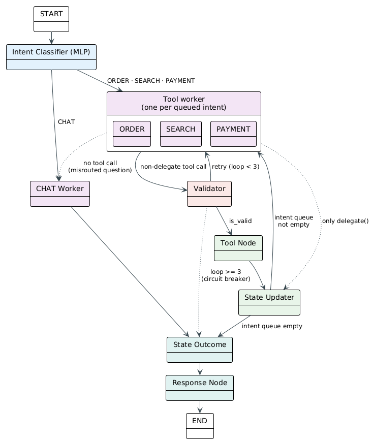
```plantuml
@startuml
!theme plain
skinparam backgroundColor #FFFFFF
skinparam defaultFontName "DejaVu Sans"
skinparam defaultFontSize 14
skinparam shadowing false
skinparam nodesep 18
skinparam ranksep 24
skinparam padding 2
skinparam roundCorner 6
skinparam ArrowColor #37474F
skinparam ArrowFontSize 12

state "START" as START
state "Intent Classifier (MLP)" as CLASSIFIER #E3F2FD

state "Tool worker\n(one per queued intent)" as WORKER #F3E5F5 {
  state "ORDER" as OW #F3E5F5
  state "SEARCH" as SW #F3E5F5
  state "PAYMENT" as PAY #F3E5F5
}

state "CHAT Worker" as CW #F3E5F5
state "Validator" as VAL #FBE9E7
state "Tool Node" as TOOLS #E8F5E9
state "State Updater" as UPD #E8F5E9
state "State Outcome" as SO #E0F2F1
state "Response Node" as RESP #E0F2F1
state "END" as END

START --> CLASSIFIER
CLASSIFIER --> WORKER : ORDER · SEARCH · PAYMENT
CLASSIFIER --> CW     : CHAT

WORKER --> VAL          : non-delegate tool call
WORKER -[dotted]-> UPD  : only delegate()
WORKER -[dotted]-> CW   : no tool call\n(misrouted question)

VAL --> TOOLS            : is_valid
VAL --> WORKER           : retry (loop < 3)
VAL -[dotted]-> SO       : loop >= 3\n(circuit breaker)

TOOLS --> UPD
UPD --> WORKER : intent queue\nnot empty
UPD --> SO     : intent queue empty

CW --> SO
SO --> RESP
RESP --> END
@enduml
```


### Edge Routing Table

| From → To | Condition | Code |
|-----------|-----------|------|
| START → Classifier | Unconditional | `add_edge(START, "classifier_router")` |
| Classifier → ORDER Worker | `current_intents[0] ∈ {ORDER, ORDER_CONFIRM}` | `INTENT_TO_WORKER` |
| Classifier → SEARCH Worker | `current_intents[0] == SEARCH` | `INTENT_TO_WORKER` |
| Classifier → PAYMENT Dispatch | `current_intents[0] == PAYMENT` | `INTENT_TO_WORKER` |
| Classifier → CHAT Worker | `current_intents[0] == CHAT` **or** queue empty | `DEFAULT_WORKER` |
| ORDER/SEARCH Worker → Validator | at least one **non-`delegate`** tool call (stray `delegate` calls are stripped) | `_route_if_tool_call` |
| ORDER/SEARCH Worker → **State Updater** | LLM produced **only** `delegate()` → pop the intent, advance the queue | `_route_if_tool_call` |
| ORDER Worker → CHAT Worker | **no** tool call at all *and* head intent ∈ {ORDER, ORDER_CONFIRM} — a question misrouted to ORDER | `_route_if_tool_call` |
| Other worker → State Updater | no tool call, any other intent (defensive; unreachable under `tool_choice="any"`) | `_route_if_tool_call` |
| PAYMENT Dispatch → Validator | Unconditional (deterministic node, always emits `request_payment`) | `payment_dispatch_node` |
| Validator → Tool Node | `is_valid == True` **and** `loop_count < 3` | `_route_after_validator` |
| Validator → Same Worker | `is_valid == False` AND `loop_count < 3` — retry with `feedback` injected as a `ToolMessage` | `_route_after_validator` |
| Validator → State Outcome | `loop_count >= 3` (circuit breaker; checked **before** `is_valid`) | `_route_after_validator` |
| Tool Node → State Updater | Unconditional | `add_edge("tools", "state_updater")` |
| State Updater → Next Worker | Intent queue not empty after pop (multi-intent loop) | `_route_after_updater` |
| State Updater → State Outcome | Intent queue empty | `_route_after_updater` |
| CHAT Worker → State Outcome | Unconditional (leaf node, no tool calls) | `add_edge` |
| State Outcome → Response Node | Unconditional | `add_edge` |
| Response Node → END | Unconditional | `add_edge` |

### Two things the drawing hides (state them plainly in prose)

1. **Eleven nodes are registered, ten are live.** `hybrid_router_node` (`"router"`) is still wired
   into the graph as a rollback path — semantic centroids + keyword detector — but `START` goes
   straight to `classifier_router`, so it is unreachable at runtime. Say "ten active nodes; an
   eleventh remains as a documented rollback" rather than claiming ten exist.
2. **The validator can grow the intent queue.** When one LLM turn emits both a cart tool and
   `confirm_order`, the validator strips `confirm_order` and appends `ORDER_CONFIRM` back onto
   `current_intents` (with `intent_queries["ORDER_CONFIRM"] = "Xác nhận đơn hàng"`). The cart
   mutation therefore executes first and the confirmation re-enters the ORDER worker on the next
   loop, so the guest is never billed for a cart the tool node has not yet committed. This is the
   `_with_confirm_revisit` path in `deterministic_validator_node`.

### Three layers, one turn

| Layer | Nodes | Purpose |
|-------|-------|---------|
| **Classify** | Intent Classifier | Determine what the user wants (ORDER / SEARCH / PAYMENT / CHAT) |
| **Execute** | 4 Workers → Validator → Tool Node → State Updater | Per-intent LLM decisions, deterministic validation, tool execution, state updates. Loops for multi-intent utterances and retries. |
| **Respond** | State Outcome → Response Node | Build typed response context, generate output (templates or LLM stream). |

---

## Figure 1 — System Architecture Overview

> Ch.4 §4.3. The first diagram examiners see: the three-tier deployment and the protocol on every
> seam. Source: whole-system topology (`pyproject.toml` extras, `.env.template`, `Makefile`).
>
> **Caption:** *Three tiers on one LAN. The central server runs the agent, the orchestrator (the
> only database writer), and a local Ollama + hybrid-RAG; two SQLite files hold the business ledger
> and conversation memory. The Jetson runs only perception (VAD · STT · TTS) and ROS2 navigation —
> the LLM never runs on the robot. Browsers are thin clients. Numbered seams trace the four flows:
> (1) voice ordering, (2) order → kitchen, (3) backend → robot goals, (4) manager monitoring. Live
> robot telemetry and the Ollama/RAG split are deliberately omitted at this altitude — at Figure 1
> the reader needs "the agent calls a local LLM and a local index," not the internals (Figures 6,
> 12a).*

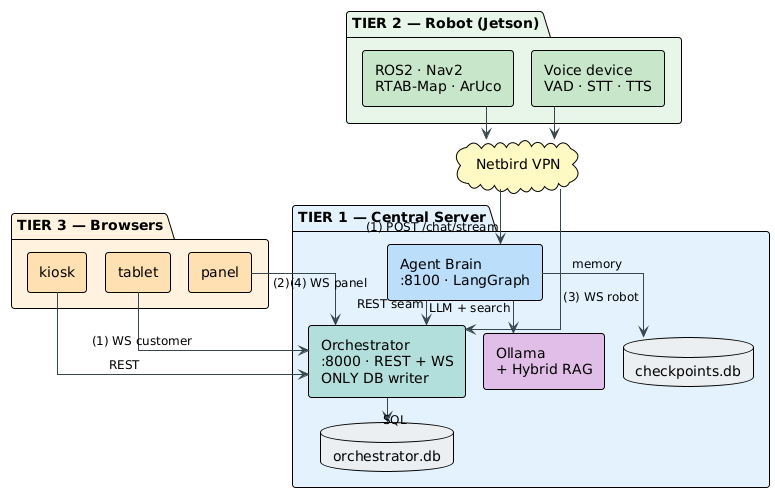
```plantuml
@startuml
' ── print profile (see "Rendering" at the top of this file) ──
!theme plain
skinparam backgroundColor #FFFFFF
skinparam defaultFontName "DejaVu Sans"
skinparam defaultFontSize 14
skinparam shadowing false
skinparam nodesep 18
skinparam ranksep 24
skinparam padding 2
skinparam roundCorner 6
skinparam ArrowColor #37474F
skinparam ArrowFontSize 12
skinparam NoteBackgroundColor #FFFDE7
skinparam NoteFontSize 11
skinparam componentStyle rectangle
skinparam linetype ortho

package "TIER 1 — Central Server" #E3F2FD {
  component "Agent Brain\n:8100 · LangGraph" as AGENT #BBDEFB
  component "Orchestrator\n:8000 · REST + WS\nONLY DB writer" as ORCH #B2DFDB
  component "Ollama\n+ Hybrid RAG" as OLLAMA #E1BEE7
  database "orchestrator.db" as DB #ECEFF1
  database "checkpoints.db" as CKPT #ECEFF1
}

package "TIER 2 — Robot (Jetson)" #E8F5E9 {
  component "Voice device\nVAD · STT · TTS" as VOICE #C8E6C9
  component "ROS2 · Nav2\nRTAB-Map · ArUco" as NAV #C8E6C9
}

package "TIER 3 — Browsers" #FFF3E0 {
  component "tablet" as TABLET #FFE0B2
  component "kiosk" as KIOSK #FFE0B2
  component "panel" as PANEL #FFE0B2
}

cloud "Netbird VPN" as VPN #FFF9C4

AGENT --> OLLAMA : LLM + search
AGENT --> CKPT   : memory
AGENT --> ORCH   : REST seam
ORCH  --> DB     : SQL

VOICE --> VPN
NAV   --> VPN
VPN --> AGENT : (1) POST /chat/stream
VPN --> ORCH  : (3) WS robot

TABLET --> ORCH : (1) WS customer
KIOSK  --> ORCH : REST
PANEL  --> ORCH : (2)(4) WS panel

@enduml
```

The four numbered seams — (1) voice ordering, (2) order → kitchen, (3) backend → robot goals,
(4) manager monitoring — are the edge labels in the diagram; §4.3 walks each one. The omissions are
deliberate design altitude, not gaps: live robot telemetry (`fleet.py`, RAM) is a detail of
Figure 12a, and Ollama + RAG are one block because the reader here needs "a local LLM and a local
index," not the split.

---

## Figure 4 — Two-Stage Intent Classification (MLP + rewriter fallback)

> Ch.4 §4.5.2. Source: [classifier/model.py](../../src/training_semantic_router/classifier/model.py),
> [features.py](../../src/training_semantic_router/classifier/features.py),
> [predict.py](../../src/training_semantic_router/classifier/predict.py),
> [classifier_router_node.py](../../src/agent_brain/agent/nodes/classifier_router_node.py).
>
> **Caption:** *Routing runs on the same 768-d embedding the retriever already computes, so the
> fast path adds only an MLP forward pass. Architecture: `778 → 256 → 64 → 4` (ReLU, dropout 0.2,
> softmax); only the 10-d context features are standardised, not the embedding. The gate passes
> when confidence ≥ 0.70 and no clause-boundary marker (`rồi · và · thì · xong · với lại`) is
> present; otherwise a few-shot rewriter LLM splits the utterance into fragments that are
> re-classified into a multi-intent queue. Failure is contained: a missing checkpoint, an import
> error or an inference exception all fall back to `intent = CHAT` at confidence 0.0 — the turn
> degrades to conversation rather than crashing.*

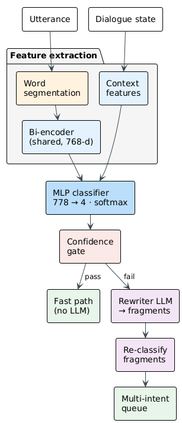
```plantuml
@startuml
' ── print profile (see "Rendering" at the top of this file) ──
!theme plain
skinparam backgroundColor #FFFFFF
skinparam defaultFontName "DejaVu Sans"
skinparam defaultFontSize 14
skinparam shadowing false
skinparam nodesep 18
skinparam ranksep 24
skinparam padding 2
skinparam roundCorner 6
skinparam ArrowColor #37474F
skinparam ArrowFontSize 12
skinparam componentStyle rectangle

rectangle "Utterance" as U #FFFFFF
rectangle "Dialogue state" as S #FFFFFF

package "Feature extraction" #F5F5F5 {
  rectangle "Word\nsegmentation" as SEG #FFF3E0
  rectangle "Bi-encoder\n(shared, 768-d)" as ENC #E3F2FD
  rectangle "Context\nfeatures" as CTX #E3F2FD
}

rectangle "MLP classifier\n778 → 4 · softmax" as MLP #BBDEFB
rectangle "Confidence\ngate" as GATE #FBE9E7
rectangle "Fast path\n(no LLM)" as FAST #E8F5E9
rectangle "Rewriter LLM\n→ fragments" as REW #F3E5F5
rectangle "Re-classify\nfragments" as PF #F3E5F5
rectangle "Multi-intent\nqueue" as MULTI #E8F5E9

U --> SEG
SEG --> ENC
S --> CTX
ENC --> MLP
CTX --> MLP
MLP --> GATE
GATE --> FAST : pass
GATE --> REW  : fail
REW --> PF
PF --> MULTI

@enduml
```

### The 10-d context vector

| Dim | Feature | Encoding |
|----:|---------|----------|
| 0–4 | `order_stage` one-hot | `IDLE, BUILDING, AWAITING_CONFIRMATION, CONFIRMED, MODIFYING` |
| 5 | `has_cart` | binary |
| 6 | `cart_size` | `min(n, 10) / 10` |
| 7 | `has_search_context` | binary |
| 8 | `search_context_size` | `min(n, 20) / 20` |
| 9 | `utterance_length` | `min(len, 200) / 200` |

> **Report this honestly.** The runtime `OrderStage` literal is only
> `IDLE | DRAFTING | AWAITING_CONFIRMATION | CONFIRMED`, and `update_state_node` only ever writes
> `IDLE`, `AWAITING_CONFIRMATION` or `CONFIRMED`. `DRAFTING` is remapped to `BUILDING` on the way
> in, and `MODIFYING` is never produced at all — so **dims 1 and 4 are constant zero in
> production**. The effective context vector is 8-dimensional. Either say so in §4.5.2 (it is a
> defensible design margin for future stages) or trim the head and retrain; do not present all ten
> dims as active.

### Why two stages instead of one LLM router

| | Single LLM router | MLP + conditional rewriter (this work) |
|---|---|---|
| Latency, typical turn | one full LLM generation | one 778→256→64→4 forward pass (sub-millisecond after encode) |
| LLM calls per turn | 1 always | 0 on the fast path, 1 only when the gate fails |
| Determinism | sampling-dependent | argmax over a fixed network |
| Multi-intent | prompt-dependent | explicit fragment decomposition + per-fragment argmax |

The encoder is the shared `encode_queries()` used by the retriever, so the fast path adds **one**
embedding forward pass to a turn that was going to embed the query anyway — the classifier itself
is nearly free. This is the argument to make in §4.5.2, and it is the reason the 0.70 threshold
matters: it is the dial that trades LLM calls for routing recall.

---

## Figure 5a — Deterministic Validator: control flow

> Ch.4 §4.5.4. Source: [deterministic_validator_node.py](../../src/agent_brain/agent/nodes/deterministic_validator_node.py).
>
> **Caption:** *Validator control flow. Per-tool preconditions are listed in Table 4.x; the menu
> resolution cascade invoked by `add_cart` is expanded in Figure 5b. Errors are returned to the
> worker as `ToolMessage` feedback, and three consecutive failures trip the circuit breaker.*

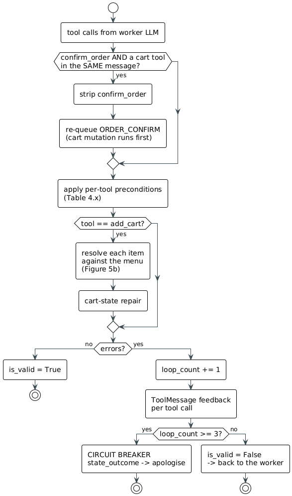
```plantuml
@startuml
' ── print profile (see "Rendering" at the top of this file) ──
!theme plain
skinparam backgroundColor #FFFFFF
skinparam defaultFontName "DejaVu Sans"
skinparam defaultFontSize 14
skinparam shadowing false
skinparam nodesep 18
skinparam ranksep 24
skinparam padding 2
skinparam roundCorner 6
skinparam ArrowColor #37474F
skinparam ArrowFontSize 12
skinparam NoteBackgroundColor #FFFDE7
skinparam NoteFontSize 11

start
:tool calls from worker LLM;

if (confirm_order AND a cart tool\nin the SAME message?) then (yes)
  :strip confirm_order;
  :re-queue ORDER_CONFIRM\n(cart mutation runs first);
endif

:apply per-tool preconditions\n(Table 4.x);

if (tool == add_cart?) then (yes)
  :resolve each item\nagainst the menu\n(Figure 5b);
  :cart-state repair;
endif

if (errors?) then (no)
  :is_valid = True;
  stop
else (yes)
  :loop_count += 1;
  :ToolMessage feedback\nper tool call;
  if (loop_count >= 3?) then (yes)
    :CIRCUIT BREAKER\nstate_outcome -> apologise;
    stop
  else (no)
    :is_valid = False\n-> back to the worker;
    stop
  endif
endif

@enduml
```

### Per-tool preconditions (Table 4.x — the "apply preconditions" step above)

| Tool | Checks | On failure |
|---|---|---|
| `add_cart` | every item resolves (Figure 5b); `quantity > 0` | item dropped → off-menu / ambiguous list |
| `remove_cart` | name resolves against the **cart**, not the menu; `quantity` clamped to `[1, in_cart]`; a quantity covering the whole line collapses to "drop the line" | error → retry |
| `clear_cart` | cart is not already empty | error → retry |
| `confirm_order` | `order_stage == AWAITING_CONFIRMATION`; cart non-empty; **`args["items"]` overwritten from the server-side cart** | error → retry |
| `request_payment` / `verify_payment` | `table_id` injected from session state | error → retry |

**Cart-state repair** fixes two LLM failure modes that no precondition can express: an additive turn
("thêm 1 chả giò") where the model silently *dropped* the existing cart — the previous items are
restored; and items copied out of conversation context that the guest never actually said in this
turn — those are stripped.

---

## Figure 5b — Menu resolution cascade

> Ch.4 §4.5.4. Source: [menu_utils.py](../../src/agent_brain/utils/menu_utils.py) (`resolve_menu_name`,
> `find_nearest_menu_name`).
>
> **Caption:** *Five-level resolution of a customer-spoken dish name, applied per item by
> `add_cart`. Only the first two levels put an item in the cart; ambiguity produces a clarifying
> question rather than a rejection or a guess.*

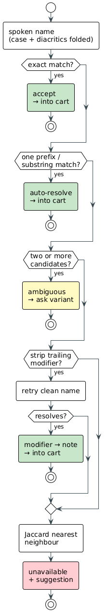
```plantuml
@startuml
' ── print profile (see "Rendering" at the top of this file) ──
!theme plain
skinparam backgroundColor #FFFFFF
skinparam defaultFontName "DejaVu Sans"
skinparam defaultFontSize 14
skinparam shadowing false
skinparam nodesep 18
skinparam ranksep 24
skinparam padding 2
skinparam roundCorner 6
skinparam ArrowColor #37474F
skinparam ArrowFontSize 12

start
:spoken name\n(case + diacritics folded);

if (exact match?) then (yes)
  #C8E6C9:accept\n→ into cart;
  stop
endif

if (one prefix /\nsubstring match?) then (yes)
  #C8E6C9:auto-resolve\n→ into cart;
  stop
endif

if (two or more\ncandidates?) then (yes)
  #FFF9C4:ambiguous\n→ ask variant;
  stop
endif

if (strip trailing\nmodifier?) then (yes)
  :retry clean name;
  if (resolves?) then (yes)
    #C8E6C9:modifier → note\n→ into cart;
    stop
  endif
endif

:Jaccard nearest\nneighbour;
#FFCDD2:unavailable\n+ suggestion;
stop

@enduml
```

**Level 4 patterns** (`_MODIFIER_PATTERNS`): a trailing `(...)`, `, ...` or `- ...` is peeled off
the name and re-attached as a special request — so "Ốc Hương Xốt Bơ Tỏi (không cay)" resolves to the
menu item with `special_requests = "không cay"` instead of failing as off-menu.

**Level 5 threshold** is deliberately conservative at Jaccard `≥ 0.30`: "Bia Corona" → "Bia 333"
(1/3 ≈ 0.33) is suggested, "Pizza" → nothing. An unhelpful suggestion is worse for the guest than an
honest "we don't have that", so the floor errs toward silence.

### What this buys the thesis

The claim to make in §4.5.4 is **not** "the validator catches LLM mistakes" — it is that three
classes of error are made *structurally impossible* rather than statistically unlikely:

| Guarantee | Mechanism | Failure it removes |
|---|---|---|
| No off-menu item can reach the kitchen | 5-level resolution; unresolved names never enter the cart | LLM hallucinating a dish |
| No bill can disagree with the cart | `confirm_order.args["items"]` is **overwritten** from server-side `active_cart` | LLM re-listing stale/invented quantities |
| No confirmation without a shown cart | `order_stage == AWAITING_CONFIRMATION` precondition | LLM skipping the read-back step |

Ambiguity is treated as a *conversational* outcome, not an error: "Ốc Hương" matching 11 sauces
produces a clarifying question, not a rejection and not a silent guess. That distinction —
**ambiguous ≠ invalid** — is the part worth a paragraph.

---

## Figure 6 — Hybrid Retrieval Pipeline

> Ch.4 §4.6. Source: [hybrid_retriever.py](../../src/agent_brain/services/retriever/hybrid_retriever.py),
> [fusion/rrf.py](../../src/agent_brain/services/retriever/fusion/rrf.py),
> [indices/bm25.py](../../src/agent_brain/services/retriever/indices/bm25.py),
> [filters.py](../../src/agent_brain/services/retriever/filters.py),
> [search_tool.py](../../src/agent_brain/agent/tools/search_tool.py).
>
> **Caption:** *Two lanes run in parallel (`ThreadPoolExecutor`): lexical BM25 (`k1=1.2, b=0`,
> indexed over name/title/taste/tags) and semantic FAISS cosine over the shared 768-d bi-encoder,
> each returning its top-15. Metadata filters (price, diet, category) drop non-menu docs. The
> dual-lane gatekeeper admits a result only if the top vector score ≥ 0.35 **or** a query token hits
> the top-1 lexical docs; otherwise it returns empty ("Không tìm thấy món ăn phù hợp.") rather than
> the least-bad matches. Survivors are fused by RRF (`k=60` — rank, not score), deduped by dish
> name, and cut to top-6.*

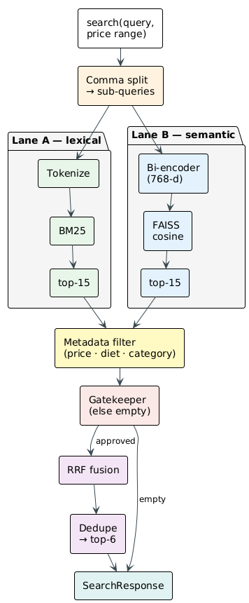
```plantuml
@startuml
' ── print profile (see "Rendering" at the top of this file) ──
!theme plain
skinparam backgroundColor #FFFFFF
skinparam defaultFontName "DejaVu Sans"
skinparam defaultFontSize 14
skinparam shadowing false
skinparam nodesep 18
skinparam ranksep 24
skinparam padding 2
skinparam roundCorner 6
skinparam ArrowColor #37474F
skinparam ArrowFontSize 12
skinparam componentStyle rectangle

rectangle "search(query,\nprice range)" as Q #FFFFFF
rectangle "Comma split\n→ sub-queries" as SPLIT #FFF3E0

package "Lane A — lexical" #F5F5F5 {
  rectangle "Tokenize" as TOKA #E8F5E9
  rectangle "BM25" as BM25 #E8F5E9
  rectangle "top-15" as TOPA #E8F5E9
}

package "Lane B — semantic" #F5F5F5 {
  rectangle "Bi-encoder\n(768-d)" as TOKB #E3F2FD
  rectangle "FAISS\ncosine" as FAISS #E3F2FD
  rectangle "top-15" as TOPB #E3F2FD
}

rectangle "Metadata filter\n(price · diet · category)" as FILT #FFF9C4
rectangle "Gatekeeper\n(else empty)" as GATE #FBE9E7
rectangle "RRF fusion" as RRF #F3E5F5
rectangle "Dedupe\n→ top-6" as TOPK #F3E5F5
rectangle "SearchResponse" as OUT #E0F2F1

Q --> SPLIT
SPLIT --> TOKA
SPLIT --> TOKB
TOKA --> BM25
BM25 --> TOPA
TOKB --> FAISS
FAISS --> TOPB
TOPA --> FILT
TOPB --> FILT
FILT --> GATE
GATE --> RRF : approved
GATE --> OUT : empty
RRF --> TOPK
TOPK --> OUT

@enduml
```

### Two parameter choices to justify in prose

**`b = 0` in BM25** disables document-length normalisation deliberately. Menu documents are short
and near-uniform in length, so a length penalty adds noise without discriminating between them.

**RRF fuses ranks, not scores.** BM25 scores are unbounded and cosine similarity lives in `[-1, 1]`;
combining them directly would require calibrating one lane against the other, and that calibration
would have to be re-tuned whenever the encoder or the corpus changed. Rank fusion sidesteps the
problem entirely — this is the reason to prefer it here, and it is worth one sentence in §4.6.

### The gatekeeper is the contribution — say so

Plain RRF always returns *something*: with a top-k cut and no floor, an out-of-domain query
("cho tôi cái pizza") still yields the six least-bad menu items, and the response LLM will happily
recommend them. The dual-lane gatekeeper is what makes "we don't serve that" reachable:

- **Semantic lane** admits paraphrase ("món nào ăn đỡ ngán?") that shares no tokens with the menu.
- **Lexical lane** admits rare proper nouns ("Bia 333") that a general-domain encoder embeds poorly.
- **Neither fires** ⇒ genuinely out of domain ⇒ empty result, and the validator's off-menu path
  produces an apology plus a Jaccard-nearest suggestion instead of a hallucinated recommendation.

Two lanes run in a `ThreadPoolExecutor(max_workers=2)`, so hybrid retrieval costs roughly the
latency of the slower lane, not their sum.

---

## Figure 7 — Voice Ordering Sequence (end-to-end, one turn)

> Ch.4 §4.3. Source: [edge_voice/main.py](../../src/edge_voice/main.py),
> [routers/voice.py](../../src/server_orchestrator/routers/voice.py),
> [agent_brain/server.py](../../src/agent_brain/server.py).

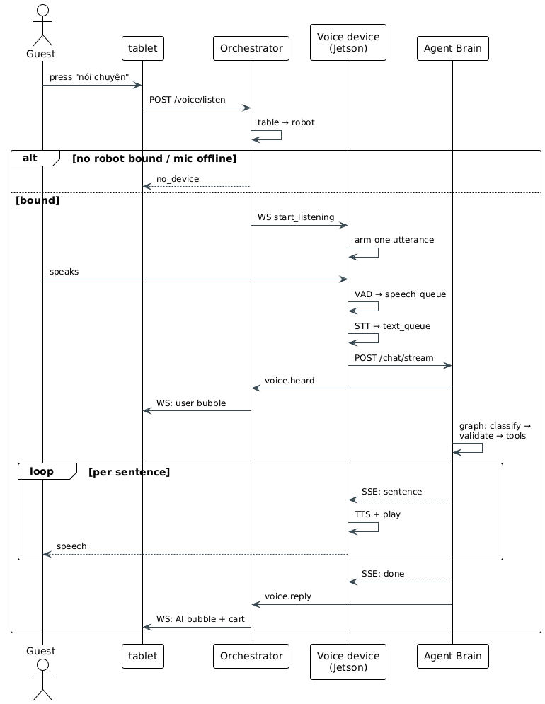
```plantuml
@startuml
' ── print profile (see "Rendering" at the top of this file) ──
!theme plain
skinparam backgroundColor #FFFFFF
skinparam defaultFontName "DejaVu Sans"
skinparam defaultFontSize 14
skinparam shadowing false
skinparam nodesep 18
skinparam ranksep 24
skinparam padding 2
skinparam roundCorner 6
skinparam ArrowColor #37474F
skinparam ArrowFontSize 12
skinparam NoteBackgroundColor #FFFDE7
skinparam NoteFontSize 11

actor Guest
participant "tablet" as TAB
participant "Orchestrator" as ORCH
participant "Voice device\n(Jetson)" as JET
participant "Agent Brain" as AG

Guest -> TAB : press "nói chuyện"
TAB -> ORCH : POST /voice/listen
ORCH -> ORCH : table → robot
alt no robot bound / mic offline
  ORCH --> TAB : no_device
else bound
  ORCH -> JET : WS start_listening
  JET -> JET : arm one utterance
  Guest -> JET : speaks
  JET -> JET : VAD → speech_queue
  JET -> JET : STT → text_queue
  JET -> AG : POST /chat/stream

  AG -> ORCH : voice.heard
  ORCH -> TAB : WS: user bubble

  AG -> AG : graph: classify →\nvalidate → tools

  loop per sentence
    AG --> JET : SSE: sentence
    JET -> JET : TTS + play
    JET --> Guest : speech
  end
  AG --> JET : SSE: done

  AG -> ORCH : voice.reply
  ORCH -> TAB : WS: AI bubble + cart
end

@enduml
```

**The latency argument for §4.3:** the reply is spoken **sentence-by-sentence as it is generated**,
not after the full generation completes. Time-to-first-audio is one sentence of LLM output plus one
TTS synthesis, independent of the total reply length. That is the whole reason for the SSE seam
between the agent and the Jetson, and it is measurable — quote time-to-first-audio, not total
turn time, in Ch.5.

---

## Figure 8 — Edge Voice Pipeline (threads, queues, gating)

> Ch.4 §4.4. Source: [perception/vad_silero.py](../../src/edge_voice/perception/vad_silero.py),
> [perception/stt_phowhisper.py](../../src/edge_voice/perception/stt_phowhisper.py),
> [perception/queues.py](../../src/edge_voice/perception/queues.py),
> [output/tts_engine.py](../../src/edge_voice/output/tts_engine.py).
>
> **Caption:** *Three daemon threads decouple capture, transcription, and dialogue so each stage
> runs while the next utterance is already being gathered; two bounded queues are the only coupling.
> Constants (Fact Sheet): Silero threshold 0.5 over 32 ms frames, 1.5 s end-of-utterance, bounded
> queues of 10 (drop-newest), faster-whisper `medium` at `beam_size=5`. Note the STT is OpenAI
> Whisper-medium via CTranslate2 — not VinAI PhoWhisper, despite the class name (see the naming
> note below). The listen gate arms for exactly one utterance; barge-in lets guest speech interrupt
> playback.*

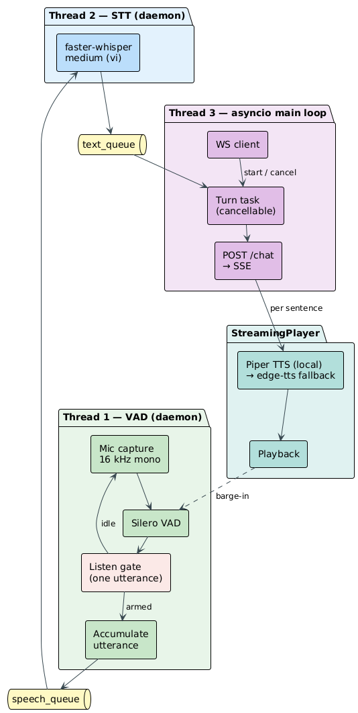
```plantuml
@startuml
' ── print profile (see "Rendering" at the top of this file) ──
!theme plain
skinparam backgroundColor #FFFFFF
skinparam defaultFontName "DejaVu Sans"
skinparam defaultFontSize 14
skinparam shadowing false
skinparam nodesep 18
skinparam ranksep 24
skinparam padding 2
skinparam roundCorner 6
skinparam ArrowColor #37474F
skinparam ArrowFontSize 12
skinparam componentStyle rectangle

package "Thread 1 — VAD (daemon)" #E8F5E9 {
  rectangle "Mic capture\n16 kHz mono" as MIC #C8E6C9
  rectangle "Silero VAD" as VAD #C8E6C9
  rectangle "Listen gate\n(one utterance)" as GATE #FBE9E7
  rectangle "Accumulate\nutterance" as ACC #C8E6C9
}

queue "speech_queue" as SQ #FFF9C4

package "Thread 2 — STT (daemon)" #E3F2FD {
  rectangle "faster-whisper\nmedium (vi)" as STT #BBDEFB
}

queue "text_queue" as TQ #FFF9C4

package "Thread 3 — asyncio main loop" #F3E5F5 {
  rectangle "WS client" as WS #E1BEE7
  rectangle "Turn task\n(cancellable)" as TURN #E1BEE7
  rectangle "POST /chat\n→ SSE" as SSE #E1BEE7
}

package "StreamingPlayer" #E0F2F1 {
  rectangle "Piper TTS (local)\n→ edge-tts fallback" as TTS #B2DFDB
  rectangle "Playback" as SPK #B2DFDB
}

MIC --> VAD
VAD --> GATE
GATE --> ACC : armed
GATE --> MIC : idle
ACC --> SQ
SQ --> STT
STT --> TQ
TQ --> TURN
WS --> TURN : start / cancel
TURN --> SSE
SSE --> TTS : per sentence
TTS --> SPK
SPK ..> VAD : barge-in

@enduml
```

### Naming correction you must make before submitting

The class is called `PhoWhisperSTT`, but it loads
`faster_whisper.WhisperModel("medium")` — that is **OpenAI Whisper medium via CTranslate2**, not
VinAI's PhoWhisper. `docs/thesis/outline.md` §2.3.2 reviews PhoWhisper as prior work, so a reader
will assume you deployed it. Pick one and be consistent:

- **Report what runs**: say "Whisper-medium, CTranslate2/faster-whisper backend, `language="vi"`,
  `beam_size=5`" and cite PhoWhisper in Ch.2 only as an alternative you evaluated or rejected. This
  is the honest, zero-work option — and Ch.5 can compare the two.
- **Or actually swap the model** and keep the name.

Either way, rename the class/file; a viva question about "which Vietnamese ASR model did you use"
against a file named `stt_phowhisper.py` that loads Whisper is a bad five minutes. The same care
applies to TTS: Piper (local, offline) is preferred and edge-tts (**cloud**, Microsoft) is the
fallback — an offline-capable claim depends on which one was actually running during evaluation.

---

## Figure 9 — Cart / Order Stage Machine

> Ch.4 §4.5.5. Source: [schemas/order.py](../../src/agent_brain/schemas/order.py),
> [nodes/update_state_node.py](../../src/agent_brain/agent/nodes/update_state_node.py),
> [graph.py](../../src/agent_brain/agent/graph.py) (`set_cart`).
>
> **Caption:** *The validator refuses `confirm_order` from any stage other than
> `AWAITING_CONFIRMATION`, and that edge is the only way into `CONFIRMED`. "The guest saw the cart
> before being billed" is therefore a property of the graph, not a request made in a prompt.
> `DRAFTING` is declared in the `OrderStage` literal but never written by any node — `add_cart`
> goes straight to `AWAITING_CONFIRMATION` — so it is drawn as reserved, not as a live state.*

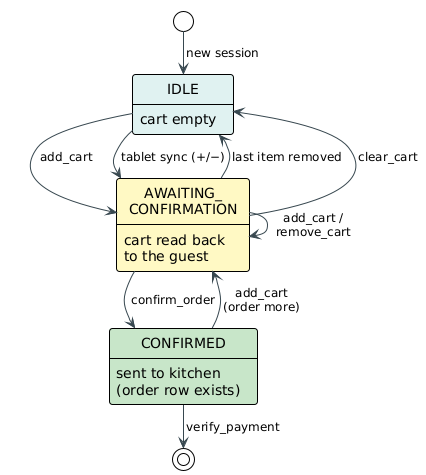
```plantuml
@startuml
' ── print profile (see "Rendering" at the top of this file) ──
!theme plain
skinparam backgroundColor #FFFFFF
skinparam defaultFontName "DejaVu Sans"
skinparam defaultFontSize 14
skinparam shadowing false
skinparam nodesep 18
skinparam ranksep 24
skinparam padding 2
skinparam roundCorner 6
skinparam ArrowColor #37474F
skinparam ArrowFontSize 12
skinparam NoteBackgroundColor #FFFDE7
skinparam NoteFontSize 11

state "IDLE" as IDLE #E0F2F1 : cart empty
state "AWAITING_\nCONFIRMATION" as AWAIT #FFF9C4 : cart read back\nto the guest
state "CONFIRMED" as CONF #C8E6C9 : sent to kitchen\n(order row exists)

[*] --> IDLE : new session

IDLE --> AWAIT : add_cart
IDLE --> AWAIT : tablet sync (+/−)

AWAIT --> AWAIT : add_cart /\nremove_cart
AWAIT --> IDLE : last item removed
AWAIT --> IDLE : clear_cart
AWAIT --> CONF : confirm_order

CONF --> AWAIT : add_cart\n(order more)
CONF --> [*]   : verify_payment

@enduml
```

| Transition | Trigger | Side effect |
|---|---|---|
| `IDLE → AWAITING_CONFIRMATION` | `add_cart` returns a non-empty cart, **or** the tablet pushes a hand-edited draft | — |
| `AWAITING_CONFIRMATION` (self) | `add_cart` / `remove_cart` leaving the cart non-empty | `cart_touched = True` |
| `→ IDLE` | `remove_cart` takes the last item, or `clear_cart` | `clear_cart` also resets `shown_dishes` |
| `→ CONFIRMED` | `confirm_order` | `POST /orders`; `order_confirmed = True` |
| `CONFIRMED → AWAITING_CONFIRMATION` | `add_cart` — ordering more within the same visit | — |
| `CONFIRMED → [*]` | `verify_payment` | session `CLOSED`, table freed, thread retired |

### Two per-turn flags that are not stages (needed for §4.5.5 and §4.8)

`order_stage` is **sticky** — it survives unrelated search and chat turns. So the tablet cannot use
it to decide when to redraw. Two booleans, reset at the top of every turn, carry that signal:

| Flag | Set when | The tablet does |
|---|---|---|
| `cart_touched` | `add_cart` / `remove_cart` / `clear_cart` actually changed the cart | mirror the agent's cart into its draft |
| `order_confirmed` | `confirm_order` succeeded **this turn** | move the draft into "đã gửi bếp", once |

Without `cart_touched`, every later turn replays a stale cart and silently undoes the guest's manual
`+`/`−` on the touch screen. This is a genuine two-writer problem (voice and touch edit one cart)
and `POST /cart` → `update_state(as_node="response_node")` is the resolution: last writer wins, with
the tablet's whole draft replacing — never merging into — the agent's.

---

## Figure 10a — Database Schema: business ledger

> Ch.4 §4.7.6. Source: [data/db.py](../../src/server_orchestrator/data/db.py).
>
> **Caption:** *Business half of `orchestrator.db`. The session — one party's whole visit — is the
> unit of the ledger: orders and the single merged payment hang off it. Fleet tables are in
> Figure 10b.*

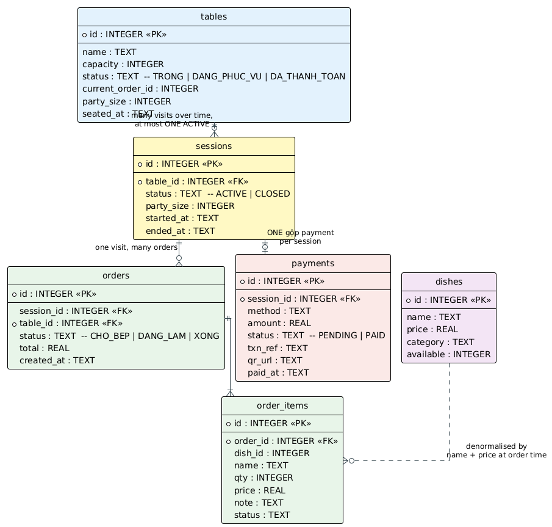
```plantuml
@startuml
' ── print profile (see "Rendering" at the top of this file) ──
!theme plain
skinparam backgroundColor #FFFFFF
skinparam defaultFontName "DejaVu Sans"
skinparam defaultFontSize 14
skinparam shadowing false
skinparam nodesep 18
skinparam ranksep 24
skinparam padding 2
skinparam roundCorner 6
skinparam ArrowColor #37474F
skinparam ArrowFontSize 12
skinparam NoteBackgroundColor #FFFDE7
skinparam NoteFontSize 11
hide circle
skinparam linetype ortho

entity "tables" as T #E3F2FD {
  * id : INTEGER <<PK>>
  --
  name : TEXT
  capacity : INTEGER
  status : TEXT  -- TRONG | DANG_PHUC_VU | DA_THANH_TOAN
  current_order_id : INTEGER
  party_size : INTEGER
  seated_at : TEXT
}

entity "sessions" as S #FFF9C4 {
  * id : INTEGER <<PK>>
  --
  * table_id : INTEGER <<FK>>
  status : TEXT  -- ACTIVE | CLOSED
  party_size : INTEGER
  started_at : TEXT
  ended_at : TEXT
}

entity "orders" as O #E8F5E9 {
  * id : INTEGER <<PK>>
  --
  session_id : INTEGER <<FK>>
  * table_id : INTEGER <<FK>>
  status : TEXT  -- CHO_BEP | DANG_LAM | XONG
  total : REAL
  created_at : TEXT
}

entity "order_items" as OI #E8F5E9 {
  * id : INTEGER <<PK>>
  --
  * order_id : INTEGER <<FK>>
  dish_id : INTEGER
  name : TEXT
  qty : INTEGER
  price : REAL
  note : TEXT
  status : TEXT
}

entity "payments" as P #FBE9E7 {
  * id : INTEGER <<PK>>
  --
  * session_id : INTEGER <<FK>>
  method : TEXT
  amount : REAL
  status : TEXT  -- PENDING | PAID
  txn_ref : TEXT
  qr_url : TEXT
  paid_at : TEXT
}

entity "dishes" as D #F3E5F5 {
  * id : INTEGER <<PK>>
  --
  name : TEXT
  price : REAL
  category : TEXT
  available : INTEGER
}

T  ||--o{ S  : "many visits over time,\nat most ONE ACTIVE"
S  ||--o{ O  : "one visit, many orders"
O  ||--|{ OI
S  ||--o| P  : "ONE gộp payment\nper session"
D  ..o{ OI   : "denormalised by\nname + price at order time"

@enduml
```

---

## Figure 10b — Database Schema: fleet tables

> Ch.4 §4.7.6. Source: [data/db.py](../../src/server_orchestrator/data/db.py).
>
> **Caption:** *Fleet half of `orchestrator.db`. `tables` is repeated from Figure 10a as the join
> point. `battery`/`x`/`y` on `robots` are a ~15 s snapshot for cold start only — the authoritative
> live values are held in RAM (`fleet.py`) and overlaid by `GET /robots` (Figure 12a).*

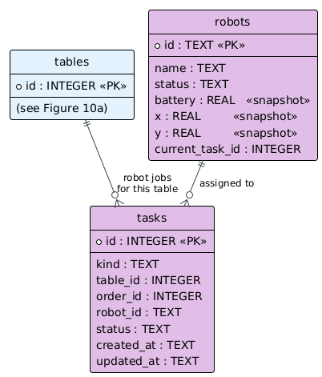
```plantuml
@startuml
' ── print profile (see "Rendering" at the top of this file) ──
!theme plain
skinparam backgroundColor #FFFFFF
skinparam defaultFontName "DejaVu Sans"
skinparam defaultFontSize 14
skinparam shadowing false
skinparam nodesep 18
skinparam ranksep 24
skinparam padding 2
skinparam roundCorner 6
skinparam ArrowColor #37474F
skinparam ArrowFontSize 12
hide circle

entity "tables" as T #E3F2FD {
  * id : INTEGER <<PK>>
  --
  (see Figure 10a)
}

entity "robots" as R #E1BEE7 {
  * id : TEXT <<PK>>
  --
  name : TEXT
  status : TEXT
  ' idle | busy | returning | offline
  battery : REAL   <<snapshot>>
  x : REAL         <<snapshot>>
  y : REAL         <<snapshot>>
  current_task_id : INTEGER
}

entity "tasks" as TK #E1BEE7 {
  * id : INTEGER <<PK>>
  --
  kind : TEXT
  ' go_to_table | deliver | call
  table_id : INTEGER
  order_id : INTEGER
  robot_id : TEXT
  status : TEXT
  ' PENDING | ASSIGNED
  ' | IN_PROGRESS | DONE
  created_at : TEXT
  updated_at : TEXT
}

T ||--o{ TK : "robot jobs\nfor this table"
R ||--o{ TK : "assigned to"

@enduml
```

**The design decision to defend in §4.7.6** is the *session* as the unit of the ledger, not the
order. A party orders several times across one visit but receives one merged bill, so `payments`
hangs off `sessions` (not `orders`), and `amount = SUM(orders of the session)` is computed
server-side. The same key doubles as the agent's conversation `thread_id`, which is what makes
memory isolation between consecutive guests automatic rather than a cleanup job (Figure 11b).

Three stores, split by data nature — worth a table in the report:

| Store | Holds | Why not the others |
|---|---|---|
| `orchestrator.db` (SQLite) | durable business ledger | must survive restart, needs transactions |
| `checkpoints.db` (LangGraph) | conversation memory, keyed by session | different lifetime and access pattern; wiped per guest |
| RAM (`fleet.py`) | pose/battery at several Hz | a file-lock write per heartbeat would contend with order/payment transactions on the same DB |

---

## Figure 11a — Order-to-Delivery Sequence

> Ch.4 §4.3. Source: [routers/orders.py](../../src/server_orchestrator/routers/orders.py),
> [services/dispatcher.py](../../src/server_orchestrator/services/dispatcher.py).
>
> **Caption:** *How one AI decision becomes a physical delivery. `confirm_order` persists the order
> (the orchestrator is the only writer); the kitchen advances it `Chờ Bếp → Đang Làm → Xong`, each
> step pushed to the panel; reaching `Xong` creates a deliver task; the dispatcher assigns the
> nearest idle robot (battery ≥ 20%), which navigates, arrives, is voice-bound to the table
> (Figure 12b), and reports done. REST on agent→orchestrator and kitchen→orchestrator; WebSocket for
> orchestrator→panel push and orchestrator↔robot.*

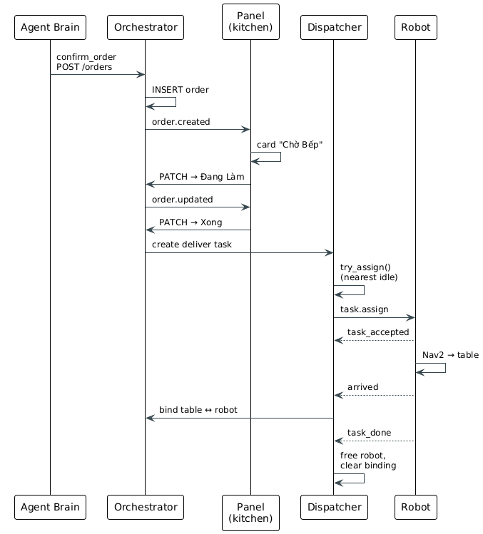
```plantuml
@startuml
' ── print profile (see "Rendering" at the top of this file) ──
!theme plain
skinparam backgroundColor #FFFFFF
skinparam defaultFontName "DejaVu Sans"
skinparam defaultFontSize 14
skinparam shadowing false
skinparam nodesep 18
skinparam ranksep 24
skinparam padding 2
skinparam roundCorner 6
skinparam ArrowColor #37474F
skinparam ArrowFontSize 12

participant "Agent Brain" as AG
participant "Orchestrator" as ORCH
participant "Panel\n(kitchen)" as PANEL
participant "Dispatcher" as DISP
participant "Robot" as ROB

AG -> ORCH : confirm_order\nPOST /orders
ORCH -> ORCH : INSERT order
ORCH -> PANEL : order.created
PANEL -> PANEL : card "Chờ Bếp"

PANEL -> ORCH : PATCH → Đang Làm
ORCH -> PANEL : order.updated

PANEL -> ORCH : PATCH → Xong
ORCH -> DISP : create deliver task
DISP -> DISP : try_assign()\n(nearest idle)
DISP -> ROB : task.assign
ROB --> DISP : task_accepted
ROB -> ROB : Nav2 → table
ROB --> DISP : arrived
DISP -> ORCH : bind table ↔ robot
ROB --> DISP : task_done
DISP -> DISP : free robot,\nclear binding

@enduml
```

---

## Figure 11b — Session Lifecycle (and conversation-memory isolation)

> Ch.4 §4.7.3. Source: [services/sessions.py](../../src/server_orchestrator/services/sessions.py),
> [routers/payments.py](../../src/server_orchestrator/routers/payments.py),
> [memory/checkpointer.py](../../src/agent_brain/agent/memory/checkpointer.py), `graph.chat()`.
>
> **Caption:** *Each turn the agent resolves the table's ACTIVE session and uses its id as the
> LangGraph `thread_id`. Within a visit that id is stable, so memory persists; once payment closes
> the session the next guest opens a new one, yielding a fresh thread and no context bleed. Before
> any seating the agent falls back to a table-scoped thread (`table-3-nosession`).*

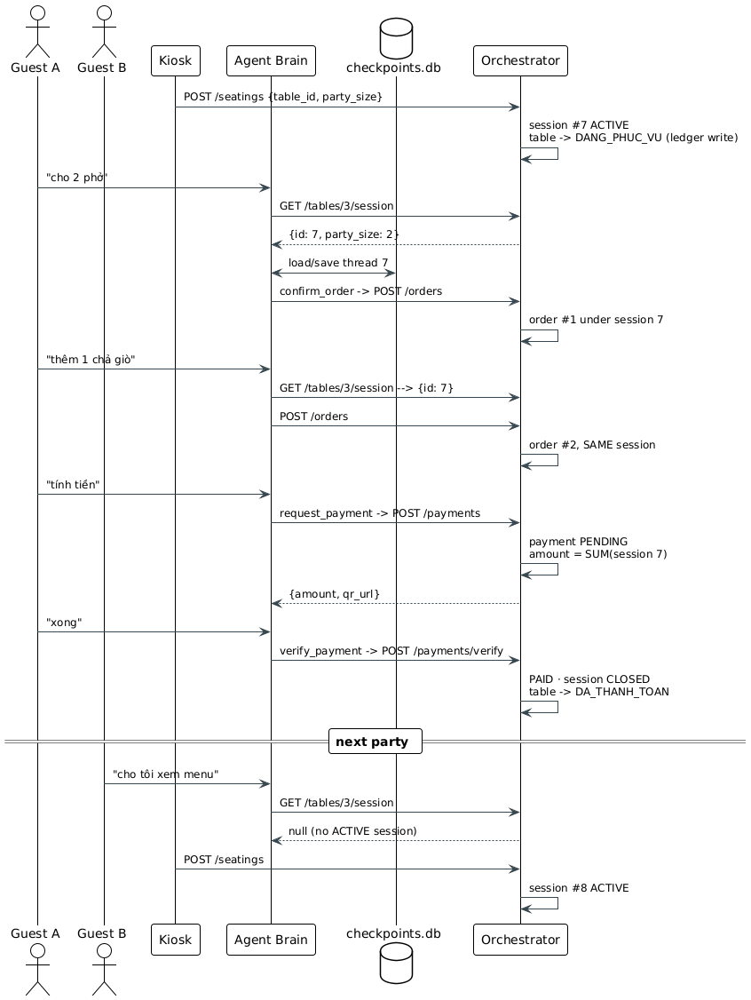
```plantuml
@startuml
' ── print profile (see "Rendering" at the top of this file) ──
!theme plain
skinparam backgroundColor #FFFFFF
skinparam defaultFontName "DejaVu Sans"
skinparam defaultFontSize 14
skinparam shadowing false
skinparam nodesep 18
skinparam ranksep 24
skinparam padding 2
skinparam roundCorner 6
skinparam ArrowColor #37474F
skinparam ArrowFontSize 12
skinparam NoteBackgroundColor #FFFDE7
skinparam NoteFontSize 11

actor "Guest A" as GA
actor "Guest B" as GB
participant Kiosk
participant "Agent Brain" as AG
database "checkpoints.db" as CK
participant "Orchestrator" as API

Kiosk -> API : POST /seatings {table_id, party_size}
API -> API : session #7 ACTIVE\ntable -> DANG_PHUC_VU (ledger write)

GA -> AG : "cho 2 phở"
AG -> API : GET /tables/3/session
API --> AG : {id: 7, party_size: 2}
AG <-> CK : load/save thread 7
AG -> API : confirm_order -> POST /orders
API -> API : order #1 under session 7

GA -> AG : "thêm 1 chả giò"
AG -> API : GET /tables/3/session --> {id: 7}
AG -> API : POST /orders
API -> API : order #2, SAME session

GA -> AG : "tính tiền"
AG -> API : request_payment -> POST /payments
API -> API : payment PENDING\namount = SUM(session 7)
API --> AG : {amount, qr_url}

GA -> AG : "xong"
AG -> API : verify_payment -> POST /payments/verify
API -> API : PAID · session CLOSED\ntable -> DA_THANH_TOAN

== next party ==

GB -> AG : "cho tôi xem menu"
AG -> API : GET /tables/3/session
API --> AG : null (no ACTIVE session)

Kiosk -> API : POST /seatings
API -> API : session #8 ACTIVE
@enduml
```

**The claim this figure supports:** cross-guest context bleed is prevented *by construction*. There
is no "clear the conversation" job to schedule and no TTL to tune — the thread key is the business
session key, so closing the bill closes the conversation. State the failure mode it removes: without
this, Guest B's first turn inherits Guest A's cart, and the validator would happily confirm it.

`reset_thread()` ("cuộc trò chuyện mới") is the deliberate exception: it deletes the checkpoints of
the *current* thread while leaving the session — and therefore the bill — untouched.

---

## Figure 12a — Task Lifecycle and Robot States

> Ch.4 §4.7.4. Source: [services/dispatcher.py](../../src/server_orchestrator/services/dispatcher.py).
>
> **Caption:** *Task lifecycle (left) and the robot state it drives (right). A robot that
> disconnects or goes silent past the heartbeat timeout has its task returned to `PENDING`, so no
> job is lost to a dropped link. A task is created on seating, an order reaching `XONG`, or a call
> button; `try_assign()` picks the **nearest** online robot that is idle/returning with battery
> ≥ 20%. Telemetry paths: RAM every beat, panel broadcast throttled to 0.2 s, DB snapshot every
> 15 s. The voice binding this assignment also maintains is Figure 12b.*

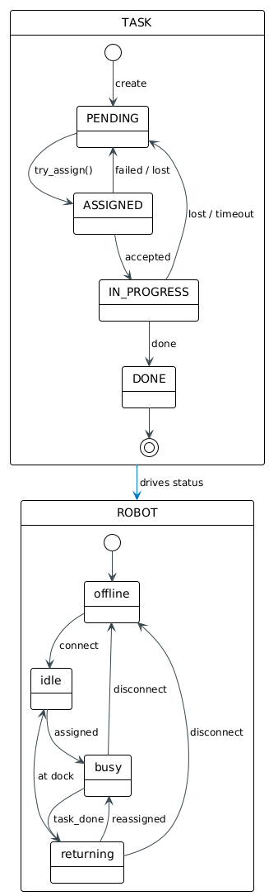
```plantuml
@startuml
' ── print profile (see "Rendering" at the top of this file) ──
!theme plain
skinparam backgroundColor #FFFFFF
skinparam defaultFontName "DejaVu Sans"
skinparam defaultFontSize 14
skinparam shadowing false
skinparam nodesep 18
skinparam ranksep 24
skinparam padding 2
skinparam roundCorner 6
skinparam ArrowColor #37474F
skinparam ArrowFontSize 12
skinparam NoteBackgroundColor #FFFDE7
skinparam NoteFontSize 11

state "TASK" as TASK {
  [*] --> PENDING : create
  PENDING --> ASSIGNED : try_assign()
  ASSIGNED --> IN_PROGRESS : accepted
  IN_PROGRESS --> DONE : done
  ASSIGNED --> PENDING : failed / lost
  IN_PROGRESS --> PENDING : lost / timeout
  DONE --> [*]
}

state "ROBOT" as ROBOT {
  [*] --> offline
  offline --> idle : connect
  idle --> busy : assigned
  busy --> returning : task_done
  returning --> idle : at dock
  returning --> busy : reassigned
  busy --> offline : disconnect
  returning --> offline : disconnect
}

TASK -[#0277BD]-> ROBOT : drives status

@enduml
```

---

## Figure 12b — Dynamic Voice Binding (table ↔ robot)

> Ch.4 §4.7.4. Source: [realtime/connection_manager.py](../../src/server_orchestrator/realtime/connection_manager.py)
> (`bind_table_robot`, `send_to_voice_device`), [dispatcher.py](../../src/server_orchestrator/services/dispatcher.py) (`on_arrived`, `on_done`).
>
> **Caption:** *A robot is not tied to a table — it is tied to one while serving it. The dispatcher
> binds the pair on arrival, so "table 3 wants to talk" resolves to whichever robot is standing at
> table 3, and returns `no_device` when none is.*

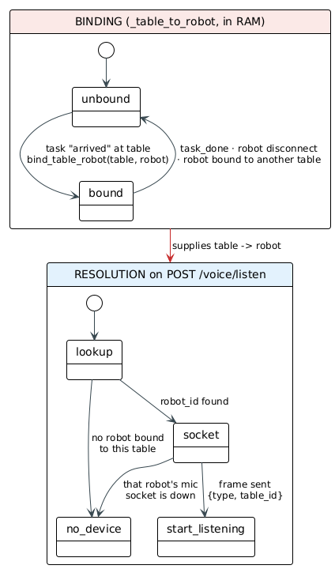
```plantuml
@startuml
' ── print profile (see "Rendering" at the top of this file) ──
!theme plain
skinparam backgroundColor #FFFFFF
skinparam defaultFontName "DejaVu Sans"
skinparam defaultFontSize 14
skinparam shadowing false
skinparam nodesep 18
skinparam ranksep 24
skinparam padding 2
skinparam roundCorner 6
skinparam ArrowColor #37474F
skinparam ArrowFontSize 12

state "BINDING (_table_to_robot, in RAM)" as VB #FBE9E7 {
  [*] --> unbound
  unbound --> bound : task "arrived" at table\nbind_table_robot(table, robot)
  bound --> unbound : task_done · robot disconnect\n· robot bound to another table
}

state "RESOLUTION on POST /voice/listen" as RES #E3F2FD {
  [*] --> lookup
  lookup --> no_device : no robot bound\nto this table
  lookup --> socket : robot_id found
  socket --> no_device : that robot's mic\nsocket is down
  socket --> start_listening : frame sent\n{type, table_id}
}

VB -[#C62828]-> RES : supplies table -> robot

@enduml
```

One physical robot holds **two** sockets under the same id — `role=robot` (motion) and
`role=voice-device` (mic) — in separate registries. The binding deliberately follows the *robot's*
presence, not the mic's: restarting the mic process must not force the robot to re-arrive at the
table before the guest can speak again.

**Task assignment cost function** (§4.7.4, and the thing Ch.5 should measure): eligibility is
`connected ∧ status ∈ {idle, returning} ∧ battery ≥ 20%`, then `argmin` Euclidean distance from the
robot's **live** pose to the table's approach waypoint, both in the saved SLAM map frame. Pending
tasks are assigned oldest-first and the loop **breaks** on the first unassignable task — so the
queue is FIFO, not best-effort reordered. `returning` counts as free because both robot clients
queue a task received mid-drive.

Note the layering to state explicitly: the dispatcher issues *system* tasks ("serve table 3") and
never speaks Nav2. It knows table waypoints only to rank robots; turning a task into motion is the
robot's own job. That separation is what lets the simulated and real robots share one backend.

---

## Figure 13 — WebSocket Hub (four roles, one endpoint)

> Ch.4 §4.7.2. Source: [realtime/ws.py](../../src/server_orchestrator/realtime/ws.py),
> [realtime/connection_manager.py](../../src/server_orchestrator/realtime/connection_manager.py).
>
> **Caption:** *One `/ws` endpoint, four client roles, four in-RAM registries — `_by_role`
> (role→sockets), `_robots` and `_voice_devices` (robot_id→socket), and `_table_to_robot`
> (table_id→robot_id). Viewers (`panel`, `customer`) are anonymous and their inbound frames are
> ignored; only robot frames are parsed and routed to the dispatcher, so the hub has exactly one
> inbound message grammar to trust.*

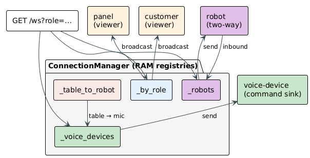
```plantuml
@startuml
' ── print profile (see "Rendering" at the top of this file) ──
!theme plain
skinparam backgroundColor #FFFFFF
skinparam defaultFontName "DejaVu Sans"
skinparam defaultFontSize 14
skinparam shadowing false
skinparam nodesep 18
skinparam ranksep 24
skinparam padding 2
skinparam roundCorner 6
skinparam ArrowColor #37474F
skinparam ArrowFontSize 12
skinparam NoteBackgroundColor #FFFDE7
skinparam NoteFontSize 11
skinparam componentStyle rectangle

rectangle "GET /ws?role=…" as EP #FFFFFF

package "ConnectionManager (RAM registries)" #F5F5F5 {
  rectangle "_by_role" as BR #E3F2FD
  rectangle "_robots" as RB #E1BEE7
  rectangle "_voice_devices" as VD #C8E6C9
  rectangle "_table_to_robot" as TR #FBE9E7
}

rectangle "panel\n(viewer)" as PANEL #FFF3E0
rectangle "customer\n(viewer)" as CUST #FFF3E0
rectangle "robot\n(two-way)" as ROBOT #E1BEE7
rectangle "voice-device\n(command sink)" as VOICE #C8E6C9

EP --> BR
EP --> RB
EP --> VD

PANEL <-- BR : broadcast
CUST  <-- BR : broadcast
ROBOT <-- RB : send
ROBOT --> RB : inbound
VOICE <-- VD : send

TR --> VD : table → mic

@enduml
```

### Message vocabulary per role (Table 4.y)

| Role | Direction | Messages |
|---|---|---|
| `panel` | server → client | `order.created` · `table.updated` · `robot.updated` · `task.created` / `task.updated` |
| `customer` | server → client | `voice.heard` · `voice.reply` · `voice.progress` · `robot.arrived` |
| `robot` | server → client | `task.assign` |
| `robot` | client → server | `heartbeat` · `task_accepted` · `arrived` · `task_done` · `at_dock` |
| `voice-device` | server → client | `start_listening` · `cancel_listening` · `set_muted` |

Broadcast is **fire-and-forget with drop-on-error**: a socket that raises is disconnected and
skipped rather than retried, so one dead browser tab cannot stall the panel fan-out or hold the
event loop. Combined with the pose-broadcast throttle (0.2 s), that is what keeps a moving fleet
from flooding the hub.

---

## Fact Sheet — verified constants

Every number below was read from the code on 2026-07-23. Quote these in Ch.4/Ch.5 rather than the
values in older design docs; where the two disagree, the code is right.

| Component | Constant | Value | Source |
|---|---|---|---|
| Intent classifier | architecture | 778 → 256 → 64 → 4, ReLU, dropout 0.2 | `classifier/model.py` |
| | embedding | `bkai-foundation-models/vietnamese-bi-encoder`, 768-d, float32 | `predict.py`, `.env.template` |
| | context features | 10-d (8 effectively active) | `classifier/features.py` |
| | fast-path threshold | `0.70` | `classifier_router_node.py` |
| | boundary markers | `rồi, và, thì, xong, rồi thì, với lại` | `classifier_router_node.py` |
| | failure fallback | intent = `CHAT`, confidence `0.0` | `classifier_router_node.py` |
| Agent graph | registered / live nodes | 11 / 10 (`router` = rollback path) | `graph.py` |
| | retry cap | `MAX_RETRY_LOOPS = 3` | `graph.py` |
| | tools | `search, add_cart, remove_cart, clear_cart, confirm_order, request_payment, verify_payment` (+ `delegate`) | `graph.py`, `tools/` |
| Validator | menu resolution | exact → single prefix/substring → ambiguous → modifier-strip retry → Jaccard suggestion | `menu_utils.py` |
| | suggestion floor | Jaccard `>= 0.30` | `menu_utils.py` |
| LLM | model | `qwen2.5:7b-instruct` (code default) / `qwen2.5:14b-instruct-q6_K` (`.env.template`) | `agent_config.py` |
| | context window | `LLM_NUM_CTX = 16384` | `agent_config.py` |
| | keep-alive | `-1` (pinned resident) + startup warmup | `agent_config.py`, `server.py` |
| RAG | candidates per lane | 15 | `hybrid_retriever.py` |
| | BM25 | `BM25Okapi(k1=1.2, b=0)`, underthesea tokens | `indices/bm25.py` |
| | gatekeeper | vector top-1 `>= 0.35` **OR** lexical token hit | `fusion/rrf.py` |
| | RRF constant | `k = 60` | `fusion/rrf.py` |
| | returned | top-6, deduped by dish name | `search_tool.py` |
| Voice | VAD | Silero, threshold `0.5`, 512-sample (32 ms) frames @ 16 kHz | `vad_silero.py` |
| | end-of-utterance | 1.5 s silence (≈47 frames) | `vad_silero.py` |
| | STT | faster-whisper `medium`, `language="vi"`, `beam_size=5`, cuda/float16 | `stt_phowhisper.py` |
| | queues | `speech_queue` / `text_queue`, maxsize 10, drop-newest + counter | `perception/queues.py` |
| | TTS | Piper `vi_VN-vais1000-medium` (local) → edge-tts `vi-VN-HoaiMyNeural` (cloud) | `tts_engine.py` |
| | playback | 22.05 kHz, non-blocking, VAD barge-in | `tts_engine.py` |
| | turn timeouts | utterance 15 s · transcript 12 s · agent HTTP 60 s | `edge_voice/main.py` |
| Fleet | min battery for a task | `20.0` % | `dispatcher.py` |
| | pose broadcast throttle | `0.2` s | `dispatcher.py` |
| | DB pose snapshot | every `15.0` s | `dispatcher.py` |
| Ports | agent / orchestrator / frontends | 8100 / 8000 / 5173 | `server.py`, `main.py` |

### Three drift risks to fix before submitting

1. **`PhoWhisperSTT` loads Whisper-medium, not PhoWhisper** (Figure 8). Rename or swap.
2. **The `DRAFTING` order stage is dead**, and two of the classifier's ten context dims are always
   zero (Figures 4 and 9). Both are safe to describe accurately; neither is safe to overclaim.
3. **The LLM model differs between the code default (7B) and `.env.template` (14B-q6_K).** Ch.5
   results are only reproducible if you state which one produced them, on which hardware.

---
