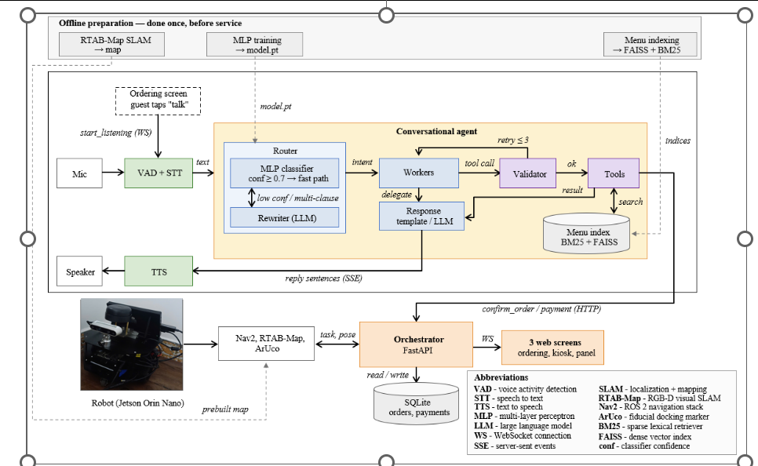

## 4.3 AI System Architecture

The AI system follows a hybrid design: the robot carries the body (perception, voice I/O,
and navigation, built in Chapter 3), while a central server carries the brain (language
model, conversational agent, business records, and menu retrieval). This section presents
the architectural split and the two-process server design that houses the AI.

*Figure 4.1. System Architecture Overview: the three-tier layout and the type of connection
on each link. (drawn by the group)*

### 4.3.1 Hybrid Architecture

The decision to run the AI on the server is not a matter of preference; it is forced by
memory. The robot's Jetson Orin Nano carries 8 GB of unified memory shared by every
process on the device, and it does not start empty. Chapter 3 delivered the navigation and
localization stack. Table 4.1 shows what that stack leaves for the components of this chapter.

*Table 4.1. Memory budget on the Jetson after the navigation stack of Chapter 3.*

| | Memory |
|---|-------:|
| Jetson Orin Nano unified memory | 8.0 GB |
| Navigation and localization (ROS 2, RTAB-Map, Nav2, EKF, sensor drivers) | ~3.7 GB |
| **Available for the voice pipeline and the language model** | **~4.3 GB** |

Into that ~4.3 GB must fit two workloads. The first is the voice pipeline: the survey of
§2.3 established that a usable on-device stack of voice activity detection, speech
recognition, and speech synthesis occupies between roughly 2 GB and 4 GB, depending on the
accuracy target chosen. The second is the language model: §2.4.3 surveyed Vietnamese-capable
models and found that the class able to follow a tool-calling protocol reliably across
several turns begins at approximately 7 billion parameters. At the lowest usable precision,
that class holds about 4 GB of weights alone; the attention cache and inference runtime sit
on top.

Even at the low end of both ranges, the combined need exceeds the ~4.3 GB available.
One of the two must run elsewhere. The design requirements demand that speech be captured,
transcribed, and synthesized entirely on the robot, and the microphone and speaker are
physically attached to it, so the voice pipeline is the component that cannot leave.
The language model, in contrast, is wired to no device and closes no control loop, so nothing
about the robot's hardware pins it in place. It therefore moves to the server, where it has
room to be as capable as the task needs.

Three further reasons support the same choice, none of them about memory:

- **Speed.** Only text crosses the WiFi, never audio. A transcript is under a hundred bytes
  where the raw audio it replaces is roughly a hundred kilobytes, so the network step is
  small and adds almost no delay.
- **Data safety.** The robot stands on the floor, where it can be damaged or taken, so
  nothing lasting is kept on it. Every order, payment, and conversation lives on the server.
  A robot that is lost carries no customer data and can be replaced at once.
- **Fleet consistency.** One model on one server serves every robot the same way, so
  behaviour does not drift, and an improvement is installed once rather than on each robot
  in turn.

The architecture therefore places perception and navigation on the robot, where they are
wired to sensors and motors, and places the reasoning engine and shared business state on
the server, where they have room and are common to all tables and all robots.

### 4.3.2 Agent and Orchestrator

The server runs two programs as separate processes. The agent turns a Vietnamese sentence
into a checked action, calling a language model served on the same machine by Ollama. The
orchestrator maintains the shared business state: tables, sessions, orders, payments, and
the real-time push of events to every screen. Two databases sit behind them, one for
business records and one for conversation history, each a single file.

The separation is deliberate. One reasoning step through the agent takes seconds and blocks
while it runs; the orchestrator's work takes milliseconds. Keeping them apart means a slow
reasoning step never freezes the kitchen screen, and either program can be restarted
without bringing down the other.

In operation, transcribed text arrives at the agent. The agent determines the intent,
validates the action, executes it, and returns a spoken reply. When the action is a
confirmed order or a payment, the agent calls the orchestrator, which records the event
and pushes it to the screens that need it. Every step past transcription runs on the server.
