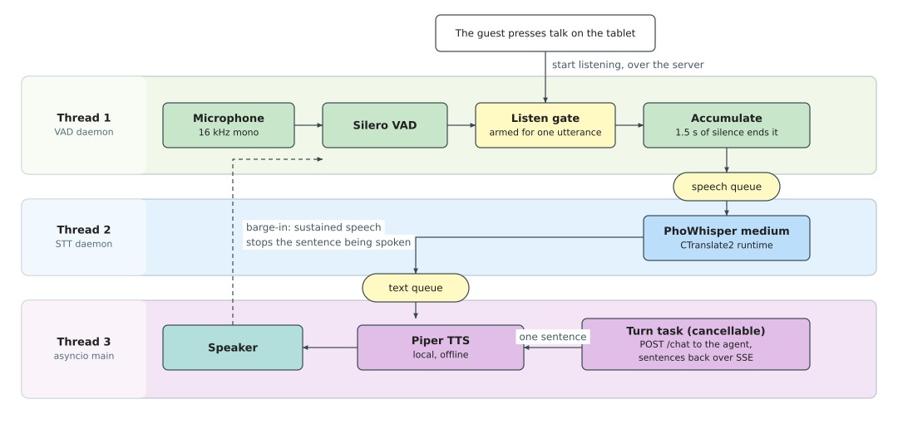

## 4.4 Edge Voice Pipeline

The voice pipeline captures Vietnamese speech on the robot, transcribes it, and synthesises
the agent's reply, all without depending on the network. This section selects the three
components that make this possible and describes how they are wired together.

### 4.4.1 Component Selection

Each component is evaluated against three criteria drawn from the design requirements:

- **Offline.** It must run on the robot without internet access, because the restaurant's
  network can drop and the robot still has to take the order in front of it.
- **Small.** It must fit within the memory left by the navigation stack and must not require
  GPU memory the robot does not have.
- **Vietnamese.** It must handle the six tones and their diacritics that carry meaning in
  Vietnamese speech.

**Voice activity detection.** The survey of §2.3.1 identified Silero VAD as a small neural
detector of about 2 MB that runs in real time on the CPU and requires no GPU memory. It is
language-agnostic, so it handles Vietnamese with no change. A single sensitivity threshold
is tuned to catch quiet speech while ignoring ambient noise such as plates being set down.

**Speech recognition.** The survey of §2.3.2 identified PhoWhisper as a Vietnamese-tuned
variant of Whisper. PhoWhisper at the medium size is selected. Its fine-tuning on
Vietnamese speech data sharpens recognition of the six tones and their diacritics, the
dimension where general multilingual models most underperform Vietnamese. It runs offline
through the faster-whisper runtime and transcribes a typical utterance in approximately
800 milliseconds, well within the latency budget for a spoken interaction. At about 3.5 GB
of runtime memory it is the largest piece of the voice pipeline, but fits within the
roughly 4.3 GB the navigation stack leaves free.

**Speech synthesis.** The survey of §2.3.3 compared both offline and cloud-based TTS
engines. Piper is selected: it is a small neural voice of about 200 MB that runs on the
CPU and speaks a sentence in roughly half a second. It is the only Vietnamese TTS option
that runs fully offline, satisfying the requirement that the voice pipeline must not depend
on the network.

Together the three components use approximately 3.7 GB. This fills nearly all of the
roughly 4.3 GB the navigation stack leaves free, which is the reason the language model
cannot join them on the robot, as established in §4.3.1.

### 4.4.2 Threaded Architecture

The three components run on different hardware at different speeds: the microphone captures
audio on the CPU, speech recognition transcribes on the GPU, and the main loop communicates
with the server over the network. If they ran one after another, each stage would idle
while the next one worked, and the total turn time would be the sum of their individual
latencies.

To prevent this, each component runs in its own thread and hands work to the next stage
through a small queue. While the STT thread transcribes one utterance, the VAD thread is
already free to capture the next, and the main thread can be sending an earlier transcript
to the agent. The three kinds of work never block one another, so the total turn time is
driven by the slowest stage rather than by the sum of all three.

*Figure 4.2. Edge Voice Pipeline: the three threads passing one utterance through two
queues, with the barge-in path that lets the customer interrupt. (drawn by the group)*

The VAD thread owns the microphone and remains idle until the server commands it to listen,
which happens only when the customer presses the talk button on the tablet. Once armed, it
captures audio until it detects roughly 1.5 seconds of silence, then passes the utterance
to the STT thread. The STT thread transcribes the audio and passes the Vietnamese text to
the main thread. The main thread sends the text to the agent and plays the reply back through
the speaker. Because the agent streams its answer one sentence at a time, the thread speaks
each sentence as it arrives rather than waiting for the full reply.

The customer can interrupt at any time: the VAD thread keeps monitoring the microphone
during playback and stops the current sentence when it detects sustained speech, producing
natural turn-taking. A short burst of noise such as a plate being placed on the table is
not enough to trigger this, only continued speech.

Together, the selected components and the threaded architecture satisfy the design
requirements. The voice pipeline runs entirely on the robot, fits within the memory left
by the navigation stack, and handles Vietnamese tones throughout. No audio crosses the
network, and the streamed, interruptible replies keep each spoken turn short.
