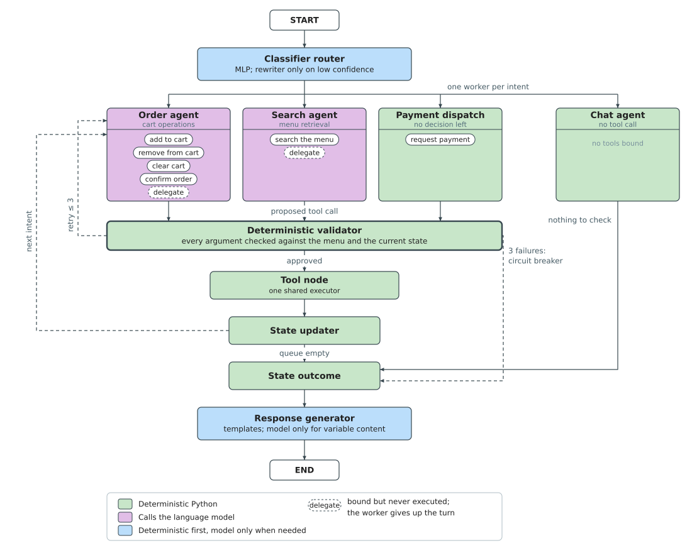

## 4.5 Conversational Agent

The voice pipeline of §4.4 delivers transcribed Vietnamese text to the server. From this
point, the system must determine what the customer wants, decide what action to take,
ensure that action is safe, and produce a spoken reply. This section presents the
conversational agent that performs that work.

### 4.5.1 Agent Architecture

The survey of Section 2.4 found four absences in prior work on conversational agents, and
read them as one: in each case the decision about what the system will do is left inside
the component that proposes the action. No architecture has been evaluated in a domain
where a wrong action costs a business record rather than an iteration (§2.4.2). Nothing
autonomous occupies the interval between a fully formed tool call and its execution, and
no benchmark scores the state a sequence of calls leaves behind rather than each call in
isolation (§2.4.5, §2.4.2). No routing mechanism varies with the utterance, and none has
been evaluated on Vietnamese task-oriented speech (§2.4.4). And no memory architecture
treats conversation history and the transactional record under separate policies (§2.4.6).

The architecture proposed here answers all four by making that placement the design
variable: every decision the system depends on is moved out of the language model and
into ordinary code, and the model is left with the two jobs it is actually good at.
The design is a graph of ten nodes organised into five stages: classify the intent,
decide the action, validate the action, execute it, and respond. Figure 4.3 shows the
topology.

*Figure 4.3. Agent StateGraph Topology: an utterance enters at the router and dispatches to
one of four specialized workers, each holding only the tools of its own intent class. Every
proposal from the three tool workers passes through the validator before the tool node runs
it; the chat agent holds no tools and bypasses both. The state updater merges results, the
state outcome finalizes the turn, and the response generator produces the spoken reply.
The two return paths lead back to whichever worker is current, not to the order agent alone.
(drawn by the group)*

Four design choices answer the architectural absence, the structural inspection of every
proposal. The graph places the validator on every edge between a worker and the tool node,
so no tool call can execute without passing through it. The workers are specialised by
domain rather than monolithic: each is bound only to the tools of its intent class, which
prevents the domain confusion a single call with all tools would suffer. A delegate tool
bound to both language-model workers provides a non-destructive escape when an utterance
falls outside a worker's domain. It is the one callable the tool node never executes: the
graph reads it as an instruction to stop, records the reason the worker gave, and lets the
turn finish without a tool call, so the reply is built from the conversation rather than
from an action. A restaurant hours question reaching the search worker is not a search the
menu can answer. The model is never forced to guess; when it is uncertain about its domain,
it admits it. And if three consecutive validations fail, the circuit breaker
routes to the state outcome, which produces a spoken apology rather than infinite retries
or silence.

The unoccupied interval is answered by the deterministic validator, which is what sits in
it. Positioned after every worker and before the tool node, it inspects each proposed tool
argument against the authoritative menu and the current conversation state. It resolves
dish names, detects ambiguous references, strips off-menu items with nearest-match
suggestions, and enforces ordering workflow constraints. Neither the language model nor the
agent generates corrections autonomously; only the customer can accept a suggestion or
choose a different item. The same component also covers the compositional half of that
absence, since the sequence a turn produces is checked as well as each call: an order
cannot be confirmed until the cart it confirms has been drafted and echoed, so the pair of
calls that would score correctly twice and leave an empty transaction is refused. The
validator is the subject of §4.5.4.

The routing absence is answered by the classifier router, a trained MLP that combines a
frozen Vietnamese bi-encoder with ten hand-crafted context features extracted from the
conversation state. It produces a four-class intent distribution at millisecond latency
without calling the language model, and the mechanism is not fixed for the whole session:
an LLM-based rewriter is reserved for the compound utterances the classifier cannot
resolve on its own, so the cost is paid per utterance rather than per turn. The router is
the subject of §4.5.2.

The treatment of state is answered by separating the two kinds of content the memory
literature stores together. The conversation history and the typed application state live
in distinct fields of one state object, persisted under a thread identifier tied to the
restaurant's own session lifecycle, so the cart and the order stage are never summarized
and never survive into the next party's visit. State management is the subject of §4.5.5.

Table 4.2 names the nodes in the order an utterance meets them.

*Table 4.2. The nodes of the agent graph, in the order an utterance meets them.*

| Node | Stage | Kind | Responsibility |
|------|-------|------|----------------|
| Classifier router | Classify | Trained MLP + LLM fallback | Embeds the utterance with conversation-state features; classifies into one of four intents; invokes the rewriter to decompose compound utterances |
| Order agent | Decide | LLM | Selects a cart operation and extracts item names, quantities, and special requests from the utterance |
| Search agent | Decide | LLM | Rewrites the conversational request into concrete search terms and dispatches retrieval |
| Payment dispatch | Decide | Deterministic | Emits a request-payment call; no further decision needed once the router has classified PAYMENT |
| Chat agent | Decide | Deterministic | Assembles conversation history, cart, and curated dish memory into a typed context for the response stage |
| Validator | Validate | Deterministic | Inspects every tool call argument against the authoritative menu; resolves dish names, detects ambiguity, rejects off-menu items |
| Tool node | Execute | Deterministic | Runs the approved tool calls: cart operations, search, or payment |
| State updater | Execute | Deterministic | Merges tool results into the agent's state; pops the processed intent from the queue |
| State outcome | Respond | Deterministic | Builds a typed response context from the executed action; clears per-turn ephemeral fields |
| Response generator | Respond | Templates + LLM | Converts the typed context into spoken Vietnamese via pre-written templates or language-model paraphrasing |

Seven of the ten nodes are deterministic Python code; two call the language model; one
uses both. The language model is therefore one component inside a mostly deterministic
machine, not the machine itself. It is confined to two roles, proposing what to do and
how to say it, and it never writes to business state directly. Every other
responsibility, routing, validation, state transitions, and per-turn cleanup, is carried
by ordinary code whose behaviour is inspectable and repeatable.

A grounding guard at the output stage provides a final safety check: when the language
model generates dish recommendations, the reply is inspected to confirm it names only
dishes that were actually retrieved. A reply that invents a dish name is replaced
wholesale by a deterministic listing of the real results, ensuring no fabricated item
ever reaches the customer.

A turn flows through these nodes as follows. The classifier router determines the intent
and dispatches to one of four workers. The order and search workers call the language
model to propose a tool action; the payment and chat workers are deterministic. Every
proposed action passes through the validator before the tool node executes it. If more
than one intent was classified, the state updater pops the processed intent from the
queue and routes to the next worker, sequentially so that an order-then-pay utterance
adds the items before computing the bill. When the queue is empty, the state updater
routes to the state outcome, which finalises the turn and builds a typed response
context. The response generator converts that context into spoken Vietnamese, using
pre-written templates for deterministic outcomes and the language model only where the
content varies.

The following subsections describe each stage in turn.
