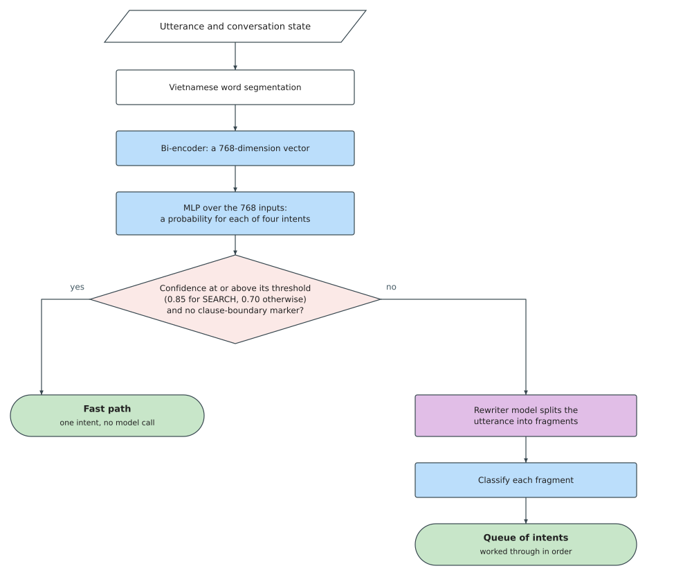

## 4.5.2 Intent Classification

Section 2.4.4 surveyed five intent classification approaches. Rule-based classifiers are
fast and deterministic but stateless; semantic centroid routers handle domain vocabulary
but cannot see conversation state; LLM-based routers satisfy every accuracy criterion but
introduce non-determinism and latency measured in seconds; and LLM-based decomposition
uses the model only to split an utterance, leaving the classification to something faster.
The fifth, state-augmented classification, is the closest existing approach to what this
section proposes: it concatenates dialogue-state features with the text representation and
so is deterministic, context-aware, and fast at once. Two things stand between it and this
domain. It requires corpora annotated with dialogue state, and none exists for Vietnamese.
And it is reported as unable to handle multi-intent utterances, which arrive here routinely.

The router proposed below is a state-augmented classifier built for those two conditions:
its training corpus is written by hand rather than drawn from an annotated one, and the
multi-intent case is handed to a decomposition step invoked only when needed, so the two
approaches the survey lists separately are combined and each is used where it is strong.
The design requirements of §4.1 set the difficulty: customers use teencode abbreviations,
context-dependent affirmations, and multi-clause sentences that combine ordering with
payment or search. The same short word maps to different actions in different conversation
states.

The proposed router answers a single question: given this Vietnamese sentence and the
current conversation state, what does the customer want to do? A routing error cascades:
an ordering intent sent to the chat worker produces a conversational reply instead of
a cart operation, and a chat intent sent to the order agent produces a spurious tool
call that the validator must later reject.

The router is a multi-layer perceptron that accepts a 778-dimensional input vector
concatenating a 768-dimensional Vietnamese sentence embedding with ten hand-crafted
context features extracted from the conversation state. The network reduces this
high-dimensional input through two hidden layers before producing a four-class
probability distribution via softmax. Table 4.3 gives the layer-by-layer composition.

*Table 4.3. Layer composition of the intent classifier MLP.*

| Layer | Dimensions | Activation | Dropout |
|-------|-----------|------------|---------|
| Input | 778 | n/a | n/a |
| Hidden 1 | 778 → 256 | ReLU | 0.2 |
| Hidden 2 | 256 → 64 | ReLU | 0.2 |
| Output | 64 → 4 | Softmax | n/a |

The two hidden layers progressively compress the input space from the embedding
dimension (768) plus the context features (10) down to four logits. The dropout
layers, applied after each hidden activation during training, prevent the network
from relying on any single input dimension and improve generalisation to unseen
utterances. The entire model holds approximately 220 thousand parameters, small
enough that inference completes in under one millisecond on the CPU with no GPU
dependency. The sentence embedding is produced by a Vietnamese-native bi-encoder,
`bkai-foundation-models/vietnamese-bi-encoder`, selected from the survey of §2.5.2
for its Vietnamese-language pre-training and 768-dimensional output. The same model
serves the retrieval pipeline (§4.6) and is loaded once at agent startup, so the
classifier and the retriever share one embedding model with no additional memory cost. Figure 4.4 illustrates the
pipeline.

*Figure 4.4. Intent Classification Pipeline: the utterance is segmented, embedded by the
same bi-encoder the retriever uses, and concatenated with the context features. The fast
path accepts a prediction when confidence reaches 0.70 and no boundary marker is present;
otherwise a rewriter decomposes the utterance into fragments classified one by one.
(drawn by the group)*

The ten context features are the architectural element that makes this router work.
A pure embedding-based approach cannot resolve context-dependent utterances because the
embedding vector for "ok" is the same regardless of whether the cart is empty or
awaiting confirmation. The features capture three specific cases the embedding alone
cannot separate: "ok" at awaiting confirmation is a confirmation while "ok" at idle is
casual acknowledgment; "gọi thêm" on an existing cart is an addition while "gọi món" on
an empty one is a first order; and a short question following a search is usually
another SEARCH rather than a new order. Table 4.4 gives their encoding.

*Table 4.4. The ten context features and how each is encoded.*

| Dimension | Feature | Encoding |
|-----------|---------|----------|
| 0 to 4 | Order stage | One-hot over idle, building, awaiting confirmation, confirmed, modifying |
| 5 | Cart present | 1 when the cart holds items, otherwise 0 |
| 6 | Cart size | Item count capped at ten, divided by ten |
| 7 | Search results present | 1 when a previous search is still in context, otherwise 0 |
| 8 | Search result count | Result count capped at twenty, divided by twenty |
| 9 | Utterance length | Character count capped at two hundred, divided by two hundred |

No labelled dataset of Vietnamese restaurant utterances exists, so one was written by
hand: 434 utterances composed against the restaurant's menu, spread across five
linguistic styles. Table 4.5 gives the style breakdown with representative examples.

*Table 4.5. The five styles of the manual dataset.*

| Style | Description | Example |
|-------|-------------|---------|
| Formal | Full sentences with polite particles "ạ", "dạ" | "Dạ cho em gọi 1 Lẩu Thái và 3 chai Bia Saigon ạ" |
| Casual | Natural everyday speech, shortened forms | "Cho 2 ốc hương đi em", "Bỏ món mực chiên sả ra khỏi đơn giúp mình" |
| Dialect | Regional variants: Southern "nghen", "hông"; Central "mô", "rứa" | "Cho anh 2 phần ốc hương nghen", "Món ni giá bao nhiêu rứa em" |
| Edge | One- or two-word utterances, inherently ambiguous without context | "ok", "ừ", "được", "chuẩn" |
| Fragment | Verbless clauses matching the output shape of the rewriter: 2–6 words, no politeness particles | "Cho 2 Ốc Hương", "Xoá hết giỏ hàng", "Tính tiền" |

The fragment style is essential for multi-intent turns. At inference, compound utterances
are split by the rewriter into single-intent fragments, and the classifier must handle
these stripped-down clauses, which carry no subject and no politeness particles, only the
words that bear the intent. Without fragment-shaped examples in training, multi-intent turns
consistently fail.

Each base utterance is then replicated under several conversation-state configurations
so the classifier learns that the same words mean different things depending on when they
are spoken. For each base utterance, the augmenter applies four to five context rules
defined per intent class: a given ORDER utterance is replicated under IDLE/empty-cart,
IDLE/with-cart, BUILDING/with-cart, AWAITING_CONFIRMATION, and CONFIRMED states. Each
replication generates a new training example carrying not only the utterance text but
also the five context fields that become the ten features in Table 4.4.

Ambiguous edge utterances such as "ok", "ừ", and "được" receive additional treatment.
Because these one-word affirmations are the hardest to classify, each is replicated a
further five times under randomly sampled context states. Their intent is reassigned
per replication: "ok" at AWAITING_CONFIRMATION becomes ORDER, while "ok" at IDLE or
BUILDING becomes CHAT. This context-dependent reassignment is what teaches the
classifier to use the ten features rather than memorising the text. Table 4.6 shows
how the corpus expands from 434 base utterances to 2,134 context-augmented examples.

*Table 4.6. Expansion of the training corpus by conversation-state augmentation. Base
utterances are counted by the intent they were written for; augmented examples by the
intent each carries after context resolution, which is why the two columns do not scale
by a common factor.*

| Intent | Base utterances | Augmented examples |
|--------|---------------:|-------------------:|
| ORDER | 129 | 650 |
| SEARCH | 128 | 512 |
| CHAT | 107 | 692 |
| PAYMENT | 70 | 280 |
| **Total** | **434** | **2,134** |

SEARCH and PAYMENT expand by exactly four, one example per context rule. ORDER and CHAT
do not, because the reassignment above moves examples between them: 83 utterances written
as ORDER carry the CHAT label in the state they were sampled into, and 14 written as CHAT
carry ORDER. CHAT therefore ends as the largest class in the training set even though it
is only the third largest in the authored corpus.

A 39-case holdout set was separated before augmentation so no augmented copy of a
holdout utterance can leak into the training split.

The model is trained on precomputed embeddings. Embeddings are computed once over the
entire corpus and cached, so training iterates over tensors rather than re-encoding
every epoch. The training configuration is given in Table 4.7.

*Table 4.7. Training hyperparameters and methodology.*

| Setting | Value |
|---------|-------|
| Optimizer | Adam (learning rate 1 × 10⁻³, weight decay 1 × 10⁻⁴) |
| Loss | Cross-entropy with inverse-frequency class weights |
| Train/validation split | 80/20, stratified by intent label |
| Batch size | 64 |
| Maximum epochs | 50, with early stopping (patience 10 on validation accuracy) |
| Feature scaling | StandardScaler fitted on training context features, saved with the model |
| Training time | ~2 minutes on precomputed embeddings (CPU) |

Class weights are computed as the inverse frequency of each intent in the training set,
which after augmentation runs from 692 CHAT examples down to 280 for PAYMENT, a ratio of
roughly two and a half to one. Without the weights the model favours CHAT, the class the
reassignment leaves largest, at the expense of PAYMENT and SEARCH.

The context features receive special treatment at both training and inference time.
Because they span different scales, one-hot vectors at {0, 1} alongside normalised
counts at [0, 1], a StandardScaler is fitted on the training split and applied to
both the training context vectors and, at inference, to the context features extracted
live from the conversation state. The scaler mean and scale are serialised alongside
the model weights and the label encoder, so the three artefacts loaded at agent startup
are: model.pt, scaler.npz, and label_encoder.json.

At inference the utterance is segmented, embedded by the frozen bi-encoder, and
concatenated with the ten context features after scaling. The embedding is produced at
float32 precision rather than float16, because the classifier's margin between a correct
and an incorrect intent is narrow enough that half-precision rounding could flip a
borderline prediction. Two outcomes determine the next step. If the
confidence exceeds 0.7 and no boundary marker is present (words such as "rồi," "và,"
"thì," "xong," or "với lại" that signal clause boundaries in Vietnamese), the predicted
intent is accepted directly and dispatched to the corresponding worker. This fast path
handles the majority of utterances.

If the confidence falls below 0.7 or boundary markers are detected, the utterance is
routed to a language-model-based rewriter that decomposes it into single-intent
Vietnamese fragments. For "Cho 2 Ốc Hương rồi tính tiền luôn," the rewriter produces
two fragments that are classified independently and queued for sequential execution
(§4.5.5). The rewriter is invoked only when the fast path cannot resolve the utterance,
so the language model cost is paid only when necessary, not on every turn.
