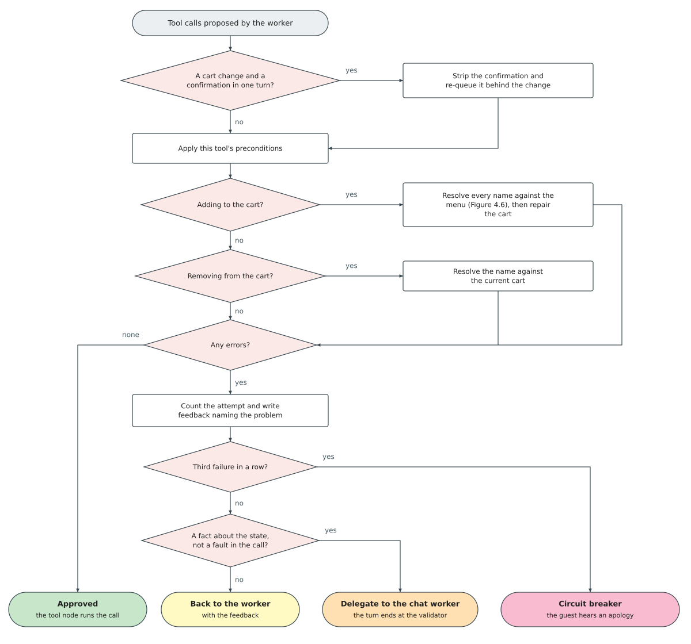
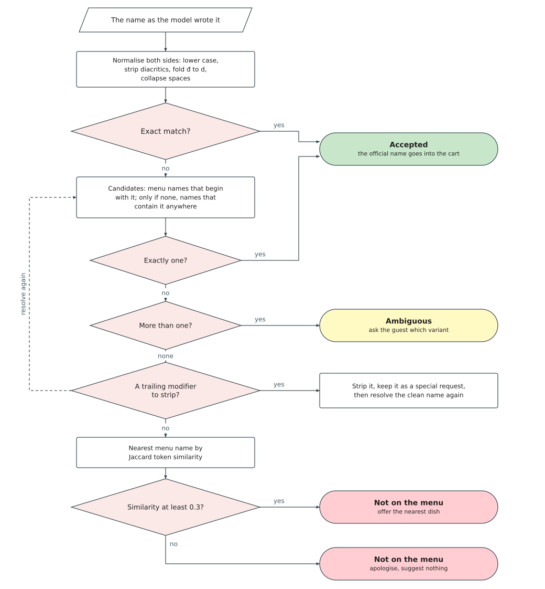

### 4.5.4 Deterministic Validator

The language model proposes; this node decides whether the proposal runs. It sits after a worker
has produced a complete tool call and before the tool node executes it, and it is plain Python
over the menu file and the current state, with no model call of its own. It inspects every
argument: each dish name, each quantity, and each step against the stage the order has reached.

A language model's output is probabilistic at any temperature. It can name a dish that is not on
the menu, ask for an impossible quantity, or try to confirm an empty order. The validator cannot
prevent those, only catch them before they reach the cart, the kitchen, or the bill. The
safeguards surveyed in Section 2.4.5 of Chapter 2 act while the model generates rather than
after: constrained decoding enforces the shape of the output and none of its meaning, since
"Cơm Tấm" is valid JSON and a real Vietnamese dish yet absent from this menu, while grounding the
prompt lowers the error rate without detecting what survives.

*Figure 4.5. Validator Control Flow: a proposed tool call enters, its arguments are checked
against the menu and the current state, and it leaves by one of four exits. The name
resolution an addition invokes is expanded in Figure 4.6; a removal resolves its name against
the cart instead. A rejection the worker can act on returns to it as corrective feedback, a
rejection that states a fact about the state goes to the chat worker, and three consecutive
failures trip the circuit breaker. (drawn by the group)*

The core check is menu name resolution: whether each name the model produced exists among the
menu's 234 entries, many of which share a leading word across a family of variants.

*Figure 4.6. Menu Name Resolution Cascade: resolution of a customer-spoken dish name, applied
to each item requested by a cart tool. A name that matches one menu entry is accepted, a name
that matches several produces a clarifying question rather than a guess, and a name that
matches none is reported as unavailable with the nearest suggestion. (drawn by the group)*

The cascade runs in four steps, ordered from the most reliable evidence to the least.

1. **Normalise.** Both sides are lowercased, stripped of Vietnamese diacritics through Unicode
   decomposition, the letter đ folded to d, and whitespace collapsed, so that "Oc Huong Xot Trung
   Muoi" and "Ốc Hương Xốt Trứng Muối" become the same string.
2. **Match exactly.** If the input equals a menu name, resolution stops and the item is accepted.
3. **Match partially.** Menu names beginning with the input are collected first, a prefix being
   the most intuitive abbreviation; only if none begin with it does the validator fall back to
   names containing it anywhere.
4. **Count the survivors.** Exactly one is accepted. Several are reported as ambiguous and never
   auto-resolved, since a family like "Ốc Hương" appears in eleven sauce variants and choosing
   one for the customer would be incorrect. None means the item is off-menu.

Token similarity plays no part in the decision. It runs only after an item is ruled off-menu, to
attach the best-scoring menu name by Jaccard similarity as a suggestion, and only if the score
reaches 0.3; below that floor an apology is more useful than a barely related dish. Running after
the ruling, it can never put a dish in the cart: the validator flags and suggests, the customer
decides.

Vietnamese customers append special requests directly to dish names: "Lẩu Thái, ít cay", "Ốc
Hương Xốt Trứng Muối, thêm hành", "Cơm Chiên (không hành)". The validator matches common
delimiters (parentheses, commas, dashes) in priority order, strips the modifier, re-resolves the
cleaned name, and stores the modifier in the item's special requests field. "Lẩu Thái, ít cay"
becomes the dish "Lẩu Thái" with the modifier "ít cay".

Beyond menu validation, four state consistency rules apply.

- **A cart change and a confirmation are split.** If the model emits a confirm-order call in the
  same turn as an addition, a removal, or a clear, the confirm is stripped and re-queued, so the
  customer sees the updated cart before confirming.
- **Additive turns restore the cart.** When the utterance carries a marker like "thêm" or "nữa"
  and the model produced a replacement rather than an addition, the existing cart is restored.
  A destructive marker ("bỏ", "xóa", "đổi") suppresses the restoration.
- **Re-added items are deduplicated.** Items the model pulled from context that the customer did
  not mention in the current utterance are stripped.
- **Clearing requires two turns.** The first `clear_cart` on a non-empty cart is refused and a
  delegate asks the customer to confirm; only the next-turn retry passes. A turn-index guard
  (`clear_confirm_at`) expires after exactly one turn, so a vague "thôi" cannot delete the cart.

Table 4.7 lists the per-tool checks and what happens when each fails. Two of them are automatic
rather than protective: for payment and confirmation the validator injects the table identifier
into the arguments, since those tools call the orchestrator while the model works on
session-scoped state and does not know the identifier.

*Table 4.7. What the validator checks before each tool, and what happens when a check fails.*

| Tool | Checks applied | On failure |
|------|----------------|------------|
| Add to cart | Every item name resolves against the menu; quantity is greater than zero | The item is dropped and recorded as off-menu or ambiguous |
| Remove from cart | The name is resolved against the current cart rather than the menu, since the question is whether the customer has that dish to remove. Resolution tries exact match, then substring, then menu-driven lookup within cart items. If no quantity is specified or the quantity exceeds the cart count, the entire item is removed; otherwise only the specified quantity is subtracted | Rejected with feedback naming what the cart actually holds; worker retries or delegates |
| Clear cart | Cart must be non-empty, and the prior-turn confirmation guard must be satisfied. An already-empty cart is rejected outright | Rejected with feedback; first non-empty attempt routes to delegate for confirmation |
| Confirm order | Stage is awaiting confirmation; cart is non-empty; the item list is replaced with the server-side cart | Rejected with feedback, worker retries or delegates |
| Request payment | The table identifier is injected from session state | Rejected with feedback, worker retries |

On failure the validator builds per-tool feedback in Vietnamese naming the exact problem and the
nearest valid suggestion, and appends it to the conversation history, so the worker sees its own
failed attempt alongside the corrective instructions on retry.

Not every rejection is returned to the worker. Some state a fact about the current state rather
than a fault in the call: the cart is empty and there is nothing to confirm, or the dish to be
removed was never in the cart. Those end the turn at the validator, which passes its recorded
reason to the chat worker. Only malformed calls go back to be corrected.

The evidence behind that split is small but one-sided. Asked in development to recover from an
empty-cart rejection, the worker reached the right answer on none of four cancellations and on
two of seven confirmations, each failure consuming all three attempts before the turn fell out
with an apology.

A loop counter tracks retry attempts. At three consecutive failures the circuit breaker routes to
the state outcome, which produces a spoken apology, so the customer always hears a reply. The
validator is evaluated in Section 5.4.2 of Chapter 5.
