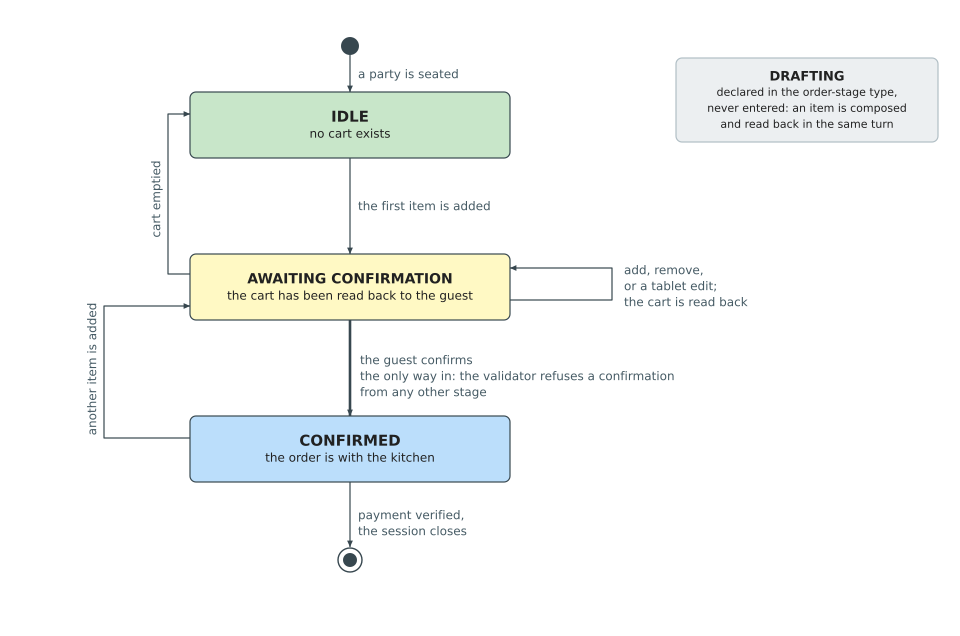

## 4.5.5 State Management

Section 2.4.6 surveyed memory strategies for conversational agents and found that they store
conversation history and application state through the same mechanism, and that no evaluation
separates the two or measures the effect of retaining each under a policy of its own. The
distinction matters because the two do not tolerate the same treatment. A summarized turn
still conveys the flow of a dialogue, so history survives lossy compression; an itemized
selection compressed to a phrase can no longer be priced, confirmed, or billed. General-purpose
agent frameworks provide sliding-window history and periodic summarization, but they do not
natively hold structured state such as the cart, order stage, and search context apart from the
message list. The pressure this puts on a Vietnamese deployment is worse than on an English one,
because Vietnamese consumes more of the context window for the same content, so the window
reaches the point of truncation or summarization sooner; the size of that penalty is
tokenizer-specific and is not reported for the models surveyed. This section presents the state
architecture that separates the two: a typed state object held apart from the message history,
persistence keyed to the restaurant's own session lifecycle, and a cart state machine that
enforces the ordering workflow.

The agent's shared state is a typed object carrying all information that must persist across
turns and flow between nodes. Its fields divide into five categories by lifecycle, so each node
knows which it may read, which it must write, and which are cleared before the next turn.
Conversation history is the only field that grows monotonically within a session; everything else
is overwritten or reset per turn. Table 4.10 sets out the categories.

*Table 4.10. The five categories of state field, by lifecycle.*

| Category | Fields | Lifetime |
|----------|--------|----------|
| Conversation history | User messages, assistant replies, tool results | Appends for the whole session |
| Task state | Table identifier, active cart (names, quantities, unit prices, special requests), order stage, search context | Persists across turns within the session |
| Routing state | Intent queue in first-in-first-out order, classification path taken, confidence score, per-intent sub-queries | Written by the router each turn, consumed as workers drain the queue |
| Inter-node contract | Validity flag, validator feedback, retry counter, off-menu items, ambiguous items | One turn only, cleared at the end of it |
| Output | Typed response context, UI action command, order-confirmed flag, cart-touched flag | One turn only, read by the response stage and the tablet |

The two one-shot flags in the output category earn their place: they let the tablet transition its
display exactly once, which is what stops the agent from overwriting a hand-edited cart on a turn
that had nothing to do with ordering.

The state persists between turns through a SQLite-backed checkpointer that saves after every
node execution. The critical design decision ties the conversation thread identifier to the
restaurant's session identifier: a session begins when a party is seated and ends
when payment is verified. Within a visit, all turns share the same thread and the
checkpointer restores the full state before each turn. Between visits, payment closes the
session, the next seating creates a new session with a new identifier, the checkpointer sees
a fresh thread, and all state is blank. No manual cleanup is needed; the session lifecycle
naturally partitions conversation memory.

Seven tools cover the agent's action space across three architectural categories, shown
in Table 4.11. Three in-memory cart tools operate with no network calls or external
dependencies and recompute prices from the authoritative menu data, never from the
language model. Three orchestrator API tools bridge the agent to the persistent
restaurant ledger. The search tool wraps the hybrid retrieval pipeline (§4.6). An eighth
callable, the delegate escape hatch, is bound to the two language-model agents but never
executes; the graph reads it as a routing instruction and hands the turn to the chat
worker.

*Table 4.11. The agent's seven tools, what each touches, and whether its effect outlives the
session.*

| Tool | Category | Effect | Permanent |
|------|----------|--------|-----------|
| Search | Retrieval | Reads the menu index and returns ranked dishes | No, read-only |
| Add to cart | In-memory | Adds items, merging quantities for a dish already present | No |
| Remove from cart | In-memory | Removes a line, or reduces its quantity | No |
| Clear cart | In-memory | Empties the cart | No |
| Confirm order | Backend | Writes the order to the ledger and returns its identifier | Yes |
| Request payment | Backend | Totals the session and returns the amount and QR code | Yes |
| Verify payment | Backend | Settles the bill, closes the session, frees the table | Yes |

The ordering workflow is governed by a finite state machine, illustrated in Figure 4.7. Four
stages are declared, but only three are ever written by the running system.

*Figure 4.7. Cart and Order Stage Machine: the stages a cart passes through and the tool that
causes each transition. The validator refuses a confirmation from any stage other than
awaiting confirmation, and that edge is the only way into the confirmed stage, so the property
that the customer saw the cart before being billed belongs to the graph rather than to a
prompt. (drawn by the group)*

In the idle state, no cart exists. The first successful addition moves the cart directly to
awaiting confirmation, because the same turn that adds an item also echoes the cart back to the
customer: there is no moment at which items sit in the cart unseen, so no separate drafting
stage is needed to represent one. Further additions, removals, and clearances keep the cart at
awaiting confirmation and re-echo it, and emptying the cart returns it to idle. Only an
explicit confirmation moves it to confirmed and sends the order to the kitchen. The critical
rule is that no modification can proceed silently to confirmation; the customer always sees the
updated cart first, and the validator enforces this by refusing a confirmation from any stage
other than awaiting confirmation. In the confirmed state, payment proceeds and a new addition
starts a fresh cycle. A fourth stage, drafting, is declared in the order stage type as a
reserved value for a future workflow but is never assigned by the current system: composition
and presentation happen in the same turn.
