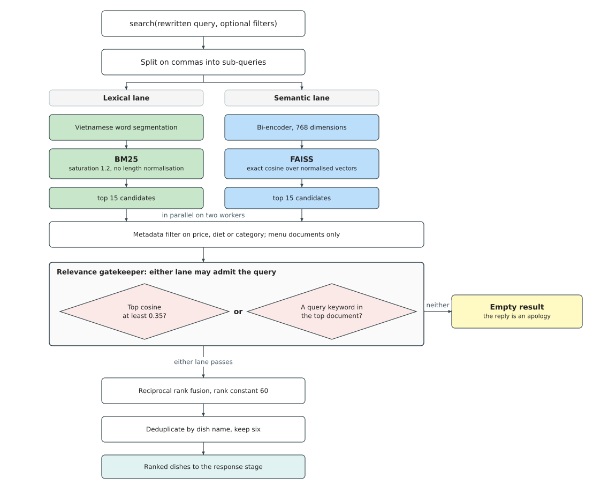

## 4.6 Knowledge Retrieval Pipeline

A customer asks "món gì ấm bụng cho ngày lạnh?". The menu lists dishes by name, category, and
price, and no word of that question appears in it. Keyword search returns nothing; vector search
returns whatever sits nearest a general sentence about warmth. The query and the dish that
answers it share no vocabulary, so ordinary retrieval has nothing to match on.

The pipeline closes that gap in four stages. The model rewrites the query into concrete search
terms. A keyword index and a vector index search the same 234-entry menu in parallel. A gate
decides whether the results are worth answering at all. What survives is rephrased against the
original request and retained for later turns.

*Figure 4.8. Hybrid Retrieval Pipeline: the rewritten query enters two lanes that run in
parallel, keyword matching over the menu text and semantic similarity over the shared
embedding index. The gatekeeper admits a result only when one of the two lanes is confident,
so an out-of-domain question returns nothing rather than the least bad dishes. Survivors are
fused by rank, deduplicated by dish name, and cut to the final list. (drawn by the group)*

### 4.6.1 Query Rewriting

The search agent uses the language model to translate the utterance into search terms before any
retrieval runs. The task is cultural mapping, not keyword extraction. "Ấm bụng" names the
sensation of warmth and fullness after eating, which in Vietnamese cuisine means noodle soups,
hot pots, porridges, and stews. The model produces "lẩu, súp, cháo, bún, phở, món nước nóng",
all of which appear in the menu's category and tag metadata. Extracting tokens from the original
would give "món", "ấm", "bụng", "lạnh", matching no entry.

The rewritten query is split on commas, and each term runs as an independent sub-query. Results
are merged and deduplicated by dish name, so one request becomes five parallel searches covering
every category the model identified. Decomposition is the model's responsibility; the retriever
matches terms without knowing why they were chosen. Mappings such as "ấm bụng" to "cháo, lẩu,
súp nóng" or "giải nhiệt" to "nước ép, sinh tố, trà đá" are taught by example in the search
agent's prompt, which removes the need for a separate rewriting model or a synonym dictionary.

Abstracting a query upward before retrieval is Step-Back Prompting, from the survey of
retrieval-augmented generation in Section 2.5.4 of Chapter 2. Two things differ here: the
abstraction yields several categories rather than one higher-level question, since a sensory
description spans unrelated parts of a menu, and what is abstracted is a culinary association
rather than a fact.

### 4.6.2 Hybrid Retrieval and Fusion

Two lanes run on the rewritten query at the same time. BM25 matches keywords against dish names,
categories, tags, and taste profiles. FAISS matches meaning by cosine similarity over embedding
vectors. Their failure modes are opposite, which is the reason for running both.

*Table 4.12. Where each retrieval lane succeeds, where it fails, and on what kind of query.*

| Lane | Strong when | Weak when | Worked example |
|------|-------------|-----------|----------------|
| Keyword | The query names a dish or a category that appears in the menu text | The query and the dish that answers it share no words | "Ốc Hương" finds every sauce variant; "hải sản" misses "tôm mực cá" |
| Semantic | The query describes a taste, an attribute, or a sensation | The dish name is rare and the encoder has little evidence for it | "món cay" finds spicy dishes with no word match; "Ốc Hương Xốt Trứng Muối" may sit closer to generic restaurant text than to itself |

Both indices cover the same 256 documents: 234 menu dishes, plus 22 supporting documents on best
sellers, the restaurant itself, and returning customers. Each dish becomes one document
concatenating name, category, tags, taste profile, and description. The keyword lane tokenises
with Vietnamese word segmentation so compounds stay whole. The semantic lane encodes each
document as a 768-dimensional vector using the frozen bi-encoder shared with the intent
classifier, loaded once at startup, and searches exactly rather than approximately, which costs
nothing at this corpus size.

The two lanes differ on one preprocessing step: the classifier keeps word segmentation, its
weights having been trained on segmented vectors, while the dense lane disables it. A menu
document is a multi-line field-and-value template that the segmenter splits differently from a
spoken question, so a dish name could break across two tokens at index time while staying a
single compound in the query, leaving the two unable to match.

Both lanes are queried on a two-worker pool, so wall-clock time is the maximum of the two rather
than their sum. Each returns up to fifteen candidates. A metadata post-filter then applies if the
customer named a constraint on price, dietary type, or category, and it applies only to menu
documents, leaving supporting material untouched.

A query that clears the gate has its two ranked lists fused by Reciprocal Rank Fusion, which
operates on ranks rather than raw scores. The scores are not comparable: BM25 produces unbounded
term-weight sums, FAISS bounded cosine similarities. Each list contributes to a document the
quantity

    w / (k + r)

where r is the document's rank in that list, k the rank constant, and w the weight of the lane.
Contributions are added, and a document appearing in one list only receives one contribution. The
constant damps the gap between neighbouring ranks, letting a document both lanes rank well
outrank one that a single lane puts first.

The keyword lane carries the heavier weight, at 3 against 1. A customer ordering from a
restaurant says the words printed on its menu, so lexical overlap is high, and equal weights let
the semantic lane demote an exact match in favour of a dish that is merely thematically close.
The semantic lane is kept at reduced weight for coverage rather than ranking quality: it answers
questions about the restaurant itself, which the twenty-two supporting documents serve and the
keyword lane handles poorly, since that lane indexes only their titles and leaves the body of an
information section reachable through the dense lane alone.

The fused list is sorted by descending score, deduplicated so an item found by both lanes appears
once, and truncated to six. Deduplication keys on dish name, falling back to section title for
supporting documents; keying on name alone dropped every restaurant-information result.

### 4.6.3 Relevance Gatekeeper

The gatekeeper runs before fusion and decides whether the query is worth answering at all. Two
tests are applied to the retrieved candidates. Either one passing admits the query; only if both
fail does retrieval return an empty list, with no fusion performed.

- **Semantic test.** The top FAISS result passes if its cosine similarity reaches 0.25.
- **Lexical test.** Vietnamese function words are stripped from the query, and any remaining term
  must appear as a whole term in the top three documents of either lane. Depth three rather than
  one, because a descriptive term such as "ấm bụng" often sits at rank two or three in a correct
  retrieval.

Two rules make the lexical test capable of rejecting anything, both added after an earlier
version admitted every query put to it. Matching is by whole term rather than substring, since
"đông" in "nhóm đông người" is contained in "Cải Thìa Xào Nấm Đông Cô". Function words are
stripped first, since "có", "món" and "gì" appear in nearly every menu document, each being
rendered from a template carrying the fields "Loại món ăn" and "Giá".

The semantic test does not discriminate. Answerable queries score 0.27 to 0.65 against their best
document, while food the restaurant does not serve at all, pizza or sushi, scores 0.29 to 0.32.
The ranges overlap, so the threshold sits below both and admits everything; rejection comes from
the lexical test alone. One class of query defeats the gate: an item not sold, phrased around a
word the menu uses. "Giá xe máy" matches "giá", a field on every entry, which no stop list can
remove without discarding legitimate price questions.

CRAG places a comparable check at this point, scored by a language model call with a web-search
fallback (Section 2.5.4 of Chapter 2). This gate is two threshold tests over values the
retrievers have already computed, so it costs no inference, and it returns nothing rather than a
substitute from outside the menu.

*Table 4.13. Settings of the retrieval pipeline.*

| Stage | Setting | Value |
|-------|---------|-------|
| Keyword lane | Term frequency saturation | 1.2 |
| | Document length normalisation | Disabled, since menu entries are short and near-uniform |
| | Tokenisation | Vietnamese word segmentation, then compounds flattened to their syllables |
| | Zero-score documents | Excluded, since a document sharing no term still takes a rank position |
| Semantic lane | Embedding dimensions | 768 |
| | Index | Exact flat inner product over normalised vectors |
| | Tokenisation | Word segmentation disabled, unlike the keyword lane and the classifier |
| Both lanes | Candidates returned per lane | 15 |
| Gatekeeper | Semantic lane, top-1 cosine similarity | At least 0.25 |
| | Lexical lane, query terms | Vietnamese function words removed before the test |
| | Lexical lane, match rule | Whole term, not substring |
| | Lexical lane, search depth | Top 3 documents of either lane |
| | Admission | Either lane passing is sufficient |
| Fusion | Rank constant | 60 |
| | Lane weights | Keyword 3, semantic 1 |
| | Results returned | 6, deduplicated by dish name, or by section title for supporting documents |
| Sub-queries | Results requested per comma-separated term | 6 |
| Follow-up memory | Dishes retained for later turns | 5 |

### 4.6.4 Result Handoff and Follow-up Context

Retrieval hands the response stage a typed search context in which every dish carries its name,
price, category, tags, and taste profile, all read from the menu data rather than produced by the
model. The model judges each dish against the original request and phrases the reply, deciding
ordering and wording but never which dishes exist or what they cost.

When the gatekeeper rejects a query the context is empty, and an empty context cannot be
embellished: with no dishes to name, the reply becomes an apology and an offer to show the menu.
A hit and a miss are therefore answered differently on the evidence retrieval produced, not on an
instruction in a prompt.

Restaurant conversations span multiple turns, and a customer may ask about a dish several turns
after it was recommended. Without a retained context the agent repeats the same search and
returns the same results.

The search agent receives a dynamic list of already-known items, drawn from the most recent
search call and retained across turns. Reading it before deciding whether to call the search
tool, the model can recognise a question about a dish already discussed and delegate to the chat
worker, which answers from a curated memory of up to five dishes, each carrying name, price,
tags, and taste profile. The active cart is included in the same context, so a question about a
dish already in the cart is answered from state rather than by a redundant search.

A cumulative list of every dish name ever returned by a search is maintained separately and
injected into the response prompt as an anti-repetition constraint, so repeated searches
prioritise different dishes. The list is cleared when the cart is emptied or the session resets.

Both indices are built offline and serialised to disk, then loaded during the agent's warmup, so
a rebuild is needed only when the menu changes. The retrieval pipeline is evaluated in
Section 5.4.4 of Chapter 5.
