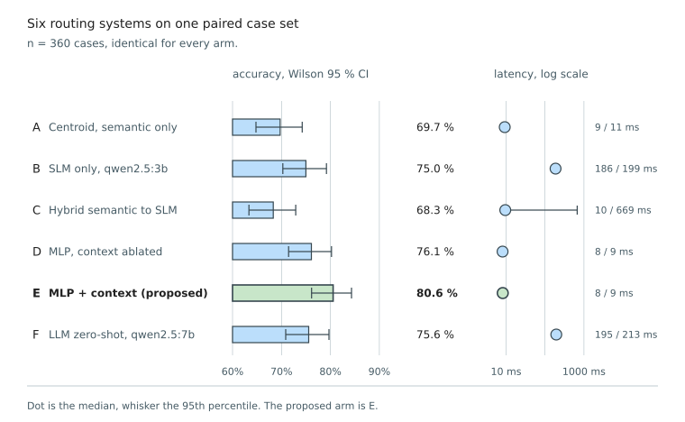

### 5.4.1 Intent Classification and Routing

Objectives 1 and 2 require Vietnamese restaurant utterances to be classified into ordering, menu search,
payment or general conversation at 90 % or better, and require that accuracy to come from a trained
classifier rather than a language model, at a median latency an order of magnitude lower. It is a joint
claim: accuracy alone would not justify the component, since a language model was already available, and
latency alone would not either, since a keyword matcher is faster still.

The classifier is the multi-layer perceptron of §4.5.2, a 768-dimensional sentence embedding concatenated
with ten conversation-state features, trained on 434 hand-written spoken Vietnamese utterances expanded to
2,134 examples by context augmentation.

#### Single-Intent Accuracy

On 149 cases balanced at roughly 37 per class and classifiable from the text alone, the classifier is
correct on 140, 94.0 %, Wilson 88.9–96.8 %, at a median inference latency of 6.9 ms.

**Table 5.3.** Confusion matrix on the single-intent set (n = 149). Rows are the true intent.
(`eval_mlp_router.py --datasets single`)

| True \ Predicted | ORDER | SEARCH | PAYMENT | CHAT | Total |
|---|:---:|:---:|:---:|:---:|:---:|
| **ORDER** | **37** | 0 | 0 | 1 | 38 |
| **SEARCH** | 2 | **34** | 0 | 1 | 37 |
| **PAYMENT** | 0 | 0 | **37** | 0 | 37 |
| **CHAT** | 4 | 1 | 0 | **32** | 37 |

The matrix matters more than the accuracy figure, because it shows which confusions occur. The dangerous
cell is empty: the entire PAYMENT row and column are clean, giving that class an F1 of 1.000, so no
utterance was routed into or out of billing. A misrouting there would either bill a customer who did not
ask or fail to bill one who did, and neither error is recoverable downstream.

All nine errors fall between ORDER, SEARCH and CHAT, and six are pulled toward ORDER, the recoverable
direction: an utterance misrouted into the order worker meets the validator, which finds no resolvable
dish name and either rejects the call or delegates to the chat worker. CHAT has the lowest recall at
0.865, and four of its five errors contain `gọi` (to order) in a conversational rather than transactional
context, as in "Tôi bị dị ứng hải sản thì gọi món gì được", where the surface form genuinely supports both
readings.

A 39-case holdout partitioned before context augmentation and never used for training gives 38 of 39,
Wilson 86.8–99.5 %. Its single error is again SEARCH pulled toward ORDER, and it arrives at confidence
0.643, below the 0.7 deployment threshold, so the utterance routes to the rewriter rather than being acted
upon.

#### Context Features and Multi-Intent Detection

Two secondary properties are measured on their own sets. The first tests the design claim behind the ten
context features, that conversation state belongs inside the feature vector rather than in a rule layer
around it, by evaluating 36 utterance groups at two order stages each. The second tests whether the router
flags an utterance carrying two intents for decomposition by the rewriter, which is the relevant question
because no single label is correct for such an utterance. Detection fires on a boundary marker (`rồi`,
`và`, `thì`, `xong`, `với lại`, `à mà`) or on confidence below 0.7.

**Table 5.4.** Context-feature ablation and multi-intent detection.
(`eval_mlp_router.py --datasets context,multi`)

| Measure | Result |
|---|---|
| Context features active (n = 70 paired cases) | 49 / 70, 70.0 % |
| Context features replaced by IDLE defaults | 41 / 70, 58.6 % |
| Corrected by context (b) / broken by context (c) | 11 / 3, McNemar exact p = 0.057 |
| Multi-intent utterances detected (n = 27) | 23 / 27, 85.2 % |
| False alarms on 3 pseudo-multi-intent controls | 2 |
| Single-intent utterances routed to the wrong worker | 0 |

The context gain of 11.4 percentage points does not reach significance. It concentrates on short
affirmations: "ok", "ừ", "đúng rồi" and "chuẩn" route to ORDER when the order stage is
AWAITING_CONFIRMATION and to CHAT when it is IDLE, which is the intended behaviour. The cases wrong in
both modes are dominated by ambiguous action verbs such as `thêm`, `lấy` and `đặt` at an empty cart, where
the classifier follows the surface ordering language while the label expects CHAT.

The four undetected multi-intent cases contain no lexical boundary marker, their clauses fused without a
connector as in "Chốt đơn với bill luôn đi em". This is an inherent limit of keyword-based segmentation,
and the failure is graceful: the utterance routes to its dominant intent and the weaker one is absorbed,
so the customer receives a partial response rather than a wrong action. The two false alarms cost one
extra rewriter call and still return the right answer.

#### Six-Arm Router Ablation

Six routing systems were evaluated on one identical pooled set of 360 cases, combining the three router
sets with the holdout and cases carried over from earlier evaluation files, so every comparison is paired.

<!-- PENDING-14B: arms B, C and F involve a language model. Copy Figure 5.1's rows from
     figure-data.md after the 14B run; arms A, D and E are deterministic and will not move. -->

*Figure 5.1. Six-Arm Router Ablation: accuracy with Wilson 95 % confidence intervals against routing
latency on a logarithmic scale. Arm E is the proposed classifier. (`render_ch5_figures.py`)*

**Table 5.5.** Paired McNemar exact test of each arm against the proposed arm E. `b` counts the cases E
gets right and the other arm does not, `c` the reverse. (`eval_router_arms.py`)

| Arm compared against E | b / c | p |
|---|:---:|---:|
| A, centroid | 61 / 22 | 2.2 × 10⁻⁵ |
| B, SLM only | 37 / 17 | 0.009 |
| C, hybrid, the previous production router | 66 / 22 | 2.9 × 10⁻⁶ |
| D, MLP with context features ablated | 18 / 2 | 4.0 × 10⁻⁴ |
| F, LLM zero-shot | 35 / 17 | 0.018 |

The proposed arm is significantly more accurate than every approach the system previously used, the
centroid router, the 3B small language model and the hybrid of the two, and also than the deployed
language model used zero-shot, at a median of 8 ms against that arm's 195 ms. Accuracy on this pool is
lower than on the single-intent set for every arm, because the context-dependent cases are deliberately
hard and the carried-over ones probe failure modes rather than sample typical usage.

**Objectives 1 and 2 are met:** 94.0 % (140/149) against a 90 % target, repeated at 38 of 39 on a set
partitioned before augmentation, significantly above every alternative arm tested, at 8 ms against the
language model's 195 ms at the median.
