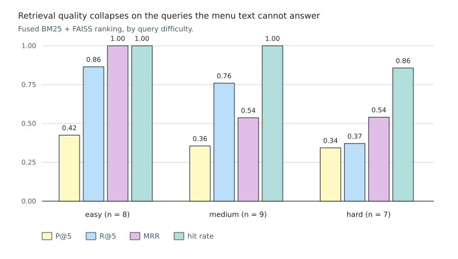

### 5.4.4 Knowledge Retrieval

Objective 4 requires the system to retrieve relevant dishes from the 234-entry menu in response to
Vietnamese sensory descriptions rather than dish names, measured by recall and mean reciprocal rank at
rank five. The pipeline is described in Section 4.6: a lexical index, a dense vector index over the same
corpus, a fusion of the two rankings, and a gate that inspects the result before any of it reaches the
language model. The dataset is 50 queries with graded relevance judgements across three difficulty
levels, 18 easy, 19 medium and 13 hard. No language model is involved in the figures below, so they are
exact.

#### Retrieval Quality and the Fusion Ablation

**Table 5.9.** Retrieval quality by mode (n = 50 queries). Fusion rows are at the weighting each method
deploys. (`eval_retrieval_full.py`)

| Mode | P@5 | R@5 | MRR | Hit Rate |
|------|:----:|:----:|:----:|:--------:|
| **BM25 only** | **0.459** | **0.597** | **0.707** | **0.840** |
| FAISS only | 0.308 | 0.475 | 0.588 | 0.700 |
| RRF fusion, 3 : 1 | 0.408 | 0.551 | 0.691 | 0.840 |
| Linear score fusion, 1 : 1 | 0.416 | 0.557 | 0.676 | 0.840 |

Fusion does not improve on the lexical index. Both fused rankings match BM25 on hit rate and stay below
it on the other three metrics, and no weighting recovers the gap. The sweep has a particular shape:
equal weighting is the worst setting tested and is worse than BM25 alone, since the dense lane demotes
exact matches often enough to cost hit rate outright; from roughly 1.5 : 1 upward the metrics are flat;
and the best setting remains 1 : 0, which removes the dense lane. The deployment runs at 3 : 1, inside
that plateau.

Swapping the fusion method changes little. Linear score fusion at equal weights lands within 0.01 of
reciprocal rank fusion at 3 : 1 on every metric and matches it exactly on hit rate, which locates the
effect in the lane weighting rather than in the arithmetic combining the ranks. Fusion does not need
tuning; on this corpus the second ranking carries no information the first does not already have.

The reason is a property of the corpus rather than of either retriever, and it is the one Section 2.5
anticipated. Customers name dishes using the words printed on the menu, so lexical overlap between query
and document is high and the vocabulary gap dense retrieval exists to bridge is narrow. A dense index
earns its place where users and documents use different words for the same thing, which is what a menu
corpus does not do.

#### The Effect of Query Rewriting

Table 5.9 measures the retriever on the customer's words as spoken. In deployment the search agent
rewrites them into category terms first, so that configuration is measured separately. The two runs
below are a matched pair over the same 50 queries, and they are not comparable with Table 5.9, which
comes from a later run.

<!-- PENDING-14B: the rewrite arm calls the search agent's language model.
     Re-run eval_retrieval_with_rewrite.py --rewrite. -->

**Table 5.10.** Retrieval with the customer's words and with the rewritten query (n = 50, one matched
pair of runs). (`eval_retrieval_with_rewrite.py`)

| Mode | R@5 raw | R@5 rewritten | Hit raw | Hit rewritten |
|------|:-------:|:-------------:|:-------:|:-------------:|
| BM25 only | 0.579 | 0.560 | 0.840 | 0.820 |
| FAISS only | 0.460 | 0.444 | 0.700 | **0.740** |
| RRF fusion, 3 : 1 | 0.533 | **0.556** | 0.840 | 0.820 |

Rewriting trades exact matching for coverage, which is the trade the design intends. The lexical lane
loses on every metric, as expected: the rewrite replaces the words printed on the menu, which are
precisely what that lane matches on. The dense lane gains where it is supposed to, its hit rate rising
from 0.700 to 0.740. On the fused ranking the two effects nearly cancel. Recall at five rises from
0.533 to 0.556 and precision with it, while hit rate falls from 0.840 to 0.820, one query in fifty
moving from a hit to a miss.

The aggregate therefore understates what rewriting does, because it averages two populations the
rewrite treats oppositely. A query naming a dish is best served unrewritten, and a query describing a
sensation cannot be served at all without the rewrite: "muốn ăn gì đó nóng hổi no bụng" moves from an
R@5 of 0.25 to 0.75 once it becomes "cháo, lẩu, súp". Deploying the rewrite unconditionally is what
costs the lexical lane its margin, and routing it by query type is the obvious improvement this
evaluation points to.

*Figure 5.2. Retrieval Quality by Query Difficulty: precision, recall, mean reciprocal rank and hit rate at
rank five for the fused ranking, split by difficulty. (`render_ch5_figures.py`)*

Easy and medium queries behave similarly, at hit rates of 0.889 and 0.895, and the easy set ranks a
relevant dish first on nine occasions in ten. The hard set falls to a recall of 0.249 and a hit rate of
0.692, so four of thirteen return nothing relevant.

Eight queries in fifty return no relevant dish at all, and they divide into four groups that mean
different things.

**Table 5.11.** The eight queries returning nothing relevant, by cause.

| Cause | Queries | What it is |
|---|---|---|
| Out of corpus, admitted anyway | pizza; sushi and sashimi; the price of a motorbike | The restaurant serves none of these, so a miss is the correct retrieval outcome. The failure is that the gate admitted them at all |
| Menu metadata absent | dishes that photograph well; unusual seafood; something for a family with children | The dishes exist and would satisfy the request, but no field in the menu records the property being asked about |
| Supporting document unwritten | wifi, parking and payment facilities | The information section that would answer this is in the corpus, but its body is still a placeholder, so there is nothing to retrieve |
| Judgement too narrow | snacks to drink beer with | The retriever returned defensible dishes that the relevance judgement does not list |

Only the second group is a retrieval failure in the ordinary sense, and the retriever cannot repair it.
Those queries describe an information need through terms absent from the menu text, and no index tuning
closes a gap that lives in the corpus. It is the structural failure identified in Section 2.5.1 of
Chapter 2, query and documents occupying disconnected regions of the vocabulary. What this analysis adds
is that the remedy is a menu carrying the tags customers ask by, not a better index. The unwritten
section is a content gap of the same kind, closed by writing the section. The first group belongs to
the gate.

#### Dual-Lane Gatekeeper

The gate, defined in Section 4.6.3, admits a query only if the semantic lane or the lexical lane finds
evidence of relevance, and otherwise returns nothing rather than passing weakly related documents to the
language model.

It admitted 48 of the 50 queries and rejected 2, withholding nothing it should have admitted. The
false-positive half of the requirement therefore holds: no query with a relevant dish on the menu was
refused.

Five of the fifty queries ask for things the menu genuinely cannot answer, and the gate turns away two
of them. The result on that half is therefore partial.

The three it admits are the cases Section 4.6.3 predicts. Pizza and sushi clear the semantic lane at
cosine similarities of 0.29 and 0.30, against a threshold of 0.25 that answerable queries clear at 0.27,
so no cutoff separates them. The motorbike query clears the lexical lane on "giá", a field every menu
entry carries and a word no stop list can remove without discarding legitimate price questions. The
gate rejects, and rejects correctly when it does, but it lets through the majority of what it was built
to catch. The response-layer grounding check of Section 4.5.6 is what stands behind it.

**Objective 4 is partially met:** the retriever finds a relevant dish for 42 of 50 queries, and of the
eight it misses, three are requests for food the restaurant does not serve and three more ask about
properties the menu does not record, leaving one genuine ranking failure and one narrow judgement. What is
not vindicated is the hybrid design, since the lexical lane alone equals or beats every fused ranking at
every weighting and every fusion method tested.
