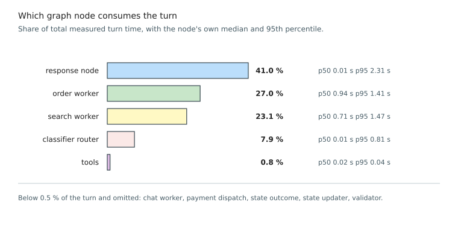

### 5.4.6 Agent Latency and Cost

Objective 5 requires a reply within five seconds at the median, measured from the arrival of a transcript
to the completion of the reply text. Chapter 4 sets the same budget over a wider span, from the end of the
customer's speech to the start of the reply, which adds voice activity detection, transcription and speech
synthesis on top of everything measured here. The two are therefore not the same quantity, and the
distance between them is the part of the budget this chapter does not measure.

Twelve utterances spanning the intent classes were each executed five times, giving 60 measurements,
broken down by class because the classes exercise different paths and a pooled figure would hide the
heaviest.

Each run starts a fresh conversation thread, so no cart or search context carries over between runs,
and the confirmation class runs against a seeded cart so that it measures the cost of a confirmation
rather than of a refusal.

<!-- PENDING-14B: every measurement includes a worker and a response language model call.
     Re-run eval_latency.py, then render_ch5_figures.py. -->

*Figure 5.3. Turn Latency by Intent Class: median and 95th-percentile turn latency for each intent class,
against the five-second budget. (`render_ch5_figures.py`)*

Median turn latency is 1.61 s and the 95th percentile 4.13 s, both inside the five-second budget. Every
intent class clears the budget at its median, and the spread between them follows the work each path
does rather than anything about the class itself. Payment is fastest at 0.32 s, because the router
settles it without leaving a decision to make and the reply is a template. Search and multi-intent are
slowest at 2.72 s and 2.69 s, since both pay for retrieval and for a generated rather than a templated
reply. Order confirmation sits between them at 1.45 s.

One figure falls outside the budget. Multi-intent turns reach 5.23 s at the 95th percentile and are the
only class that does. Such a turn carries out what the customer asked for in two separate exchanges,
one worker at a time, so it pays a worker cost and a response cost per intent; divided by the intents
served rather than by the turn, it sits near 2.6 s. That is an observation about where the time goes
and not a revision of the target, which Chapter 4 states for a turn without qualification.

*Figure 5.4. Turn Latency by Graph Node: the share of a turn consumed by each node of the agent graph,
separating the language-model nodes from the deterministic ones. (`render_ch5_figures.py`)*

Instrumenting each graph node separately confirms the premise the architecture was designed on. The
three language model nodes consume 91 % of a turn between them, the response generator taking 41.0 %,
the order worker 27.0 % and the search worker 23.1 %, while everything deterministic is free by
comparison: the validator runs at a median of 1 ms and rounds to nothing as a share of the turn, and the
state updater, the outcome node and the tool executor together add less than one percent. Adding a
deterministic gate in front of every tool call therefore costs nothing measurable against the language
model calls surrounding it. The classifier's 7.9 % is larger than its few milliseconds of inference would
suggest because that node also carries segmentation and, on multi-intent turns, the rewriter call.

The response generator's own profile is the clearest confirmation in this chapter of a decision taken in
Chapter 4. Its median is 9 ms and its 95th percentile 2.32 s, a spread of more than two hundred to one
inside a single node. That is the shape a mixture of templates and generation produces: most turns leave
through one of the sixteen templated outcomes and cost microseconds of string formatting, while the two
paths that call the model carry the entire tail. The node is at once the largest single consumer of a
turn and idle on most of them, which is what the design predicted and what a node that generated every
reply could not produce.

One point from Figure 5.1 bears on deployment, and it is why a median alone is insufficient. The previous
hybrid router's median is close to the classifier's, 11.2 ms against 9.2 ms, because its semantic stage
resolves most queries without escalating. Its 95th percentile is 716.6 ms against the classifier's 11.0 ms,
a factor of sixty-five, and it falls on exactly the queries that do escalate. One turn in twenty running
dozens of times slower than typical is what a customer notices as the system occasionally hanging.

**Objective 5 is met:** 1.61 s at the median and 4.13 s at the 95th percentile, both inside the
five-second budget, with every intent class inside it at the median. The roughly 3.4 s of headroom is
what the unmeasured speech stages have to fit into rather than a claim that they do.
