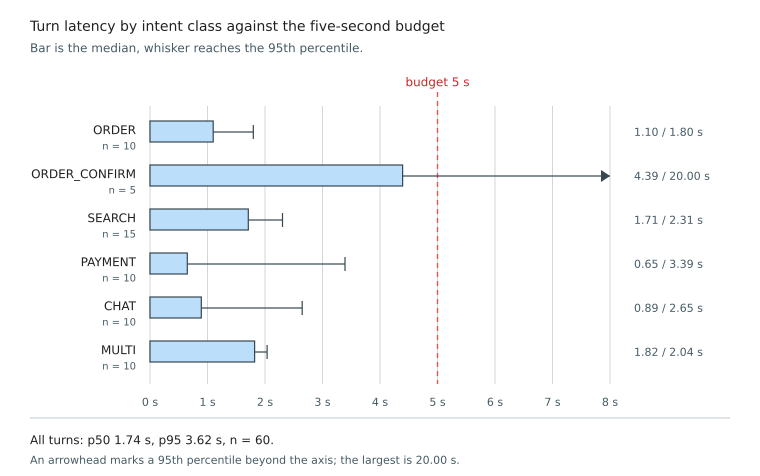

### 5.4.6 Agent Latency and Cost

Objective 5 requires a reply within five seconds at the median, measured from the arrival of a transcript
to the completion of the reply text. Chapter 4 sets the same budget over a wider span, from the end of the
customer's speech to the start of the reply, which adds voice activity detection, transcription and speech
synthesis on top of everything measured here. The two are therefore not the same quantity, and the
distance between them is the part of the budget this chapter does not measure.

Twelve utterances spanning the intent classes were each executed five times, giving 60 measurements,
broken down by class because the classes exercise different paths and a pooled figure would hide the
heaviest.

<!-- PENDING-14B: every measurement includes a worker and a response language model call.
     Re-run eval_latency.py, then render_ch5_figures.py. -->

*Figure 5.3. Turn Latency by Intent Class: median and 95th-percentile turn latency for each intent class,
against the five-second budget. (`render_ch5_figures.py`)*

Median turn latency is 1.74 s and the 95th percentile 3.62 s, both inside the five-second budget of §4.1.
The heaviest path is order confirmation at a median of 4.39 s, driven by `confirm_order` performing a
database write and a kitchen display push in addition to the language model call. It is also the only
class whose 95th percentile falls outside the budget, at 20.0 s on one of its five runs, which is a
stalled generation rather than a typical worst case: no other class exceeds 3.4 s at the 95th percentile.

Instrumenting each graph node separately confirms the premise the architecture was designed on. The
language model nodes consume almost the whole turn, the order worker alone taking 55.6 % of it and the
response generator a further 22.5 %, while everything deterministic is free by comparison: the validator
accounts for 0.1 % at a median of 1 ms, and the state updater, the outcome node and the tool executor
together for less than one percent more. Adding a deterministic gate in front of every tool call therefore
costs nothing measurable against the language model calls surrounding it. The classifier's 10.6 % is
larger than its few milliseconds of inference would suggest because that node also carries segmentation
and, on multi-intent turns, the rewriter call.

One point from Figure 5.1 bears on deployment, and it is why a median alone is insufficient. The previous
hybrid router's median is close to the classifier's, because its semantic stage resolves most queries
without escalating, but its 95th percentile is two orders of magnitude higher and falls on the queries
that do escalate. One turn in twenty running dozens of times slower than typical is what a customer
notices as the system occasionally hanging.

**Objective 5 is met:** 1.74 s at the median and 3.62 s at the 95th percentile, both inside the
five-second budget, with even the heaviest class staying within it at the median. The roughly 3.3 s of
headroom is what the unmeasured speech stages have to fit into rather than a claim that they do.
