# CHAPTER 4: PROPOSED METHOD (II): AI AND BACKEND SYSTEM

## 4.1 AI System Requirements

Chapter 1 set the objective of an autonomous waiter that takes Vietnamese orders in conversation, understands them through a conversational agent, sends them to the kitchen, and delivers the food to the correct table. Chapter 3 delivered a robot that can navigate autonomously and dock at tables, but it does not yet understand what a customer says, decide what to do about it, or know where to go. To close that gap, the system described in this chapter must:

Capture, transcribe, and synthesize Vietnamese speech entirely on the robot, running VAD, STT, and TTS on the Jetson while the LLM runs on a central server. Only text transcripts cross the network. The speech pipeline must handle tonal diacritics, compound words, and restaurant background noise. This requirement is satisfied by the component selection and deployment described in section 4.4 and is verified by inspection of the running pipeline; its recognition accuracy is not measured in this work, and section 6.3 records that as a limitation.

Understand informal spoken Vietnamese and map it to the correct action. The agent must classify utterances into ordering, searching, paying, or chatting, handling teencode abbreviations and multi-intent turns at that step, then decide which tool to invoke and keep the cart consistent when the customer switches between voice and touch on the tablet.

Let customers find dishes by taste, dietary type, price, or occasion, not only by dish name. The retrieval pipeline must bridge the gap between experiential language ("trời lạnh ăn gì ấm bụng") and a menu organized by name and category. When no dish matches, it must return nothing rather than fabricate.

Push every business event to the right screen in real time. A confirmed order must reach the kitchen board, and a robot's position must reach the minimap, over a WebSocket push path rather than by polling. The session lifecycle (seating, orders, payment, table release) must be enforced across all components.

Dispatch the right robot to the right table at the right time. The fleet manager must assign each navigation task to the nearest idle robot with sufficient battery, track position and battery from live telemetry, bind a table's voice channel to whichever robot is physically there.

Provide three role-specific web interfaces: a customer tablet for menu browsing and voice mirroring, an entrance kiosk for check-in, and a management panel with a kitchen order board, fleet status, and live minimap. All three share a common TypeScript client and receive updates through WebSocket push rather than polling.

Run entirely on the restaurant's own hardware with no cloud dependency in normal operation. The agent must produce a reply within five seconds, measured from the arrival of a transcript to the completion of the reply text, which is the interval reported in section 5.4.6. The voice activity detection, recognition and synthesis time contributed by the edge device sits outside this budget and is not measured in this work. Every LLM decision must pass through a deterministic safety gate before affecting state. Conversation state must be clear completely when a session ends, and no single component failure may bring down the system.

## 4.2 Design Challenges

The requirements of Section 4.1 are each familiar on their own, but meeting them together, in Vietnamese, on modest on-premises hardware, and with no human in the loop, raises six difficulties that shape the rest of this chapter. Each is stated here as the problem to be solved; the sections that follow present the design that answers it.

Informal Vietnamese is hard to classify reliably. Customers speak in abbreviations and slang, reuse the same short word for different intents depending on the context, combine several requests in a single turn, and name dishes the model has rarely seen. No single classification approach handles all of these at once, yet the routing must still be accurate, fast enough to add no perceptible delay, and deterministic.

Memory on the robot is a fixed budget shared by everything. The robot's onboard computer has 8 GB of memory shared between navigation, the sensors, and the voice pipeline, which together leave too little for a capable language model. The model must therefore run elsewhere, and the work must be divided between the robot and a server without letting the network round trip erode the voice response time.

The language model is a probabilistic component inside a system that must behave deterministically. It can invent dish names, produce impossible quantities, or attempt invalid steps in the ordering sequence. Such errors cannot be prevented outright without fine-tuning, so the system must instead detect and block them before they reach the cart, the kitchen, or payment, on every call and with no human review.

The way customers describe food does not match how the menu is stored. Customers ask by taste, sensation, or occasion, whereas the menu is organized by name, category, and price, so a query and the dish that answers it may share no words at all. Retrieval must actively bridge this gap, reshaping the query before the search and interpreting the results after it.

The backend is a shared state machine driven by the AI rather than by staff. Several client roles each need a different, live view of the same events as the agent creates orders, updates carts, dispatches robots, and settles payments. Polling is too slow for time-critical events such as a new order reaching the kitchen board, and cloud dependency fails when the local network drops, so the whole backend must run on one on-premises machine and push changes as they happen.

The link between a robot and the table it serves must survive disconnection. When a robot reaches a table, that table's voice commands are routed to that particular robot; if the robot loses its connection mid-visit, the system must release the link, hand the task to another robot, and rebind the new one, all without the customer noticing that the robot behind the voice has changed.

## 4.3 Software System Architecture

The AI system follows a hybrid design: the robot carries the body (perception, voice I/O, and navigation, built in Chapter 3), while a central server carries the brain (language model, conversational agent, business records, and menu retrieval). This section presents the architectural split and the two-process server design that houses the AI.

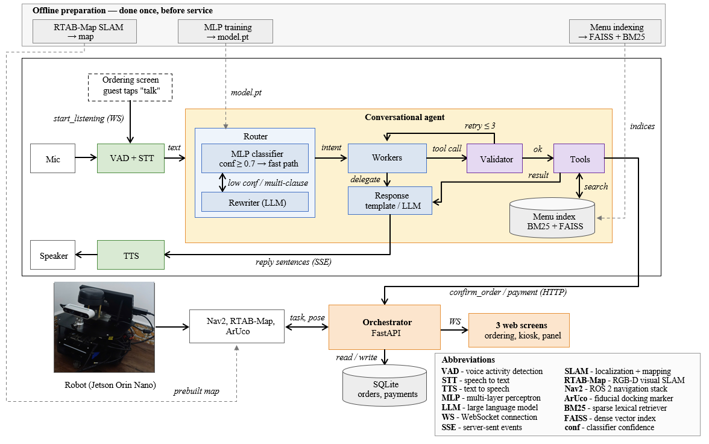

*Figure 4.: System Architecture Overview: the three-tier layout and the type of connection*

### 4.3.1 Hybrid Architecture

The decision to run the AI on the server is not a matter of preference; it is forced by memory. The robot's Jetson Orin Nano carries 8 GB of unified memory shared by every process on the device, and it does not start empty. Chapter 3 delivered the navigation and localization stack. Table 4.1 shows what that stack leaves for the components of this chapter.

*Table 4.: Memory budget on the Jetson after the navigation stack of Chapter 3.*

| Component | Memory |
| --- | --- |
| Jetson Orin Nano unified memory | 8.0 GB |
| Navigation and localization (ROS 2, RTAB-Map, Nav2, EKF, sensor drivers) | ~3.7 GB |
| Available for the voice pipeline and the language model | ~4.3 GB |

Into that ~4.3 GB must fit two workloads. The first is the voice pipeline: the survey of section 2.3 established that a usable on-device stack of voice activity detection, speech recognition, and speech synthesis occupies between roughly 2 GB and 4 GB, depending on the accuracy target chosen. The second is the language model: section 2.4.3 surveyed Vietnamese-capable models and found that the class able to follow a tool-calling protocol reliably across several turns begins at approximately 7 billion parameters. At the lowest usable precision, that class holds about 4 GB of weights alone; the attention cache and inference runtime sit on top.

Even at the low end of both ranges, the combined need exceeds the ~4.3 GB available.One of the two must run elsewhere. The design requirements demand that speech be captured,transcribed, and synthesized entirely on the robot, and the microphone and speaker are physically attached to it, so the voice pipeline is the component that cannot leave. The language model, in contrast, is wired to no device and closes no control loop, so nothing about the robot's hardware pins it in place. It therefore moves to the server, where it has room to be as capable as the task needs.

Three further reasons support the same choice, none of them about memory:

Speed. Only text crosses the WiFi, never audio. A transcript is under a hundred bytes where the raw audio it replaces is roughly a hundred kilobytes, so the network step is small and adds almost no delay.

Data safety. The robot stands on the floor, where it can be damaged or taken, so nothing lasting is kept on it. Every order, payment, and conversation lives on the server. A robot that is lost carries no customer data and can be replaced at once.

Fleet consistency. One model on one server serves every robot the same way, so behaviour does not drift, and an improvement is installed once rather than on each robot in turn.

The architecture therefore places perception and navigation on the robot, where they are wired to sensors and motors, and places the reasoning engine and shared business state on he server, where they have room and are common to all tables and all robots.

### 4.3.2 Agent and Orchestrator

The server runs two programs as separate processes. The agent turns a Vietnamese sentence into a checked action, calling a language model served on the same machine by Ollama. The orchestrator maintains the shared business state: tables, sessions, orders, payments, and the real-time push of events to every screen. Two databases sit behind them, one for business records and one for conversation history, each a single file.

The separation is deliberate. One reasoning step through the agent takes seconds and blocks while it runs; the orchestrator's work takes milliseconds. Keeping them apart means a slow reasoning step never freezes the kitchen screen, and either program can be restarted without bringing down the other.

In operation, transcribed text arrives at the agent. The agent determines the intent, validates the action, executes it, and returns a spoken reply. When the action is a confirmed order or a payment, the agent calls the orchestrator, which records the event and pushes it to the screens that need it. Every step past transcription runs on the server.

## 4.4 Edge Voice Pipeline

The voice pipeline captures Vietnamese speech on the robot, transcribes it, and synthesises the agent's reply, all without depending on the network. This section selects the three components that make this possible and describes how they are wired together.

### 4.4.1 Component Selection

Each component is evaluated against three criteria drawn from the design requirements:

Offline. It must run on the robot without internet access, because the restaurant's network can drop and the robot still has to take the order in front of it.

Small. It must fit within the memory left by the navigation stack and must not require GPU memory the robot does not have.

Vietnamese. It must handle the six tones and their diacritics that carry meaning in Vietnamese speech.

Voice activity detection. The survey of section 2.3.1 identified Silero VAD as a small neural detector of about 2 MB that runs in real time on the CPU and requires no GPU memory. It is language-agnostic, so it handles Vietnamese with no change. A single sensitivity threshold is tuned to catch quiet speech while ignoring ambient noise such as plates being set down.

Speech recognition. The survey of section 2.3.2 identified PhoWhisper as a Vietnamese-tuned variant of Whisper. PhoWhisper at the medium size is selected. Its fine-tuning on Vietnamese speech data sharpens recognition of the six tones and their diacritics, the dimension where general multilingual models most underperform Vietnamese. It runs offline through the faster-whisper runtime and transcribes a typical utterance in approximately 800 milliseconds, well within the latency budget for a spoken interaction. At about 3.5 GB of runtime memory it is the largest piece of the voice pipeline, but fits within the roughly 4.3 GB the navigation stack leaves free.

Speech synthesis. The survey of section 2.3.3 compared both offline and cloud-based TTS engines. Piper is selected: it is a small neural voice of about 200 MB that runs on the CPU and speaks a sentence in roughly half a second. It is the only Vietnamese TTS option that runs fully offline, satisfying the requirement that the voice pipeline must not depend on the network.

Together the three components use approximately 3.7 GB. This fills nearly all of the roughly 4.3 GB the navigation stack leaves free, which is the reason the language model cannot join them on the robot, as established in section 4.3.1.

### 4.4.2 Threaded Pipeline Architecture

The three components run on different hardware at different speeds: the microphone captures audio on the CPU, speech recognition transcribes on the GPU, and the main loop communicates with the server over the network. If they ran one after another, each stage would idle hile the next one worked, and the total turn time would be the sum of their individual latencies.

To prevent this, each component runs in its own thread and hands work to the next stage through a small queue. While the STT thread transcribes one utterance, the VAD thread is already free to capture the next, and the main thread can be sending an earlier transcript to the agent. The three kinds of work never block one another, so the total turn time is driven by the slowest stage rather than by the sum of all three.

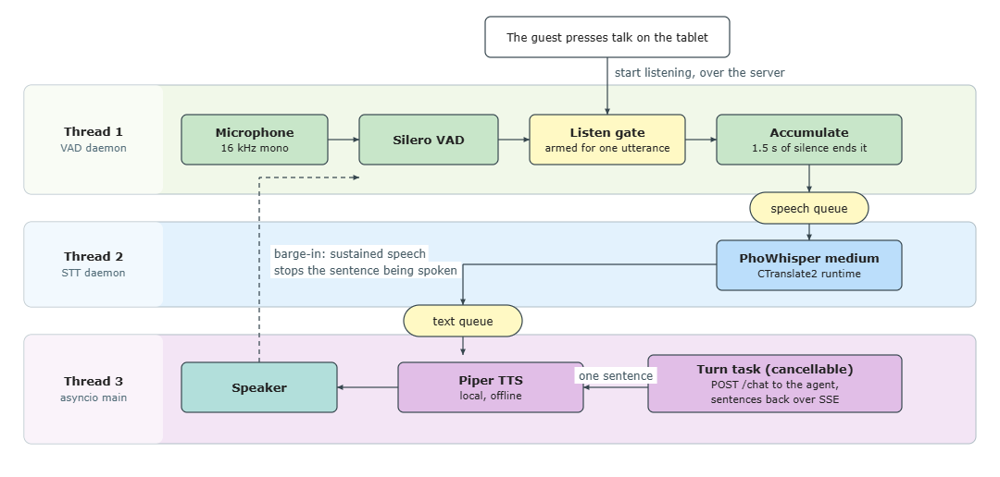

*Figure 4.: Edge Voice Pipeline: the three threads passing one utterance through two
queues, with the barge-in path that lets the customer interrupt.*

The VAD thread owns the microphone and remains idle until the server commands it to listen, which happens only when the customer presses the talk button on the tablet. Once armed, it captures audio until it detects roughly 1.5 seconds of silence, then passes the utterance to the STT thread. The STT thread transcribes the audio and passes the Vietnamese text to the main thread. The main thread sends the text to the agent and plays the reply back through the speaker. Because the agent streams its answer one sentence at a time, the thread speaks each sentence as it arrives rather than waiting for the full reply.

The customer can interrupt at any time: the VAD thread keeps monitoring the microphone during playback and stops the current sentence when it detects sustained speech, producing natural turn-taking. A short burst of noise such as a plate being placed on the table is not enough to trigger this, only continued speech.

Together, the selected components and the threaded architecture satisfy the design requirements. The voice pipeline runs entirely on the robot, fits within the memory left by the navigation stack, and handles Vietnamese tones throughout. No audio crosses the network, and the streamed, interruptible replies keep each spoken turn short.

## 4.5 Conversational Agent

The voice pipeline delivers transcribed Vietnamese text to the server. From there the system must work out what the customer wants, choose an action, make sure that action is safe to take, carry it out, and say something back. This section presents the conversational agent that does that work.

### 4.5.1 Agent Architecture

The agent is a graph of ten nodes through which one customer sentence passes in five stages: classify the intent, decide the action, validate it, execute it, and respond. Every node reads and writes one shared state object and then hands control forward; no node calls another directly. The idea the whole graph is arranged around is that the decisions the system depends on are made in ordinary code, and the language model is asked only to propose which action fits an utterance and to phrase what has already been decided. Figure 4.3 shows the topology, and Table 4.2 names the nodes in the order an utterance meets them.

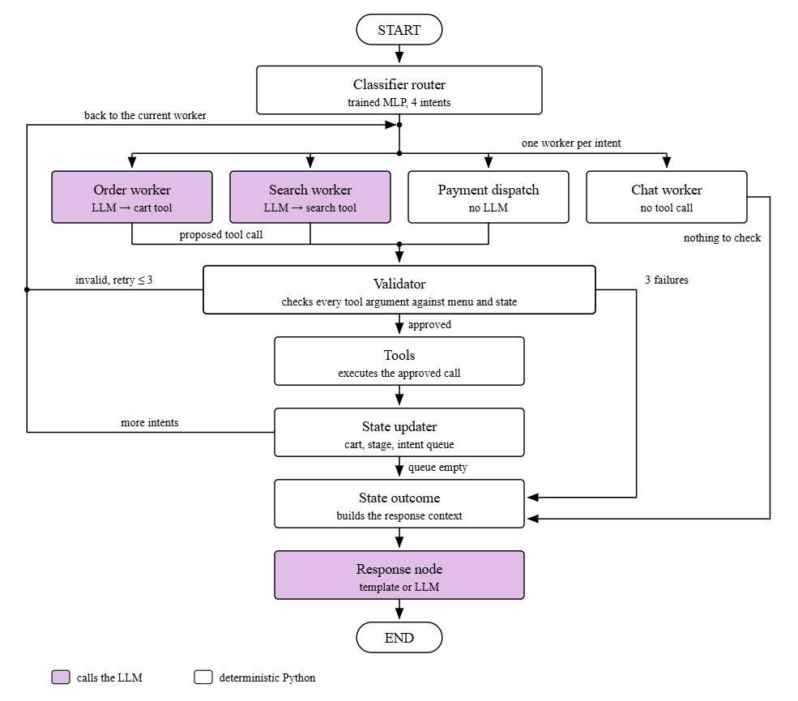

*Figure 4.: Agent StateGraph Topology*

An utterance enters at the router and is dispatched to one of four workers. Every proposal from the three tool-calling workers passes through the validator before the tool node runs it; the chat agent holds no tools and bypasses both. The state updater merges results and returns the turn to the next worker while intents remain, the state outcome finalizes the turn, and the response generator produces the spoken reply.

*Table 4.: The nodes of the agent graph, in the order an utterance meets them.*

| Node | Stage | Kind | Responsibility |
| --- | --- | --- | --- |
| Router | Classify | Trained MLP +LLM fallback | Embeds the utterance alone, with no conversation-state features; classifies into one of four intents; invokes the rewriter to decompose compound utterances |
| Order agent | Decide | LLM | Selects a cart operation and extracts item names, quantities, and special requests from the utterance |
| Search agent | Decide | LLM | Rewrites the conversational request into concrete search terms and dispatches retrieval |
| Payment dispatch | Decide | Deterministic | Emits a request-payment call; no further decision needed once the router has classified PAYMENT |
| Chat agent | Decide | Deterministic | Assembles conversation history, cart, and curated dish memory into a typed context for the response stage |
| Validator | Validate | Deterministic | Inspects every tool call argument against the authoritative menu; resolves dish names, detects ambiguity, rejects off-menu items |
| Tool node | Execute | Deterministic | Runs the approved tool calls: cart operations, search, or payment |
| State updater | Execute | Deterministic | Merges tool results into the agent's state; pops the processed intent from the queue |
| State outcome | Respond | Deterministic | Builds a typed response context from the executed action; clears per-turn ephemeral fields |
| Response generator | Respond | Templates + LLM | Converts the typed context into spoken Vietnamese via pre-written templates or language-model paraphrasing |

A customer saying "Cho tôi 2 Ốc Hương" crosses all five stages. The classifier router labels the sentence an ordering intent in about nine milliseconds, without calling the language model. The order agent, which holds the cart tools and nothing else, proposes one call: add to cart, name "Ốc Hương", quantity two. That name is only the string the customer said, because the agent never receives the menu. The validator looks it up, finds that it identifies no single dish, and refuses the call, so nothing enters the cart and the tool node does not run.

The turn still reaches the response generator, which asks the customer which dish they meant. When the next turn names it in full, the call passes, the cart tool runs, and the price is read from the menu file rather than produced by the model.

Three properties of that path belong to the graph rather than to any node in it. The first is that the validator sits on every edge between a worker and the tool node, so no proposed call reaches execution without being inspected, and it is the shape of the graph rather than an instruction in a prompt that makes this true.

The second is that a turn carrying more than one intent is served one worker at a time, in the order the customer spoke them: the state updater pops the intent it has just finished and sends the turn back for the next one, so an order followed by a request for the bill adds the items before the total is computed. The third is that every path ends at the response generator, whether the turn succeeded, was refused, or exhausted its retries, so the customer always hears a reply.

Of the ten nodes, six are ordinary Python, two call the language model, and two combine the two. Routing, validation, cart arithmetic, state transitions, and per-turn cleanup are all code whose behaviour can be read from the source and repeated. The language model is one component inside a mostly deterministic machine, not the machine itself.

The subsections that follow take the five stages in the order an utterance meets them: classification, action selection, validation, execution, and response.

### 4.5.2 Intent Classification

Every turn begins with one decision: which of the four workers receives the utterance. Customers make that decision hard. They speak in regional forms and clipped fragments ("Cho anh 2 phần ốc hương nghen", "Món ni giá bao nhiêu rứa em"), they answer in a single word whose meaning depends entirely on what was just asked ("ừ", "ok", "chuẩn"), and they put two requests into one sentence ("Cho 2 Ốc Hương rồi tính tiền luôn").

A routing error cascades: an ordering intent sent to the chat worker produces a conversational reply instead of a cart operation, and a chat intent sent to the order worker produces a spurious tool call that the validator must later reject.

No single approach in the survey of section 2.4.4 of Chapter 2 covers all of this. The deterministic ones are fast but fail on teencode and on turns whose meaning comes from the conversation rather than from the words. The language-model ones handle both, at second-scale latency and without returning the same answer twice on the same input. The state-augmented classifiers that would otherwise fit need dialogue-state corpora that do not exist for Vietnamese, and are reported as unable to handle multi-intent utterances.

The design here takes two of those mechanisms and uses each where it is strong: a classifier trained on a corpus written by hand for this restaurant, and a rewriter that splits a compound utterance into single-intent fragments before any of them is classified. Context-dependent one-word answers are the third difficulty, and the design does not solve them at this layer. The classifier sees the utterance and nothing else, so "ok" carries the same embedding whether it answers a question about the cart or opens a conversation. That case is settled after routing: the validator refuses a confirmation unless the order stage is AWAITING_CONFIRMATION, and refuses a removal once the order is confirmed. Placing the check there rather than in the classifier keeps routing deterministic and text-only, at the cost of one wasted worker call on the turns where the stage contradicts the predicted intent.

The router is a multi-layer perceptron that accepts a 768-dimensional Vietnamese sentence embedding and produces a four-class probability distribution via softmax through two hidden layers. Table 4.3 gives the layer-by-layer composition.

*Table 4.: Layer composition of the intent classifier MLP.*

| Layer | Dimensions | Activation | Dropout |
| --- | --- | --- | --- |
| Input | 768 | n/a | n/a |
| Hidden 1 | 768→ 256 | ReLU | 0.2 |
| Hidden 2 | 256 → 64 | ReLU | 0.2 |
| Output | 64 → 4 | Softmax | n/a |

The two hidden layers progressively compress the embedding down to four logits, one per intent class. The dropout layers, applied after each hidden activation during training, prevent the network from relying on any single embedding dimension and improve generalisation to unseen utterances. The entire model holds approximately 220 thousand parameters, small enough that inference completes in under one millisecond on the CPU with no GPU dependency.

The sentence embedding is produced by a Vietnamese-native bi-encoder, bkai-foundation-models/vietnamese-bi-encoder, selected from the survey of section 2.5.2 for its Vietnamese-language pre-training and 768-dimensional output. The same model serves theretrieval pipeline (section 4.6) and is loaded once at agent startup, so the classifier and the retriever hare one embedding model with no additional memory cost. Figure 4.4 illustrates the pipeline.

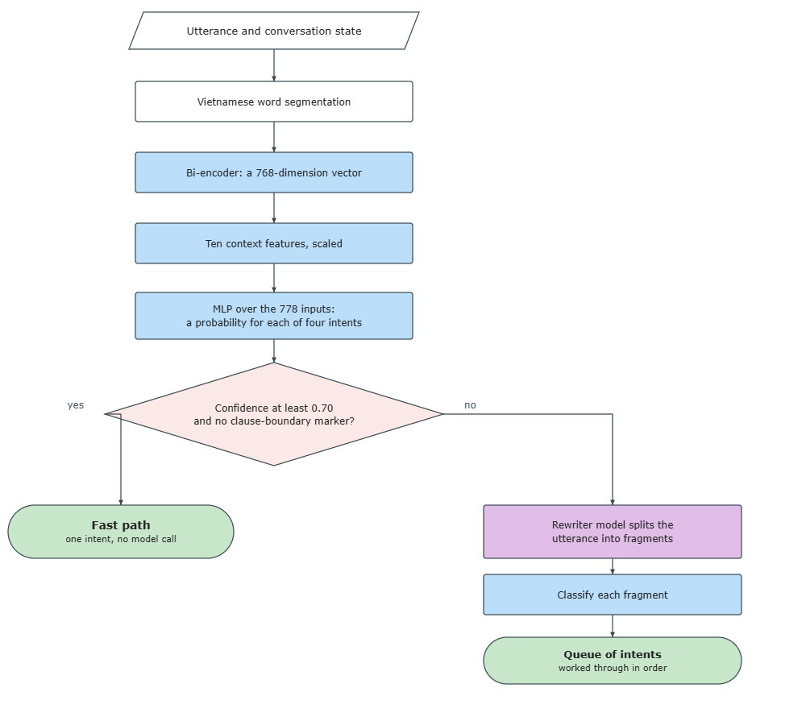

*Figure 4.4. Intent Classification Pipeline*

No labelled dataset of Vietnamese restaurant utterances exists, so one was written by hand: 1 639 utterances composed against the restaurant's menu, spread across five linguistic styles. Table 4.4 gives the style breakdown with representative examples.. Table 4.4 gives their encoding.

*Table 4.4. The five styles of the manual dataset.*

| Style | Count | Description | Example |
| --- | --- | --- | --- |
| Casual | 561 | Natural everyday speech, shortened forms | "Cho 2 ốc hương đi em", "Bỏ món mực chiên sả ra khỏi đơn giúp mình" |
| Formal | 300 | Full sentences with polite particles "ạ", "dạ" | "Dạ cho em gọi 1 Lẩu Thái và 3 chai Bia Saigon ạ" |
| Fragment | 298 | Verbless clauses matching the output shape of the rewriter: 2–6 words, no politeness particles | "Cho 2 Ốc Hương", "Xoá hết giỏ hàng", "Tính tiền" |
| Dialect | 267 | Regional variants: Southern "nghen", "hông"; Central "mô", "rứa" | "Cho anh 2 phần ốc hương nghen", "Món ni giá bao nhiêu rứa em" |
| Edge | 213 | One- or two-word utterances, inherently ambiguous | "ok", "ừ", "được", "chuẩn" |

The fragment style is essential for multi-intent turns. At inference, compound utterances are split by the rewriter into single-intent fragments, and the classifier must handle these stripped-down clauses, which carry no subject and no politeness particles, only the words that bear the intent. Without fragment-shaped examples in training, multi-intent turns consistently fail.

The training split is grouped by utterance using GroupShuffleSplit, which ensures that all rows carrying the same utterance text land in the same split. A split by row would scatter copies of one utterance across training and validation, inflating the validation score with memorisation rather than generalisation.

A 39-case holdout set was separated before any training, so no holdout utterance appears in the training split.

The model is trained on precomputed embeddings. Embeddings are computed once over the entire corpus and cached, so training iterates over tensors rather than re-encoding every epoch. The training configuration is given in Table 4.5.

*Table 4.5. Training hyperparameters and methodology.*

| Setting | Value |
| --- | --- |
| Optimizer | Adam (learning rate 1 × 10⁻³, weight decay 1 × 10⁻⁴) |
| Loss | Cross-entropy with inverse-frequency class weights |
| Train/validation split | 80/20, grouped by utterance (GroupShuffleSplit) |
| Batch size | 64 |
| Maximum epochs | 80, with early stopping (patience 15 on validation accuracy) |
| Training time | ~3 minutes on precomputed embeddings (CPU) |

Class weights are computed as the inverse frequency of each intent in the training set. After grouping, ORDER is the largest class at 655 examples and CHAT the smallest at 204, a ratio of roughly three to one. Without the weights the model favours ORDER at the expense of CHAT and PAYMENT.

Two artefacts are serialised and loaded at agent startup: model.pt (the trained weights) and label_encoder.json (the label-to-index mapping). At inference the utterance is word-segmented by underthesea.word_tokenize, embedded by the frozen bi-encoder, and fed directly to the MLP. The embedding is produced at float32 precision rather than float16, because the classifier's margin between a correct and an incorrect intent is narrow enough that half-precision rounding could flip a borderline prediction.

Two outcomes determine the next step. If the confidence exceeds 0.7 and no boundary marker is present (words such as "rồi," "và," "thì," "xong," or "với lại" that signal clause boundaries in Vietnamese), the predicted intent is accepted directly and dispatched to the corresponding worker. For SEARCH, a higher threshold of 0.85 is applied, because dish-name tokens bias the MLP toward SEARCH even when the utterance carries ORDER markers ("cho mình 1 Mực Cháy Tỏi" scoring SEARCH 0.740). Raising the SEARCH bar sends borderline dish-name utterances through the rewriter where they reclassify correctly as ORDER. The fast path handles the majority of utterances.

If the confidence falls below its class-specific threshold or boundary markers are detected, the utterance is routed to a language-model-based rewriter that decomposes it into single-intent Vietnamese fragments. For "Cho 2 Ốc Hương rồi tính tiền luôn," the rewriter produces two fragments that are classified independently and queued for sequential execution (section 4.5.5). The rewriter is invoked only when the fast path cannot resolve the utterance, so the language model cost is paid only when necessary, not on every turn.

### 4.5.3  Action Selection

Once the router has fixed the intent, one of four workers decides what to do about it. The order agent turns "Cho tôi 2 Ốc Hương" into a call to add to cart carrying a name and a quantity. The search agent turns "món gì ấm bụng" into concrete search terms. The payment dispatcher emits the one call its intent allows. The chat agent produces no call at all. This section describes what each worker is bound to, what it is told, and what it does when the utterance in front of it does not fit.

None of the four is fine-tuned. The one trained component in the agent is the intent classifier, and even that trains a small head on a frozen embedding. Everything that adapts the shared language model to these four roles is carried by the prompt, which makes the prompt a design element here rather than an implementation detail.

All four places the agent calls a language model, the rewriter, the two tool-calling workers, and the response generator, share one model instance: Qwen2.5 14B Instruct. The survey of section 2.4.3 of chapter 2 groups Vietnamese-capable models into three categories, and this one comes from the open-weight multilingual group, the only category that offers documented function-calling support, Vietnamese good enough to speak to a customer, and weights that can be held on the restaurant's own server.

The model is served locally by Ollama with persistent keep-alive, so it remains pinned in GPU memory and no loading overhead is incurred between stages. Each stage configures the same model differently: temperature and tool-binding are set per call, not per instance.

Which tools each agent may call is shown in Figure 4.3: the order agent holds the four cart operations, the search agent holds retrieval, the payment dispatcher holds the single payment call, and the chat agent holds none. The escape hatch is bound to the two agents that call the model and to neither of the deterministic ones.

That escape hatch is the delegate tool, and it is the one callable the tool node never runs. A worker calls it when the utterance in front of it fits none of its tools, passing a short reason in Vietnamese. The graph reads the call as the worker giving up the turn: it keeps the reason, drops the intent from the queue, and lets the turn finish with no tool executing, so the reply is assembled from the conversation rather than from an action. A question about opening hours reaching the search agent is not a search the menu can answer, and the worker can say so instead of running one. Without this, forced tool choice would leave it nothing to do but invent a call for the validator to reject.

Table 4.6 gives what each agent receives, its dynamic context from the conversation state, its system prompt, and its few-shot examples, and what it produces. The four agents share no prompt between them; each is an independent module, and the only coupling is through the agent state object they read and write. All system prompts are written in Vietnamese, which produces more natural Vietnamese output than prompting in English.

*Table 4.6. What each agent receives and what it produces.*

| Agent | Dynamic context | System prompt | Few-shot | Produces |
| --- | --- | --- | --- | --- |
| Order agent | Active cart (items, quantities, prices)  Validator feedback on retry | order_worker_agent.md: cart rules, quantity patterns, modifier handling | 12 pairs | One tool call: add_cart, remove_cart, clear_cart, confirm_order, or delegate |
| Search agent | Already-known items from prior search results and cart; validator feedback on retry | search_agent.md: rewriting instructions, delegation triggers | 11 pairs | One tool call: search (with rewritten query terms), or delegate |
| Payment dispatch | Table identifier | None (deterministic) | None | One tool call: request_payment |
| Chat worker | Full conversation history, cart with total, order stage, curated dishes from prior searches, delegate reason | None (deterministic) | None | Typed chat context (no tool call) |

The two language-model agents share two design choices that distinguish them from a generic tool-calling setup. First, forced tool choice (tool_choice="any") requires each invocation to produce exactly one tool call; a single automatic retry recovers the occasional failure where the model responds in Vietnamese text instead of calling a tool. Second, the menu is deliberately excluded from every decision prompt: the model extracts raw item strings and quantities, and the validator resolves names against the authoritative menu.

The second choice is where the one thing the design cannot establish is absorbed. Function calling and Vietnamese have only ever been benchmarked apart, tool-invocation suites running in English and Vietnamese suites measuring generated text rather than structured actions (section 2.4.3), so no published figure says how accurately any model calls a function while working in Vietnamese, where the arguments are compound dish names carrying tonal diacritics. Nothing here can supply that figure.

What the design can do is give the model less to get wrong. Keeping the menu out of the prompt means it is never asked to decide whether a dish exists, only to repeat the string the customer said and attach a number to it. Whether "Ốc Hương Xốt Trứng Muối" is spelled correctly, is on this menu, or names one dish rather than eleven is settled afterwards, in Python, against the menu file.

The three stages that call the shared model use different runtime configurations. The rewriter runs at temperature zero with output constrained to a list of fragments. The workers run at 0.1 with forced tool choice, enough to tolerate Vietnamese orthographic variation while keeping tool selection stable. The response node runs at 0.3 with free-form generation, low enough that the reply stays close to the pre-verified data it is given.

The model's Vietnamese limitations, moderate diacritic accuracy and variable compound-word handling, are absorbed by the surrounding design rather than by the prompt. Classification does not depend on them, because the trained classifier decides the intent without a model call. Orthographic errors do not reach the cart, because the validator normalizes diacritics on both sides before matching a name. What the model is left to do is extraction and paraphrasing: deciding which structured action to take, and how to say what has already been verified.

### 4.5.4 Deterministic Validator

The language model proposes; this node decides whether the proposal runs. It sits after a worker has produced a complete tool call and before the tool node executes it, and it is plain Python over the menu file and the current state, with no model call of its own. It inspects every argument: each dish name, each quantity, and each step against the stage the order has reached.

A language model's output is probabilistic at any temperature. It can name a dish that is not on the menu, ask for an impossible quantity, or try to confirm an empty order. The validator cannot prevent those, only catch them before they reach the cart, the kitchen, or the bill. The safeguards surveyed in section 2.4.5 of chapter 2 act while the model generates rather than after: constrained decoding enforces the shape of the output and none of its meaning, since "Cơm Tấm" is valid JSON and a real Vietnamese dish yet absent from this menu, while grounding the prompt lowers the error rate without detecting what survives.

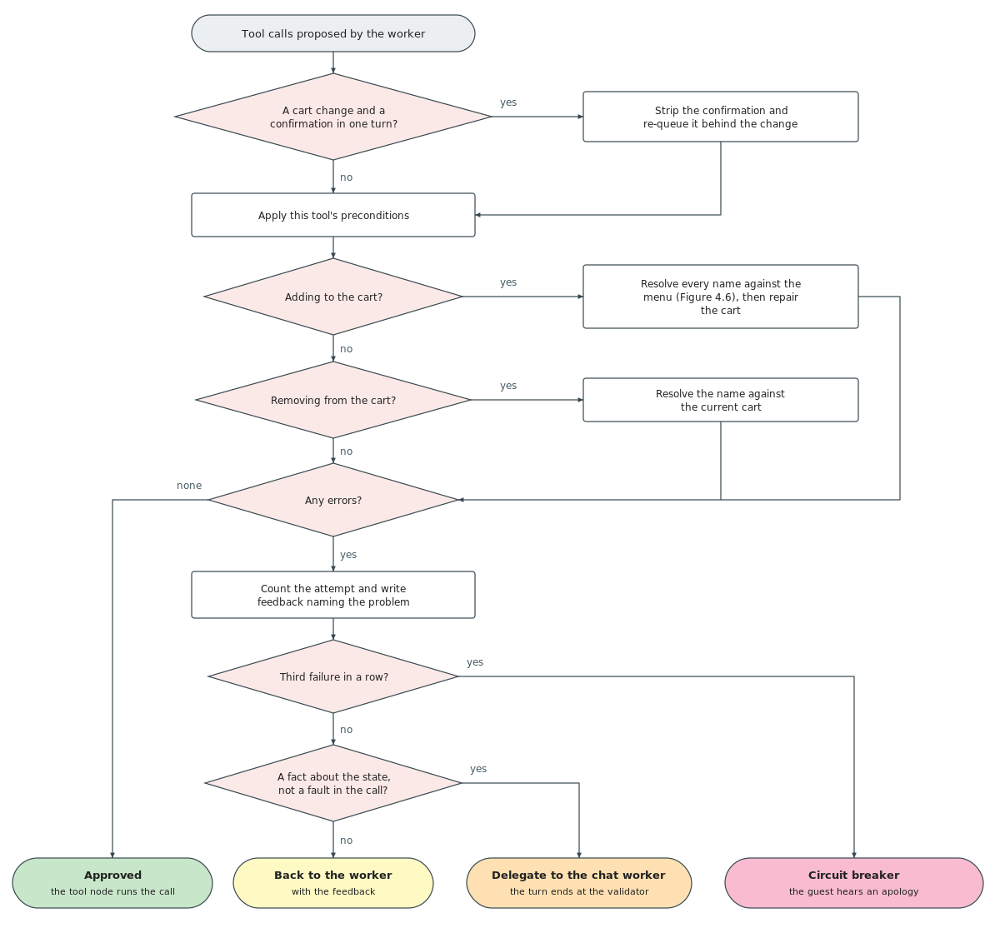

*Figure 4.: Validator Control Flow*

The core check is menu name resolution: whether each name the model produced exists among the menu's 234 entries, many of which share a leading word across a family of variants.

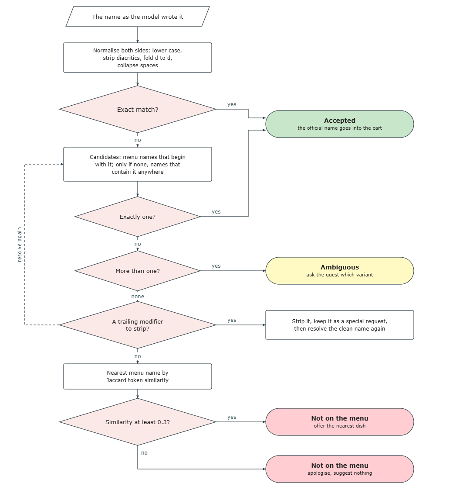

*Figure 4.: Menu Name Resolution Cascade*

The cascade runs in four steps, ordered from the most reliable evidence to the least.

Normalise. Both sides are lowercased, stripped of Vietnamese diacritics through Unicode decomposition, the letter đ folded to d, and whitespace collapsed, so that "Oc Huong Xot Trung Muoi" and "Ốc Hương Xốt Trứng Muối" become the same string.

Match exactly. If the input equals a menu name, resolution stops and the item is accepted.

Match partially. Menu names beginning with the input are collected first, a prefix being the most intuitive abbreviation; only if none begin with it does the validator fall back to names containing it anywhere.

Count the survivors. Exactly one is accepted. Several are reported as ambiguous and never auto-resolved, since a family like "Ốc Hương" appears in eleven sauce variants and choosing one for the customer would be incorrect. None means the item is off-menu.

Token similarity plays no part in the decision. It runs only after an item is ruled off-menu, to attach the best-scoring menu name by Jaccard similarity as a suggestion, and only if the score reaches 0.3; below that floor an apology is more useful than a barely related dish. Running after the ruling, it can never put a dish in the cart: the validator flags and suggests, the customer decides.

Vietnamese customers append special requests directly to dish names: "Lẩu Thái, ít cay", "Ốc Hương Xốt Trứng Muối, thêm hành", "Cơm Chiên (không hành)". The validator matches common delimiters (parentheses, commas, dashes) in priority order, strips the modifier, re-resolves the cleaned name, and stores the modifier in the item's special requests field. "Lẩu Thái, ít cay" becomes the dish "Lẩu Thái" with the modifier "ít cay".

Beyond menu validation, four state consistency rules apply.

A cart change and a confirmation are split. If the model emits a confirm-order call in the same turn as an addition, a removal, or a clear, the confirm is stripped and re-queued, so the customer sees the updated cart before confirming.

Additive turns restore the cart. When the utterance carries a marker like "thêm" or "nữa" and the model produced a replacement rather than an addition, the existing cart is restored. A destructive marker ("bỏ", "xóa", "đổi") suppresses the restoration.

Re-added items are deduplicated. Items the model pulled from context that the customer did not mention in the current utterance are stripped.

Clearing requires two turns. The first clear_cart on a non-empty cart is refused and a delegate asks the customer to confirm; only the next-turn retry passes. A turn-index guard (clear_confirm_at) expires after exactly one turn, so a vague "thôi" cannot delete the cart.

Table 4.7 lists the per-tool checks and what happens when each fails. Two of them are automatic rather than protective: for payment and confirmation the validator injects the table identifier into the arguments, since those tools call the orchestrator while the model works on session-scoped state and does not know the identifier.

*Table 4.7. What the validator checks before each tool, and what happens when a check fails.*

| Tool | Checks applied | On failure |
| --- | --- | --- |
| Add to cart | Every item name resolves against the menu; quantity is greater than zero | The item is dropped and recorded as off-menu or ambiguous |
| Remove from cart | The name resolves against the cart in three stages: exact, substring, then menu resolution plus cart lookup; if no quantity is specified or the quantity exceeds the cart count, the entire item is removed; otherwise only the specified quantity is subtracted | Rejected with feedback, worker retries |
| Clear cart | The cart is not already empty | Rejected with feedback, worker retries |
| Confirm order | Stage is awaiting confirmation; cart is non-empty; the item list is replaced with the server-side cart | Rejected with feedback, worker retries |
| Request payment, verify payment | The table identifier is injected from session state | Rejected with feedback, worker retries |

On failure the validator builds per-tool feedback in Vietnamese naming the exact problem and the nearest valid suggestion, and appends it to the conversation history, so the worker sees its own failed attempt alongside the corrective instructions on retry.

Not every rejection is returned to the worker. Some state a fact about the current state rather than a fault in the call: the cart is empty and there is nothing to confirm, or the dish to be removed was never in the cart. Those end the turn at the validator, which passes its recorded reason to the chat worker. Only malformed calls go back to be corrected.

The evidence behind that split is small but one-sided. Asked in development to recover from an empty-cart rejection, the worker reached the right answer on none of four cancellations and on two of seven confirmations, each failure consuming all three attempts before the turn fell out with an apology.

A loop counter tracks retry attempts. At three consecutive failures the circuit breaker routes to the state outcome, which produces a spoken apology, so the customer always hears a reply.

### 4.5.5 State Management

The agent has to carry two different things from one turn to the next, and they do not tolerate the same treatment. One is the conversation: what the customer said and what the robot answered. The other is the transaction: which dishes are in the cart, how many of each, what they cost, and how far the order has got. A summarized turn of dialogue still conveys what was said, so the conversation survives lossy compression. An itemized selection compressed to a phrase can no longer be priced, confirmed, or billed.

General-purpose agent frameworks keep both in the message list and manage it with a sliding window and periodic summarization, and no evaluation separates the two or measures the effect of holding each under a policy of its own (section 2.4.6). What follows is a typed state object kept apart from the message history, persistence keyed to the restaurant's own session, and a state machine that governs the ordering workflow.

The agent's shared state is a typed object carrying all information that must persist across turns and flow between nodes. Its fields divide into five categories by lifecycle, so each node knows which it may read, which it must write, and which are cleared before the next turn. Conversation history is the only field that grows monotonically within a session; everything else is overwritten or reset per turn. Table 4.8 sets out the categories.

*Table 4.8. The five categories of state field, by lifecycle.*

| Category | Fields | Lifetime |
| --- | --- | --- |
| Conversation history | User messages, assistant replies, tool results | Appends for the whole session |
| Task state | Table identifier, active cart (names, quantities, unit prices, special requests), order stage, search context | Persists across turns within the session |
| Routing state | Intent queue in first-in-first-out order, classification path taken, confidence score, per-intent sub-queries | Written by the router each turn, consumed as workers drain the queue |
| Inter-node contract | Validity flag, validator feedback, retry counter, off-menu items, ambiguous items | One turn only, cleared at the end of it |
| Output | Typed response context, UI action command, order-confirmed flag, cart-touched flag | One turn only, read by the response stage and the tablet |

The two one-shot flags in the output category earn their place: they let the tablet transition its display exactly once, which is what stops the agent from overwriting a hand-edited cart on a turn that had nothing to do with ordering.

The state persists between turns through a SQLite-backed checkpointer that saves after every node execution. The critical design decision ties the conversation thread identifier to the restaurant's session identifier: a session begins when a party is seated and ends when payment is verified. Within a visit, all turns share the same thread and the checkpointer restores the full state before each turn. Between visits, payment closes the session, the next seating creates a new session with a new identifier, the checkpointer sees a fresh thread, and all state is blank. No manual cleanup is needed; the session lifecycle naturally partitions conversation memory.

Six tools cover the agent's action space across three architectural categories, shown in Table 4.9. Three in-memory cart tools operate with no network calls or external dependencies and recompute prices from the authoritative menu data, never from the language model. Two orchestrator API tools bridge the agent to the persistent restaurant ledger. The search tool wraps the hybrid retrieval pipeline (section 4.6). A seventh callable, the delegate escape hatch, is absent from the table because it touches no state and never runs; it belongs to the workers rather than to the action space, and is described with them in section 4.5.3.

Settling the bill is not among them. The agent asks for payment and states the amount, and the settlement itself is recorded through the management panel, which closes the session and frees the table. Nothing a customer says can mark their own bill as paid.

*Table 4.9: The agent's seven tools, what each touches, and whether its effect outlives the session.*

| Tool | Category | Effect | Permanent |
| --- | --- | --- | --- |
| Search | Retrieval | Reads the menu index and returns ranked dishes | No, read-only |
| Add to cart | In-memory | Adds items, merging quantities for a dish already present | No |
| Remove from cart | In-memory | Removes a line, or reduces its quantity | No |
| Clear cart | In-memory | Empties the cart | No |
| Confirm order | Backend | Writes the order to the ledger and returns its identifier | Yes |
| Request payment | Backend | Totals the session and returns the amount and QR code | Yes |
| Verify payment | Backend | Settles the bill, closes the session, frees the table | Yes |

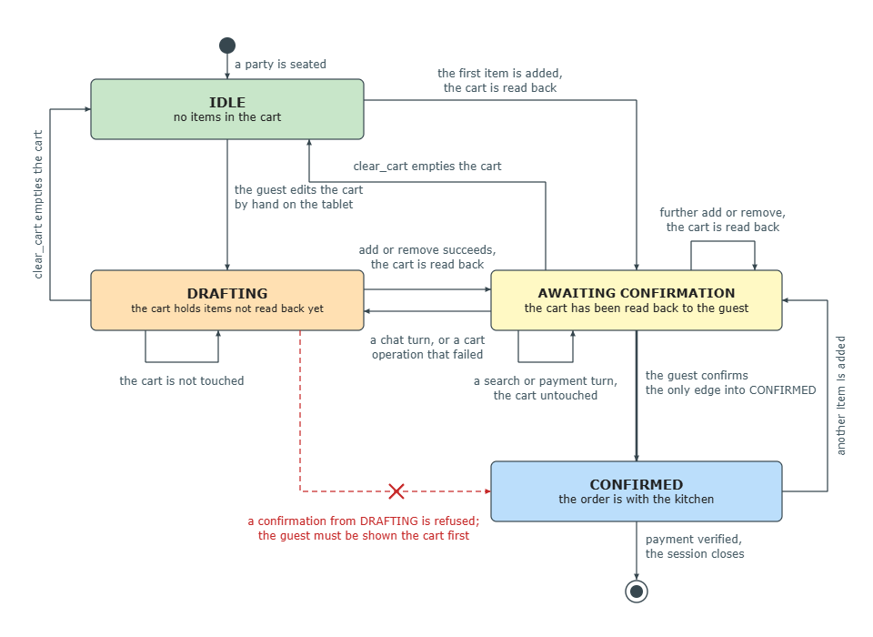

The ordering workflow is governed by a finite state machine, illustrated in Figure 4.7. Four stages are declared, IDLE, DRAFTING, AWAITING_CONFIRMATION and CONFIRMED, and all four are written by the running system: the two paths that reach DRAFTING are described at the end of this subsection.

*Figure 4.: Cart and Order Stage Machine*

In the idle state, no cart exists. The first successful addition moves the cart directly to awaiting confirmation, because the same turn that adds an item also echoes the cart back to the customer: there is no moment at which items sit in the cart unseen. Further additions, removals, and clearances keep the cart at awaiting confirmation and re-echo it, and emptying the cart returns it to idle. Only an explicit confirmation moves it to confirmed and sends the order to the kitchen. The critical rule is that no modification can proceed silently to confirmation: the customer always sees the updated cart first. In the confirmed state, payment proceeds and a new addition starts a fresh cycle.

The drafting stage is reached through two code paths. When a customer edits the cart manually on the tablet, the synchronised draft enters the graph as DRAFTING rather than AWAITING_CONFIRMATION, because the system has not yet read the updated cart back to the guest. Non-ordering turns that leave cart items unchanged also land at DRAFTING, to distinguish a silent cart from one the system just echoed verbally. Neither path reaches confirmation directly, so no order goes to the kitchen before the guest has seen and acknowledged the cart.

Two further protections guard the destructive transitions. Both are enforced by the validator and are described with the rest of its rules in section 4.5.4: a first clear_cart on a non-empty cart is refused pending confirmation, and a confirm_order sharing a turn with add_cart is stripped and re-queued, so the guest always sees the final cart before confirming it.

The tablet and the agent keep a bidirectional cart synchronisation. When the agent mutates the cart, it sets a per-turn cart_touched flag, and the tablet reads the flag to mirror the change into its own cart UI. When the guest edits the cart by hand on the tablet, the tablet pushes the full draft to the agent, which overwrites the checkpoint. The two converge on last writer wins, so a quantity changed by hand is not silently undone by the next voice turn.

The order_confirmed flag serves the same one-shot purpose for the confirmation step: it is set on the turn confirm_order succeeds and lets the tablet move its draft items into the ordered list exactly once, since order_stage alone cannot tell "just confirmed" from "still CONFIRMED from an earlier cycle."

### 4.5.6 Response Generation

The final stage converts the result of the turn into spoken Vietnamese. Its input is not the raw output of a tool but a typed response context, built by the state outcome or the chat worker and carrying only values that have already been checked. Table 4.10 sets out the five subtypes, one per kind of outcome a turn can reach. which is what makes the model safe to call on it. Table 4.10 sets out the five.

*Table 4.10. The five response contexts, and what each carries into the reply stage.*

| Context | Built by | Carries | Produced when |
| --- | --- | --- | --- |
| Order | State outcome | Cart, total, off-menu items, ambiguous items, stage, order identifier | A cart tool ran |
| Search | State outcome | Query, ranked results, dishes already shown in earlier turns | The search tool ran |
| Payment | State outcome | Amount, QR code address, table identifier, status | A payment tool ran |
| Chat | Chat agent | Utterance, cart, stage, history, up to five remembered dishes, delegate reason | No tool ran this turn |
| Retry | State outcome | Name of the failed tool, validator feedback | The circuit breaker tripped |

Most outcomes are formula-driven: a cart read back with its total, an order sent to the kitchen, a dish reported as unavailable. These use pre-written Vietnamese templates filled with values computed in Python, so the phrasing is identical on every occurrence and the numbers are arithmetic rather than generation. Templates cost microseconds, need no inference, and were written by a native speaker rather than translated from English.

Two kinds of content cannot be written in advance. A search that returned dishes has to become something a waiter would say, selected and ordered against what the customer asked rather than read out rank by rank. Open conversation has to follow whatever was actually said. Both go to the model, and it receives more than a list of names: each dish carries its price, taste profile, tags, and category, and on the conversational path the cart with its computed total, the order stage, and the dishes discussed in earlier turns. All of it is read from the menu data, so the model decides which dishes to raise and how to describe them, never what they are or what they cost.

Within each context type an ordered set of conditions selects the path, listed in Table 4.11. Of the twenty paths a turn can reach, seventeen are assembled from templates and three call the model: a search with results, and the two conversational paths, one with remembered dishes and one without.

Table 4.11. How a reply is chosen. Conditions are tested top to bottom within each context, and the first one that matches wins.

| Context | Condition | Reply |
| --- | --- | --- |
| Order | Ambiguous items present | Template: ask which variant |
| Order | Off-menu item with a nearest match | Template: name it as unavailable, offer the match |
| Order | Off-menu item with no match | Template: plain rejection |
| Order | Tool reported an error | Template: convey the error |
| Order | Confirm order succeeded | Template: the order has gone to the kitchen |
| Order | Remove succeeded | Template: acknowledge, then echo the cart |
| Order | Clear succeeded | Template: acknowledge |
| Order | Otherwise, add succeeded | Template: echo the cart with prices and total |
| Search | Tool reported an error | Template: nothing suitable found |
| Search | No results | Template: not on the menu, offer to suggest something |
| Search | Results returned | Model, generated whole, checked against the retrieved dishes, then spoken sentence by sentence |
| Payment | Request without an amount, or an error | Template: apologise |
| Payment | Request succeeded | Template: state the total, show the QR code |
| Payment | Verification succeeded | Template: confirm the bill is settled |
| Chat | Delegated to review the cart | Template: echo the cart, or say it is empty |
| Chat | Delegated as unclear | Template: ask the customer to repeat |
| Chat | Greeting or thanks | Template: standard courtesy reply |
| Chat | Dishes held in memory | Model, generated whole, checked, then spoken sentence by sentence |
| Chat | Otherwise | Model, streamed token by token |
| Retry | Always | Template: apologise, quoting the validator's feedback |

The three model paths pass a grounding check before anything is spoken. Given the retrieved dishes and told to name only those, the model still invents plausible neighbours: "Ốc Luộc" and "Ốc Hương nướng mỡ hành" both appeared during development on a menu carrying neither. Detecting an invented name directly is not possible, since it matches nothing that could be compared against the menu, and a Vietnamese reply is full of bare food words such as "món ốc" that any pattern broad enough to catch would also catch in a correct sentence.

The check is therefore positive rather than negative. A reply that recommends dishes must name at least one of the dishes actually retrieved, matched as whole words after normalising diacritics on both sides. A reply naming none is discarded and replaced by a deterministic listing of the real results with their prices. A reply given no dishes to check against, such as an answer to a general question, passes untouched.

This catches the reply that has left the retrieved set altogether, where the customer would order a dish the kitchen cannot cook and the tablet would show no card for it. It does not catch an invented name standing beside a genuine one, since one real dish satisfies the test. That residual case is the one place where model output reaches the customer without a deterministic check, and Section 5.6.2 of Chapter 5 reports it as such.

Streaming differs by path. Open conversation is streamed token by token and split into sentences at Vietnamese punctuation. Replies that name dishes cannot be: grounding can only be judged on the finished text, and a spoken sentence cannot be recalled, so they are generated in full, checked, and only then emitted sentence by sentence. Template responses are emitted as a single event.

## 4.6 Knowledge Retrieval Pipeline

A customer asks "món gì ấm bụng cho ngày lạnh?". The menu lists dishes by name, category, and price, and no word of that question appears in it. Keyword search returns nothing; vector search returns whatever sits nearest a general sentence about warmth. The query and the dish that answers it share no vocabulary, so ordinary retrieval has nothing to match on.

The pipeline closes that gap in four stages. The model rewrites the query into concrete search terms. A keyword index and a vector index search the same 234-entry menu in parallel. A gate decides whether the results are worth answering at all. What survives is rephrased against the original request and retained for later turns.

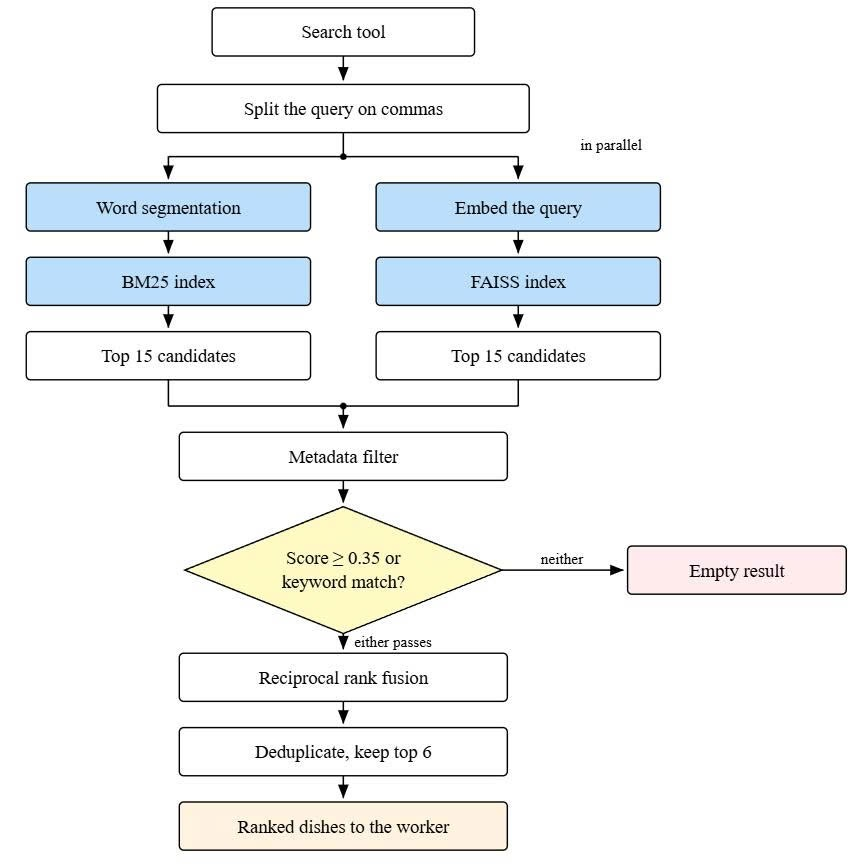

*Figure 4.: Hybrid Retrieval Pipeline*

### 4.6.1 Query Rewriting

The search agent uses the language model to translate the utterance into search terms before any retrieval runs. The task is cultural mapping, not keyword extraction. "Ấm bụng" names the sensation of warmth and fullness after eating, which in Vietnamese cuisine means noodle soups, hot pots, porridges, and stews. The model produces "lẩu, súp, cháo, bún, phở, món nước nóng", all of which appear in the menu's category and tag metadata. Extracting tokens from the original would give "món", "ấm", "bụng", "lạnh", matching no entry.

The rewritten query is split on commas, and each term runs as an independent sub-query. Results are merged and deduplicated by dish name, so one request becomes five parallel searches covering every category the model identified. Decomposition is the model's responsibility; the retriever matches terms without knowing why they were chosen. Mappings such as "ấm bụng" to "cháo, lẩu, súp nóng" or "giải nhiệt" to "nước ép, sinh tố, trà đá" are taught by example in the search agent's prompt, which removes the need for a separate rewriting model or a synonym dictionary.

Abstracting a query upward before retrieval is Step-Back Prompting, from the survey of retrieval-augmented generation in Section 2.5.4 of Chapter 2. Two things differ here: the abstraction yields several categories rather than one higher-level question, since a sensory description spans unrelated parts of a menu, and what is abstracted is a culinary association rather than a fact.

### 4.6.2 Hybrid Retrieval and Fusion

The retrieval system processes rewritten queries through two parallel lanes: keyword matching (BM25) and semantic matching (FAISS). BM25 matches exact terms across dish names, categories, and profiles, while FAISS matches meaning through cosine similarity over embedding vectors. We run both because their strengths and failure modes are strictly complementary, as outlined in Table 4.12.

*Table 4.12. Where each retrieval lane succeeds, where it fails, and on what kind of query.*

| Lane | Strong when | Weak when | Worked example |
| --- | --- | --- | --- |
| Keyword | The query names a dish or a category that appears in the menu text | The query and the dish that answers it share no words | "Ốc Hương" finds every sauce variant; "hải sản" misses "tôm mực cá" |
| Semantic | The query describes a taste, an attribute, or a sensation | The dish name is rare and the encoder has little evidence for it | "món cay" finds spicy dishes with no word match; "Ốc Hương Xốt Trứng Muối" may sit closer to generic restaurant text than to itself |

Both indices cover the same 256 documents: 234 menu dishes and 22 supporting documents (e.g., best sellers, restaurant information, and customer policies). For indexing, each dish is flattened into a single document concatenating its name, category, tags, taste profile, and description. The semantic lane encodes each document as a 768-dimensional vector using a frozen bi-encoder (shared with the intent classifier) and performs exact, rather than approximate, nearest-neighbor search, which carries negligible compute cost at this corpus size.

Crucially, the two lanes differ in their tokenization strategies. The keyword lane applies Vietnamese word segmentation to ensure compound words remain whole. However, the semantic lane disables this segmentation. Because menu documents are formatted as multi-line templates, the segmenter often splits dish names differently in the index than it does in a natural spoken query. Disabling segmentation for the dense lane prevents these artificial mismatches.

he two lanes are queried concurrently on a two-worker pool, meaning the wall-clock retrieval time is simply the maximum of the two lanes rather than their sum. Each lane retrieves up to fifteen candidates. If the customer's query contains explicit constraints (e.g., price limits, dietary requirements, or specific categories), a metadata post-filter is applied. This filter only affects menu documents, leaving the 22 supporting information documents untouched.

Because BM25 produces unbounded term-weight sums while FAISS produces bounded cosine similarities, their raw scores cannot be directly compared. Instead, the resulting lists are combined using Reciprocal Rank Fusion (RRF), which operates on rank positions. Each lane contributes a score to a document based on the following formula:

where  is the document's rank in a given list,  is the rank constant (which dampens the gap between neighboring ranks), and  is the weight of the lane. If a document appears in both lists, its scores are summed, allowing a document ranked moderately well by both lanes to outrank a document placed first by only one.

The keyword lane carries the heavier weight, at 3 against 1. A customer ordering from a restaurant says the words printed on its menu, so lexical overlap is high, and equal weights let the semantic lane demote an exact match in favour of a dish that is merely thematically close. The semantic lane is kept at reduced weight for coverage rather than ranking quality: it answers questions about the restaurant itself, which the twenty-two supporting documents serve and the keyword lane handles poorly, since that lane indexes only their titles and leaves the body of an information section reachable through the dense lane alone.

While Section 5.4.4 shows that for this specific menu corpus, the keyword lane alone slightly outperforms the fused ranking, the hybrid design is retained. A menu corpus represents a worst-case scenario for dense retrievers; keeping the semantic lane ensures the system can handle non-menu FAQ queries and generalizes well to other domains with wider vocabulary gaps.

After fusion, the combined list is sorted by descending score, deduplicated, and truncated to the top six results. To ensure non-menu documents are not accidentally filtered out, deduplication keys on the dish name for menu items, but falls back to the section title for supporting documents.

### 4.6.3 Relevance Gatekeeper

The gatekeeper runs before fusion and decides whether the query is worth answering at all. Two tests are applied to the retrieved candidates. Either one passing admits the query; only if both fail does retrieval return an empty list, with no fusion performed.

Semantic test. The top FAISS result passes if its cosine similarity reaches 0.25.

Lexical test. Vietnamese function words are stripped from the query, and any remaining term must appear as a whole term in the top three documents of either lane. Depth three rather than one, because a descriptive term such as "ấm bụng" often sits at rank two or three in a correct retrieval.

Two rules make the lexical test capable of rejecting anything, both added after an earlier version admitted every query put to it. Matching is by whole term rather than substring, since "đông" in "nhóm đông người" is contained in "Cải Thìa Xào Nấm Đông Cô". Function words are stripped first, since "có", "món" and "gì" appear in nearly every menu document, each being rendered from a template carrying the fields "Loại món ăn" and "Giá".

The semantic test discriminates weakly. Answerable queries score 0.25 to 0.69 against their best document. Two of the fifty evaluation queries fall below the 0.25 threshold and are rejected by the semantic test. Most rejection is handled by the lexical test, which stops queries whose terms appear nowhere in the corpus.

CRAG places a comparable check at this point, scored by a language model call with a web-search fallback (Section 2.5.4 of Chapter 2). This gate is two threshold tests over values the retrievers have already computed, so it costs no inference, and it returns nothing rather than a substitute from outside the menu.

*Table 4.13. Settings of the retrieval pipeline.*

| Stage | Setting | Value |
| --- | --- | --- |
| Keyword lane | Term frequency saturation | 1.2 |
| Keyword lane | Document length normalisation | Disabled, since menu entries are short and near-uniform |
| Keyword lane | Tokenisation | Vietnamese word segmentation, compounds kept whole |
| Semantic lane | Embedding dimensions | 768 |
| Semantic lane | Index | Exact flat inner product over normalised vectors |
| Both lanes | Candidates returned per lane | 15 |
| Gatekeeper | Semantic lane, top-1 cosine similarity | At least 0.25 |
| Gatekeeper | Lexical lane | Any query keyword present in the 3 top document |
| Fusion | Rank constant | 60 |
| Fusion | Results returned | 6, deduplicated by dish name |
| Sub-queries | Results requested per comma-separated term | 6 |
| Follow-up memory | Dishes retained for later turns | 5 |

### 4.6.3 Result Rephrasing

Retrieval hands the response stage a typed search context in which every dish carries its name, price, category, tags, and taste profile, all read from the menu data rather than produced by the model. The model judges each dish against the original request and phrases the reply, deciding ordering and wording but never which dishes exist or what they cost.

When the gatekeeper rejects a query the context is empty, and an empty context cannot be embellished: with no dishes to name, the reply becomes an apology and an offer to show the menu. A hit and a miss are therefore answered differently on the evidence retrieval produced, not on an instruction in a prompt.

Restaurant conversations span multiple turns, and a customer may ask about a dish several turns after it was recommended. Without a retained context the agent repeats the same search and returns the same results.

The search agent receives a dynamic list of already-known items, drawn from the most recent search call and retained across turns. Reading it before deciding whether to call the search tool, the model can recognise a question about a dish already discussed and delegate to the chat worker, which answers from a curated memory of up to five dishes, each carrying name, price, tags, and taste profile. The active cart is included in the same context, so a question about a dish already in the cart is answered from state rather than by a redundant search.

A cumulative list of every dish name ever returned by a search is maintained separately and injected into the response prompt as an anti-repetition constraint, so repeated searches prioritise different dishes. The list is cleared when the cart is emptied or the session resets.

Both indices are built offline and serialised to disk, then loaded during the agent's warmup, so a rebuild is needed only when the menu changes. The retrieval pipeline is evaluated in Section 5.4.4 of Chapter 5.

## 4.7. Backend Orchestrator

### 4.7.1. Where This Layer Sits

Chapter 3 ended with the robot receiving a navigation goal and driving to it. This section covers the layer that produces that goal.

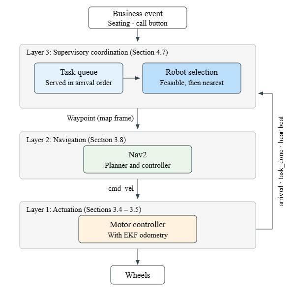

*Figure 4.: The three control layers*

A business event enters at the top, either a party seated or a call button pressed. The supervisory layer, which is what this section is about, holds two blocks: the task queue, keeping outstanding jobs in the order they arrive, and robot selection, which takes the job at the head and works out who goes. All that leaves this layer is one waypoint in the saved map frame, not the route to it. Nav2 plans and follows that route, passing cmd_vel to the motor controller, which drives the wheels and closes its own loop on EKF odometry (Section 3.5). Up the right of the figure runs everything that comes back: arrived at the table, task_done at the end of the job, and a heartbeat carrying pose and battery. That is all the backend learns about the motion it started, and all it needs.

The backend is one FastAPI process on the central server with a single SQLite file behind it, holding which tables are seated, what each party has ordered and paid, and which robot is on which job. Every screen draws from that one file, so the manager's tablet, the entrance kiosk and the screen on the robot cannot disagree. The conversational agent of Section 4.5 runs separately and the two exchange plain HTTP requests, neither importing the other's code, so a reasoning step of several seconds cannot stall the kitchen board and either side can be restarted alone.

Clients reach it two ways, and the split follows who is deciding. A request over HTTP appears whenever someone chooses to act: a party seated at the kiosk, a tool call from the agent. It carries the change and waits for an answer, and its paths are named the REST way, by the thing being acted on rather than by the action. A message over the WebSocket goes the other way, sent when the backend has to tell someone what just happened, or when a robot reports in. The manager's panel and the screen on each robot hold such a socket open from the moment they load, so an order appears on the kitchen board as it is placed, a robot moves on the minimap as it drives, and a guest's screen changes by itself the moment the robot reaches their table. Polling would have fixed that delay at the polling period however fast the backend reacted. The robot holds one too, two-way in its case: it receives its waypoint there and sends back arrival, completion and heartbeat.

### 4.7.2 The Dispatcher

The dispatcher is the part that turns a business event into a robot on its way somewhere. It is the only component here that makes a choice rather than a record, and the rest of this section is that choice: what creates work, which robot gets it, and in what order.

A task is one piece of work for a robot: drive to this table and stay there until the guests are done with it. Two events create one. Seating a party makes a task to go out and take the order, and the call button makes a task to attend a table that has asked for help. In both cases the task carries a table number and nothing about how to get there.

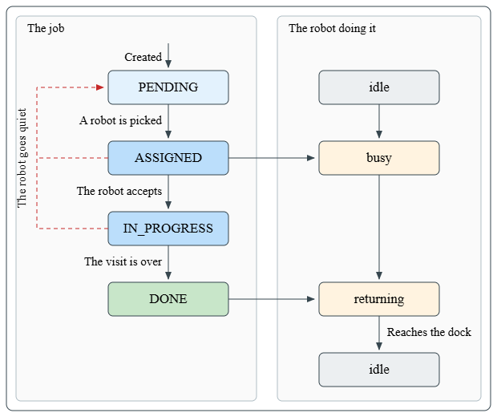

*Figure 4.10: A task, and the robot state*

Figure 4.10 puts the two beside each other because they move together. Down the left is the job, down the right the machine doing it, and time runs from top to bottom. A task starts PENDING and waits its turn. When the dispatcher picks a robot the task turns ASSIGNED and that robot leaves idle for busy, which is what the arrow across the middle means: the state of the job is what moves the state of the robot, never the reverse. The robot then confirms it has the work and the task becomes IN_PROGRESS. When the visit is over the task is DONE and the robot starts returning, and it counts as idle again only after it reports reaching the dock, so one still driving home is never mistaken for one parked and free.

The dashed line back up the left is the failure case. A task already handed out whose robot goes quietly returns to PENDING and is offered to the fleet again, which the end of this section takes up.

Assignment happens on two levels. The queue is served first come first served by creation time. For the task at its head, the dispatcher first throws out every robot that cannot take it, keeping only those still connected, either idle or driving home, and above a battery floor of twenty per cent. Of whoever is left it picks the one closest to the table. Both the robot positions and the table are measured against sit in the saved SLAM map frame, the one the robot navigates in, so nothing is converted between them. A robot driving home counts as available, since a task handed to it in transit starts as soon as the wheels are free.

To pick the closest robot the backend has to know where they all are, so each robot reports its position and battery several times a second. That rate is why those readings are not kept the way the rest of the data is. Orders and payments arrive a few dozen times an hour and go into the SQLite file, which locks whole for every write, so pushing position reports through the same lock several times a second would leave the two waiting on each other. Positions are held in memory instead and overwritten by the next report, with a copy saved to the file occasionally so that a screen reloading has something to draw. The panel's map is fed five of those updates a second, smooth enough to watch and light on the connection.

## 4.8 Web Interfaces

### 4.8.1 The Guest’s Ordering Screen

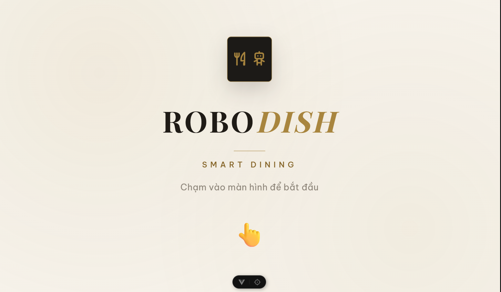

*Figure 4.: The ordering screen at rest, waiting for a guest to touch it*

The ordering screen runs on the touchscreen mounted on the robot, so a guest orders on the machine that drove to their table rather than on a tablet left there. It is organized as a short sequence of screens: a welcome, a choice of what to do, the menu, a confirmation, and payment.

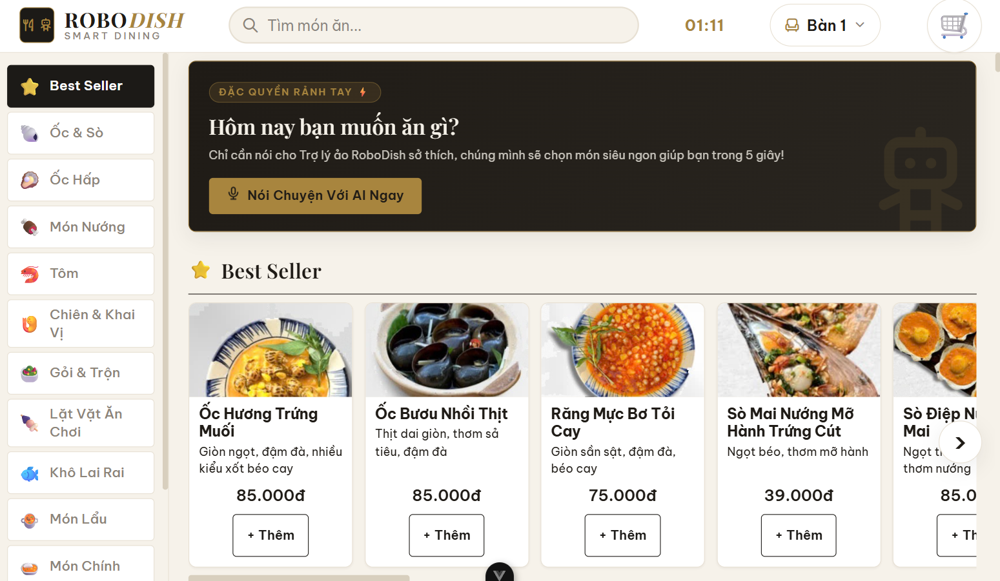

*Figure 4.: The menu, with the voice prompt sitting above the dish grid*

Which screen a guest first sees is decided by the state of their table rather than by the guest. A party that has just been seated and has ordered nothing gets the welcome screen. A table already dining goes straight to the choice between ordering more and paying, because that is the only thing a party in the middle of a meal wants from it. The screen asks the backend for its table's state to make that decision, so it holds true after every return to the start, including when a robot arrives at a table partway through a visit.

From the menu the guest browses by category, opens a dish for its detail and photograph, changes quantities, and places the order. What is placed is a list of dishes and quantities. The amount is computed by the orchestrator from the stored prices, so a stale or tampered screen cannot set what a party pays.

The screen also mirrors the spoken conversation. As the guest talks, it shows what was heard and the reply that came back, and it follows along when the agent opens the menu or the payment page, so a guest who orders entirely by voice still sees the same screens move under them. The cart on the screen and the cart the agent is building are held as one in both directions: a dish added by voice appears in the cart, and a quantity changed by hand is pushed back into the agent's state, so the next spoken turn does not overwrite it with a stale copy.

One boundary inside this screen is worth naming because it is easy to assume otherwise. The browser never touches the microphone. The talk button signals the robot, and the recording, the transcription, and the speech all happen in the voice pipeline on the same board (Section 4.4). The screen is a viewer of the conversation, not a participant in it, which is why muting the robot or cancelling a turn are requests sent to the robot rather than actions taken in the page.

### 4.8.2 Entrance Kiosk

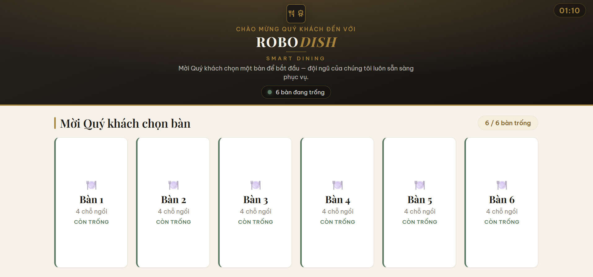

*Figure 4.: The entrance kiosk, showing the tables and how many are free*

The kiosk stands at the entrance, outside the dining area, and does a single job: booking a table. A guest arriving at the restaurant uses it without waiting for anyone. It shows the tables as a grid, each marked free, dining, or waiting to be cleared, with a count of how many are open. The guest taps a free table, sets the party size against the table's capacity, and confirms. That opens the session, marks the table as occupied, and sends a robot to meet the party at it. A closing screen confirms the table is ready and tells the guest to order on the screen at the table, then returns to the grid for the next arrival.

### 4.8.3 Management Panel

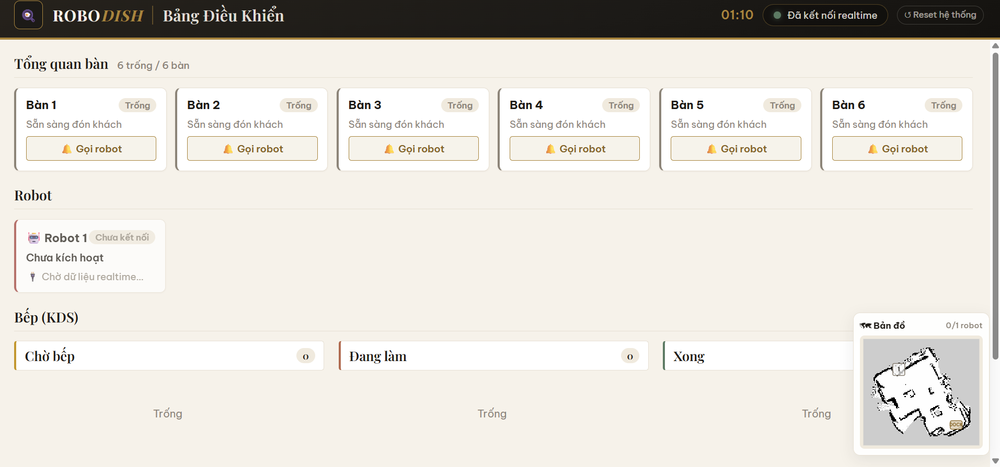

*Figure 4.: The management panel: the table overview, the robot board, the kitchen board, and the minimap docked at the lower right*

The management panel is the staff view of the whole floor, carried rather than mounted so it can be read anywhere in the restaurant, and it has four parts on one screen.

The table overview lists each table with its party size, how long since it was seated, its running total, and where its order stands with the kitchen. Two actions sit beside each row: call a robot to the table, and close out a table that has paid, which frees it and clears any work still queued for it.

The kitchen board is the display the kitchen works from. Orders appear as cards in three columns, waiting, cooking, and done, and a card is moved along as the food progresses. Moving a card to done is not only a status change: it is what creates the delivery task and puts a robot on the way, which is the seam where the kitchen's work becomes the robot's (Section 4.7.4).

The robot board shows each robot with what it is doing right now, described in the words the staff would use rather than in states from the database: on its way to table three, serving table one, returning to the dock, or disconnected. A robot that has never connected since the system started is shown as such rather than as idle, so nobody sends work to a machine that is switched off.

The minimap draws the robots on the restaurant's actual SLAM map and moves them as they travel. It is the point where the web layer meets the navigation layer with nothing in between: the backdrop is the same map the robot localizes against in Chapter 3, and the positions on it come straight from the robots' telemetry, projected into the map frame the robot itself uses. It sits as a small draggable overlay above the rest of the panel, so the manager can put it wherever it does not cover what they are reading.

A connection indicator in the header reports whether the panel's own WebSocket is live. It is a small thing, but it is the difference between a quiet floor and a screen that has silently stopped updating, and on a screen that is watched rather than clicked, that distinction is worth showing.

