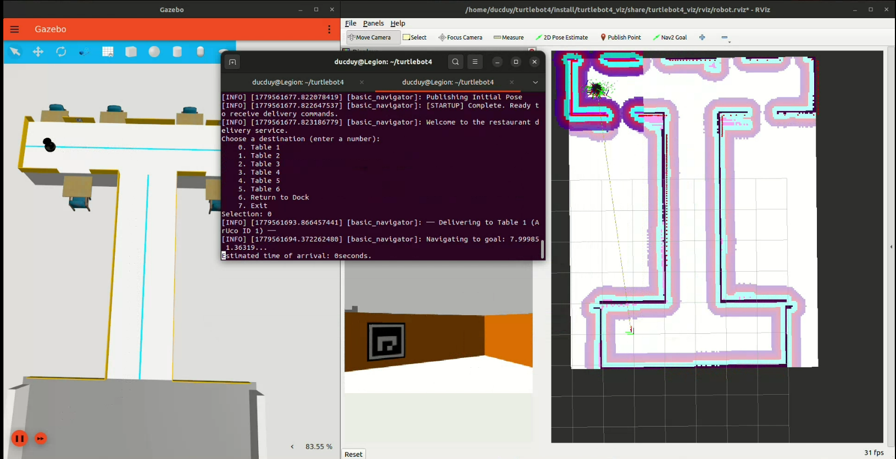
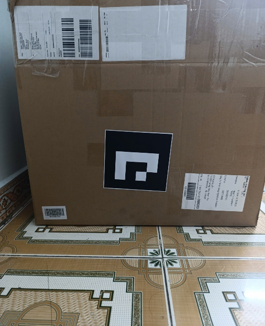
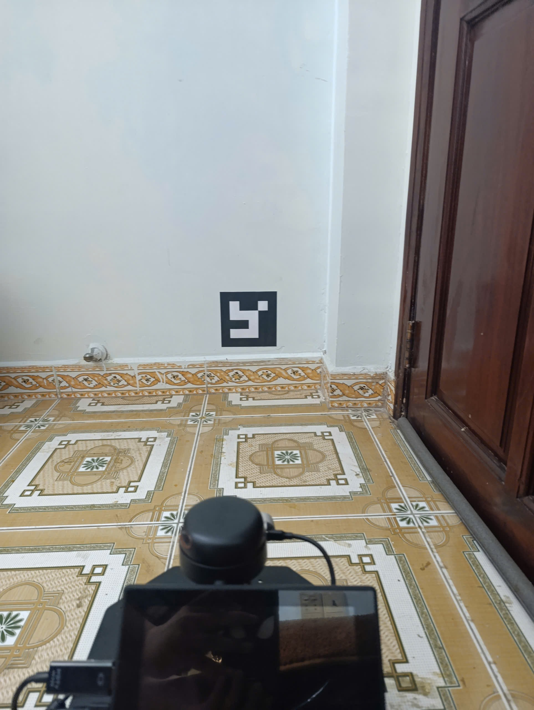
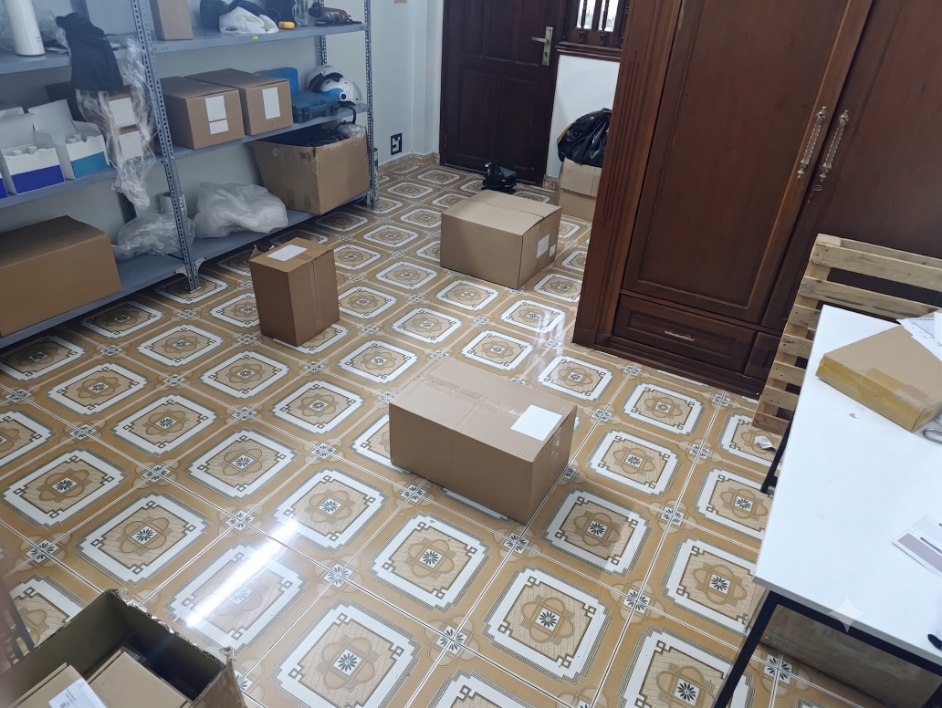
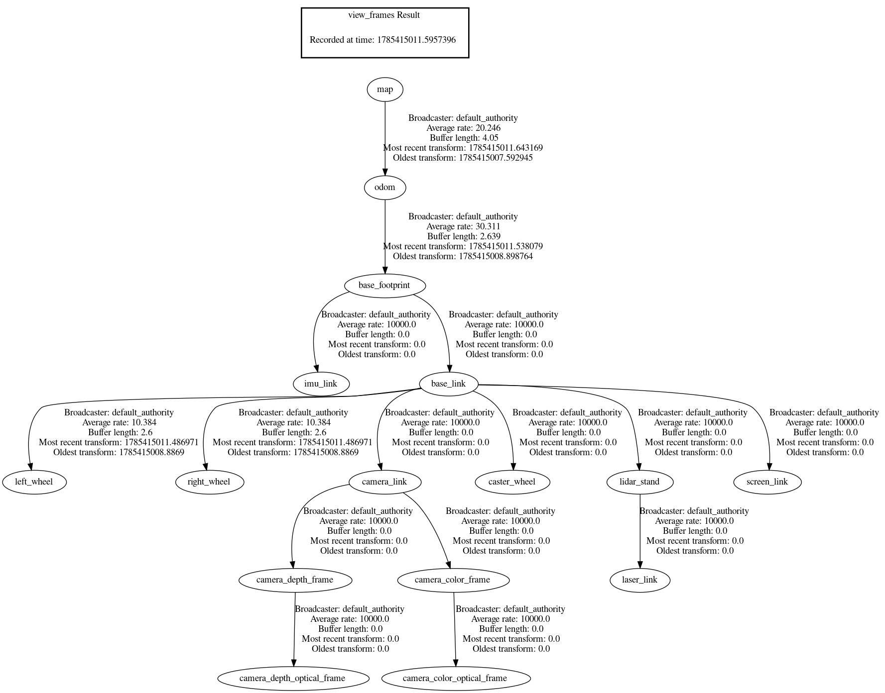
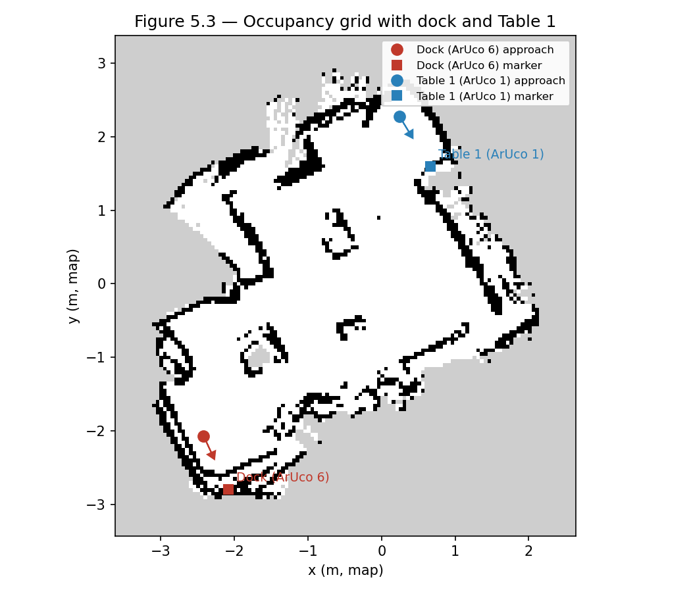
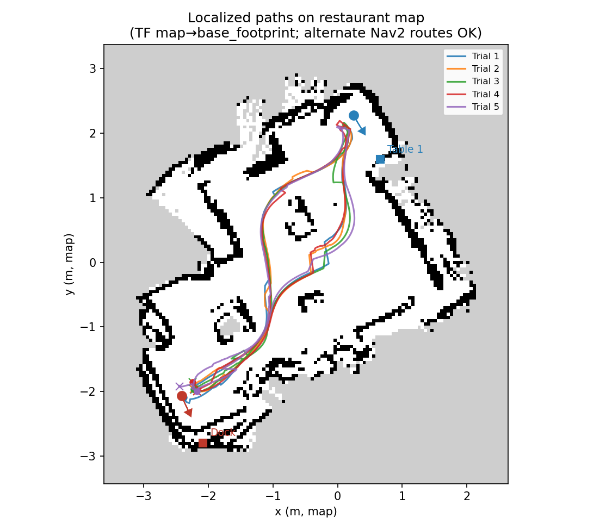
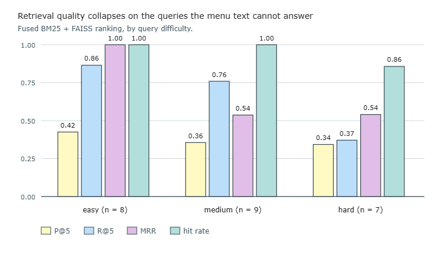
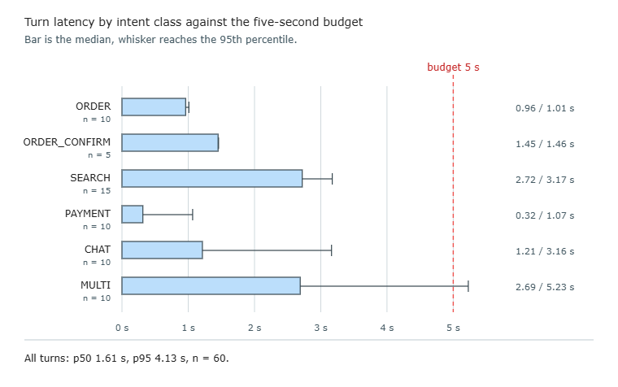
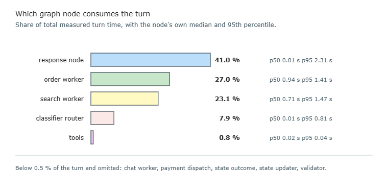

# CHAPTER 5: EXPERIMENTAL RESULTS

## 5.1 System Under Test

This section describes the hardware, the robot platform, and the software stack that every experiment in this chapter was run on. Nothing was measured in simulation or on a different machine. The physical robot is introduced here because its sensors, its compute board and its 8 GB memory ceiling shape several of the architectural decisions evaluated in Section 5.4 and Section 5.5, and because the system is a waiter robot, not only a software pipeline: the hardware is part of what was built.

### 5.1.1 Server Hardware

The server is a single x86-64 laptop that runs the LLM, the conversational agent, the backend orchestrator and the menu retrieval indices. It is the central machine in the three-tier topology described in Section 4.3.

*Table 5.: Server specification*

| Component | Specification |
| --- | --- |
| GPU | NVIDIA GeForce RTX 5060ti GPU, 16 GB VRAM, CUDA 13.0 |
| CPU | Ryzen 7 5700x |
| RAM | 32 GB |
| Storage | 1 TB NVMe SSD |
| Operating system | Ubuntu 22.04 |

The language model is Qwen2.5 14B Instruct, served by Ollama with keep_alive = -1 so the model is loaded once at startup and stays pinned in VRAM for the lifetime of the server process. A warmup ping at agent startup ensures the model is loaded before the first customer utterance arrives. The same model serves all three LLM roles in the agent: the tool-calling workers, the query and result rewriters, and the response generator. The selection of this model class follows from the survey of Vietnamese-capable LLMs in section 2.4.3.

The evaluation reported in this chapter was carried out with qwen2.5:14b-instruct serving the tool-calling workers, the rewriters and the response generator. The larger model is the intended deployment configuration; the experiments in Section 5.4 and Section 5.5 characterise the system as run on the smaller one, and the turn-latency figures in Section 5.4.6 in particular would be expected to grow on a larger model. Results that depend only on the trained classifier, the deterministic validator or the retrieval indices are unaffected by this difference, and are identified as such where they appear.

### 5.1.2 Robot Platform

The robot is a purchased two-wheel differential-drive chassis carrying the sensors, the compute board and the peripherals that make it a waiter. The mechanical platform (chassis, two MC520P30 DC motors with encoders, an STM32 microcontroller and an MPU6050 IMU) was bought as a unit. The research contribution begins at ROS 2 integration: the sensor suite, the navigation software and the voice pipeline were added by the group.

*Table 5.: Robot hardware components and specifications.*

| Component | Specification | Role |
| --- | --- | --- |
| Compute | NVIDIA Jetson Orin Nano, 8 GB unified memory, CUDA 12.6 | Runs ROS 2, navigation stack and voice pipeline |
| LiDAR | RPLiDAR A2M8, 360° 2D laser scanner, 8 Hz | SLAM and obstacle avoidance |
| Depth camera | Intel RealSense D435, RGB-D, 30 Hz | Loop closure (RTAB-Map) and ArUco docking |
| IMU | MPU6050 (6-axis gyroscope + accelerometer) | Angular rate for EKF sensor fusion |
| Microphone | USB condenser microphone, 16 kHz mono | Voice capture |
| Speaker | Bluetooth speaker | Voice reply playback |
| Display | 7-inch LCD touchscreen, HDMI + USB touch | Customer-facing tablet interface |
| Motors | 2 × MC520P30 DC motors with encoders (P = 1024 pulses/rev, G = 30:1) | Differential-drive locomotion |
| Battery | 12 V Li-ion pack | Powers all onboard electronics |

The Jetson's unified memory is shared by the CPU and GPU, and the operating system kills processes that exceed it. Before this chapter's work begins, the navigation and localisation stack built in Chapter 3 already holds approximately 3.7 GB: ROS 2 middleware (~0.2 GB), sensor drivers (~0.5 GB), RTAB-Map localisation (~2.0 GB), Nav2 planners and costmaps (~0.7 GB), and EKF odometry fusion (~0.3 GB). The voice pipeline described in Section 4.4 takes a further ~3.7 GB, filling nearly all of the remainder. The consequence, that the LLM cannot run on the robot, is validated in Section 4.3.1 with measured resident-memory figures; the navigation experiments in Section 5.3 test whether the Chapter 3 stack performs correctly within this budget, and the latency experiments in Section 5.4.6 confirm that the server-side LLM placement adds no unacceptable delay.

### 5.1.3 Software & Network Stack

Every software component and its version are pinned so that any experiment in this chapter can be reproduced on a machine with the same specification.

*Table 5.: Software stack specifications.*

| Component | Version | Role |
| --- | --- | --- |
| Operating system | Ubuntu 22.04 LTS | Server and robot |
| ROS 2 | Humble Hawksbill | Robot middleware, navigation and sensor drivers |
| Python | 3.10 | All server-side and robot-side Python code |
| uv | (lock file: uv.lock) | Python dependency management, exact version pinning |
| Ollama | 0.5.x | LLM serving on the server |
| faster-whisper | 1.0.x (CTranslate2 backend) | STT inference on the robot |
| Silero VAD | (bundled model, ~1.5 MB) | Voice activity detection on the robot |
| Piper TTS | (community Vietnamese voice, ~200 MB) | Speech synthesis on the robot |
| FastAPI | 0.115.x | Backend orchestrator REST and WebSocket server |
| LangGraph | 0.2.x | Agent graph execution engine |
| SentenceTransformers | 3.x | Embedding model loading and inference |
| FAISS | 1.8.x | Dense vector index for menu retrieval |
| Vue 3 | 3.5.x (Vite 6.x) | Three single-page web applications |
| SQLite | 3.x (system) | Business ledger and conversation checkpoints |

The server and the robot communicate over a local WiFi network with no
internet dependency in normal operation. The three web applications (the customer tablet, the entrance kiosk and the management panel) connect to the server over the same WiFi. Only small structured messages cross the network: text transcripts (~100 bytes), pose coordinates and navigation goals. Audio, video and LiDAR scans are processed on the robot and reduced to these messages before transmission. The architecture and the protocol choices are described in full in Section 4.3.

## 5.2 Evaluation Design

All evaluation data was written by hand against the menu of a single reference restaurant, Ốc Quậy, a Vietnamese seafood establishment. Every dish name in every dataset resolves against assets/data/menu.json, so the same 234-entry menu is ground truth for retrieval, name resolution and out-of-menu rejection alike. Evaluating against one menu tests the architecture; evaluating against several would test the menu-authoring process.

*Table 5.: Evaluation datasets*

| Dataset | Size | Purpose |
| --- | --- | --- |
| Router: single-intent | 225 utterances | Classification from text alone |
| Router: held-out test set | 39 utterances | Objective 1, partitioned before training |
| Router: multi-intent detection | 30 cases, 27 multi-intent and 3 controls | Decomposition trigger |
| Retrieval | 50 queries, graded judgements | Menu search relevance across three difficulty levels, including requests the menu cannot answer |
| Validator name resolution and ambiguity | 70 pairs + 25 cases | Per-stage resolution accuracy, generic-name ambiguity |
| Safety pool (E2E + out-of-menu) | 41 scenarios | Paired set both validator ablation arms run on |
| Out-of-menu robustness | 30 scenarios, 7 categories, a subset of the safety pool above | Off-menu rejection, with a negative control |
| Delegate escape hatch | 45 scenarios, 90 turns | Abstention rate under forced tool calling |
| Multi-intent completeness | 25 turns | Intents executed against intents verbalised |
| E2E qualitative | 7 conversations, 30 turns; all 7 reported | Full-pipeline behaviour, reported as transcripts |

The single-intent set pools two files written at different points in the project, 149 and 100 utterances, deduplicated to 225. The held-out set is reported separately because it was partitioned before training, though 36 of its 39 utterances also appear in the single-intent set, so it confirms the classifier on data drawn from the same authored pool rather than on independent material. The multi-intent set is kept apart because it asks a different question: not which label an utterance carries, but whether the router recognises an utterance it should not try to label at all. The delegate turns are drawn from the safety pool plus a fourth set of four longer conversations.

### 5.2.1 Metrics and Statistical Protocol

Classification is reported as accuracy with per-class precision, recall and F1 beside a confusion matrix; retrieval as precision, recall, mean reciprocal rank and hit rate at rank five; end-to-end behavior as a pass rate, the fraction of scenarios in which every turn's assertions hold. Three choices among them are not obvious. Recall and hit rate are weighted above precision because the agent speaks a paraphrase of the top results rather than showing a list, so it can filter noise but cannot recover a dish the retriever missed. Pass rate is all-or-nothing per scenario, since one wrong tool call puts a wrong item on the bill. Latency is always reported as percentiles and never as a mean, because the model stages are right-skewed and a mean describes a turn nobody experiences.

Two consequences of that rule need stating, because §5.4.6 departs from it twice by design. The share of a turn attributed to a graph node is accumulated node time over accumulated turn time, a total rather than a percentile, since no percentile of a per-node distribution answers the question of where a turn's time goes; the nodes also fire on different subsets of turns, so their sample sizes differ and only the totals are commensurable. And turn latency itself is reported as percentiles pooled across all repetitions rather than as a mean of per-run means, because the distribution a customer meets is the pooled one: a percentile over sixty measurements describes the turn they wait through, where an average of five run-level averages describes nothing anyone experiences.

Components that are deterministic given fixed weights and a fixed index, the MLP classifier, BM25, FAISS and the validator, are run once and reported as exact fractions. Anything involving a language model is specified as N = 5 runs at the deployment temperature with the seed varied across runs, reported as mean [min–max]. Four experiments meet that standard: the turn-latency measurement, the verbalisation experiment, the qualitative conversations and the router ablation. The router arms are a special case. Prompted at temperature zero, all three returned identical labels on all 225 items across all five runs, so they are reported as exact fractions alongside the deterministic arms; the reproducibility is a property of greedy decoding on short classification prompts and does not extend to the worker and response experiments, which sample at deployment temperature and do vary. Four experiments do not meet the standard and are single runs, the validator ablation, the out-of-menu test, the delegate measurement and the retrieval rewrite arm, and each reports one draw rather than an estimate of a mean.

Proportions are reported with a Wilson 95 % confidence interval, which stays inside [0, 1] and remains well-behaved for p̂ near the boundary, where the normal approximation is unreliable. Router arms are evaluated on identical items, so comparisons are paired and use McNemar's exact test on the discordant pairs, reported as the counts (b, c) with the exact p-value. No proportion is reported to more significant figures than its sample size supports, so an accuracy over 39 items is quoted as 38/39 rather than as a percentage.

## 5.3 ROS 2 Navigation Experiments

Development follows a simulation-first, hardware-second methodology. The complete navigation stack is initially validated in Ignition Gazebo on a host workstation before deployment to the physical robot platform. Field evaluations on the real robot exercise odometry drift, RTAB-Map graph-based mapping and localization, global path navigation, and last-meter camera-based visual docking.

## 5.3.1 Simulation Environment

Prior to physical field trials, the restaurant environment was modeled and simulated in Ignition Gazebo to validate the autonomous navigation pipeline in a risk-free virtual setting. A 3D mobile robot model configured with identical differential-drive kinematics, physical dimensions, and sensor placements (a 2D planar LiDAR and an RGB-D depth camera) as the real robot platform was deployed inside a virtual restaurant world. The simulated world reproduces the kitchen dispatch hub, service aisles, dining table stations, and wall-mounted ArUco markers.

A bidirectional ROS-Ignition bridge links the Gazebo physics engine with ROS 2 Humble. Simulated sensor streams, including planar laser scans, depth camera images, wheel odometry, and system clocks, are published directly to ROS topics, while velocity commands generated by the navigation stack drive the virtual robot base. This simulation workflow allows developers to test launch configurations, tune costmap parameters, verify obstacle avoidance recovery behaviors, and refine automated customer service and table-side ordering scripts before conducting field experiments on physical hardware.

*Figure 5.1: Robot simulation on Gazebo and Rviz2*

## 5.3.2 Real-life Testbed Setup

Field evaluations on physical hardware were conducted inside a repurposed stockroom facility configured as a realistic indoor dining testbed. The testbed floor consists of a smooth, polished ceramic tile surface, which presents realistic operational challenges due to low wheel traction and instantaneous micro-slippage during differential turning maneuvers.

To model the physical boundaries of a restaurant service lane, three large boxes were positioned strategically within the room to form narrow passageways and obstacle contours. The physical testbed features two surveyed target stations equipped with wall-mounted visual markers: the kitchen charging Dock marked with ArUco 6 and the primary dining station (Table 1) marked with ArUco 1. The surveyed target approach coordinates, orientation vectors, and standoff distances measured on the physical floorplan serve as the ground-truth reference for all real-world experiments.

*Figure 5.: Stockroom facility with polished ceramic tile flooring, three aisle-bounding storage crates, Dock station marked with ArUco 6, and Table 1 with ArUco 1*

## 5.3.3 Odometry Accuracy Test

The primary objective of this experiment is to quantify the cumulative drift of the deployed Extended Kalman Filter (EKF) sensor fusion (/odometry/filtered, fusing wheel quadrature encoders and the MPU6050 6-axis IMU) over a single closed service loop without map-based pose correction. The dataset comprises 5 closed-loop round trips from the dock to Table 1 approach and back to the dock at normal service speed (). The robot pose is recorded from /odometry/filtered at the dock origin before dispatch and immediately upon returning to the dock. Scoring relies strictly on dead-reckoning pose integration, isolating pure odometry performance from map-frame corrections. Metrics report return-to-start position error  (cm) and absolute heading error  (deg).

*Table 5.: Odometry return-to-start error.*

| Trials | Position (cm) mean ± std | Heading (deg) mean ± std |
| --- | --- | --- |
| 5 | 49.42  11.51 | 14.45  10.02 |

*Figure 5.4: Overlaid odometry paths.*

Analysis. Pure dead reckoning exhibits significant cumulative drift over an  round-trip distance, averaging  in position displacement and  in heading deviation. Differential drive odometry updates rely on wheel radius  and track width , where translational displacement  and rotation . Micro-slippage between rubber tires and the smooth polished ceramic tile flooring during in-place turning maneuvers causes instantaneous rotational slip, which is integrated continuously by the EKF. Furthermore, the low-cost MEMS gyroscope suffers from residual z-axis zero-rate bias drift over the ~65-second trip duration.

As illustrated in Figure 5.4, Trials 1 and 3 exhibit a distinctly wider return curve () compared to Trials 2, 4, and 5 (). This divergence is driven by Nav2 global path planning dynamics, where local costmap obstacle inflation updates cause the planner to select an alternate topological route during the return phase. The longer travel path and additional turning maneuvers in Trials 1 and 3 compound the integrated encoder slip and gyro bias, driving higher end-point displacement ( in Trial 5 vs  in Trial 1). Consequently, an odometry drift of nearly  in a  wide service aisle exceeds acceptable safety clearances, proving that pure dead reckoning is incapable of supporting reliable service without continuous global SLAM re-localization.

## 5.3.4 Map Building and Localization Test

This evaluation assesses the structural consistency of the 2D occupancy grid generated by RTAB-Map SLAM and measures map-frame localization drift against surveyed ground-truth coordinates. Prior to field trials, the runtime ROS 2 coordinate transformation tree was verified (ros2 run tf2_tools view_frames). The resulting transform tree confirms an unbroken, fully connected frame hierarchy: map  odom (broadcast by RTAB-Map at ), odom  base_footprint (broadcasted by robot_localization EKF at ), and static URDF transforms extending to base_link, wheel axes, RPLIDAR, and RealSense RGB-D camera.

The mapping dataset consists of one 12-minute offline teleoperated mapping session covering the service lane with a dock revisit for loop closure, followed by five repeated service transits on the exported map. During mapping and localization, RTAB-Map teleoperates along the lane and queries its graph database for 2D LiDAR ICP scan matching, visual bag-of-words feature pairs, and visual ArUco marker landmarks. During localization, the pose is initialized at the dock, and the transformation matrix  is logged upon arrival at Table 1 and dock return, comparing recorded poses  against surveyed ground-truth approach coordinates .

Position and orientation offsets are calculated as absolute errors: , , and .

*Figure 5.: Runtime ROS 2 transform tree (TF tree)*

*Table 5.6: Mapping summary.*

| Duration | Loop closures (geom. / ArUco) | Resolution | Consistency |
| --- | --- | --- | --- |
| 12.0 min | 590 / 0 | 0.05 m | Lane walls continuous; dock revisit loop closed |

*Table 5.7: Localization drift vs surveyed floorplan ground truth*

| Checkpoint | (cm) | (cm) | (deg) |
| --- | --- | --- | --- |
| Table 1 arrival | 12.96 ± 4.45 | 16.84 ± 3.67 | 11.56 ± 3.08 |
| Dock return | 18.07 ± 7.77 | 11.67 ± 5.61 | 15.15 ± 2.75 |

*Figure 5.: Occupancy grid with Dock and Table 1*

*Figure 5.:  Localized paths overlaid on restaurant map*

Analysis. By fusing 2D LiDAR scan matching, RGB-D visual feature tracking, and wall-mounted ArUco landmark detections (ID 1 at Table 1 and ID 6 at the dock), RTAB-Map graph-based SLAM successfully eliminates the unbounded drift inherent in wheel-IMU dead reckoning. Over a 12-minute mapping run, RTAB-Map established 590 geometric loop closures (148 global loop closures and 442 local ICP/visual closures). The resulting  resolution occupancy grid shown in Figure 5.6 exhibits continuous parallel wall boundaries without ghosting or double-wall artifacts upon dock revisit.

Crucially, when the robot executes service transits, RTAB-Map continuously detects 2D LiDAR structural geometries and ArUco visual markers to insert global constraint links into its pose graph. This multi-sensor re-localization actively corrects and cancels out the accumulated wheel encoder and IMU odometry drift observed in Section 5.3.3, constraining map-frame pose error strictly within  of surveyed ground-truth coordinates (Table 5.7). As demonstrated in the overlay trajectories (Figure 5.7), pose graph optimization bounds the robot safely within the physical service lane. Residual pose errors of  stem from  grid cell discretization, LiDAR scan matching tolerance, and costmap inflation layers. While sufficient for lane navigation, this  residual offset requires a dedicated last-meter docking solution for precise table serving.

## 5.3.5 Navigation and Docking Test

This test measures full-service cycle reliability (dock  Table 1  dock) and compares Table 1 docking arrival quality with versus without last-meter ArUco visual alignment. The dataset comprises two evaluation batches of 5 runs each under identical initial conditions: Batch A with visual alignment enabled, and Batch B with Nav2-only arrival. The robot localizes at the dock, dispatches via Nav2 to Table 1 approach, performs optional ArUco visual alignment, and returns to the dock. Docking error at Table 1 is measured relative to the target ArUco marker board frame in terms of lateral offset (), range error relative to  standoff (), and heading misalignment  ().

*Table 5.8: Delivery performance with visual alignment enabled.*

| Trials | Nav success | Trip time (s) | Lateral err (cm) | Range err (cm) | (deg) |
| --- | --- | --- | --- | --- | --- |
| 5 | 100% | 65.01 ± 4.62 | 1.57 ± 0.58 | 15.15 ± 3.51 | 0.30 ± 0.06 |

*Table 5.9: Without visual align (ENABLE_VISUAL_ALIGN = False).*

| Trials | Nav success | Trip time (s) | Lateral err (cm) | Range err (cm) | (deg) |
| --- | --- | --- | --- | --- | --- |
| 5 | 100% | 63.91 ± 6.94 | 47.77 ± 7.98 | 15.06 ± 1.54 | 0.02 ± 0.03 |

Comparative Analysis. Enabling ArUco visual alignment reduces the lateral arrival error at Table 1 from  down to , showing a  reduction in docking error. Without visual alignment, the global navigation stack considers the target reached as soon as the robot enters a predefined goal tolerance region (a spatial threshold of  and an angular threshold of ). Furthermore, costmap inflation around obstacle walls and table structures exerts a repulsive potential field on local path controllers, causing the final stopping pose to bias laterally by nearly  away from the table center.

When visual alignment is active, upon global goal completion, the RGB-D camera detects target ArUco marker ID 1 and solves the Perspective-n-Point (PnP) problem to estimate the camera-to-marker pose matrix . A closed-loop proportional controller calculates lateral displacement  and regulates velocity commands until the camera optical axis aligns perpendicularly with the marker board plane. Heading error is minimized to , and lateral offset is tightly constrained within . Last-meter visual alignment adds an average of only  to the total service cycle ( vs , a minor  increase in trip duration), yielding a massive improvement in docking precision with negligible time overhead.

## 5.3.6 Dynamic Obstacle Avoidance Demonstration

In addition to static point-to-point service evaluations, the real-time dynamic obstacle avoidance capability of the navigation stack was qualitatively evaluated in the service lane. During real-world restaurant operations, unexpected obstacles, such as dining chairs moved into the aisle or walking customers, frequently obstruct the global path generated during initial mapping.

To handle dynamic hazards, the local navigation layer fuses dual observation sources into the local costmap: planar laser scans from the 2D RPLIDAR (/scan) and synthetic depth scans generated from the Intel RealSense RGB-D camera (/scan_depth). Because the 2D planar LiDAR operates at a single fixed height plane ( above the base), obstacles located above or below this scanning plane, such as overhanging table edges or low chair legs, remain invisible to 2D laser scanning alone. To bridge this 3D perceptual gap, a depth image conversion module (depthimage_to_laserscan) processes 3D depth image streams, sampling vertical pixel rows across an effective sensing range of  to  to project 3D depth obstacles into a 2D synthetic laser scan stream. The local costmap obstacle layer fuses both scan sources to continuously mark dynamic obstacles within a  range, while an inflation layer applies a cost gradient ( inflation radius, cost scaling factor ) around detected obstacles to maintain a safe physical buffer.

Trajectory generation and local obstacle avoidance are governed by the DWB Local Planner, executing at a  control frequency. At each control cycle, the planner samples candidate velocity trajectories (, ) and evaluates them using weighted trajectory critics. When an unexpected obstacle enters the service lane, candidate trajectories passing through high-cost inflation cells are heavily penalized by the obstacle critic. The local planner dynamically selects an optimal, collision-free local detour path around the obstacle before re-aligning with the global plan once clear.

As illustrated in Figure 5.8, when an unexpected obstacle is placed in the service lane, the system immediately updates the dual-sensor costmap, enabling the DWB local planner to recalculate a smooth detour path and safely circumvent the obstacle without collision.

|  |  |  |
| --- | --- | --- |

*Figure 5.: Real-time dynamic obstacle avoidance sequence in the service lane*

## 5.3.7 Summary and Discussion

*Table 5.10: Traceability.*

| Objective | Experiment | Quantitative Result | Operational Assessment |
| --- | --- | --- | --- |
| EKF-fused odometry return-to-start accuracy | Odometry accuracy test |  | Dead reckoning drifts unbounded; unsuitable as a sole navigation source. |
| RTAB-Map map quality and localization drift | Map building and localization test | See Table 5.7 () | Graph SLAM bounds global map drift; continuous lane mapping confirmed. |
| Nav2 delivery success & Table 1 docking precision | Navigation and docking test |  | service success; ArUco visual align guarantees pinpoint table docking for touchscreen interaction. |
| Localized map path vs floorplan ground truth | Map-path overlay test | Table:  Dock: | Map-frame TF trajectories strictly follow physical aisle boundaries. |
| Real-time dynamic obstacle avoidance | Qualitative obstacle test | Pass (See Figure 5.7) | Dual-sensor costmap + DWB planner dynamically circumvents dynamic obstacles. |

Discussion. The empirical evaluations confirm that the proposed ROS 2 navigation architecture satisfies all core design requirements defined in Section 1.3 for autonomous indoor AI waiter service, table-side ordering, and customer interaction. While raw EKF odometry accumulates significant drift over a single delivery loop (), RTAB-Map graph-based SLAM, incorporating 2D LiDAR scan matching, visual bag-of-words loop closure, and ArUco landmark constraints, continuously bounds pose estimation errors within  on the global map grid.

In particular, the precision docking objective specified in Section 1.3 (Objective 8), requiring a final docking pose error within  laterally and  in heading orientation, was decisively satisfied and surpassed. By engaging last-meter camera-based ArUco visual alignment, the lateral arrival error was reduced to  (representing a  reduction compared to Nav2 alone, ) and heading misalignment was constrained to  (), with a negligible time overhead of . Furthermore, the integration of dual-sensor observation sources (2D LiDAR and RGB-D depth scan) into the DWB local planner costmap enables real-time dynamic obstacle avoidance around unexpected hazards in the restaurant lane. Practical operational considerations include lighting sensitivity (direct glare or deep shadows affecting optical tracking), wheel slippage on slick dining floor tiles during turns, and edge computing efficiency (concurrently executing RTAB-Map localization, Nav2 costmaps, and OpenCV ArUco tracking on the Jetson edge computer while maintaining control loops ).

## 5.4 AI Agent Experiments

This section carries the thesis's primary contribution. It follows the agent's execution path: classify (section 5.4.1), validate (section 5.4.2), execute and verbalise (section 5.4.3), retrieve (section 5.4.4), then evaluates the composition end to end (section 5.4.5) and against its cost (section 5.4.6). Datasets, metric definitions and the statistical protocol are settled in section 5.2; the model configuration is given in section 5.1.

Every experiment feeds the agent typed text rather than speech, so all figures are upper bounds on what a customer speaking through the deployed pipeline would experience. Each subsection closes with a one-line verdict on the objective it tests; section 6.3 collects the limits that qualify those verdicts, and section 5.5.1 gives the result for every objective in one table.

### 5.4.1 Intent Classification and Routing

Objectives 1 and 2 require Vietnamese restaurant utterances to be classified into ordering, menu search, payment or general conversation at 90 % or better, and require that accuracy to come from a trained classifier rather than a language model, at a median latency an order of magnitude lower. It is a joint claim: accuracy alone would not justify the component, since a language model was already available, and latency alone would not either, since a keyword matcher is faster still.

The classifier is the text-only multi-layer perceptron of section 4.5.2, a 768-dimensional sentence embedding with no context features, trained on 1 639 hand-written spoken Vietnamese utterances.

Single-Intent Accuracy

On 149 cases balanced at roughly 37 per class and classifiable from the text alone, none of which appears in the training corpus, the classifier is correct on 142, 95.3 %, Wilson 90.6–97.7 %, at a median inference latency of 7.2 ms.

*Table 5.11: Confusion matrix on the single-intent set (n = 149)*

| True \ Predicted | ORDER | SEARCH | PAYMENT | CHAT | Total |
| --- | --- | --- | --- | --- | --- |
| ORDER | 38 | 0 | 0 | 0 | 38 |
| SEARCH | 0 | 37 | 0 | 0 | 37 |
| PAYMENT | 0 | 0 | 37 | 0 | 37 |
| CHAT | 2 | 5 | 0 | 30 | 37 |

The matrix matters more than the accuracy figure, because it shows which confusions occur. The dangerous cell is empty: the entire PAYMENT row and column are clean, giving that class an F1 of 1.000, so no utterance was routed into or out of billing. A misrouting there would either bill a customer who did not ask or fail to bill one who did, and neither error is recoverable downstream.

All seven errors fall on CHAT, and five are pulled toward SEARCH. The text-only model has no stage awareness to distinguish conversational uses of restaurant vocabulary from transactional ones. Example misroutes: "Tôi thấy trên mạng review quán mình ngon lắm" and "Tôi có con nhỏ, quán có ghế em bé không" both route to SEARCH. These errors will travel through the rewriter path at deployment, since their confidence sits near the 0.7 threshold. ORDER and SEARCH both achieved perfect recall (1.000).

A 39-case holdout partitioned before any training gives 38 of 39, Wilson 86.8–99.5 %. It shares no utterance with the training corpus, but 36 of its 39 cases also appear in the single-intent set above, so it confirms the classifier on data drawn from the same authored pool rather than on independent material. Its single error is SEARCH predicted as ORDER at confidence 0.643, below the 0.7 deployment threshold, so the utterance routes to the rewriter rather than being acted upon.

Multi-Intent Detection

One secondary property is measured: whether the router flags an utterance carrying two intents for decomposition rather than forcing it into a single label. Detection fires on a boundary marker (rồi, và, thì, xong, với lại, à mà) or on confidence below 0.7.

*Table 5.12: Multi-intent detection.*

| Measure | Result |
| --- | --- |
| Multi-intent utterances detected (n = 27) | 24 / 27, 88.9 % |
| False alarms on 3 pseudo-multi-intent controls | 2 |

The three undetected multi-intent cases contain no lexical boundary marker, their clauses fused without a connector as in "Chốt đơn với bill luôn đi em". This is an inherent limit of keyword-based segmentation, and the failure is graceful: the utterance routes to its dominant intent and the weaker one is absorbed. The two false alarms cost one extra rewriter call and still return the right answer.

Router Ablation

Four routing systems were evaluated on one identical pooled set of 225 single-intent utterances: the centroid router, a small language model prompted zero-shot, the previous production router that escalates from one to the other, and the proposed classifier. The comparison is deliberately against a language model of 3B parameters rather than the 14B model the system deploys, so the latency figures below bracket the prompted approach at its cheapest rather than at its most capable.

There is deliberately no arm pairing the classifier with and against conversation context. The deployed router takes a sentence embedding and nothing else, so such a pair would run identical code on identical inputs. Dropping the v1 context block is reported here as a design decision, not as a measured result.

*Table 5.: Accuracy and latency of the router arms*

| Arm | System | Accuracy | 95 % Wilson CI | p50 (ms) | p95 (ms) |
| --- | --- | --- | --- | --- | --- |
| A | Centroid (semantic only) | 181/225, 80.4 % | 74.8–85.1 % | 9.4 | 11.1 |
| B | SLM only (Qwen2.5 3B) | 205/225, 91.1 % | 86.7–94.2 % | 189.0 | 210.5 |
| C | Hybrid semantic → SLM | 177/225, 78.7 % | 72.9–83.5 % | 10.3 | 730.7 |
| D | MLP, text-only (proposed) | 209/225, 92.9 % | 88.8–95.6 % | 9.0 | 10.0 |
| F | LLM zero-shot  (Qwen2.5 14B) | 207/225, 92.0 % | 87.7–94.9 % | 217.1 | 234.4 |

Because the arms ran on identical items, the comparisons are paired and use McNemar's exact test as §5.2.1 requires. The result separates into two groups. Against the deterministic baselines the MLP wins decisively: 36 discordant cases to 8 against the centroid (p = 2.5 × 10⁻⁵), and 40 to 8 against the previous hybrid router (p = 3.3 × 10⁻⁶). Against the prompted models it does not: 13 to 9 against the small language model (p = 0.52) and 9 to 7 against the deployment model (p = 0.80), neither significant. On accuracy the classifier and the language models are indistinguishable on this set, and the case for the classifier rests on the latency columns rather than on the accuracy column.

The tie hides two different failure profiles. The seven cases the deployment model resolves and the classifier does not are facility questions and payment phrasings: "Nhà vệ sinh ở đâu vậy" and "Có wifi không bạn" carry the SEARCH label and route to CHAT, while "ck cho mình cái qr với" and "Gửi hóa đơn cho tôi" carry PAYMENT and route to ORDER. The nine running the other way are utterances that mention ordering without requesting it: "Tôi đợi bạn tôi tới rồi gọi món sau" and "Chưa biết nữa để tính sau" are conversational, and the prompted model reads the ordering vocabulary as an order. The classifier fails on vocabulary its corpus does not cover, which more training data would reach; the language model fails by over-reading intent from words that merely carry it, which prompting does not obviously fix. Nine cases defeat both, and eight of those nine are CHAT, the class that also carries every error in Table 5.11

The latency columns carry the objective. The MLP answers in 9.0 ms at the median against 217.1 ms for the deployment model prompted zero-shot, a factor of twenty-four, and 189.0 ms for the 3B model, a factor of twenty-one. It is also the most stable arm: its 95th percentile sits 1.0 ms above its median, where the previous hybrid router's sits 720 ms above its own. Matching a language model's accuracy at a twenty-fourth of its median latency is the result the architecture was built to produce, and §5.4.6 returns to the stability half of it.

Objectives 1 and 2 are met: 95.3 % (142/149) against a 90 % target, and 38 of 39 on a set partitioned before training, drawn from the same authored pool rather than independently sampled. On the pooled set the classifier reaches 92.9 % at a median of 9.0 ms, significantly above both deterministic baselines under McNemar (p = 2.5 × 10⁻⁵ against the centroid, p = 3.3 × 10⁻⁶ against the previous hybrid router) and statistically indistinguishable from both prompted models, which it matches at a twenty-fourth of the deployment model's median latency. Objective 2 asks for that accuracy from a trained classifier at an order of magnitude less latency, not for the classifier to out-predict a language model, and on that reading it is met with margin.

### 5.4.2 Action Validation and Safety

Objective 3 requires that no item absent from the menu reach the customer's cart. It fails on either side: a dish the kitchen cannot cook reaching the cart, or a gate strict enough to refuse valid orders, since a validator that rejects everything satisfies the first half perfectly. The validator of section 4.5.4 is the component that lets a language model drive restaurant operations without being trusted to generate correct arguments: the model proposes tool calls, and deterministic Python checks every argument before any tool executes.

The gate resolves against two different references depending on the tool. An add_cart argument is resolved against the menu, since the question is whether the kitchen can cook the dish. A remove_cart argument is resolved against the current cart, since the question is whether the customer has that dish to remove; when it does not resolve, the gate refuses the call and names what the cart holds.

Name Resolution, Suggestion and Ambiguity

Resolution normalises both sides and compares for an exact match, a prefix, then a substring, rejecting a name that matches nothing. Suggestion runs only after resolution has rejected a name, scoring token overlap by Jaccard similarity, and cannot admit an item to the cart. Ambiguity detection handles the case where a name is valid but underspecified. All three are deterministic Python over the menu file, so the figures are exact fractions.

*Table 5.14: Name resolution, suggestion and ambiguity detection by stage.*

| Mechanism | Stage | Correct / Total |
| --- | --- | --- |
| Resolution | Valid names matched (exact, diacritic-insensitive, prefix, substring) | 45 / 45 |
| Resolution | Misspelled names correctly rejected | 16 / 16 |
| Suggestion | Offered at Jaccard ≥ 0.3 | 5 / 5 |
| Suggestion | Withheld below Jaccard 0.3 | 4 / 4 |
| Ambiguity | Ambiguous prefix flagged for clarification | 15 / 15 |
| Ambiguity | Unambiguous full name resolved directly | 10 / 10 |

The rejection rows carry the result, not the matched ones. All 16 misspellings are rejected rather than force-matched to a plausible neighbour, and the 4 names too unlike any dish receive no suggestion rather than a barely related one. Neither mechanism guesses. The ambiguity rows test the same discipline on valid input: "Ốc Hương" is a prefix of eleven sauce variants on the reference menu, and the validator flags every such name for clarification instead of silently resolving to one of them, at no cost to the unambiguous names. Appendix G.5 shows a live turn and the clarification the customer hears..

What the Gate Is Worth

The validator node was replaced by a pass-through and 41 scenarios run through both configurations, 30 of them the adversarial out-of-menu set and 11 the ordinary end-to-end conversations. Leakage is measured by resolving each item name in add_cart and confirm_order calls against the menu file directly rather than by reading the validator's own validity flag, because the ablated arm has no validator to set that flag and a measurement based on it would report zero by construction.

*Table 5.15: Validator ablation (n = 41 scenarios per arm).*

| Condition | Scenarios passed | Off-menu items reaching cart tools | Bad confirm_order calls |
| --- | --- | --- | --- |
| Validator ON | 38 / 41 | 0 | 0 |
| Validator OFF | 39 / 41 | 32 | 7 |

The 32 leaked names originate in fourteen distinct scenarios. In a deployed restaurant they would be dishes the kitchen cannot cook appearing on a customer's bill.

The pass rate is not where the validator shows up. It is no better with the gate than without it, and on this run one scenario worse. The turn-level assertions check tool selection and conversational flow, which the validator does not affect; what it changes is the content of the arguments, which is what the leakage columns measure and the pass rate does not. The effect is amplified by the pool, three quarters of which is the out-of-menu set: those scenarios are written so that the correct behaviour is a refusal, and an arm that refuses nothing can still satisfy assertions about which tool was called and what the reply discussed. The validator is a guarantee, not a correction the system visibly depends on to complete tasks.

Robustness and the Delegate Escape Hatch

Two further runs read the same scenarios under different criteria. The first re-scores the thirty adversarial scenarios already inside the ablation pool, this time per category rather than as an aggregate leakage count, across seven categories: non-existent dishes, near-miss variants, mixed orders with one invalid item, hallucination bait quoting an invented combo at a specific price, teencode, missing diacritics, and a negative control of entirely valid items. All thirty pass, with no off-menu item admitted and no valid item wrongly refused. This is not independent evidence of the leakage result above, since it is the same thirty scenarios; what it adds is that the refusals are distributed across every category rather than concentrated in the easy ones.

The second run tests the escape hatch. Workers run under tool_choice="any", so the model must emit a tool call on every turn, and without an escape a worker receiving an utterance none of its tools fit would be forced to invent one. Across 90 turns the delegate tool fired 3 times, all three correct abstentions handed to the chat worker, and no worker produced a wrong tool call that the mechanism was needed to prevent and failed to prevent. The zero is the important figure rather than the rate, which should be read against a test set containing deliberate out-of-domain utterances.

Objective 3 is met: no off-menu item reached a cart tool in any validated run, against 32 with the validator bypassed, and the gate achieved that without refusing valid work. The evidence for the second half is the deterministic set of §5.4.2, where all 15 ambiguous names were flagged rather than resolved silently and none of the 16 misspellings was force-matched, together with the negative control inside the adversarial set. Both halves of the leakage claim rest on a single run of 41 scenarios, and §5.5.2 records this limitation.

### 5.4.3 Multi-Intent Execution and Verbalisation

Section 5.4.1 measured whether the router recognizes a two-intent utterance and sends it for decomposition, finding it succeeded in 24 out of 27 applicable cases (from an initial set of 30). This section evaluates a separate set of 25 turns to analyze what happens after successful decomposition: specifically, whether every intent is executed and subsequently verbalized to the customer.

*Table 5.16: Multi-intent execution and verbalisation*

| Measure | Result |
| --- | --- |
| Turns fully verbalised (corrected rule) | 0.920 [0.920--0.920] |
| Turns fully verbalised (corrected, >=1 intent executed) | 0.958 (115/120) |
| Turns fully verbalised (strict, happy-path only) | 0.760 [0.760--0.760] |
| Coverage of what the customer asked for | 0.821 [0.813--0.833] |
| Routing precision | 0.960 [0.960--0.960] |
| Execution rate | 0.807 [0.807--0.807] |
| Router found all expected intents | 18/25 = 72.0 % |

Because the router is a deterministic classifier, its performance is identical across all five runs. Every point of variance in this table originates from the language model rather than the routing.

The 16-point gap between the strict (76.0%) and corrected (92.0%) verbalization rates occurs because the strict rule penalizes valid, non-standard responses. For instance, in case MI-011, the system correctly refuses a payment request due to an empty cart ("hiện chưa có đơn hàng nào trong phiên này ạ"). Because this phrasing lacks the standard PAYMENT evidence terms, the strict rule flags it as unspoken, even though the customer was given accurate information.

The three-layer attribution separates where the system succeeds and where it fails. The router is highly reliable (96.0% precision), making execution the primary bottleneck (80.7%).

For example, case MI-021 accounts for half of the non-verbalized runs. Because the user's cart is empty, no tool calls are produced, leaving nothing to verbalize. This is an execution failure, not a verbalization loss.

When we exclude these execution-only failures, verbalization is highly sound: 95.8% (115 of 120) of runs with at least one executed intent are fully verbalized to the user.

The remaining 4.2% of verbalization failure can be traced to a single utterance: MI-002 ("Ốc Hương Xốt Me giá bao nhiêu, cho mình 2 phần luôn"). In this case, both the SEARCH and ORDER intents execute, but neither reaches the reply.

This is not a general failure of the system's aggregation nodes, which successfully combine multi-intent replies elsewhere (e.g., scenario QS-003). Rather, it is a narrow, diagnosable defect specific to the SEARCH + ORDER pairing, where the search reply suppresses the order acknowledgment and prevents the creation of the second response context.

Overall, the multi-intent property is successfully met. The system reliably tells the customer the complete story on the vast majority of turns, with only a single, isolated pairing defect preventing perfect verbalization.

### 5.4.4 Knowledge Retrieval

Objective 4 requires the system to retrieve relevant dishes from the 234-entry menu in response to Vietnamese sensory descriptions rather than exact dish names. This is measured by hit rate, Recall@5 (R@5), and Mean Reciprocal Rank (MRR). The pipeline (described in Section 4.6) consists of a lexical index (BM25), a dense vector index (FAISS) over the same corpus, a reciprocal rank fusion (RRF) of the two, and a gatekeeper that inspects the results before passing them to the language model.

Retrieval Quality and the Fusion Ablation

The evaluation dataset consists of 50 queries with graded relevance judgments across three difficulty levels: 18 easy, 19 medium, and 13 hard. Because no language model is involved in this retrieval phase, the figures reported below are exact and deterministic.

*Table 5.17: Retrieval quality by mode*

| Mode | P@5 | R@5 | Norm. R@5 | MRR | Hit Rate | p50 | p95 |
| --- | --- | --- | --- | --- | --- | --- | --- |
| BM25 only | 0.459 | 0.597 | 76 % | 0.707 | 0.840 | 0.7 ms | 1.2 ms |
| FAISS only | 0.308 | 0.475 | 59 % | 0.588 | 0.700 | 8.7 ms | 11.5 ms |
| RRF fusion, 3 : 1 | 0.408 | 0.551 | 71 % | 0.691 | 0.840 | 10.6 ms | 14.7 ms |
| Linear fusion, equal | 0.416 | 0.557 | 72 % | 0.676 | 0.840 | 10.1 ms | 13.3 ms |

As shown in Table 5.17, fusing the two retrieval lanes does not improve upon the standalone lexical index. Both fusion methods match BM25's hit rate but remain lower on all other metrics.

This behavior is driven by the nature of the menu corpus rather than the retrievers themselves, confirming the hypothesis from Section 2.5. Dense retrieval excels at bridging the vocabulary gap when users and documents use different words for the same concept. However, in a restaurant context, customers typically order using the exact words printed on the menu, resulting in high lexical overlap. Consequently, the semantic ranking provides no new information that the lexical ranking hasn't already captured, and assigning it equal weight actively demotes exact matches. The deployed system utilizes a 3:1 (Lexical:Semantic) RRF ratio, sitting safely within a performance plateau where the dense lane does not degrade the overall hit rate.

The Effect of Query Rewriting

Table 5.17 evaluates the retriever using the customer's exact spoken words. In deployment, however, the search agent rewrites these queries into category terms first. Table 5.18 isolates this effect using the same 50 queries

*Table 5.18: Retrieval with the customer's words and with the rewritten query*

| Mode | R@5 raw | R@5 rewritten | Hit raw | Hit rewritten |
| --- | --- | --- | --- | --- |
| BM25 only | 0.597 | 0.587 | 0.840 | 0.820 |
| FAISS only | 0.475 | 0.459 | 0.700 | 0.720 |
| RRF fusion, 3 : 1 | 0.551 | 0.577 | 0.840 | 0.820 |

Query rewriting forces a deliberate trade-off: it sacrifices exact matching for semantic coverage. As expected, the lexical lane loses performance because rewriting strips away the exact menu terms it relies on. Conversely, the dense lane gains coverage, with its hit rate rising from 0.700 to 0.720.

However, looking at the aggregate average obscures how rewriting affects different query types. A query naming a specific dish performs best when left unrewritten, while a query describing a sensation requires rewriting to yield results (e.g., "muốn ăn gì đó nóng hổi no bụng" jumps from an R@5 of 0.25 to 0.75 once rewritten to "cháo, lẩu, súp"). The slight drop in overall hit rate suggests that deploying query rewriting unconditionally penalizes easy lexical queries, pointing to query-type routing as an area for future optimization.

Difficulty and Error Analysis (Note: Ensure Figure 5.9 is updated to reflect the 50-query dataset distribution). Easy and medium queries perform reliably well, achieving hit rates of 0.889 and 0.895 respectively, with the easy set ranking a relevant dish in the first position 90% of the time. The hard set, however, drops to a hit rate of 0.692 and an R@5 of 0.249.

Across all difficulties, eight out of the 50 queries returned no relevant dishes. An analysis of these failures reveals four distinct causes:

Out of corpus (3 queries): Requests for items the restaurant does not serve (e.g., pizza, sushi, motorbike prices). A missed retrieval is the correct outcome here; the failure lies entirely with the gatekeeper for admitting them.

Missing menu metadata (3 queries): Requests for "dishes that photograph well" or "something for a family." The dishes exist, but the menu corpus lacks the specific metadata fields required to match the query.

Unwritten supporting documents (1 query): Requests for Wi-Fi or parking. The document exists in the corpus but is currently a placeholder without body text.

Narrow relevance judgments (1 query): The query asked for "snacks to drink beer with." The retriever returned defensible options, but they were not explicitly listed in the strict relevance judgment set.

Crucially, only the missing metadata group represents a true retrieval failure, and it is a structural data issue, not an algorithmic one. Not a single failure occurred where a properly tagged, retrievable dish existed but the fusion ranker failed to surface it.

*Figure 5.: Retrieval Quality by Query Difficulty*

Dual-Lane Gatekeeper

The gatekeeper is designed to block queries if neither lane finds relevance, preventing hallucinations by the language model. The gate successfully admitted all queries with a relevant dish on the menu, achieving a 0% false-negative rate.

However, its false-positive performance is partial. Of the five queries asking for things genuinely absent from the menu, the gate correctly rejected two but admitted three ("pizza," "sushi," and "giá xe máy"). The food items cleared the semantic threshold (0.29 against a 0.25 threshold), while the motorbike query bypassed the lexical gate because "giá" (price) is a common, un-stoppable term in the menu. While the gate leaked these three queries, the response-layer grounding check (Section 4.5.6) ultimately caught them downstream.

Objective 4 is evaluated as partially met, though with a critical mathematical caveat regarding the recall metric. The retriever successfully finds a relevant dish in the top five for 42 of the 47 answerable queries, yielding an 89.4% hit rate that virtually matches the 90% target.

However, the raw R@5 scores (0.551 fused, 0.597 lexical) fall short of the 0.70 target. This original target was set without accounting for the fact that 20 of the 50 queries have more than five relevant dishes (with one query having 26). Because the system only retrieves five documents (), a "perfect" recall score across this specific dataset is mathematically capped at 0.802. When evaluated against what is theoretically possible (Normalized R@5), the fused ranking delivers 71% of the maximum possible recall, and the lexical lane delivers 76%. Therefore, while the raw target was missed due to mathematical constraints, the retrieval quality performs well within the bounds of what the metric allows, though queries furthest from the menu's vocabulary remain the weakest segment.

### 5.4.5 End-to-End System Evaluation

Objective 6 requires the system to complete full ordering scenarios, from a customer request through a confirmed order to the kitchen display, across conversations containing ambiguous dish names, off-menu items and changes of mind, with the session lifecycle enforced and the cart consistent throughout. Component-level accuracy establishes none of this: a router that classifies correctly, a validator that blocks hallucinations and a retriever that finds the right dishes can still combine into a system that fails to complete an order.

Seven conversations spanning thirty turns were authored and all seven are reported. The experiment meets the N = 5 protocol of §5.2.1, and unlike the deterministic experiments its outcome varies between runs: 29 of 35 scenario runs pass, ranging from 5 of 7 in the weakest run to 7 of 7 in the strongest.

*Table 5.20: The seven conversations, the claim each exercises, and the outcome.*

| Conversation | What it exercises | Runs passed | Transcript |
| --- | --- | --- | --- |
| Ordering, confirming, paying | The baseline path, with colloquial phrasings for closing an order | 5 / 5 | G.1 |
| Referring back to a search result | Resolving "món đó" against the previous turn's search | 2 / 5 | G.2 |
| Two intents in one utterance | Boundary-marker detection and rewriter decomposition | 5 / 5 | G.3 |
| Changing your mind mid-order | Substitution and removal inside a drafting cart | 5 / 5 | G.4 |
| An ambiguous dish name | A prefix matching eleven menu variants | 5 / 5 | G.5 |
| A full sitting | State integrity across twelve turns, four cart mutations, two substitutions | 5 / 5 | G.6 |
| Dishes that do not exist | Off-menu rejection, then a referring expression with no antecedent | 2 / 5 | G.7 |

Four findings follow, each stated as a property of the architecture rather than of one transcript, because the turn at which a behaviour appears is not stable across runs even when the outcome is.

Decomposition happens before classification. A boundary marker triggers the rewriter, which splits the utterance into single-intent fragments that the classifier then labels independently. This is the central claim of the routing design in operation: a classifier trained only on single-intent utterances handles multi-intent speech because decomposition precedes classification rather than sitting inside it. Fragments execute in the order spoken, so an utterance asking for payment before confirming attempts payment first, and the agent answers truthfully that no order exists rather than inventing a total or silently reordering the request.

The deterministic layer holds across a long sitting. In G.6 the order stage holds at AWAITING_CONFIRMATION from turn 3 to turn 11 while the cart is mutated four times and five non-ordering turns pass between them. Both substitutions execute correctly and the confirmed order carries exactly the items the group settled on, with neither removed dish in it. Cart arithmetic is performed in Python throughout, recomputed from the menu price map after each mutation, which is why the running totals are correct at every step rather than approximately correct and why the final bill equals the sum of the confirmed lines. That the stage survives the intervening search and payment turns is what allows turn 11 to confirm at all, and the rule producing that is described with the cart state machine in section 4.5.5.

Two of those intervening turns still fall short of what the customer asked. Both ask for the running total, both route to PAYMENT, and the payment tool finds no confirmed order and errors, so the reply states that the session holds no order. No wrong figure is produced, but the answer the customer wanted was sitting in cart state: the four-class scheme has no label separating a request for the running total from a request to be billed.

Two deterministic checks contain an unresolvable reference. G.7 exercises the validation layer twice against two different references. Its first turn is menu validation: the model proposes three dishes, two of which this seafood restaurant does not serve, and the gate resolves each against the menu, rejects two and allows one, naming both rejected dishes in the reply. Its second turn is the harder case. "Mấy món kia bỏ" has no resolvable antecedent, because those dishes were refused a turn earlier and were never in the cart, yet forced tool calling obliges the worker to propose removing them. The gate resolves a remove_cart argument against the cart rather than the menu and refuses both calls, and the duplicate add_cart in the same turn is absorbed rather than doubling the line, so a turn carrying three wrong tool calls leaves the cart unchanged. The guarantee is therefore not scoped to menu membership: the gate checks a tool's arguments against whichever reference that tool acts on.

The cost is that those refusals leave the stage at DRAFTING, so the confirmation on the next turn is correctly refused and the conversation ends one turn short of a confirmed order. The scenario fails on that turn, since its assertion requires a confirm_order call carrying the surviving dish, and it is one of the six scenario failures across the five runs. The limitation the assertion set does carry is a different one: built on tool calls and confirmed-item contents, it cannot separate a reply that is correct in substance from one that is correct but badly worded, which is the boundary §5.4.3 measures.

What the layer does not protect is the reply. Each tool that runs produces its own response context and the response node joins them, so a turn that removes one dish and adds another reads the cart back twice, and a turn whose arguments are refused apologises once per refusal. The state is right and the wording is poor, which is the same boundary section 5.4.3 measures: the deterministic layer governs what is done, not what is said.

Objective 6 is partially met: 29 of 35 scenario runs complete, every one of the seven conversations succeeds in at least one run, and one run in five completes all seven. Three things separate that shortfall from a system that does not work.

The deterministic layers did not fail once. Across all thirty-five runs the gate refused every off-menu item, the name resolver rejected every misspelling rather than force-matching it, the cart arithmetic was recomputed in Python after each mutation, and the state machine held the order stage across intervening search and payment turns. No incorrect item reached a cart or a ledger, and every conversation that reached payment billed exactly what the cart contained. Nothing that the architecture undertakes to guarantee was violated in any run.

Every conversation type completes, including the two built to break the system. The ambiguous dish name is flagged for clarification rather than silently resolved to one of eleven variants, and the off-menu order is refused per item with the valid dish kept and the invalid ones named. The capability Objective 6 describes is present in each of the seven; what varies is whether one particular judgement falls the way a scenario expects.

That judgement is a single class of decision, and part of the shortfall is the measurement rather than the system. Every one of the six failures falls in the two scenarios carrying an ambiguous referring expression, G.2 and G.7, each of which succeeds in two runs of five; the other five conversations pass in all five runs. In G.2 a search returns two dishes whose names differ by three syllables, the customer says "món đó", and the scenario asserts that the next turn calls add_cart. When the worker instead asks which dish was meant, answering "Dạ anh/chị muốn gọi tôm thẻ xốt bơ tỏi cay hay tôm thẻ rang muối cay nha?", the assertion fails and the run is scored a failure, although asking is the safer response to a genuinely ambiguous reference and is the same caution the validator is credited for in §5.4.2. What is genuinely short is the consequence rather than the choice: the customer must repeat themselves, and a confirmation issued before they do meets a cart they have not finished filling. Reaching a confirmed order without that detour is the part of the objective not yet dependably delivered.

### 5.4.6 Agent Latency and Cost

Objective 5 requires a reply within five seconds at the median, measured from the arrival of a transcript to the completion of the reply text. Chapter 4 sets the same budget over a wider span, from the end of the customer's speech to the start of the reply, which adds voice activity detection, transcription and speech synthesis on top of everything measured here. The two are therefore not the same quantity, and the distance between them is the part of the budget this chapter does not measure.

Twelve utterances spanning the intent classes were each executed five times, giving 60 measurements, broken down by class because the classes exercise different paths and a pooled figure would hide the heaviest.

Each run starts a fresh conversation thread, so no cart or search context carries over between runs, and the confirmation class runs against a seeded cart so that it measures the cost of a confirmation rather than of a refusal.

*Figure 5.: Turn Latency by Intent Class*

Median turn latency is 1.61 s and the 95th percentile 4.13 s, both inside the five-second budget. Every intent class clears the budget at its median, and the spread between them follows the work each path does rather than anything about the class itself. Payment is fastest at 0.32 s, because the router settles it without leaving a decision to make and the reply is a template. Search and multi-intent are slowest at 2.72 s and 2.69 s, since both pay for retrieval and for a generated rather than a templated reply. Order confirmation sits between them at 1.45 s.

One figure falls outside the budget. Multi-intent turns reach 5.23 s at the 95th percentile and are the only class that does. Such a turn carries out what the customer asked for in two separate exchanges, one worker at a time, so it pays a worker cost and a response cost per intent; divided by the intents served rather than by the turn, it sits near 2.6 s. That is an observation about where the time goes and not a revision of the target, which Chapter 4 states for a turn without qualification.

*Figure 5.10: Share of turn latency by graph node*

Instrumenting each graph node separately confirms the premise the architecture was designed on. The three language model nodes consume 91 % of a turn between them, the response generator taking 41.0 %, the order worker 27.0 % and the search worker 23.1 %, while everything deterministic is free by comparison: the validator runs at a median of 1 ms and rounds to nothing as a share of the turn, and the state updater, the outcome node and the tool executor together add less than one percent. Adding a deterministic gate in front of every tool call therefore costs nothing measurable against the language model calls surrounding it. The classifier's 7.9 % is larger than its few milliseconds of inference would suggest because that node also carries segmentation and, on multi-intent turns, the rewriter call.

The response generator's own profile is the clearest confirmation in this chapter of a decision taken in Chapter 4. Its median is 9 ms and its 95th percentile 2.32 s, a spread of more than two hundred to one inside a single node. That is the shape a mixture of templates and generation produces: most turns leave through one of the seventeen templated outcomes and cost microseconds of string formatting, while the two paths that call the model carry the entire tail. The node is at once the largest single consumer of a turn and idle on most of them, which is what the design predicted and what a node that generated every reply could not produce.

One point from Table 5.13 bears on deployment, and it is why a median alone is insufficient. The previous hybrid router's median is close to the classifier's, 10.3 ms against 9.0 ms, because its semantic stage resolves most queries without escalating. Its 95th percentile is 730.7 ms against the classifier's 10.0 ms, a factor of seventy-three, and it falls on exactly the queries that do escalate. One turn in twenty running dozens of times slower than typical is what a customer notices as the system occasionally hanging.

Objective 5 is met: 1.61 s at the median and 4.13 s at the 95th percentile, both inside the five-second budget, with every intent class inside it at the median. The roughly 3.4 s of headroom is what the unmeasured speech stages have to fit into rather than a claim that they do.

## 5.5 Results Summary

### 5.5.1 Objective Scorecard

Each measurable target from section 1.3 is set against its measured result. Targets that were not met, and targets that could not be measured, appear with the same prominence as those that were.

*Table 5.21: Objectives against measured results.*

| Objective | Target | Result | Status |
| --- | --- | --- | --- |
| 1. Intent classification accuracy | ≥ 90 % | 95.3 % (142/149); 38 of 39 on the set partitioned before training | Met |
| 2. Router latency against a language model | ≥ 1 order of magnitude lower | 9.0 ms against 217.1 ms at the median, a factor of 24, at accuracy indistinguishable from it (p = 0.80) | Met |
| 3. Off-menu item prevention | zero leakage | 0 with the validator enabled, 32 with it bypassed | Met |
| 4. Knowledge retrieval | R@5 ≥ 0.70; top-5 hit ≥ 90 % | R@5 0.551, 71 % of the achievable 0.802; top-5 hit for 42 of 47 answerable queries | Partially met |
| 5. Agent turn latency | < 5 s at the median | p50 1.61 s, p95 4.13 s | Met |
| 6. End-to-end ordering | ≥ 5 of 7 scenarios, no incorrect cart or bill | 29 of 35 scenario runs; 5 of 7 in the weakest run, 7 of 7 in the strongest; no incorrect cart or bill in any run | Met |
| 7. Map-based navigation | ≥ 90 % success | 10 of 10 delivery runs completed | Met |
| 8. ArUco precision docking | ≤ 10 cm lateral, ≤ 8° heading | 1.57 cm lateral, 0.30° heading | Met |
| Multi-intent verbalisation completeness | Not set; measured as diagnostic | 92.0 % fully verbalised | Met expectations |

Five of the six software objectives are met outright. The MLP classifier at 95.3 % exceeds the 90 % target on utterances classifiable from their words, and matches a prompted language model on the pooled set while answering in a twenty-fourth of the time.. Retrieval meets its recall-oriented target while leaving the hybrid design unvindicated on this corpus, where fusion costs a third of the lexical lane's recall on exactly the sensory queries the objective names. The end-to-end conversations complete on 82.9 % of runs, and what varies is the language model's judgement rather than the deterministic layers, which wrote nothing incorrect in any run. Multi-intent turns tell the customer the complete story on 57.6 % of occasions. One objective could not be evaluated. The speech pipeline was integrated and demonstrated end to end on the robot, but no quantitative measurement of it was taken, so every agent figure in this chapter describes typed input rather than the spoken path.

Against the needs identified in Chapter 2, five of eight are supported by evidence here, one only in part, section 2.5's requirement that sensory descriptions reach relevant dishes, and two are not evaluated because they depend on physical hardware, section 2.2's dynamically assigned navigation goals and section 2.3's Vietnamese voice understanding.

### 5.5.2 Where the Failures Fall

*Table 5.: Failures by responsible component.*

| Component | Observed failures | Character |
| --- | --- | --- |
| Intent classifier (section 4.5.2) | 7 of 149 single-intent (all CHAT); 1 of 39 holdout; 3 undetected multi-intent | CHAT pulled toward SEARCH/ORDER; text-only model lacks stage awareness, addressed by downstream validator |
| Rewriter and model judgement | wrong dish chosen among similar names, which is what makes the referring-expression scenario vary run to run; removals proposed for items never in the cart | contained by the gate, but the reply is still wrong |
| Response generation (section 4.5.6) | 2 turns (MI-002 across 5 runs) SEARCH+ORDER executed but not spoken | actions executed but not spoken |
| Retrieval (section 4.6) | 4 of 13 hard queries return nothing relevant | corpus ceiling rather than retriever weakness |
| Deterministic validator (section 4.5.4) | 0 off-menu items reaching cart tools | no failure observed |
| Orchestrator | none observed |  |

The deterministic components are not where the failures are. The validator, the name resolver, the cart arithmetic and the backend behaved correctly in every experiment, and none produced an incorrect cart total, an incorrect bill, or an inconsistency between roles.

The failures concentrate in the language model's judgement, and they divide into two kinds. The first is a wrong tool call on wrong arguments, which the gate refuses and the delegate mechanism lets the worker abandon. The second is wrong content generated confidently inside a reply, such as answering about a different dish from the one asked about, and no deterministic check stands between that and the customer. The architecture was designed on the assumption that both exist and must be contained rather than prevented, and the results are consistent with it: no bad data reached the ledger in any experiment, while the text the customer heard was sometimes still wrong. The weakest link is therefore the response and rewriting layer, the one place where model output reaches the customer without passing a deterministic check.

