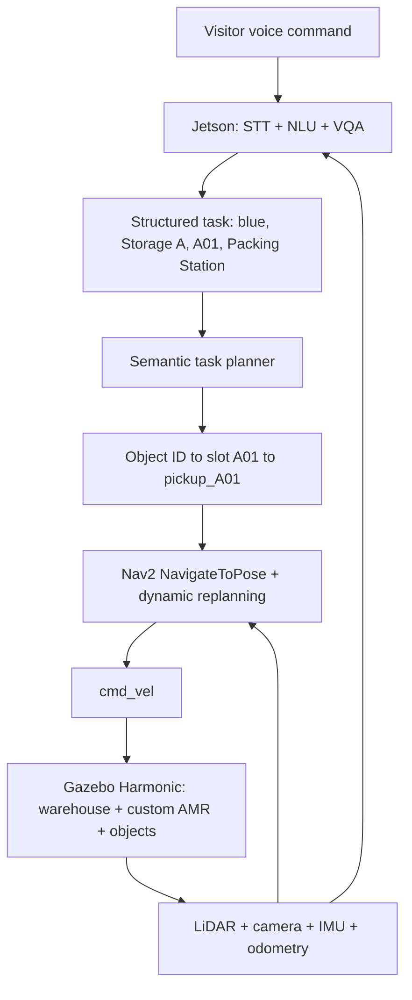

# Gazebo Harmonic Warehouse AGV demo

A native Gazebo Harmonic prototype for ROS 2 Jazzy. It keeps the **official Open
Robotics “Tugbot in Warehouse”** layout from Gazebo Fuel, but replaces the old
Tugbot with a custom compact warehouse AMR. The world also includes semantic
storage markers, colored target boxes, shelves, pallets, carts and obstacles.

The complete Shelf A / blue-package mission now includes predictive
`WAIT`/`PASS`/`REPLAN` human handling, configurable grasp retries, curvature
control at the second 90-degree turn, and asynchronous V-JEPA `z(t+1..3)`
logging/evaluation. See
[`docs/warehouse_vjepa_mission.md`](docs/warehouse_vjepa_mission.md) for the
architecture, state machine, metrics, failure policy, and validation procedure.

This implements the simulation block from the architecture as:

- `GAZEBO HARMONIC (PC)` instead of `ISAAC SIM (PC)`
- Virtual Warehouse: official Tugbot warehouse layout
- Virtual AGV: inVia-inspired `warehouse_agv` with four compact underbody
  wheels, differential drive and a five-stage scissor retrieval lift
- Sensors: hidden front-edge 360-degree LiDAR, an under-platform RGB camera in
  the `90 x 25 x 25 mm` RealSense D435 envelope, IMU and odometry
- Camera preview: floating **AGV Camera View** window inside Gazebo
- Obstacles: shelves, pallets, carts, seven road boxes and five moving workers

The warehouse now uses 27 compact racks, all with centered, two-sided names
`A` through `AA`. Fifteen of them replace the five former `shelf_big` rows
(three short racks per old footprint), with cross-aisles left between them. The task
layer keeps nine single-color task objects in A/B/C and a visible
`packing_station`. Each task storage zone contains three different-colored
boxes. Colors intentionally repeat between zones, so VQA must resolve both the
color and Storage A/B/C instead of selecting the only colored object in the
scene. Planner-facing names and approach poses are in
`config/semantic_tasks.yaml`; all 108 rack-column locations A00-AA03 are generated
in `config/inventory_locations.yaml`.

Each colored target is placed **inside a low shelf row among ordinary cartons**.
This makes the camera / VQA stage distinguish the requested object from nearby
stock instead of detecting an isolated box outside the rack.

## Pipeline



The shelf codes and navigation anchors are separate on purpose: each colored box
is visually inside a real empty rack cell, while the anchor is an invisible,
collision-free pose in the aisle. There are no colored navigation discs on the
floor.

| Storage | Slot/color/model | Slot/color/model | Slot/color/model |
| --- | --- | --- | --- |
| A | A01 blue `special_blue_box` | A02 red `distractor_red_A02` | A03 green `distractor_green_A03` |
| B | B01 blue `distractor_blue_B01` | B02 red `special_red_box` | B03 green `distractor_green_B03` |
| C | C01 blue `distractor_blue_C01` | C02 red `distractor_red_C02` | C03 green `special_green_box` |

## Nav2 and dynamic obstacles

Nav2 uses the locally rebuilt `maps/warehouse_lidar.yaml` global map. It is
generated from the simulated 360-degree `/scan` topic at 5 cm resolution and is
already aligned with the Gazebo world frame. Both global and local costmaps also
consume live LiDAR via an obstacle layer. The default NavigateToPose behavior
tree computes the path once per goal, and the collision monitor stops the AMR
when a newly added person or object enters its path. Seven colored boxes are
fixed road obstacles. Five visible workers continuously move between aisle
waypoints; their controller starts automatically with `run_demo.sh`. Workers 4
and 5 deliberately cross the two main AGV routes so Nav2 visibly stops, waits,
and resumes the same path. Their controller keeps them outside a
`0.85 m` physical safety envelope around the AGV while LiDAR avoidance runs.
Their detailed MakeHuman visual is scaled to approximately 1.52 m, while a
simple hidden collision proxy keeps live LiDAR detection inexpensive.
Each worker is a kinematic VelocityControl model: the controller publishes
forward/yaw velocity at 30 Hz and Gazebo integrates it on every simulation
step, so people slide continuously instead of teleporting between waypoints.
They move at a visible `0.68–0.85 m/s` with the integrated demo's default
`WAREHOUSE_PEOPLE_SPEED_SCALE=1.25`. Nav2's default forward limit
for the AGV is now `1.0 m/s` (up from `0.50 m/s`), while the LiDAR obstacle
layer and collision monitor keep their existing slowdown/stop behavior. Override
it when launching Nav2 with `max_linear_speed:=<m/s>`; the model hard limit is
`1.0 m/s`. For the integrated entry point, set
`WAREHOUSE_NAV_MAX_LINEAR_SPEED=<m/s> ./run_demo.sh`.
RViz displays `/plan`,
`/plan_smoothed`, the two costmaps, robot footprint, LiDAR and semantic goal.

For a repeatable avoidance-only demonstration, use the longest preset route.
The AGV drives through both worker crossings on its way to C, while leaving all
boxes untouched:

```bash
./run_dynamic_avoidance_demo.sh
```

Watch the local costmap / LiDAR in RViz and the live dashboard comment. Worker
4 crosses the east-west leg near `(7, -10)` and worker 5 crosses the northbound
leg near `(-2, -5)`. Because they keep patrolling, the exact stop or detour can
vary from run to run; the route itself always intersects both patrol lines.

For the VL-JEPA-style streaming presentation, choose one or two fixed routes:

```bash
# Terminal 1: Gazebo + bridge + Nav2 + V-JEPA + both dashboard windows
./run_demo.sh

# Terminal 2: one short route, one long route, or both in sequence
./run_vljepa_showcase.sh --route short
./run_vljepa_showcase.sh --route long
./run_vljepa_showcase.sh --route both
```

The first window follows the linked research-demo layout: live 16:9 camera on
the left and a 2-D latent cloud on the right. Gray points are the saved map
embeddings, red is the current 1024-D camera embedding, and blue is the
temporally accepted map match. Eight prepared questions rotate every 3.5
seconds and show both an instant and stabilized answer. Edit their order or
wording in
`../vjepa_visual_localization/configs/warehouse_live_questions.yaml`.

The localizer continuously uses the newest four frames at 4 FPS in a one-second
rolling clip. Its clip-center timestamp therefore contributes 0.5 seconds of
honest raw visual delay, plus measured GPU inference time. Two executor threads
let one run the serialized GPU query while the other keeps replacing old clip
frames with fresh camera frames; completed inference never causes an old-query
backlog to be processed.
Before inference, a separate latest-frame worker republishes Gazebo `/camera`
as `sensor_msgs/msg/Image` on `/vjepa/camera/image_raw`. This is a native ROS 2
DDS topic with `BEST_EFFORT + VOLATILE + KEEP_LAST(1)` QoS, intended for a
Jetson Orin connected directly to the laptop by Ethernet. Old frames are
superseded instead of queued, so a temporary network/GPU slowdown does not
grow latency.
The dashboard uses a latest-frame-only ROS queue and renders at 24 FPS; the
heavier map window refreshes independently at 5 FPS. The camera overlay reports
its measured simulation-time age in milliseconds. These rates can be tuned
without editing code via `WAREHOUSE_DASHBOARD_REFRESH_HZ` and
`WAREHOUSE_DASHBOARD_MAP_REFRESH_HZ`.

The language answers are deliberately prepared demo templates filled from
V-JEPA localization, A*, LiDAR and evaluator context; this repository does not
claim that the V-JEPA checkpoint is an end-to-end VL-JEPA language decoder.
Gazebo model names are available only inside the separate dashboard evaluator
to label a LiDAR return as a person or static box.

To rebuild the map after changing the warehouse, start Gazebo and the bridge as
described below, then run:

```bash
./run_mapping.sh
```

The mapper samples overlapping live LiDAR scans from collision-free survey
poses and saves `maps/warehouse_lidar.pgm` plus its YAML metadata. Ground-truth
poses are used only to register scans without long-distance wheel-slip error.
It temporarily parks the moving workers outside the warehouse, so they remain
live obstacles and are not burned into the static map.
Restart Gazebo after mapping to return the AGV to its dock pose.

For repeatable simulation tests, `ground_truth_localizer.py` aligns `map` with
the Gazebo world and publishes `map -> odom`; it replaces AMCL only. Planning,
control, `/cmd_vel`, LiDAR obstacle detection, recovery and collision monitoring
remain Nav2 components.

## Run

```bash
./run_demo.sh
```

This is now the integrated entry point. It starts Gazebo, the random-worker
controller, the ROS bridge, the camera-only temporal V-JEPA localizer and—when
`DISPLAY` is available—the camera/QA/latent and warehouse-map windows. The
saved dense visual map at `../vjepa_visual_localization/outputs/autonomous_map_dense` is
reused; normal pickup does not rebuild its latents. Component logs are written
under `/tmp/warehouse_agv_demo`.

The default control localization is the Gazebo truth reference so the physical
pick demo remains repeatable while the window reports the independent V-JEPA
estimate and its error. Experimental V-JEPA ownership of `map -> odom` remains
available explicitly with
`WAREHOUSE_NAV_LOCALIZATION_SOURCE=vjepa ./run_demo.sh`; it is not presented as
production-ready because closed-loop tests still drift in repeated aisles.
The map window draws `V-JEPA RAW (CLIP CENTER)` rather than presenting an
odometry projection as pure V-JEPA. `RAW ERR` compares against truth at that
same clip timestamp; `NOW GAP` compares the intentionally delayed raw marker
with current truth. Odometry projection is off by default, so the displayed
estimate is camera-only. Set `WAREHOUSE_VJEPA_ODOM_PROJECTION=true` only to add
a telemetry-only projected pose; it does not replace `V-JEPA RAW`.

Set `WAREHOUSE_VJEPA_ENABLED=false`, `WAREHOUSE_VJEPA_DASHBOARD=false` or
`WAREHOUSE_AUTOSTART_BRIDGE=false` before launch to disable an integrated
component. `run_bridge.sh` remains available for an intentionally split stack,
but is no longer required in a second terminal with the defaults.

To run V-JEPA on an external Orin while keeping Gazebo, the DDS image relay and
comparison dashboard on the laptop:

```bash
ROS_DOMAIN_ID=77 WAREHOUSE_VJEPA_LOCALIZER=false ./run_demo.sh
```

Use the same DDS domain on Orin and run `./run_orin_vjepa.sh`. Direct-LAN IP and
DDS setup are documented in
[`../vjepa_visual_localization/ORIN_DDS_LAN.md`](../vjepa_visual_localization/ORIN_DDS_LAN.md).

To park or resume all workers
from another terminal, use the same Gazebo partition:

```bash
export GZ_PARTITION=warehouse_agv_demo
gz topic -t /warehouse/random_people/enabled -m gz.msgs.Boolean -p 'data: false'
gz topic -t /warehouse/random_people/enabled -m gz.msgs.Boolean -p 'data: true'
```

Raise or lower the connected scissor lift manually after starting the bridge:

```bash
./run_lift_demo.sh up
./run_lift_demo.sh down
```

The two lower pivots slide inward on visible guide rails as all five X stages
open. The tray, intermediate stage centers, bar angles and slider travel all
come from the same linkage equation, so their endpoints remain joined during
the complete motion. The red bars intentionally have no collision geometry,
which prevents the folded first X from snagging the chassis; the chassis, four
small wheels and load tray keep their collision geometry.

The current body is approximately `0.385 x 0.299 m`: 25% larger than the
compact revision, with another 10% added only along its length so it is not too
square. Its black shell is 30% lower. The first X feet sit `10 mm` above the
wheel tops; 80% of the folded mechanism is recessed inside the shell and only
20% remains visible. The flat loading surface is `0.394625 x 0.30625 m`, equal
to the full outer bounding box of the black base bumper.

The lifting tray itself is a flat red platform without guard rails. Its RGB
camera and LiDAR are fixed to two thin plates at the rear edge. A compact open T-head holds two shallow
rubber suction pads; it replaces the previous solid mounting wall. The foot of
that T attaches to the forward end of an inverted-L carriage. Its vertical leg
is the slider, while the horizontal leg and actuator remain below the platform.
The retracted T-head rests near the rear edge rather than the tray center, and
the concealed rail provides the extra forward travel. There is no raised
center rail, leaving a flat cargo surface. During the VQA
mission, the selected box follows this retracting carriage onto the tray.

All four wheel joints are driven by the same Gazebo DiffDrive system. Explicit
longitudinal friction direction, moderate lateral grip and joint damping keep
the rear pair from being flung sideways during image-servo yaw corrections.

LiDAR remains active in Nav2 obstacle costmaps while the vehicle travels. Once
Nav2 reaches the selected slot, lift position control is independent of LiDAR and never waits
for `/scan`: the fast sequence raises the lift, aligns from the camera image,
extends and retracts the suction head, then lowers the attached carton.
The final rack-facing gate limits chassis yaw error to 2 degrees so both cups
meet the carton face. Slide motion uses measured Gazebo link feedback instead
of a timer: lowering is forbidden until the measured extension is at most
8 mm. Gazebo also starts paused, detaches all nine selectable cartons, and only
then starts physics so every carton remains exactly in its registered slot.
After the payload is secured and lowered, the AGV automatically reverses
`0.72 m` from the suction-contact pose into the clear aisle. This removes the
base from the rack's inflated costmap region before Nav2 receives the loaded
return corridor, avoiding a long recovery loop after a worker has moved away.

For a manually split stack, start Nav2 and RViz in another terminal. The
recommended `pick_box.sh` command below does this automatically when needed:

```bash
./run_nav2.sh
```

## Go to a cabinet, then choose a box

The cabinet picker uses only the ordered truth poses saved alongside the dense
latent map. It samples those poses into a `NavigateThroughPoses` corridor from
the dock to staging and cannot create an A* shortcut through an aisle that was
not seen during mapping. Nav2 keeps the selected path when a worker crosses it,
stops on LiDAR, then continues after the worker clears. Only after staging does the terminal show
the available colors and ask which box to pick:

```bash
./run_storage_pick.sh --storage A
```

Example interaction after arrival:

```text
[ARRIVED] AGV đã ở staging của tủ A
[SELECT] đã tới storage_A; màu có sẵn: blue, red, green
Chọn màu box cần pick: đỏ
```

The color may also be supplied in advance for an unattended test. Resolution
is still delayed until after arrival:

```bash
./run_storage_pick.sh --storage B --color đỏ
./run_storage_pick.sh --storage C --color green
```

Delivery is the default: after extraction and the 0.72 m rack-clearance retreat,
the loaded AGV sends one direct `NavigateToPose` goal to Packing Station. NavFn
A* chooses the collision-free route once and LiDAR stops/resumes for crossing
people; it no longer loops through C/B/A return clips. Pass
`--pick-only` only when the carton should stay attached on the lowered tray for
a controller test.

If a previous `--pick-only` run has already left the carton attached, resume
only the direct loaded delivery without approaching or picking the shelf again:

```bash
./pick_box.sh --storage A --color red --resume-delivery
```

The storage and color must describe the payload currently on the tray. Before
release, the controller verifies from Gazebo link poses that this exact carton
is still within `0.85 m` of the AGV; a wrong selection fails safely instead of
detaching another model.
The mapping traversal itself continues from Packing back to the charging dock,
so the visual route is a complete loop.
Use `--route-only` to test aisle navigation without picking, or `--dry-run` to
validate a storage/color combination without ROS or Gazebo motion. Nav2
lifecycle state is checked automatically, so this command can wait for startup
instead of sending a goal to an inactive action server.

Alternatively, run the complete mock-VQA mission after Nav2 is active:

```bash
./run_vqa_mission.sh \
  --command "Bring the blue box from Storage A to Packing Station"
```

The simulated Orin VQA resolves `(blue, Storage A)` to A01. Nav2 drives to the
pickup anchor and raises the camera with the platform. VQA then processes a
fresh `/camera` RGB frame, detects the requested color, saves an annotated
frame in `screenshots/vqa_storage_A_blue_detection.png`, and cross-checks the
result against the registered shelf cell. The twin suction carriage extracts
that box onto the platform, and Nav2 drives to Packing Station.
Only the requested model is moved. A command with a repeated color but no
storage, such as `Bring the blue box`, is rejected as ambiguous.

For a one-command pick-and-deliver mission that starts bridge/Nav2 when needed,
selects any cabinet and RGB carton, and returns it to Packing Station:

```bash
./pick_box.sh --storage A --color red
./pick_box.sh --area C --color green
```

`--storage` and `--area` are aliases. Add `--pick-only` to stop with the payload
on the tray, `--route-only` to navigate without moving a box, or `--dry-run` to
validate the requested area/color without ROS. `--deliver` remains accepted as
an explicit compatibility flag. The command reuses the temporal
V-JEPA process and two windows owned by `run_demo.sh`; it starts fallbacks only
if those components were explicitly disabled. It also waits for the GPU model
and the first dock-anchored V-JEPA estimate before the AGV leaves on the saved
route, avoiding a false initial match to a repeated warehouse corridor. The old
`./pick_blue_box.sh` command remains compatible: without flags it defaults to
A/blue, and it now accepts the same area/color flags.

These scripts use the isolated `warehouse_agv_demo` Gazebo partition. If Gazebo
is restarted, restart Nav2 as well because simulation time returns to zero.

Manual driving (when Nav2 is not controlling the robot):

```bash
ros2 topic pub --rate 10 /cmd_vel geometry_msgs/msg/Twist \
  "{linear: {x: 0.5}, angular: {z: 0.2}}"
```

Example structured task represented by the demo:

```text
Bring the blue box from Storage A to Packing Station
```

Resolve the pickup anchor without ROS / Nav2:

```bash
./run_task.sh --object blue_box --destination pickup --dry-run
```

Send the resolved anchor to the Nav2 `NavigateToPose` action server:

```bash
./run_task.sh --object blue_box --destination pickup
```

With Gazebo, the bridge and Nav2 running, this route also demonstrates
static-box planning plus stop/wait/resume around moving workers.

The same pose is published on `/semantic_goal` for inspection. To test only the
pickup controller after Nav2 has reached the anchor:

```bash
./run_pick.sh --object blue_box
```

It verifies that the AMR is within `0.9 m` of `pickup_A01`, carries exactly
`special_blue_box` with the gripper pose, then places it at Packing Station when
stopped. The Fuel shelf uses one closed collision volume, so this controller
keeps the target visually inside the shelf for recognition and performs the
extraction through Gazebo's authoritative model-pose service.

For a short controller-only test that skips the distance guard and restores the
box to its shelf afterwards:

```bash
./run_pick.sh --object blue_box --force --duration 1 --drop shelf
```

On first launch Gazebo downloads the official Fuel assets; later launches use
its local cache. The deterministic VQA oracle stands in for the unavailable Orin
process and can later be replaced by its structured result without changing the
Nav2 or pickup interfaces.
